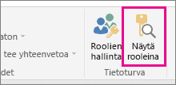
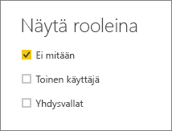
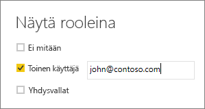

## Roolien vahvistaminen Power BI Desktopissa
Kun olet luonut roolit, voit testata niiden tuloksia Power BI Desktopissa.

1. Valitse **Mallinnus**-välilehdeltä **Näytä rooleina**. 

    

    **Näytä rooleina** -ikkuna tulee näkyviin ja näet luomasi roolit.

    

3. Valitse luomasi rooli ja valitse sitten **OK**, jos haluat ottaa roolin käyttöön. 

   Raportit hahmontavat ainoastaan ne tiedot, jotka koskevat kyseistä roolia.

4. Voit myös valita **toisen käyttäjän** ja määrittää tietyn käyttäjän. 

    

   On parasta määrittää täydellinen käyttäjätunnus (UPN), koska sitä Power BI -palvelu ja Power BI -raporttipalvelin käyttävät.

   **Toinen käyttäjä** näyttää eri tuloksia Power BI Desktopissa ainoastaan, jos käytössäsi on dynaaminen tietoturva, joka perustuu DAX-lausekkeisiin. 

5. Valitse **OK**. 

   Raportit hahmonnetaan sen perusteella, mitä käyttäjä näkee.

