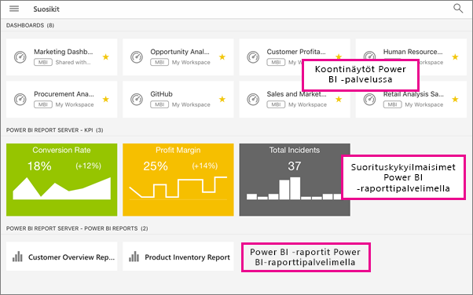

# Suosikkien luominen ja selaaminen Power BI -mobiilisovelluksissa
Koskee seuraavia:

|  |  |  |  |  |
|:--- |:--- |:--- |:--- |:--- |
| iPhonet |iPadit |Android-puhelimet |Android-tabletit |Windows 10 -laitteet |

Miten luot ja selaat suosikkeja Power BI -koontinäytöillä, raporteilla ja sovelluksissa sekä paikallisista Power BI -raporttipalvelimen ja Raporttipalveluiden raporteista ja suorituskyvyn mittareista mobiilisovelluksissa.

Kun teet suosikin Power BI -mobiilisovelluksessa, näet sen Power BI -palvelun ([https://powerbi.com](https://powerbi.com)) ja kaikkien mobiililaitteidesi Suosikit-sivulla. 

Voit myös [tehdä Power BI-koontinäytöistä ja sovelluksista suosikkeja Power BI-palvelussa](service-dashboard-favorite.md). Silloin näet ne mobiilisovelluksen Suosikit-sivulla.

Voit merkitä suorituskykymittareiden ja raportteja suosikeiksi Power BI -raporttipalvelimella tai Reporting Services -verkkoportaalissa ja tarkastella niitä yhdessä kätevässä kansiossa mobiililaitteessasi Power BI -suosikkikoontinäyttöjesi ja raporttien kera.

## Selaa Power BI -suosikkejasi
* Valitse yläreunan siirtymispalkista  ja napsauta sitten **Suosikit**.
  
  
  
  Näet kaikki suosikkisi yhdessä tällä sivulla:
  
  

## Sovelluksen lisääminen suosikkeihin
1. Napsauta mobiilisovelluksen sovellusluettelossa sovelluksen vieressä olevia kolmea pistettä (...) > **Suosikki**.
   
    
   
    Nyt se näkyy muiden koontinäkymä- ja sovellussuosikkiesi joukossa.
   
    

## Tee koontinäkymästä tai sovelluksesta suosikki iOS- tai Windows 10 -mobiilisovelluksissa
Voit tehdä Power BI -koontinäytöstä tai raportista suosikin koontinäyttö- tai raporttiluettelosta tai suoraan koontinäytöltä tai raportilta.

* Napsauta mobiilisovelluksen koontinäyttö- tai raporttilistalla nimen vieressä olevaa tyhjää tähteä . Tähti muuttuu keltaiseksi .
  
    
* Napsauta koontinäytöllä tai raportilla valintanauhan tyhjää tähteä . Tähti muuttuu keltaiseksi .
  
    

## Tee koontinäkymästä tai sovelluksesta suosikki Android-mobiilisovelluksissa
Voit tehdä koontinäytöstä tai raportista suosikin koontinäyttö- tai raporttiluettelosta tai suoraan koontinäytöltä tai raportilta.

* Napsauta mobiilisovelluksen koontinäyttö- tai raporttilistalla nimen vieressä olevia kolmea päällekkäistä pistettä (...) ja sitten **Suosikki**-painiketta. Nimen viereen ilmestyy keltainen tähti .
  
    
* Napsauta koontinäytöllä tai raportilla valintanauhan tyhjää tähteä . Tähti muuttuu keltaiseksi .
  
    

## Tee suosikkeja Power BI -raporttipalvelimen ja Reportin Services -raporteista ja suorituskyvyn mittareista
Voit selata suosikkejasi Power BI -raporttipalvelimen ja Reporting Services -raporteista ja suorituskykymittareista Power BI -mobiilisovelluksissa, mutta et voi tehdä niistä suosikkeja mobiilisovelluksissa. Sinun [tulee merkitä ne suosikeiksi verkkoportaalissa](report-server/tutorial-explore-report-server-web-portal.md#tag-your-favorites). 

## Seuraavat vaiheet
* [Suosikkikoontinäytöt Power BI -palvelussa](service-dashboard-favorite.md) 
* Onko sinulla kysyttävää? [Voit esittää kysymyksiä Power BI -yhteisössä](http://community.powerbi.com/)

