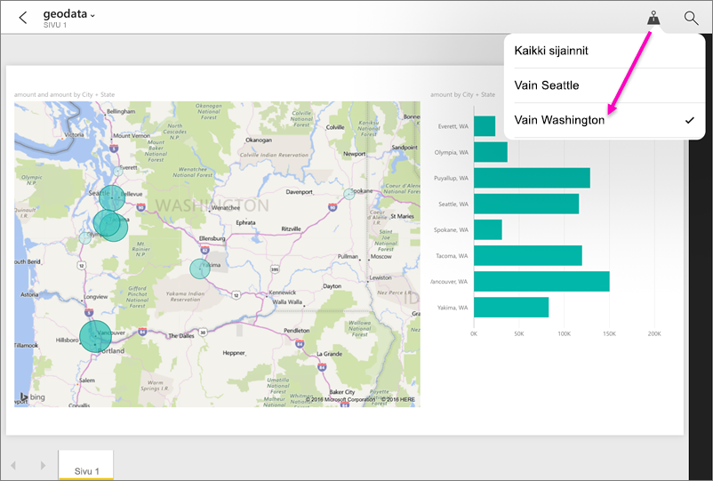

# Raportin suodattaminen maantieteellisen sijainnin mukaan Power BI ‑mobiilisovelluksessa
Koskee seuraavia:

|  |  |  |  |  |
|:--- |:--- |:--- |:--- |:--- |
| iPhonet |iPadit |Android-puhelimet |Android-tabletit |Windows 10 ‑puhelimet |

Kun tarkastelet Power BI ‑raporttia mobiililaitteelta, näetkö oikeassa yläkulmassa pienen nuppineulakuvakkeen? Jos näet, voit suodattaa raportin oman maantieteellisen sijaintisi mukaan.

> [!NOTE]
> Voit suodattaa sijainnin mukaan ainoastaan, jos raportin maantieteelliset nimet ovat englanniksi &#150; esimerkiksi ”New York City” tai ”Germany”. Windows 10 ‑tabletit ja ‑tietokoneet eivät tue maantieteellistä suodatusta, mutta Windows 10 ‑puhelimet tukevat.
> 
> 

## Raportin suodattaminen maantieteellisen sijaintisi mukaan
1. Avaa mobiililaitteellasi raportti Power BI ‑mobiilisovelluksessa.
2. Jos raportissa on maantieteellisiä tietoja, näyttöön tulee sanoma, jossa kysytään, saako Power BI käyttää sijaintiasi. Valitse **Salli** ja napauta sitten uudelleen **Salli**.
3. Napauta nuppineulakuvaketta . Raportin ominaisuuksista riippuen voit suodattaa tiedot joko kaupungin mukaan, osavaltion/provinssin mukaan tai maan/alueen mukaan. Suodatin näyttää vain asetukset, jotka vastaavat senhetkistä sijaintiasi.
   
    

## Miksi en näe raportissa sijaintitunnisteita?
Jotta näkisit sijaintitunnisteet, kaikkien kolmen ehdon on täytyttävä: 

* Power BI Desktopissa raportin luonut henkilö [on luokitellut maantieteellisiä tietoja](desktop-mobile-geofiltering.md), kuten kaupunki, osavaltio tai maa/alue, vähintään yhteen sarakkeeseen.
* Olet sellaisessa paikassa, josta on tietoja kyseisessä sarakkeessa.
* Käytät jotakin seuraavista mobiililaitteista:
  * iOS (iPad, iPhone, iPod)
  * Android-puhelin tai ‑tabletti
  * Windows 10 ‑puhelin (muut Windows 10 ‑laitteet, kuten pöytäkoneet ja tabletit, eivät tue maantieteellistä suodatusta).

Lue lisää [maantieteellisen suodatuksen määrittämisestä](desktop-mobile-geofiltering.md) Power BI Desktopissa.

### Seuraavat vaiheet
* [Power BI:n yhdistäminen reaalimaailman tietoihin](mobile-apps-data-in-real-world-context.md) mobiilisovellusten avulla
* [Tietojen luokittelu Power BI Desktopissa](desktop-data-categorization.md) 
* Onko sinulla kysyttävää? [Voit esittää kysymyksiä Power BI -yhteisössä](http://community.powerbi.com/)

