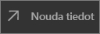

# Pikaopas: Raporttinäkymien ja raporttien tarkastelu Power BI -mobiilisovelluksissa
Tässä pikaoppaassa esitellään esimerkki raporttinäkymästä ja raportista Android-puhelimen Power BI -mobiilisovelluksessa. Voit seurata myös muilla mobiilisovelluksilla. 

Koskee seuraavia:

|  |  |  |  |
|:--- |:--- |:--- |:--- |
| iPhone | iPad | Android | Windows 10 |

Raporttinäkymät ovat portaali yrityksesi elinkaareen ja prosesseihin. Raporttinäkymä on yleisnäkymä, jossa voit seurata yrityksen nykyistä tilaa yhdessä paikassa. Raportti on vuorovaikutteinen näkymä tiedoistasi, joka sisältää eri havaintoja ja merkityksellisiä tietoja esittäviä visualisointeja. 

## Edellytykset

### Rekisteröidy Power BI:hin
Jos et ole rekisteröitynyt Power BI:hin, [rekisteröidy ilmaiseen kokeiluversioon](https://app.powerbi.com/signupredirect?pbi_source=web) ennen aloittamista.

### Power BI:n Android-sovelluksen asentaminen
[Lataa Power BI for Android -sovellus](http://go.microsoft.com/fwlink/?LinkID=544867) Google Play -kaupasta.

Power BI toimii Android-laitteilla, joissa on käytössä Android 5.0 -käyttöjärjestelmä tai uudempi versio. Jos haluat tarkistaa laitteesi, siirry kohtaan **Asetukset** > **Tietoa laitteesta** > **Android -versio**.

### Hae Jälleenmyyntianalyysimalli
Pikaoppaan ensimmäisessä vaiheessa ladataan jälleenmyyntianalyysimalli Power BI -palvelussa.

1. Avaa Power BI -palvelu (app.powerbi.com) selaimessasi ja kirjaudu sisään.

1. Avaa vasen siirtymisruutu napsauttamalla yleistä siirtymiskuvaketta.

    

2. Valitse vasemmassa siirtymisruudussa **Työtilat** > **Oma työtila**.

    

3. Valitse vasemmassa alakulmassa **Nouda tiedot**.
   
    

3. Valitse Nouda tiedot -sivulla **Mallit**-kuvake.
   
   

4. Valitse **Jälleenmyyntianalyysimalli**.
 
    
 
8. Valitse **Muodosta yhteys**.  
  
   
   
5. Power BI tuo mallin sekä lisää uuden koontinäytön, raportin ja tietojoukon omaan työtilaasi.
   
   

Nyt voit siirtyä tarkastelemaan mallia Android-laitteessa.

## Selaa raporttinäkymää Android-laitteesta
1. Avaa Power BI -sovellus Android-laitteessa ja kirjaudu sisään Power BI -tilisi tunnistetiedoilla, samoilla joita käytit selaimen Power BI-palvelussa.

1.  Napauta yleistä siirtymispainiketta .

2.  Napauta**Työtilat** > **Oma työtila**

    

3. Siirry takaisin Jälleenmyyntianalyysimallin raporttinäkymään avataksesi sen.
 
    
   
    Raporttinäkymän nimen alapuolella oleva merkintä (tässä esimerkissä kirjain ”C”) kertoo miten kunkin raporttinäkymän tiedot on luokiteltu. Lue lisää [tietojen luokittelusta Power BI:ssä](service-data-classification.md).

    Power BI -raporttinäkymät näyttävät hiukan erilaisilta Android-puhelimessasi. Kaikki ruudut näkyvät saman levyisinä, ja ne on järjestetty peräkkäin ylhäältä alaspäin.

4. Napauta tähtikuvaketta  otsikkorivillä tehdäksesi tästä suosikkiraporttinäkymän.

    Kun teet näkymästä suosikin mobiilisovelluksessa, se on suosikki myös Power BI -palvelussa ja päinvastoin.

4. Selaa alaspäin ja napauta viivakaaviota ”Tämän vuoden myynti, Viime vuoden myynti”.

    

    Tämä avaa kohdistustilan.

7. Napauta kohdistustilassa kaavion kohtaa Apr. Näet huhtikuun arvot esitettynä kaavion yläosassa.

    

8. Napauta Raporttikuvaketta  oikeassa yläkulmassa. Tähän ruutuun liittyvä raportti avautuu vaakatilassa.

    

9. Napauta keltaista ”040 - Juniors” -kuplaa kuplakaaviossa. Huomaat sen korostavan liittyvät arvot muissa visualisoinneissa. 

    

10. Sipaise ylöspäin nähdäksesi työkalurivin näytön alaosassa ja napauta kynäkuvaketta.

    

11. Napauta Lisää huomautus -työkalurivin hymiökuvaketta ja lisää raporttisivullesi hymiöitä.
 
    

12. Napauta **Jaa** oikeassa yläkulmassa.

1. Täytä sähköpostiosoitteet ja lisää halutessasi viesti.  

    

    Voit jakaa tämän tilannevedoksen kenen kanssa tahansa organisaatiosi sisällä tai ulkopuolella. Jos vastaanottaja on organisaatiossasi ja hänellä on oma Power BI -tili, hän voi myös avata Jälleenmyyntianalyysimallin raportin.

## Resurssien tyhjentäminen

Kun olet suorittanut pikaoppaan, voit halutessasi poistaa Jälleenmyyntianalyysimallin raporttinäkymän , raportin ja tietojoukon.

1. Avaa Power BI -palvelu (app.powerbi.com) ja kirjaudu sisään.

2. Valitse vasemmassa siirtymisruudussa **Työtilat** > **Oma työtila**.

    Keltainen tähti kertoo, että kyse on suosikista.

3. Valitse **Koontinäytöt**-välilehdessä Jälleenmyyntianalyysimallin raporttinäkymän vieressä oleva **Poista**-roskakorikuvake.

    

4. Siirry **Raportit**-välilehdelle ja toimi samoin Jälleenmyyntianalyysiraportin kohdalla.

5. Siirry **Tietojoukot**-välilehdelle ja toimi samoin Jälleenmyyntianalyysitietojoukon kohdalla.

## Seuraavat vaiheet

Tässä pikaoppaassa kerrottiin raporttinäkymien ja raporttien tarkastelusta Android-laitteellasi. Lue lisää Power BI -palvelun käyttämisestä. 

> [!div class="nextstepaction"]
> [Pikaopas: Power BI -palvelussa liikkuminen](service-the-new-power-bi-experience.md)

