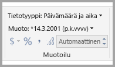
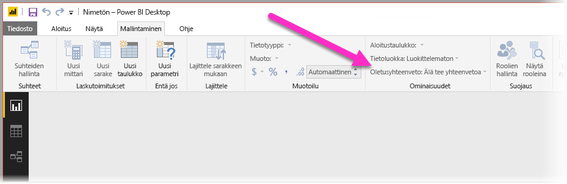
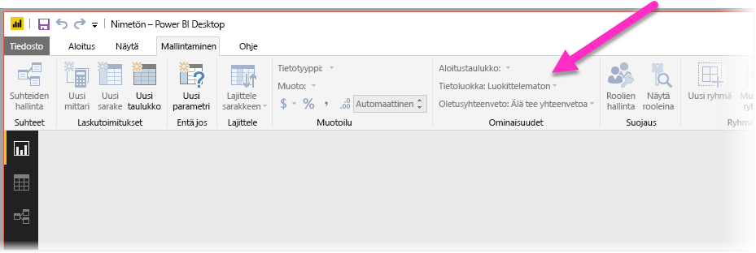
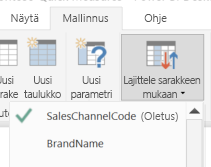

# Q&A:n optimoimisen parhaat käytännöt Power BI:ssä
Yleisien lauseiden ja luonnollisen kielen käyttäminen tiedoista esitettävissä kysymyksissä on tehokasta. Vielä tehokkaampaa on, kun tiedot vastaavat, minkä Power BI:n Q&A-toiminto tekee.

Jotta Q&A pystyy tulkitsemaan onnistuneesti laajaa kysymysvalikoimaa, johon se pystyy vastaamaan, Q&A:n on tehtävä mallista oletuksia. Jos mallin rakenne ei vastaa vähintään yhtä näistä oletuksista, sinun on muutettava malliasi. Kyseiset Q&A:ta varten tehtävät muutokset ovat samat parhaiden käytäntöjen mukaiset optimoinnit kaikille malleille Power BI:ssä riippumatta siitä, käytätkö Q&A:ta.

Seuraavissa osioissa kuvataan, minkälaisia muutoksia malliisi on tehtävä, jotta se toimii hyvin Power BI:n Q&A-toiminnon kanssa.

## Q&A:n tekemät automaattiset muutokset

### Mittaritaulukot

Aikaisemmissa Q&A-versioissa mittaritaulukot sekoittavat Q&A:n, koska pohjana olevan taulukon yhteys katkesi. Nyt Q&A toimii hienosti mittaritaulukoiden kanssa.

### Sarakkeiden nimien kanssa ristiriitaiset taulukon nimet

Jos taulukon ja sarakkeen nimi oli sama Q&A:n aiemmissa versioissa, taulukko oli etusijalla. Tämä ongelma on käsitelty, joten sinun ei enää tarvitse korjata ongelmaa malleissasi.

## Manuaalisia toimenpiteitä Q&A:n parantamiseksi

### Kysymysten korjaaminen uusien Q&A-työkalujen avulla

Q&A-työkaluilla voit opettaa Q&A:lle keskeisiä liiketoimintatermejä ja korjata käyttäjien esittämiä kysymyksiä. Joskus joitakin kysymyksiä ei edelleenkään voi käsitellä, koska tiedot on muotoiltu virheellisesti tai tietoja puuttuu. Tällaisessa tapauksessa lue muut alla olevat osiot, joissa kerrotaan, miten voit optimoida. Lue lisää [Q&A-työkaluista](q-and-a-tooling-intro.md).

## Lisää puuttuvat suhteet

Jos taulukoiden väliset suhteet puuttuvat mallista, Power BI tai Q&A ei kumpikaan pysty tulkitsemaan, kuinka nämä taulukot tulisi liittää. Suhteet ovat hyvän mallin olennainen osa. Et esimerkiksi voi pyytää “Seattlen asiakkaiden kokonaismyyntiä”, jos *Orders* (Tilaukset) -taulukon ja *Customers* (Asiakkaat) -taulukon välinen suhde puuttuu. Seuraavissa kuvissa on malli, jota on muokattava, ja malli, joka on valmis Q&A:ta varten. 

**Edellyttää muokkauksia**

Ensimmäisessä kuvassa ei ole suhteita Customers-, Sales- ja Products-taulukoiden välillä.

**Valmis Q&A:ta varten**

Ensimmäisessä kuvassa taulukoiden välille määritetään yhteydet.

## Nimeä taulukot ja sarakkeet uudelleen

Taulukkojen ja sarakkeiden valinta on tärkeää Q&A:ta varten. Oletetaan, että sinulla on taulukko nimeltä *CustomerSummary* (Asiakasyhteenveto), joka sisältää luettelon asiakkaistasi. Sinun on esitettävä kyselyitä, kuten ”Luettele asiakasyhteenvedot Chicagossa”, sen sijaan, että esittäisit kyselyn ”Luettele asiakkaat Chicagossa”. 

Vaikka Q&A pystyy käsittelemään joitakin yksinkertaisia sananjakoja ja tunnistamaan monikot, se olettaa, että taulukoiden ja sarakkeiden nimet vastaavat täsmällisesti niiden sisältöä.

Otetaan toinen esimerkkitilanne. Kuvitellaan, että sinulla taulukko nimeltä *Headcount* (Henkilöstömäärä), joka sisältää etu- ja sukunimet ja työntekijämäärät. Sinulla on toinen taulukko nimeltä *Employees* (Työntekijät), joka sisältää työntekijämäärät, työpaikkamäärät ja aloituspäivämäärät. Henkilöt, joille tämä malli on tuttu, saattavat ymmärtää tämän rakenteen. Jokin toinen henkilö, joka esittää kyselyn ”Laske työntekijät”, saa rivimäärän ”Työntekijät”-taulukosta. Tämä tulos ei todennäköisesti vastaa sitä, mitä hänellä oli mielessä, sillä tuloksessa on laskettu yhteen jokaisen työntekijän siihenastisten työpaikkojen lukumäärä. Nämä taulukot kannattaa siten nimetä uudelleen vastaamaan niiden todellista sisältöä.

**Edellyttää muokkauksia**

Taulukon nimet, kuten *StoreInfo* (Kaupan tiedot) ja *Product List* (tuoteluettelo), vaativat muokkausta.

**Valmis Q&A:ta varten**

*Store* (kauppa) ja *Products* (tuotteet) toimivat paremmin.

## Korjaa virheelliset tietotyypit

Tuoduilla tiedoilla voi olla virheelliset tietotyypit. Q&A-toiminto ei etenkään tulkitse päivämääriksi ja määriksi *päivämäärä*- ja *määrä*sarakkeita, jotka tuodaan *merkkijonoina*. Varmista, että valitset oikean tietotyypin Power BI -mallissa.

## Merkitse vuosi- ja tunnistesarakkeiden koosteeksi Älä tee yhteenvetoa

Oletusarvoisesti Power BI koostaa numeerisia sarakkeita tehokkaasti, joten kysymykset, kuten ”kokonaismyynti vuodessa” saattaa joskus antaa tulokseksi paitsi myynnin kokonaissumman myös vuosien kokonaissumman. Jos sinulla on tiettyjä sarakkeita, joissa et halua Power BI:n toimivan näin, aseta sarakkeen **Oletusyhteenveto**-ominaisuudeksi **Älä tee yhteenvetoa**. Kiinnitä huomiota **vuosi**-, **kuukausi**-, **päivä**- ja **tunnus**-sarakkeisiin, sillä ne ovat tavallisimmin ongelmia aiheuttavia sarakkeita. Muut sarakkeet, joille summa ei ole merkitsevä, kuten *ikä*, voivat myös hyötyä asetuksen **Oletusyhteenveto** muuttamisesta asetukseksi **Älä tee yhteenvetoa** tai **Keskiarvo**. Löydät tämän asetuksen **Mallinnus**-välilehdeltä.

## Valitse jokaiselle päivämäärä- ja paikkatietosarakkeelle tietoluokka

**Tietoluokka** tarjoaa sarakkeen sisällöstä muita semanttisia tietoja tietotyypin lisäksi. Voit esimerkiksi merkitä kokonaislukusarakkeen postinumeroksi, merkkijonosarakkeen kaupungiksi, maaksi tai alueeksi ja niin edelleen. Q&A-toiminto käyttää näitä tietoja kahdella tärkeällä tavalla: visualisoinnin valintaan ja kielen eroihin.

Ensin Q&A käyttää apuna **tietoluokan** tietoja tehdäkseen valintoja käytettävän visualisointinäytön suhteen. Se esimerkiksi tunnistaa, että päivämäärä- tai aika**tietoluokan** sisältävät sarakkeet ovat tavallisesti hyvä valinta viivakaavion vaaka-akselille tai kuplakaavion PlayAxis-akselille. Lisäksi se olettaa, että maantieteellisiä **tietoluokkia** sisältävät sarakkeet saattavat näyttää hyvältä kartalla.

Toiseksi Q&A tekee joitakin tietoon perustuvia arvauksia siitä, miten käyttäjät todennäköisesti puhuvat päivämäärä- ja paikkatietosarakkeista. Tämä auttaa sitä ymmärtämään tietyn tyyppisiä kysymyksiä. Esimerkiksi “milloin”-sana kysymyksessä “Milloin Veli Koivula palkattiin?” lähes varmasti yhdistää päivämääräsarakkeeseen, ja sana ”Pähkinäinen” lauseessa ”Laske Pähkinäisen asiakkaat” on todennäköisemmin kaupunki kuin ruoka-annoksen ominaisuus.

## Valitse asianmukaisille sarakkeille Lajittele sarakkeen mukaan -asetus

**Lajittele sarakkeen mukaan** -ominaisuus mahdollistaa yhden sarakkeen lajittelun sijaan automaattisesti eri sarakkeen lajittelun. Kun esimerkiksi teet pyynnön ”Lajittele asiakkaat paidan koon mukaan”, haluat luultavasti lajitella Paidan koko -sarakkeen pohjana olevan kokonumeron (XS, S, M, L, XL) mukaan etkä aakkosjärjestyksen mukaan (L, M, S, XL, XS).

## Normalisoi mallisi

Älä kuitenkaan huolestu, emme kehota sinua muotoilemaan uudestaan koko mallia. Tietyt rakenteet ovat kuitenkin niin hankalia, että Q&A ei pysty käsittelemään niitä hyvin. Jos normalisoit mallin rakennetta yksinkertaisemmaksi, Power BI -raporttien käytettävyys lisääntyy merkittävästi samoin kuin Q&A-tulosten tarkkuus.

Noudata tätä yleistä sääntöä: jokaista yksilöllistä ”asiaa”, josta käyttäjä puhuu, tulee edustaa täsmälleen yksi malliobjekti (taulukko tai sarake). Jos siis käyttäjät puhuvat asiakkaista, pitäisi olla yksi *asiakas*-objekti. Ja jos käyttäjät puhuvat myynnistä, pitäisi olla yksi *myynti*-objekti. Kuulostaa yksinkertaiselta, eikö vain? Näin voi ollakin, riippuen tietojen muodosta, joiden kanssa olet aloittamassa. **Kyselyeditorissa** on käytettävissä monipuolisia muotoiluominaisuuksia, jos tarvitset niitä. Samalla monet suoraviivaisimmista muunnoksista voidaan tehdä yksinkertaisesti Power BI -mallin laskutoimitusten avulla.

Seuraavissa osioissa esitellään muutamia yleisiä muunnoksia, joita sinun on ehkä tarpeen tehdä.

### Luo uusia taulukoita usean sarakkeen entiteeteille

Jos sinulla on useita sarakkeita, jotka toimivat yhtenä erillisenä yksikkönä suuremman taulukon sisällä, nämä sarakkeet tulee erottaa omaan taulukkoonsa. Oletetaan, että sinulla on Contact Name (Yhteyshenkilön nimi)-, Contact Title (Yhteyshenkilön tehtävänimike)- ja Contact Phone (Yhteyshenkilön puhelinnumero) -sarake *Companies* (Yritykset) -taulukossa. Rakenteellisesti parempi olisi käyttää erillistä *Contacts* (Yhteystiedot) -taulukkoa, joka sisältää nimen, tehtävänimikkeen ja puhelinnumeron, ja linkkiä takaisin *Companies* (Yritykset) -taulukkoon. Tämä helpottaa kysymysten esittämistä yhteyshenkilöistä erikseen tai kysymysten esittämistä yrityksistä, joille he toimivat yhteyshenkilöinä. Lisäksi näytön joustavuus lisääntyy.

**Edellyttää muokkauksia**

**Valmis Q&A:ta varten**

### Poista ominaisuussäilöt pivotoimalla

Jos mallissasi on *ominaisuussäilöjä*, ne on jäsennettävä uudelleen niin, että ominaisuutta kohti on yksi sarake. Vaikka ominaisuussäilöt ovat käteviä suurten ominaisuusmäärien hallintaan, niiden heikkoutena on kuitenkin joukko luontaisia rajoituksia, joita Power BI -raportteja ja Q&A:ta ei kumpiakaan ole suunniteltu kiertämään.

Otetaan esimerkiksi *CustomerDemographics* (Asiakkaiden demografiset tiedot) -taulukko, jossa on sarakkeet CustomerID (Asiakastunnus), Property (Ominaisuus) ja Value (Arvo). Taulukon jokainen rivi edustaa asiakkaan eri ominaisuuksia (kuten ikä, siviilisääty, kaupunki ja niin edelleen). Jos Value (Arvo) -sarakkeen merkitys ylikuormittuu Property (Ominaisuus) -sarakkeen sisällön pohjalta, Q&A ei enää pysty tulkitsemaan useimpia siihen viittaavia kyselyitä. Yksinkertainen kysymys, kuten ”Näytä jokaisen asiakkaan ikä” saattaa vielä toimia, koska sen voidaan tulkita tarkoittavan ”Näytä asiakkaat ja asiakkaiden demografiset tiedot, kun ominaisuus on ikä”. Mallin rakenne ei kuitenkaan yksinkertaisesti tue hiukan monimutkaisempia kysymyksiä, kuten ”Chicagon asiakkaiden keski-ikä”. Vaikka käyttäjät, jotka suoraan laativat Power BI -raportteja, voivat joskus keksiä näppäriä keinoja saada hakemiaan tietoja, Q&A toimii vain, kun jokaisella sarakkeella on vain yksi merkitys.

**Edellyttää muokkauksia**

**Valmis Q&A:ta varten**

### Poista osiointi yhdistämällä

Jos olet osioinut tietosi useisiin taulukoihin tai pivotoinut arvot useisiin sarakkeisiin, monet tavalliset toiminnot ovat käyttäjille vaikeita tai mahdottomia toteuttaa. Otetaan ensin esimerkiksi tyypillinen taulukon osiointi: *Sales2000-2010*-taulukko ja *Sales2011-2020*-taulukko. Jos kaikki tärkeät raportit rajatuvat tiettyyn vuosikymmeneen, voit todennäköisesti jättää sen näin Power BI -raportteja varten. Q&A:n joustavuus aiheuttaa kuitenkin sen, että käyttäjäsi odottavat vastauksia kysymyksiin, kuten ”kokonaismyynti vuodessa”. Jotta tämä kysely toimisi, sinun tulee yhdistää tiedot yhteen Power BI -mallin taulukkoon.

Vastaavasti esimerkiksi voidaan ottaa tyypillinen pivotoitu arvosarake: *BookTour* (Kirjakiertue) -taulukko, joka sisältää Author (Kirjailija)-, Book (Kirja)-, City1 (Kaupunki1)-, City2 (Kaupunki2)- ja City3 (Kaupunki3) -sarakkeet. Kun rakenne on tällainen, edes yksinkertaisia kysymyksiä, kuten ”laske kirjat kaupunkia kohti” ei voida tulkita oikein. Jotta tämä kysely toimisi, sinun on luotava erillinen *BookTourCities* (Kirjakiertueen kaupungit) -taulukko, joka yhdistää kaupunkiarvot yhteen sarakkeeseen.

**Edellyttää muokkauksia**

**Valmis Q&A:ta varten**

### Jaa muotoillut sarakkeet

Jos lähde, josta tuot tietoja, sisältää muotoiltuja sarakkeita, Power BI -raportit (ja Q&A) eivät pääse sarakkeen sisään sen sisältöä jäsentääkseen. Jos sinulla on esimerkiksi **Full Address** (Koko osoite) -sarake, joka sisältää katuosoitteen, kaupungin ja maan, sinun tulee jakaa se myös Address (Osoite)-, City (Kaupunki)- ja Country (Maa) -sarakkeisiin, jotta käyttäjät voivat tehdä niille kyselyitä erikseen.

**Edellyttää muokkauksia**

**Valmis Q&A:ta varten**

Vastaavasti, jos sinulla on henkilöiden koko nimen sisältäviä sarakkeita, lisää **Etunimi**- ja **Sukunimi**-sarakkeet siltä varalta, että joku haluaa esittää kysymyksiä käyttämällä osittaisia nimiä. 

### Luo uusia taulukoita moniarvoisille sarakkeille

Jos lähde, josta tuot tietoja, sisältää moniarvoisia sarakkeita, Power BI -raportit (ja Q&A) eivät myöskään tässä tilanteessa voi päästä sarakkeen sisään sen sisältöä jäsentämään. Näin ollen, jos sinulla on esimerkiksi Composer (Säveltäjä) -sarake, jossa on useamman säveltäjän nimi yhdelle sävellykselle, sinun tulee jakaa se useille riveille erilliseen *Composers* (Säveltäjät) -taulukkoon.

**Edellyttää muokkauksia**

**Valmis Q&A:ta varten**

### Poista passiiviset suhteet denormalisoimalla

Yksi poikkeus ”normalisointi on parempi” -sääntöön on, kun taulukosta toiseen pääsee useampaa kuin yhtä polkua. Oletetaan esimerkiksi, että sinulla on *Flights* (Lennot) -taulukko, jossa on sekä SourceCityID (Lähtökaupungin tunnus)- että DestinationCityID (Kohdekaupungin tunnus) -sarakkeet, jotka kumpikin on liitetty *Cities* (Kaupungit) -taulukkoon. Yksi näistä suhteista on merkittävä passiiviseksi. Koska Q&A voi käyttää vain aktiivisia suhteita, et pysty esittämään kysymyksiä joko lähtöpaikasta tai kohteesta, sen mukaan, kumman valitsit. Jos sen sijaan denormalisoit kaupunkien nimet sisältävät sarakkeet *Flights* (Lennot) -taulukkoon, tällöin voit esittää kyselyitä, kuten: ”Luetteloi huomiset lennot, joiden lähtökaupunki on Seattle ja kohdekaupunki San Francisco”.

**Edellyttää muokkauksia**

**Valmis Q&A:ta varten**

### Lisää synonyymeja taulukoihin ja sarakkeisiin

Tämä vaihe koskee erityisesti Q&A:ta (ei Power BI -raportteja yleensä). Käyttäjillä on usein useita termejä, joilla he viittaavat samaan asiaan, kuten kokonaismyynti, nettomyynti ja nettomyynti yhteensä. Voit lisätä nämä synonyymit taulukoihin ja sarakkeisiin Power BI -mallissa. 

Tämä vaihe voi olla tärkeä. Silloinkin, kun taulukon ja sarakkeiden nimet ovat yksinkertaisia, Q&A:n käyttäjät esittävät kysymyksiä käyttämällä sanastoa, joka heille ensimmäisenä tulee mieleen. He eivät valitse esimääritetystä sarakeluettelosta. Mitä enemmän merkitseviä synonyymeja lisäät, sitä paremman kokemuksen käyttäjät saavat raportista. Jos haluat lisätä synonyymeja, siirry Power BI Desktopissa mallinäkymään, valitse Mallinnus-välilehti ja valitse kenttä tai taulukko. Ominaisuudet-ruudussa näkyy **Synonyymit**-ruutu, jossa voit lisätä synonyymeja.

 Ole huolellinen lisätessäsi synonyymeja. Saman synonyymin lisääminen useampaan kuin yhteen sarakkeeseen tai taulukkoon luo moniselitteisyyttä. Q&A käyttää mahdollisuuksien mukaan kontekstia valitakseen moniselitteisten synonyymien välillä, mutta kaikkiin kysymyksiin kontekstia ei ole riittävästi. Jos esimerkiksi käyttäjä esittää kysymyksen ”laske asiakkaat” ja mallissasi on kolme eri asiaa synonyymilla ”asiakas” kanssa, käyttäjä ei välttämättä saa hakemaansa vastausta. Varmista näissä tapauksissa, että ensisijainen synonyymi on ainutkertainen, sillä sitä käytetään oikaisussa. Se voi varoittaa käyttäjää moniselitteisyydestä (esimerkiksi oikaisu kysymyksestä ”näytä arkistoitujen asiakastietueiden määrä”) ja antaa vihjeen, että käyttäjä haluaa ehkä esittää kysymyksen toisin.

## Seuraavat vaiheet

[Johdatus Power BI:n Q&A:han](q-and-a-intro.md)
