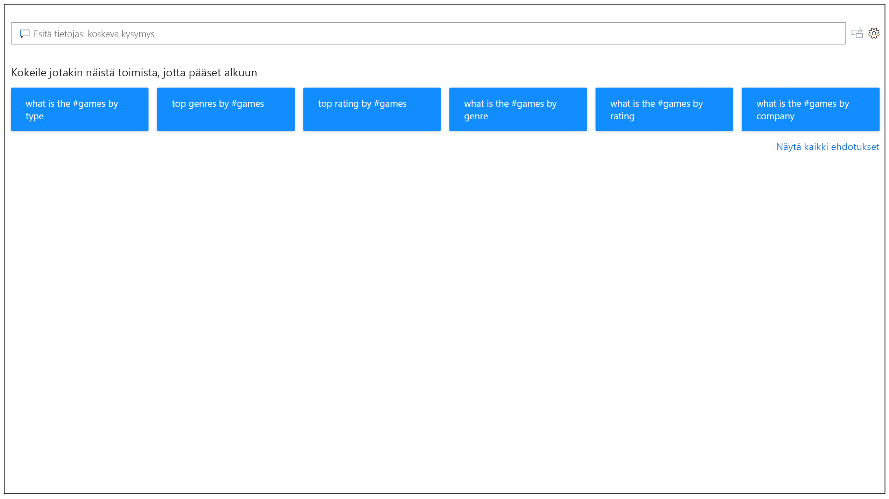
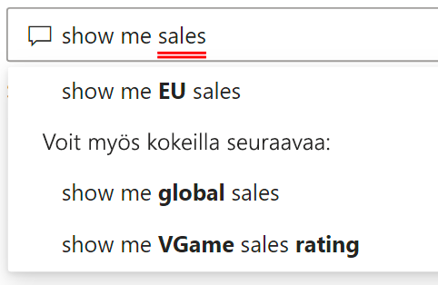
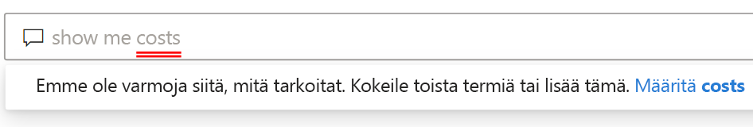
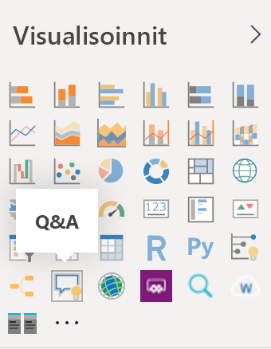
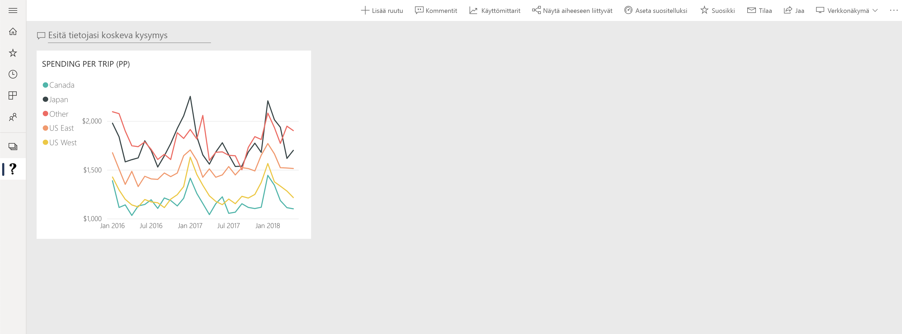

# Johdatus Power BI:n Q&A:han

Joskus nopein tapa saada vastauksia tiedoista on tehdä tietohaku luonnollisella kielellä. Power BI:n Q&A-ominaisuuden avulla voit tutkia tietojasi omin sanoin käyttäen luonnollista kieltä. Q&A on vuorovaikutteinen, jopa hauska. Usein yksi kysymys johtaa muihin, sillä visualisoinnit paljastavat kiinnostavia polkuja seurattaviksi. Kysymyksen esittäminen on vasta alkua. Tutki tietojasi ja keksi kysymyksiä, joilla voit löytää uusia tietoja, keskittyä yksityiskohtiin ja tarkastella kokonaisuutta laajemmasta näkökulmasta. Käyttökokemus on vuorovaikutteinen ja nopea, ja se toimii muistissa olevan tallennustilan avulla. 

Power BI:n Q&A on ilmainen ja kaikkien käyttäjien käytettävissä. Power BI Desktopissa raportin suunnittelijat voivat käyttää Q&A-toimintoa tietojen tutkimiseen ja visualisointien luomiseen. Power BI -palvelussa kaikki voivat tutkia tietojaan Q&A:lla. Jos sinulla on koontinäytön tai raportin muokkausoikeus, voit myös kiinnittää Q&A:n tuloksia.

## Q&A:n käyttäminen

Jo ennen kuin alat kirjoittaa, Q&A näyttää uuden näytön ehdotuksilla, jotka voivat olla avuksi kysymyksen muodostamisessa. Aloita jostakin ehdotetusta kysymyksestä tai kirjoita omat kysymyksesi. Q&A tukee useita erilaisia kysymyksiä, muun muassa seuraavia:

- **Esitä luonnollisia kysymyksiä** Millä myynneillä on suurin tuotto?
- **Käytä suhteellista päivämääräsuodatusta** Näytä myynti viimeisen vuoden ajalta
- **Palauta vain suurimmat N** 10 parasta tuotetta myynnin mukaan
- **Anna suodatin** Näytä myynti USA:ssa
- **Anna monimutkaisia ehtoja** Näytä myynnit, joissa tuoteluokka on luokka 1 tai luokka 2
- **Palauta tietty visualisointi** Näytä myynti tuotteittain ympyräkaaviona
- **Käytä monimutkaisia koosteita** Näytä myynnin mediaani tuotteittain
- **Lajittele tuloksia** Näytä kymmenen parasta maata myynnin mukaan, maakoodin mukaan lajiteltuna
- **Vertaa tietoja** Näytä päivämäärä kokonaismyynti vs kokonaiskustannus
- **Näytä trendit** Näytä myynti ajan mittaan

### Automaattinen täydennys

Kun kirjoitat kysymyksesi, Power BI:n Q&A näyttää oleellisia ja tilannekohtaisia tuloksia, joiden avulla voit nopeasti parantaa tuottavuuttasi käyttäen luonnollista kieltä. Saat kirjoittaessasi välittömästi palautetta ja tuloksia. Kokemus on samankaltainen kuin hakukoneeseen kirjoittaminen.

### Punainen/sininen alleviivaus

Q&A lisää sanoihin alleviivauksia, joiden avulla näet, mitä sanoja järjestelmä ymmärsi ja mitä se ei tunnistanut. Tasainen sininen alleviivaus ilmaisee, että järjestelmä yhdisti sanan onnistuneesti tietomallin kenttään tai arvoon. Alla olevassa esimerkissä näkyy, että Q&A on tunnistanut sanan *EU-myynti*.

Usein Q&A:han kirjoittamasi sana merkitään punaisella alleviivauksella. Punaisella alleviivauksella voidaan ilmaista kahta eri ongelmatilannetta. Ensimmäinen ongelmatyyppi on *alhainen luotettavuus*. Jos kirjoitat epämääräisen tai moniselitteisen sanan, kenttä alleviivataan punaisella. Esimerkki tästä on sana Myynti. Useat kentät voivat sisältää sanan Myynti, joten järjestelmä kehottaa sinua valitsemaan tarkoittamasi kentän lisäämällä punaisen alleviivauksen. Toinen esimerkki alhaisesta luotettavuudesta on, jos kirjoitat sanan ”alue”, mutta sarake, jota se vastaa, on nimeltään ”vyöhyke”. Power BI:n Q&A tunnistaa sanoja, jotka tarkoittavat samaa asiaa, Bing- ja Office-integraatioiden ansiosta. Q&A alleviivaa sanan punaisella, jotta tiedät, että se ei ole suora vastaavuus.

Toinen ongelmatyyppi on, kun Q&A ei tunnista sanaa lainkaan. Voit kohdata tämän ongelman, jos käytät toimialuekohtaista termiä, jota ei ole mainittu missään tiedoissa, tai jos tietokenttien nimet on määritetty virheellisesti. Esimerkiksi jos käytät sanaa "kustannukset", vaikka sitä ei löydy mistään tiedoista. Sana löytyy englanninkielisestä sanastosta, mutta Q&A merkitsee sen punaisella alleviivauksella.

> [!NOTE]
> Voit mukauttaa sinisen ja punaisen alleviivauksen värejä Q&A:n **Visuaalinen muotoilu** -ruudussa. [Q&A-työkalut](q-and-a-tooling-teach-q-and-a.md) artikkelissa kerrotaan myös *Opeta Q&A:ta* -toiminnosta, jonka avulla voit määritellä termejä, joita Q&A ei tunnistanut.

### Visualisoinnin tulokset

Kun kirjoitat kysymyksesi, Q&A yrittää tulkita ja visualisoida vastauksen heti. Uusimpien päivitysten myötä Q&A yrittää nyt tulkita kysymystä ja piirtää kentät automaattisesti oikeaan akseliin. Jos esimerkiksi kirjoitat ”myynti vuoden mukaan”, Q&A havaitsee, että vuosi on päivämääräkenttä ja priorisoi tämän kentän asettamista X-akselille. Jos haluat muuttaa visualisoinnin tyyppiä, kirjoita kysymyksen jälkeen *kaaviotyyppinä*. Q&A tukee tällä hetkellä näitä visualisointityyppejä:

- Viivakaavio
- Palkkikaavio
- Matriisi
- Taulukko
- Kortti
- Alue
- Ympyräkaavio
- Piste-/kuplakaavio
 

## Lisää Q&A raporttiin

Voit lisätä Q&A:n raporttiin Power BI Desktopissa tai Power BI -palvelussa kahdella eri tavalla:

- Lisää Q&A-visualisointi.
- Lisää Q&A-painike.

Jos haluat lisätä Q&A-visualisoinnin raporttiin, valitse uusi **Q&A**-kuvake, ja valitse sitten uusi Q&A-visualisointi Visualisointi-ruudussa. Vaihtoehtoisesti voit lisätä Q&A-visualisoinnin kaksoisnapsauttamalla mitä tahansa raporttipohjan kohtaa.

Jos haluat lisätä painikkeen, valitse **Aloitus**-valintanauhasta **Painikkeet** > **Q&A** Voit mukauttaa Q&A-painikkeen kuvaa haluamallasi tavalla.

> [!NOTE]
> Kun käynnistät Q&A:n painikkeesta, se käyttää yhä vanhaa Q&A:ta. Tämä korjataan tulevissa Power BI:n julkaisuversioissa.

## Käytä Q&A:ta koontinäytöissä

Q&A on oletusarvoisesti käytettävissä koontinäyttöjen yläreunassa. Jos haluat käyttää Q&A:ta, kirjoita kysymys **Esitä kysymys tiedoistasi** -ruutuun.

## Seuraavat vaiheet

Luonnollisen kielen voi integroida useilla eri tavoilla. Lisätietoja saat näistä artikkeleista:

* [Q&A-visualisointi](../visuals/power-bi-visualization-q-and-a.md)
* [Q&A:n parhaat käytännöt](q-and-a-best-practices.md)
