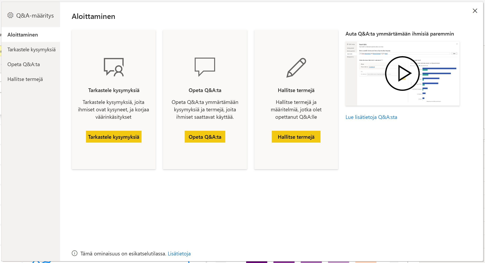
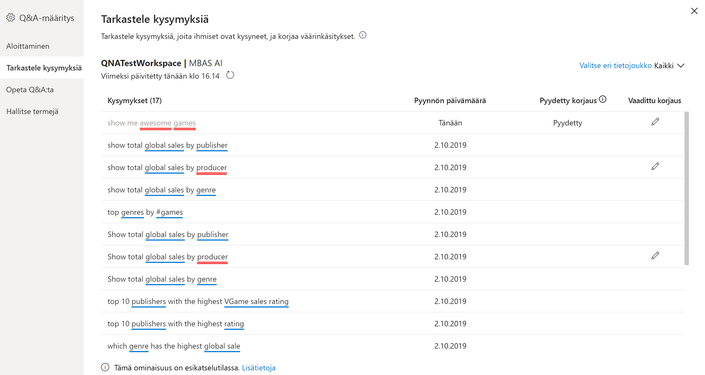
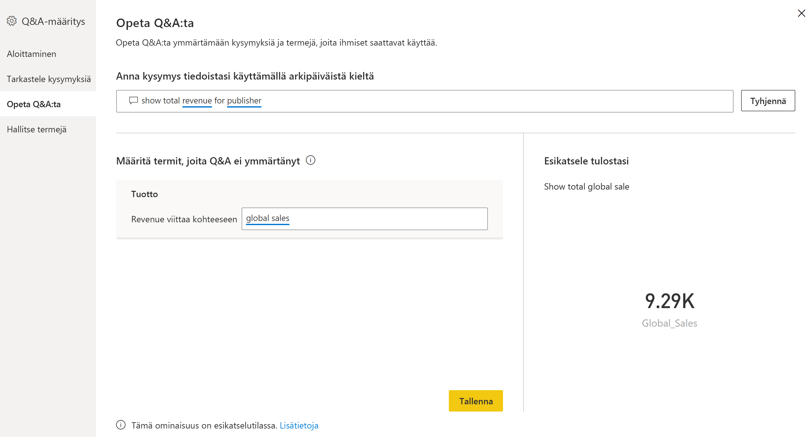
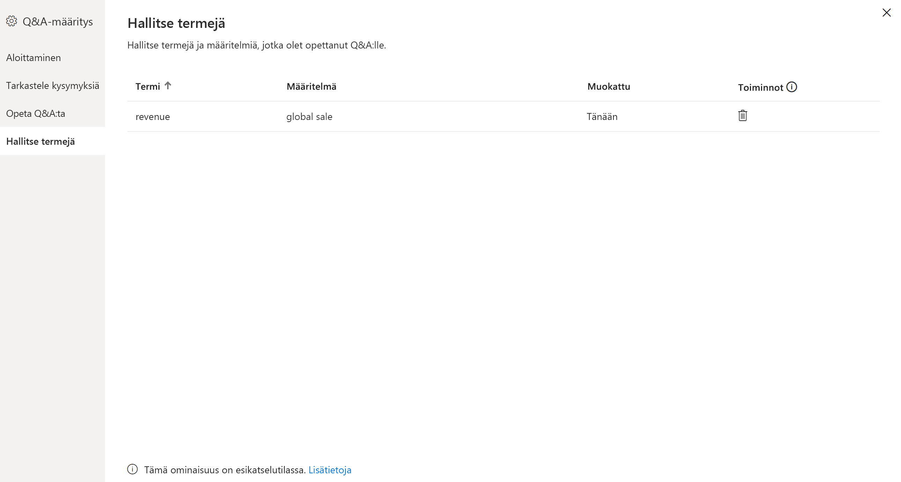
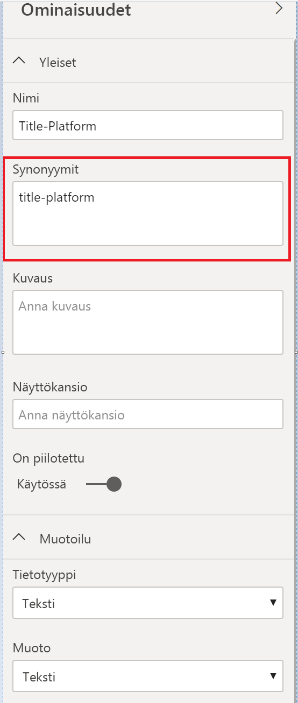

# Johdatus Power BI:n Q&A:n opetustyökaluihin (esiversio)

Power BI:n Q&A-*työkalujen* avulla voit parantaa käyttäjiesi luonnollisen kielen kokemusta. Suunnittelijana tai järjestelmänvalvojana voit käyttää luonnollisen kielen moduulia ja tehdä parannuksia kolmella alueella: 

- Tarkastele käyttäjiesi esittämiä kysymyksiä.
- Opeta Q&A:ta ymmärtämään kysymyksiä.
- Hallitse termejä, jotka olet opettanut Q&A:lle.

Näiden erillisten työkalutoimintojen lisäksi Power BI Desktopin **Mallinnus**-välilehdellä on lisää vaihtoehtoja:  

- Synonyymit
- Riviotsikot
- Piilota Q&A:sta
- Lingvistisen rakenteen määrittäminen (lisäasetus)

## Q&A-työkalujen käytön aloittaminen

Q&A-työkalut ovat käytettävissä vain Power BI Desktopissa, ja ne tukevat tällä hetkellä vain tuontitilaa.

1. Luo visualisointi avaamalla Power BI Desktop ja käyttämällä Q&A:ta. 
2. Valitse visualisoinnin kulmasta hammasrataskuvake. 

    

    Aloittaminen -sivu avautuu.  

    

### Tarkastele kysymyksiä

Valitse **Tarkastele kysymyksiä**, niin saat näkyviin luettelon tietojoukoista, joita käytetään vuokraajasi Power BI -palvelussa. **Tarkastele kysymyksiä** -sivu näyttää myös tietojoukon omistajan, työtilan ja viimeisimmän päivityksen päivämäärän. Täältä voit valita tietojoukon ja tarkastella käyttäjien esittämiä kysymyksiä. Tiedoissa näkyvät myös sanat, joita ei tunnistettu. Kaikki tässä näytetyt tiedot ovat viimeisen 28 päivän ajalta.

### Opeta Q&A:ta

**Opeta Q&A:ta** -osion avulla voit opettaa Q&A:ta tunnistamaan sanoja. Aloita kirjoittamalla kysymys, joka sisältää sanan tai sanoja, joita Q&A ei tunnistanut. Q&A pyytää sinua määrittelemään kyseisen termin. Anna joko suodatin tai kentän nimi, joka vastaa sitä, mitä kyseinen sana merkitsee. Q&A tulkitsee sitten alkuperäisen kysymyksen uudelleen. Jos olet tyytyväinen tuloksiin, voit tallentaa ne. Katso lisätietoja artikkelista [Opeta Q&A:ta](q-and-a-tooling-teach-q-and-a.md)

### Hallitse termejä

Kaikki Opeta Q&A:ta -osiossa tallentamat tietosi näkyvät täällä, joten voit tarkastella tai poistaa määrittämiäsi termejä. Tällä hetkellä et voi muokata aiemmin luotua määritystä, mutta voit määrittää termin uudelleen poistamalla kyseisen termin ja luomalla sen uudelleen.

## Muut Q&A-asetukset

### Joukkosynonyymit

Power BI Desktopin **Mallinnus**-välilehdellä on lisää vaihtoehtoja Q&A-kokemuksen parantamiseen. 

1. Valitse Power BI Desktopin Mallinnus-näkymä.

2. Valitse kenttä tai taulukko nähdäksesi **Ominaisuudet**-ruudun.  Tämä ruutu näkyy piirtoalustan oikealla puolella, ja siinä luetellaan useita Q&A-toimintoja. Yksi vaihtoehdoista on **Synonyymit**. **Synonyymit**-ruudussa voit nopeasti määrittää vaihtoehtoja valitsemallesi taulukolle tai kentälle. Voit myös määrittää synonyymeja Työkalut-valintaikkunan **Opeta Q&A:ta** -osiossa, mutta useille taulukon kentille on usein nopeampaa määrittää synonyymeja täällä.

    

3. Jos haluat määrittää useita synonyymeja yhdelle kentälle, käytä pilkkuja erottamaan synonyymit toisistaan.

### Piilota Q&A:sta

Voit myös piilottaa kenttiä ja taulukoita, jolloin ne eivät näy Q&A:n tuloksissa. 

1. Valitse Power BI Desktopin Mallinnus-näkymä.

2. Valitse kenttä tai taulukko nähdäksesi **Ominaisuudet**-ruudun ja vaihda valinnan **On piilotettu** arvoksi **Käytössä**.

    Q&A noudattaa tätä asetusta ja varmistaa, että Q&A ei tunnista kyseistä kenttää. Saatat esimerkiksi haluta piilottaa tunnuskentät ja viiteavaimet, välttääksesi tarpeettomat samannimisten kenttien kaksoiskappaleet. Vaikka piilotat kentän, voit edelleen käyttää sitä Power BI Desktopin visualisoinneissa muualla kuin Q&A:ssa.

### Aseta riviotsikko

Riviotsikon avulla voit määrittää, mikä sarake (tai *kenttä*) parhaiten tunnistaa yksittäisen rivin taulukossa. Esimerkiksi taulukolle, jonka nimi on ”asiakas”, riviotsikko on yleensä ”näyttönimi”. Tämän ylimääräisen metatiedon avulla Q&A voi piirtää entistä hyödyllisempiä visualisointeja, kun käyttäjä kirjoittaa ”Näytä myynti asiakkaittain”. Sen sijaan, että se käsittelisi "asiakasta" taulukkona, se voi käyttää ”näyttönimeä” ja näyttää palkkikaavion, jossa on kunkin asiakkaan myynnit. Riviotsikon voi määrittää vain Mallinnus-näkymässä. 

1. Valitse Power BI Desktopin Mallinnus-näkymä.

2. Valitse taulukko nähdäksesi **Ominaisuudet**-ruudun.

3. Valitse kenttä **Riviotsikko**-ruudussa.

## Määritä lingvistinen rakenne (lisäasetus)

Voit opettaa ja parantaa Power BI:n luonnollisen kielen moduulia Q&A:n sisällä, mukaan lukien taustalla olevien luonnollisen kielen tulosten pisteytystä ja painotusta. Lisätietoja on artikkelissa [Q&A:n lingvistisen rakenteen muokkaaminen ja muotoilujen lisääminen](q-and-a-tooling-advanced.md).

## Seuraavat vaiheet

Luonnollisen kielen moduulin parantamiseen on olemassa joitain parhaita käytäntöjä. Katso lisätietoja seuraavasta artikkelista:

* [Q&A:n parhaat käytännöt](q-and-a-best-practices.md)
