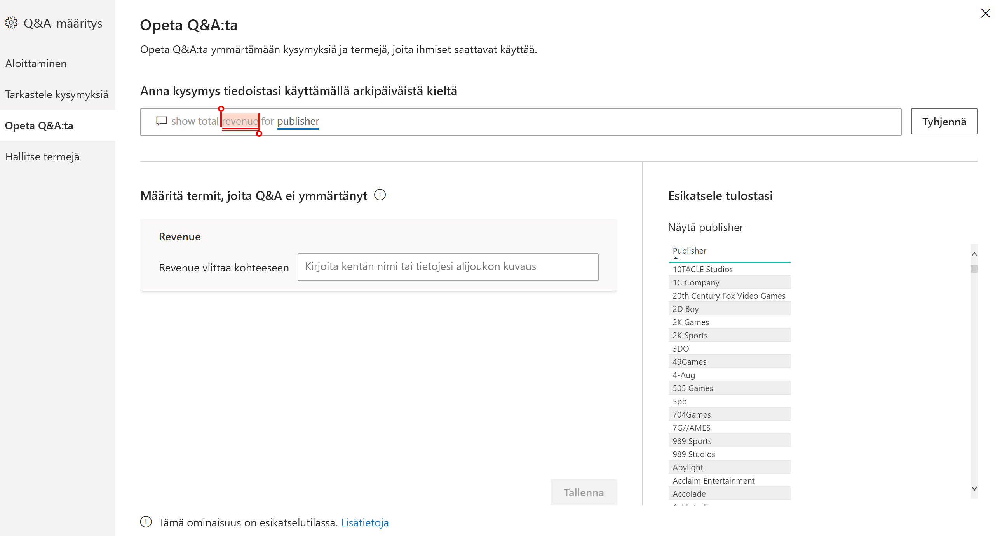
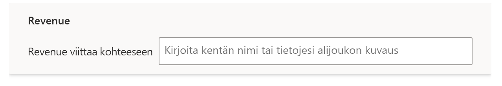
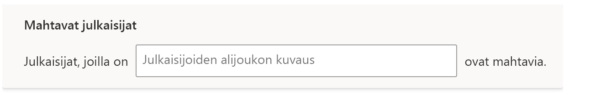

# Opeta Q&A:ta ymmärtämään kysymyksiä ja termejä Power BI:n Q&A:ssa

Q&A-määrityksen osassa **Opeta Q&A:ta** voit harjoittaa Q&A:ta ymmärtämään luonnollisen kielen kysymyksiä ja termejä, joita ei ole tunnistettu. Aloita lähettämällä kysymys, joka sisältää sanan tai sanoja, joita Q&A ei tunnistanut. Q&A pyytää sinua sitten määrittämään kyseisen termin. Anna joko suodatin tai kentän nimi, joka vastaa sitä, mitä kyseinen sana merkitsee. Q&A tulkitsee sitten alkuperäisen kysymyksen uudelleen. Jos olet tyytyväinen tuloksiin, tallenna ne.

> [!NOTE]
> Opeta Q&A:ta -toiminto tukee vain tuontitilaa. Se ei myöskään vielä tue yhdistämistä paikalliseen tai Azure Analysis Servicesin tietolähteeseen. Tämä rajoitus poistetaan seuraavissa Power BI -julkaisuversioissa.

## Aloita Q&A:n opettaminen

1. Valitse Power BI Desktopissa **Mallinnus**-valintanauhassa **Q&A-määritys** > **Opeta Q&A:ta**.

    

2. Kirjoita lause, joka sisältää termin, jota Q&A ei tunnista, ja valitse **Lähetä**.

3. Valitse punaisella alleviivattu sana. 

    Q&A tarjoaa ehdotuksia ja kehottaa sinua antamaan termin oikean määritelmän. 
    
3. Anna määritelmä kohtaan **Määritä termit, joita Q&A ei ymmärtänyt**.

    

4. Esikatsele päivitettyä visualisointia valitsemalla **Tallenna**.

5. Anna seuraava kysymys tai sulje toiminto valitsemalla **X**.

Raporttisi käyttäjät eivät näe tätä muutosta, ennen kuin julkaiset raportin uudelleen palvelussa.

## Substantiivien ja adjektiivien määrittäminen

Voit opettaa Q&A:lle kahdentyyppisiä termejä:

- Substantiivit
- Adjektiivit

### Määritä substantiivin synonyymi

Kun käsittelet tietoja, sinulla voi usein olla kenttien nimiä, joihin voisi viitata myös vaihtoehtoisilla nimillä. Esimerkki tällaisesta nimestä on ”Myynti”. Myyntiin voidaan viitata muillakin sanoilla tai ilmauksilla, kuten ”tuotto”. Jos sarakkeen nimi on "Myynti" ja raportin käyttäjät kirjoittavat ”tuotto”, Q&A ei välttämättä osaa valita oikeaa saraketta vastatakseen kysymykseen. Tässä tapauksessa haluat kertoa Q&A:lle, että ”myynti” ja ”tuotto” viittaavat samaan asiaan.

Q&A tunnistaa automaattisesti, kun tunnistamaton sana on substantiivi, käyttäen Microsoft Officen tietoja. Jos Q&A havaitsee substantiivin, näet seuraavan kehotteen:

- <your term> **viittaa kohteeseen** 

Täytä ruutuun termisi tiedot.

Jos annat synonyymiksi jotain muuta kuin tietomallin kentän, saatat saada epätoivottuja tuloksia.

### Adjektiivin suodatusehtojen määrittäminen

Joskus saatat haluta määrittää termejä, jotka toimivat pohjana olevien tietojen ehtona. Esimerkki tällaisesta on ”Loistavat julkaisijat”. ”Loistava” voi olla ehto, joka valitsee vain julkaisijoita, jotka ovat julkaisseet tietyn määrän tuotteita. Q&A yrittää havaita adjektiiveja ja näyttää eri kehotteen:

- <field name>, **joilla on**  

Täytä ruutuun ehto.

Esimerkkejä ehdoista, joita voit määrittää:

- ”Maa”, joka on ”USA”
- ”Maa”, joka ei ole ”USA”
- ”Paino” > 2 000
- ”Paino = 2 000
- ”Paino” < 2 000

Voit määrittää vain yhden ehdon työkalujen kautta. Jos haluat määrittää monimutkaisempia ehtoja, luo DAX-toiminnolla laskettu sarake ja luo sitten yksi ehto tälle lasketulle sarakkeelle työkalujen avulla. Mittareita ei tueta. Käytä sen sijaan laskettuja sarakkeita.

## Hallitse termejä

Kun olet antanut määritelmät, voit palata katsomaan kaikkia tekemiäsi korjauksia ja halutessasi muokata tai poistaa niitä. 

1. Siirry**Q&A-määritys**-valikossa osioon **Hallitse termejä**.

2. Poista termit, joita et enää halua. Tällä hetkellä et voi muokata termejä. Jos haluat määrittää termin uudelleen, poista se ja määritä se uudelleen.

    

## Seuraavat vaiheet

Luonnollisen kielen moduulin parantamiseen on olemassa joitain parhaita käytäntöjä. Katso lisätietoja seuraavasta artikkelista:

* [Q&A:n parhaat käytännöt](q-and-a-best-practices.md)
