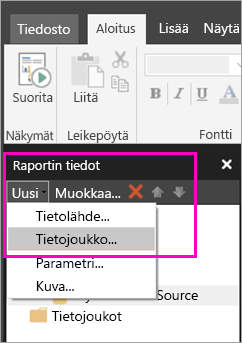
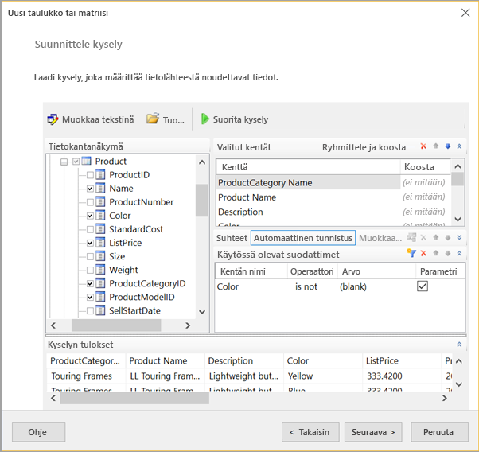
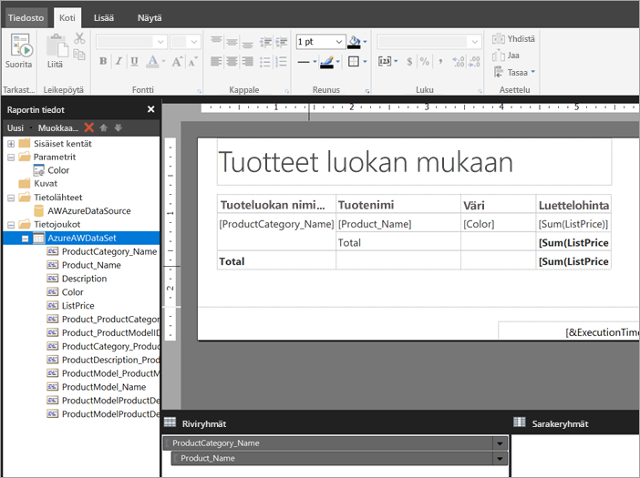

# Upotetun tietojoukon luominen sivutettuun raporttiin Power BI -palvelussa

Tässä artikkelissa opit luomaan upotettuun tietolähteeseen perustuvan upotetun tietojoukon sivutettuun raporttiin Power BI -palvelussa. Upotetut tietojoukot lisätään yksittäiseen sivutettuun raporttiin kyseisessä raportissa käytettäväksi. Power BI -palveluun tällä hetkellä julkaistavat sivutetut raportit edellyttävät upotettuja tietojoukkoja ja upotettuja tietolähteitä. Voit luoda upotetun tietolähteen ja tietojoukon Power BI:n raportin muodostimessa samalla, kun luot raportin. 

Ennen kuin luot tietojoukon, sinun on luotava tietolähde. Ohjeet ovat kohdassa [Sivutettujen raporttien upotetut tietolähteet](paginated-reports-embedded-data-source.md) Power BI -palvelussa.
  
## Upotetun tietojoukon luominen
  
1. Valitse Power BI:n raportin muodostimen raporttitietoruudusta **Uusi** > **Tietojoukko**.

1. Anna tietojoukolle nimi **Tietojoukon ominaisuudet** -valintaikkunan **Kysely**-välilehdellä. Upotettu tietolähde on jo **Tietolähde**-ruudussa tai voit luoda uuden upotetun tietolähteen valitsemalla **Uusi**.
 
     

3. Valitse **Kyselyn tyyppi**, valitse tietojoukossa käytettävä komennon tai kyselyn tyyppi. 
    - **Teksti** suorittaa kyselyn tietojen hakemiseksi tietokannasta. Se on oletusarvo, ja sitä käytetään useimmissa kyselyissä. Kirjoita kysely tai tuo aiemmin luotu kysely valitsemalla **Tuo**. Voit luoda kyselyn graafisesti valitsemalla **Kyselyjen suunnittelutyökalu**. Jos luot kyselyn kyselyjen suunnittelutyökalun avulla, kyselyn teksti näkyy tässä ruudussa. Luo kysely dynaamisesti lausekkeen avulla valitsemalla **Lauseke** (**fx**) -painike. 
    - **Taulukko** valitsee kaikki taulukon kentät. Kirjoita sen taulukon nimi, jota haluat käyttää tietojoukkona.
    - **Tallennettu toimintosarja** suorittaa tallennetun toimintosarjan nimen mukaan.

4. Kyselyjen suunnittelutyökalussa voit tarkastella ja käsitellä tietojoukon taulukoita ja kenttiä, tuoda kyselyn tai muokata tekstinä. Siellä voit myös lisätä suodattimia ja parametreja. 

    

5. Testaa kysely valitsemalla kyselyjen suunnittelutyökalussa **Suorita kysely** ja sitten **OK**.

1. Kirjoita Tietojoukon ominaisuudet -valintaikkunan **Aikakatkaisu (sekunteina)** -ruutuun, kuinka monen sekunnin kuluttua kysely aikakatkaistaan. Oletusarvo on 30 sekuntia. **Aikakatkaisu**-arvon on oltava tyhjä tai suurempi kuin nolla. Jos se on tyhjä, kyselyä ei aikakatkaista.

7.  Voit määrittää muita ominaisuuksia tietojoukolle muilla välilehdillä:
    - Luo laskettuja kenttiä **Kentät**-välilehdellä.
    - Määritä lisäasetuksia **Asetukset**-välilehdellä.
    - Lisää tai päivitä **suodattimia** ja **parametreja** niitä vastaavilla välilehdillä.

8. Valitse **OK**.
 
   Raportti avautuu raportin suunnittelunäkymässä. Tietolähde, tietojoukko ja tietojoukon kenttäkokoelma näkyvät raporttitietoruudussa, ja voit jatkaa sivutetun raportin suunnittelemista.  

     
 
## Seuraavat vaiheet 

- [Mitä ovat sivutetut raportit Power BI Premiumissa?](paginated-reports-report-builder-power-bi.md)  
- [Opetusohjelma: Sivutetun raportin luominen ja lataaminen Power BI -palveluun](paginated-reports-quickstart-aw.md)
- [Sivutetun raportin julkaiseminen Power BI -palveluun](paginated-reports-save-to-power-bi-service.md)

