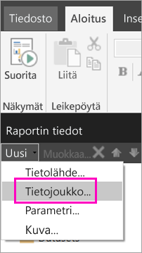
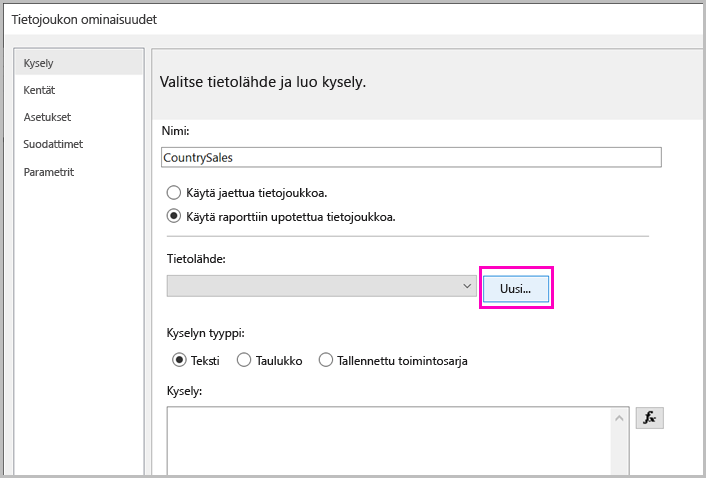
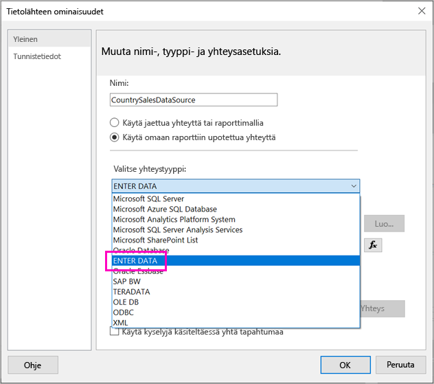
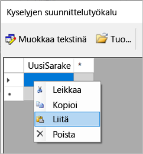
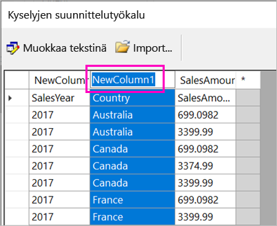
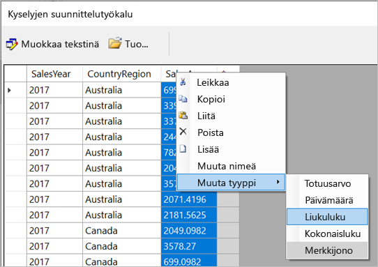
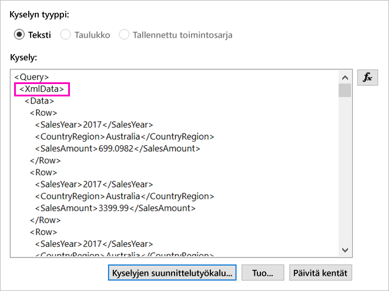
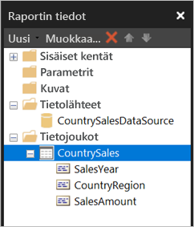

# <a name="enter-data-directly-in-a-paginated-report-in-report-builder---power-bi"></a>Tietojen lisääminen suoraan sivutettuun raporttiin Raportin muodostimessa – Power BI

Tässä artikkelissa kerrotaan SQL Server 2016:n Raportin muodostimen uusimman version ominaisuudesta, joka mahdollistaa tietojen lisäämisen suoraan RDL-raporttiin upotettuna tietojoukkona.  Tämä ominaisuus on samankaltainen kuin Power BI Desktop. Voit kirjoittaa tiedot suoraan raportin tietojoukkoon, tai voit liittää ne toisesta ohjelmasta, kuten Microsoft Excelistä. Kun olet luonut tietojoukon antamalla tiedot, voit käyttää sitä samalla tavalla kuin mitä tahansa muuta luomaasi upotettua tietojoukkoa. Lisäksi voit lisätä useamman kuin yhden taulukon ja käyttää yhtä taulukkoa toisen suodattimena. Tämä ominaisuus on erityisen kätevä pienissä ja staattisissa tietojoukoissa, joita saatat tarvita raportissasi, kuten raportin parametreissä.
 
## <a name="prerequisites"></a>Edellytykset

- Jotta voisit lisätä tietoja suoraan sivutettuun raporttiin, sinun on asennettava [Raportin muodostimen uusi versio Microsoft Download Centeristä](https://www.microsoft.com/download/details.aspx?id=53613). 
- Jos haluat tallentaa sivutetun raportin Power BI -palveluun, tarvitset [Power BI Pro -tilin](service-self-service-signup-for-power-bi.md) ja kirjoitusoikeudet [Power BI Premium -kapasiteetin](service-premium-what-is.md) työtilaan.
- Jos haluat tallentaa sivutetun raportin raporttipalvelimeen, tarvitset [RsReportServer.config-tiedoston muokkausoikeudet](#upload-the-paginated-report-to-a-report-server).

## <a name="get-started"></a>Aloittaminen

Kun olet ladannut ja asentanut Raportin muodostimen, seuraat samaa työnkulkua kuin lisätessäsi upotettua tietolähdettä ja -joukkoa raporttiin. Seuraavan toiminnon **Tietolähteet**-kohdassa näkyy uusi vaihtoehto: **Anna tiedot**.  Sinun tarvitsee määrittää tämä tietolähde ainoastaan kerran kutakin raporttia kohden. Sen jälkeen voit luoda annetuista tiedoista useita taulukoita erillisinä tietojoukkoina, jotka kaikki käyttävät samaa tietolähdettä.

1. Valitse **raporttitietoruudussa** **Uusi** > **Tietojoukko**.

    

1. Valitse **Tietojoukon ominaisuudet** -valintaikkunasta **Käytä raporttiin upotettua tietojoukkoa**.

1. Valitse **Tietolähde**-kohdan vierestä **Uusi**.

    

1. Valitse **Tietolähteen ominaisuudet** -valintaikkunasta **Käytä raporttiin upotettua yhteyttä**.
2. Valitse **Valitse yhteystyyppi** -ikkunassa **ANNA TIEDOT** > **OK**.

    

1. Valitse **Tietojoukon ominaisuudet** -valintaikkunasta **Kyselyjen suunnittelutyökalu**.
2. Napsauta **Kyselyjen suunnittelutyökalu** -ruutua hiiren kakkospainikkeella ja liitä tiedot taulukkoon.

    

1. Jos haluat määrittää sarakkeiden nimet, kaksoisnapsauta jokaista **UusiSarake**-kohtaa ja kirjoita sarakkeen nimi.

    

1. Jos ensimmäinen rivi sisältää alkuperäisten tietojen sarakeotsikot, napsauta sitä hiiren kakkospainikkeella ja poista se.
    
9. Sarakkeiden oletustietotyyppi on Merkkijono. Jos haluat muuttaa tietotyyppiä, napsauta sarakkeen otsikkoa hiiren kakkospainikkeella > **Muuta tyyppi** ja määritä tyypiksi toinen tietotyyppi, kuten päivämäärä tai liukuluku.

    

1. Kun taulukko on valmis, valitse **OK**.  

    Luotava kysely on samanlainen kuin XML-tietolähteiden kohdalla. Konepellin alla käytetäänkin XML:ää tietopalveluna.  Se on suunniteltu uudelleen sopimaan myös tähän skenaarioon.

    

12. Valitse **Tietojoukon ominaisuudet** -valintaikkunasta **OK**.

13. Näet tietolähteen ja -joukon **Raporttitietoruudussa**.

    

Voit käyttää tietojoukkoa raporttisi tietojen visualisoinnin perustana. Voit myös lisätä toisen tietojoukon ja käyttää sille samaa tietolähdettä.

## <a name="upload-the-paginated-report-to-the-power-bi-service"></a>Sivutetun raportin lataaminen Power BI -palveluun

Nyt kun Power BI -palvelu tukee sivutettuja raportteja, voit ladata sivutetun raportin Premium-kapasiteettiin. Lue lisää kohdasta [Sivutetun raportin lataaminen](paginated-reports-save-to-power-bi-service.md).

## <a name="upload-the-paginated-report-to-a-report-server"></a>Sivutetun raportin lataaminen raporttipalvelimeen

Voit ladata sivutetun raportin myös Power BI -raporttipalvelimeen tai SQL Server Reporting Services 2016 tai 2017 -raporttipalvelimeen. Ennen sitä sinun täytyy lisätä seuraava kohde RsReportServer.config-tiedostoon ylimääräisenä tietolaajennuksena. Varmuuskopioi RsReportServer.config-tiedosto ennen kuin teet muutoksen siltä varalta, että myöhemmin ilmenee ongelmia.

```xml
<Extension Name="ENTERDATA" Type="Microsoft.ReportingServices.DataExtensions.XmlDPConnection,Microsoft.ReportingServices.DataExtensions">
    <Configuration>
        <ConfigName>ENTERDATA</ConfigName>
    </Configuration>
</Extension>
```

Muokkaamisen jälkeen määritystiedoston tietopalveluiden luettelon pitäisi näyttää tältä:


Siinä kaikki – nyt voit julkaista raporttipalvelimeesi raportteja, jotka hyödyntävät tätä uutta toiminnallisuutta.

## <a name="next-steps"></a>Seuraavat vaiheet

- [Mitä ovat sivutetut raportit Power BI Premiumissa?](paginated-reports-report-builder-power-bi.md)
- [Mikä on Power BI -raporttipalvelin?](report-server/get-started.md)
