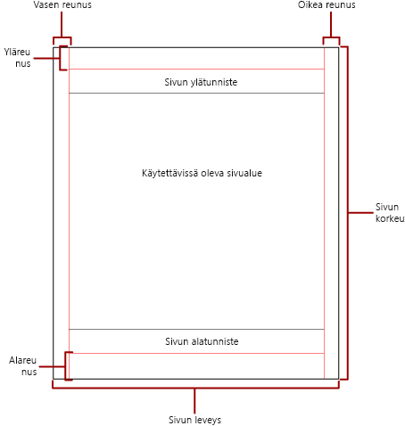
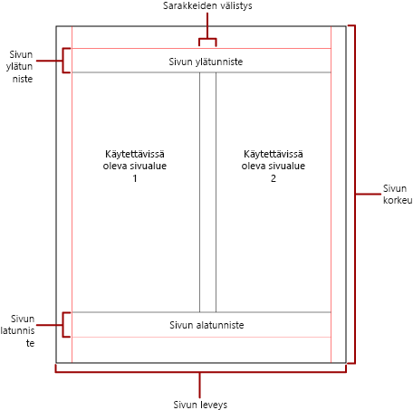

# Sivutus Power BI:n sivutetuissa raporteissa

 *Sivutus* viittaa raportin sivujen määrään ja siihen, miten raporttikohteet järjestetään näille sivuille. Power BI:n sivutettujen raporttien sivutus vaihtelee sen mukaan, mitä hahmontamislaajennusta käytät raportin tarkastelemiseen ja toimittamiseen. Kun raportti suoritetaan raporttipalvelimessa, raportti käyttää HTML-hahmonninta. HTML noudattaa tiettyä sivutussääntöjoukkoa. Jos viet saman raportin PDF-tiedostoon, käytät esimerkiksi PDF-hahmonnusta, joka käyttää eri sääntöjoukkoa. Siksi raportti sivuttaa eri tavalla. Sinun on ymmärrettävä sivutetuissa Power BI -raporteissa käytettävät sivutussäännöt. Sen jälkeen voit onnistuneesti suunnitella helposti luettavan raportin, jonka optimoit sille hahmontamistoiminnolle, jota aiot käyttää raportin toimittamiseen.  
  
 Tässä ohjeaiheessa käsitellään fyysisen sivun koon ja raportin asettelun vaikutusta siihen, miten kiinteän sivunvaihdon hahmontamistoiminnot hahmontavat raportin. Voit määrittää ominaisuudet fyysisen sivun koon ja reunusten muokkaamiseksi ja jakaa raportin sarakkeisiin käyttämällä **Raportin ominaisuudet** -ruutua, **Ominaisuudet**-ruutua tai **Sivun asetukset** -valintaikkunaa. Käytä **Raportin ominaisuudet** -ruutua napsauttamalla raportin rungon ulkopuolella olevaa sinistä aluetta. Käytä **Sivun asetukset** -valintaikkunaa valitsemalla Aloitus-välilehdessä **Suorita** ja valitsemalla sitten Suorita-välilehdessä **Sivun asetukset**.  
  
> [!NOTE]  
>  Jos olet suunnitellut raportin yhden sivun levyiseksi, mutta se hahmontaa useilla sivuilla, tarkista, että raportin rungon leveys, reunukset mukaan lukien, ei ole suurempi kuin fyysisen sivun koon leveys. Jos haluat estää tyhjien sivujen lisäämisen raporttiin, voit pienentää säilön kokoa vetämällä säilön kulmaa vasemmalle.  

## Raportin leipäteksti  
 Raportin leipäteksti on suorakulmainen säilö, joka näkyy suunnittelualueella tyhjänä tilana. Se kasvaa tai kutistuu siihen sisältyvien raporttikohteiden mukaan. Raportin leipäteksti ei vastaa fyysisen sivun kokoa, ja itse asiassa raportin leipäteksti voi kasvaa fyysisen sivun koon rajojen ulkopuolelle useille raporttisivuille. Jotkin hahmontimet, kuten Microsoft Excel, Word, HTML ja MHTML, hahmontavat raportteja, jotka kasvavat tai kutistuvat sivun sisällön mukaan. Näissä muodoissa hahmonnetut raportit optimoidaan näyttöpohjaiseen, esimerkiksi verkkoselaimessa tapahtuvaan, katseluun. Nämä hahmontimet lisäävät pystysuuntaisia sivunvaihtoja tarvittaessa.  
  
 Voit muotoilla raportin rungon leipätekstiä muokkaamalla reunan väriä, tyyliä ja leveyttä. Voit myös lisätä taustavärin ja taustakuvan.  
  
## Fyysinen sivu  
 Fyysisen sivun koko on paperikoko. Raportille määrittämäsi paperikoko ohjaa raportin hahmontamista. Kiinteän sivunvaihdon muodoissa hahmonnetut raportit lisäävät sivunvaihtoja vaaka-ja pystysuunnassa fyysisen sivun koon mukaan. Nämä sivunvaihdot tarjoavat optimoidun lukukokemuksen, kun niitä tulostetaan tai tarkastellaan tiedostomuodossa, joka käyttää kiinteää sivunvaihtoa. Pehmeän sivunvaihdon muodoissa hahmonnetut raportit lisäävät sivunvaihtoja vaakasuunnassa fyysisen koon mukaan. Sivunvaihdot tarjoavat myös optimoidun lukukokemuksen, kun niitä tarkastellaan verkkoselaimessa.  
  
 Sivun oletuskoko on 8,5 x 11 tuumaa, mutta voit muuttaa tätä kokoa **Raportin ominaisuudet** -ruudussa tai **Sivun asetukset** -valintaikkunassa tai muuttamalla sivun PageHeight- tai PageWidth-ominaisuuksia **Ominaisuudet**-ruudussa. Sivun koko ei kasva tai kutistu raportin leipätekstin sisällön mukaan. Jos haluat raportin näkyvän yhdellä sivulla, raportin leipätekstin koko sisällön on sovittava fyysiselle sivulle. Jos se ei sovi ja käytät kiinteän sivunvaihdon muotoa, raportti tarvitsee lisäsivuja. Jos raportin leipäteksti kasvaa fyysisen sivun oikean reunan yli, sivunvaihto lisätään vaakasuunnassa. Jos raportin leipäteksti kasvaa fyysisen sivun alareunan yli, sivunvaihto lisätään pystysuunnassa.  
  
 Jos haluat ohittaa raportissa määritetyn fyysisen sivun koon, voit määrittää fyysisen sivun koon käyttämällä sen hahmontimen laitetietojen asetuksia, jota käytät raportin vientiin. Täydellinen luettelo on saatavana [Hahmontamislaajennusten laitetietojen asetukset](https://docs.microsoft.com/sql/reporting-services/device-information-settings-for-rendering-extensions-reporting-services?view=sql-server-2017) -asiakirjassa SQL Server Reporting Servicesin dokumentaatiossa.  
  
### Reunukset

 Reunukset piirretään fyysisen sivun mittojen reunasta sisäänpäin määritettyyn reunuksen asetukseen. Jos raporttikohde ulottuu reunuksen alueelle, se leikataan niin, ettei päällekkäistä aluetta hahmonneta. Jos määritetty reunuksen koko aiheuttaa sen, että sivun vaaka- tai pystysuuntainen leveys on nolla, reunuksen asetusten oletusarvoksi tulee nolla. Reunukset määritetään **Raportin ominaisuudet** -ruudussa tai **Sivun asetukset** -valintaikkunassa tai muuttamalla TopMargin-, BottomMargin-, LeftMargin- ja RightMargin-ominaisuuksia **Ominaisuudet**-ruudussa. Jos haluat ohittaa raportissa määritetyn reunuksen koon, voit määrittää reunuksen koon käyttämällä sen hahmontimen laitetietojen asetuksia, jota käytät raportin vientiin.  
  
 Fyysisen sivun aluetta, joka jää jäljelle, kun tila on varattu reunuksille, sarakkeiden välistykselle sekä sivun ylä- ja alatunnisteille, kutsutaan *käytettävissä olevakse sivualueeksi*. Reunuksia käytetään vain, kun raportteja hahmonnetaan ja tulostetaan kiinteillä sivunvaihdoilla. Seuraavassa kuvassa näkyy fyysisen sivun reunus ja käytettävissä oleva sivualue.  
  
 
  
### Uutiskirjeen tyyliset sarakkeet  

 Raportti voidaan jakaa sarakkeisiin, jotka muistuttavat sanomalehtien palstoja. Sarakkeita käsitellään *loogisina* sivuina, jotka hahmonnetaan samalle *fyysiselle* sivulle. Ne järjestetään vasemmalta oikealle, ylhäältä alas, ja ne erotetaan toisistaan tyhjällä tilalla kunkin sarakkeen välissä. Jos raportti on jaettu useampaan kuin yhteen sarakkeeseen, jokainen fyysinen sivu jaetaan pystysuunnassa sarakkeisiin, ja kutakin saraketta pidetään loogisena sivuna. Oletetaan esimerkiksi, että fyysisellä sivulla on kaksi saraketta. Raportin sisältö täyttää ensimmäisen sarakkeen ja sitten toisen sarakkeen. Jos raportti ei sovi kokonaan kahteen ensimmäiseen sarakkeeseen, raportti täyttää ensimmäisen ja toisen sarakkeen seuraavalla sivulla. Sarakkeiden täyttämistä jatketaan vasemmalta oikealle, ylhäältä alas, kunnes kaikki raporttikohteet on hahmonnettu. Jos määritetty sarakkeen koko aiheuttaa sen, että vaaka- tai pystysuuntainen leveys on nolla, sarakkeen välistyksen oletusarvoksi tulee nolla.  
  
 Sarakkeet määritetään **Raportin ominaisuudet** -ruudussa tai **Sivun asetukset** -valintaikkunassa tai muuttamalla TopMargin-, BottomMargin-, LeftMargin- ja RightMargin-ominaisuuksia **Ominaisuudet**-ruudussa. Jos haluat käyttää reunuksen koko, jota ei ole määritetty, voit määrittää reunuksen koon käyttämällä sen hahmontimen laitetietojen asetuksia, jota käytät raportin vientiin. Sarakkeita käytetään vain, kun raportteja hahmonnetaan ja tulostetaan PDF- tai kuvamuodossa. Seuraavassa kuvassa näkyy sarakkeita sisältävän sivun käytettävissä oleva sivualue.  
  

  
## Sivunvaihdot ja sivun nimet

 Raporttia voi olla helpompi lukea ja sen tietoja voi olla helpompi tarkastaa ja viedä, kun raportin sivut on nimetty. Reporting Services tarjoaa raporteille sekä raportissa oleville taulukon, matriisin ja luettelon tietoalueille, ryhmille sekä suorakulmioille ominaisuuksia, joiden avulla voidaan ohjata sivutusta, nollata sivunumeroita ja nimetä raporttien sivuja uudelleen sivunvaihdoissa. Nämä ominaisuudet voivat parantaa raportteja niiden hahmontamisen muodosta riippumatta, mutta ne ovat erityisen hyödyllisiä vietäessä raportteja Excel-työkirjoihin.

> [!NOTE]
> Taulukon, matriisin ja luettelon tietoalueet ovat kaikki oikeastaan samanlaisia tietoalueita – *tablix*-tietoalueita. Tämä nimi voi siis tulla vastaan. 

 InitialPageName-ominaisuus antaa raportin alkuperäisen sivun nimen. Jos raportti ei sisällä sivun nimiä sivunvaihdoille, alkuperäistä sivun nimeä käytetään kaikille uusille sivunvaihtojen luomille sivuille. Sinun ei tarvitse käyttää alkuperäistä sivun nimeä.  
  
 Hahmonnettu raportti voi antaa uuden sivun nimen uudelle sivulle, jonka sivunvaihto aiheuttaa. Jos haluat nimetä sivun, määritä taulukon, matriisin, luettelon, ryhmän tai suorakulmion PageName-ominaisuus. Sinun ei tarvitse määrittää sivun nimiä sivunvaihdoissa. Jos et määritä niitä, InitialPageName-arvoa käytetään sen sijaan. Jos InitialPageName on myös tyhjä, uudella sivulla ei ole nimeä.  
  
 Taulukon, matriisin ja luettelon tietoalueet, ryhmät ja suorakulmiot tukevat sivunvaihtoja.  
  
 Sivunvaihto sisältää seuraavat ominaisuudet:  
  
- **BreakLocation** määrittää sivunvaihdon sijainnin raporttielementissä, jossa on sivunvaihto käytössä: alussa, lopussa tai alussa ja lopussa. Ryhmissä BreakLocation voi sijaita ryhmien välillä.  
  
- **Disabled** ilmaisee, sovelletaanko sivunvaihtoa raporttielementtiin. Jos tämän ominaisuuden arvona on Tosi, sivunvaihtoa ei oteta huomioon. Tämän ominaisuuden avulla sivunvaihdot poistetaan käytöstä dynaamisesti lausekkeiden perusteella, kun raportti suoritetaan.  
  
- **ResetPageNumber** ilmaisee, palautetaanko sivun numeroksi 1, kun sivunvaihto tehdään. Jos tämän ominaisuuden arvona on Tosi, sivun numero palautetaan.  
  
 Voit määrittää BreakLocation-ominaisuuden **Tablix-ominaisuudet**-, **Suorakulmion ominaisuudet**- tai **Ryhmän ominaisuudet** -valintaikkunoissa, mutta Disabled-, ResetPageNumber- ja PageName-ominaisuudet on määritettävä Raportin muodostimen ominaisuudet -ruudussa. Jos Ominaisuudet-ruudun ominaisuudet on järjestetty luokan mukaan, ominaisuudet löytyvät **PageBreak**-luokasta. Ryhmien kohdalla **PageBreak**-luokka sijaitsee **Ryhmä**-luokassa.  
  
 Voit määrittää Disabled- ja ResetPageNumber-ominaisuudet käyttämällä vakioita ja yksinkertaisia tai monimutkaisia lausekkeita. Et voi kuitenkaan käyttää lauseketta BreakLocation-ominaisuuden kanssa. Lisätietoja lausekkeiden kirjoittamisesta ja käyttämisestä on kohdassa [Lausekkeet Power BI:n raportin muodostimessa](report-builder-expressions.md).  
  
 Raportissasi voit kirjoittaa lausekkeita, jotka viittaavat nykyisiin sivujen nimiin tai numeroihin, käyttämällä **yleisten kohteiden** kokoelmaa. Lisätietoja on raportin muodostimen ja Reporting Servicesin dokumentaation kohdassa [Sisäiset yleiset kohteet ja käyttäjien viittaukset](https://docs.microsoft.com/sql/reporting-services/report-design/built-in-collections-built-in-globals-and-users-references-report-builder?view=sql-server-2017).
  
### Excel-laskentataulukon välilehtien nimeäminen

 Nämä ominaisuudet ovat hyödyllisiä, kun viet raportteja Excel-työkirjoihin. InitialPage-ominaisuuden avulla voit määrittää laskentataulukon välilehden oletusnimen raporttia viedessäsi sekä käyttää sivunvaihtoja ja PageName-ominaisuutta eri nimien antamiseksi kullekin laskentataulukolle. Jokainen sivunvaihdon määrittämä uusi raporttisivu viedään eri laskentataulukkoon, jonka nimen määrittää PageName-ominaisuuden arvo. Jos PageName on tyhjä, mutta raportilla on alkuperäinen sivun nimi, niin kaikissa Excel-työkirjan laskentataulukoissa käytetään samaa nimeä, alkuperäisen sivun nimeä.  
  
 Lisätietoja ominaisuuksien toiminnasta, kun raportteja viedään Exceliin, on raportin muodostimen ja Reporting Servicesin dokumentaation kohdassa [Vienti Microsoft Exceliin](https://docs.microsoft.com/sql/reporting-services/report-builder/exporting-to-microsoft-excel-report-builder-and-ssrs?view=sql-server-2017).  
  
## Seuraavat vaiheet

- [Sivutetun raportin tarkasteleminen Power BI -palvelussa](consumer/paginated-reports-view-power-bi-service.md)
- [Tyhjien sivujen välttäminen sivutettuja raportteja tulostettaessa](guidance/report-paginated-blank-page.md)
- Onko sinulla kysyttävää? [Kokeile Power BI -yhteisöä](https://community.powerbi.com/)
