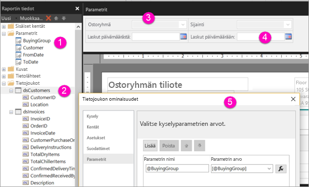

# Sivutettujen raporttien parametrien luominen Power BI -palvelussa (esikatselu)

Tässä artikkelissa opit luomaan sivutettujen raporttien parametreja Power BI -palvelussa.  Raporttiparametrien avulla voit valita raportin tiedot ja muuttaa raportin esitystapaa. Voit antaa oletusarvon ja käytettävissä olevien arvojen luettelon, jolloin raportin lukijat voivat muuttaa valintaa.  

Seuraavassa kuvassa näkyy Power BI-raportin muodostimen Suunnittelunäkymä raportin parametrit @BuyingGroup, @Customer, @FromDate, ja @ToDate. 
  

  
1.  Raporttiparametrit Raporttitietoruudussa.  
  
2.  Taulukko, jonka tietojoukossa on yksi parametri.  
  
3.  Parametriruutu. Voit mukauttaa parametrien asettelua parametriruudussa. 
  
4.  Parametrien @FromDate ja @ToDate tietotyyppi on **DateTime**. Kun tarkastelet raporttia, voit kirjoittaa päivämäärän tekstiruutuun tai valita päivämäärän kalenterista. 

5.  Yksi **Tietojoukon ominaisuudet** -valintaikkunan parametreista.  

  
## Raporttiparametrin luominen tai muokkaaminen  
  
1.  Avaa sivutettu raportti Power BI-raportin muodostimessa.

1. Napsauta **Raporttitiedot**-ruudussa olevaa **Parametrit**-solmua hiiren kakkospainikkeella > **Lisää parametri**. **Raporttiparametrin ominaisuudet** -valintaikkuna avautuu.  
  
2.  Kirjoita **Nimi**-parametrin nimi tai hyväksy oletusnimi.  
  
3.  Kirjoita **Kehote**-kohtaan teksti, joka näytetään parametri-tekstiruudun vieressä, kun käyttäjä suorittaa raportin.  
  
4.  Valitse **Tietotyyppi**-kohtaan parametriarvon tietotyyppi.  
  
5.  Jos parametri voi sisältää tyhjän arvon, valitse **Salli tyhjä arvo**.  
  
6.  Jos parametri voi sisältää nolla-arvon, valitse **Salli nolla-arvo**.  
  
7.  Jotta käyttäjä voi valita useamman kuin yhden parametriarvon, valitse **Salli useita arvoja**.  
  
8.  Valitse näkyvyysasetus.  
  
    -   Voit näyttää parametrin raportin yläreunan työkalurivissä valitsemalla **Näkyvissä**.  
  
    -   Voit piilottaa parametrin niin, että sitä ei näytetä työkalurivissä, valitsemalla **Piilotettu**.  
  
    -   Valitsemalla **Sisäinen** voit piilottaa parametrin ja estää sen muokkauksen raporttipalvelimella raportin julkaisun jälkeen. Raporttiparametria voidaan tämän jälkeen tarkastella vain raportin määrityksessä. Sinun on määritettävä asetukselle oletusarvo tai sallittava parametrille nolla-arvo.  
  
9. Valitse **OK**. 
  
## Seuraavat vaiheet

Katso [Sivutettujen raporttien parametrien tarkastelu](paginated-reports-view-parameters.md) -artikkelista, miltä parametrit näyttävät Power BI -palvelussa.

Katso sivutettujen raporttien parametrien yksityiskohtaiset tiedot SQL Server Reporting Services -palveluiden [Raporttiparametrit (Raportin muodostin ja Report Designer)](https://docs.microsoft.com/sql/reporting-services/report-design/report-parameters-report-builder-and-report-designer) -artikkelista.  
