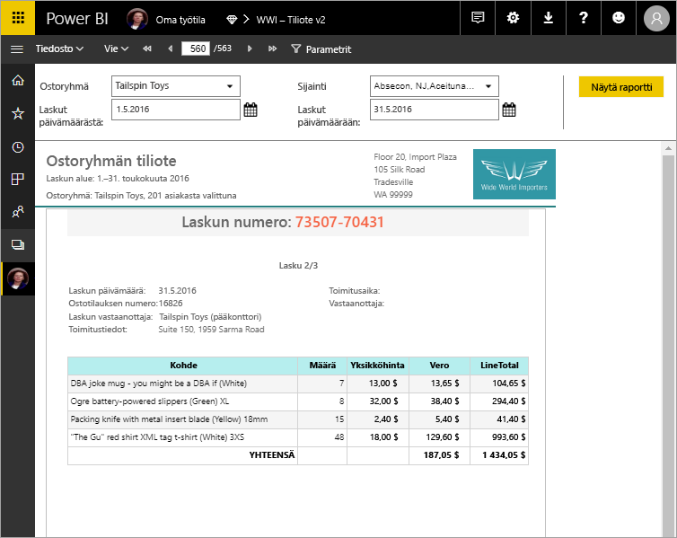

# Mitä ovat sivutetut raportit Power BI Premiumissa?

Sivutetut raportit, SQL Server Reporting Servicesin vakioraporttimuoto, ovat nyt käytettävissä Power BI -palvelussa. Nämä raportit voidaan tulostaa tai jakaa. Niitä kutsutaan ”sivutetuiksi”, koska ne on muotoiltu sopimaan hyvin sivulle. Niissä kaikki tiedot näytetään taulukossa, vaikka taulukko olisi useita sivuja pitkä. Niitä kutsutaan joskus pikselintarkasti täydellisiksi, koska voit hallita tarkasti niiden asettelua raportin sivulla. Sivutetut raportit perustuvat SQL Server Reporting Servicesin RDL-raporttitekniikkaan. Raportin muodostin on erillinen työkalu sivutettujen raporttien luomiseen. 

Sivutetuissa raporteissa voi olla useita sivuja. Esimerkiksi tässä raportissa on 563 sivua. Jokainen sivu on aseteltu tarkasti yksi sivu laskua kohti -muotoon, ja ylä- ja alatunnisteet toistuvat kaikissa.

Voit esikatsella raporttisi raportin muodostimessa ja julkaista sen Power BI -palvelussa, http://app.powerbi.com. Tarvitset Power BI Pro -käyttöoikeuden raportin julkaisemiseksi palveluun. Voit julkaista ja jakaa sivutettuja raportteja omassa työtilassasi tai sovelluksen työtiloissa niin kauan kuin työtila on Power BI Premium -kapasiteetissa. Lisäksi Power BI -järjestelmänvalvojan on otettava sivutetut raportit käyttöön Power BI -hallintaportaalin [Premium-kapasiteettiosiosta](service-admin-premium-workloads.md#paginated-reports). 

## Raporttien luominen Power BI:n raportin muodostimessa

Sivutetuilla raporteilla on oma suunnittelutyökalu, Power BI:n raportin muodostin. Se on uusi työkalu, jossa perustuu samoihin työkaluihin, joiden avulla loit aiemmin sivutettuja raportteja Power BI -raporttipalvelimeen tai SQL Server Reporting Services -palveluihin (SSRS). SSRS 2016:lle ja 2017:lle tai Power BI -raporttipalvelimelle paikallisesti luomasi sivutetut raportit ovat itse asiassa yhteensopivia Power BI -palvelun kanssa. Power BI -palvelu ylläpitää yhteensopivuutta aikaisempien versioiden kanssa, joten voit siirtää raportteja uudempiin versioihin ja päivittää aiemman version sivutetut raportit. Kaikki raporttiominaisuudet eivät ole käytettävissä käynnistettäessä. Katso lisätietoja [rajoituksista ja huomioitavista seikoista](#limitations-and-considerations) tästä artikkelista.
     
## Raportti useista eri tietolähteistä

Yksittäisellä sivutetulla raportilla voi olla useita eri tietolähteitä. Sen pohjana ei ole tietomallia, toisin kuin Power BI -raporteissa. Power BI -palvelun sivutettujen raporttien ensimmäisen julkaisun yhteydessä luot upotettuja tietolähteitä ja tietojoukkoja itse raporttiin. Tällä hetkellä et voi käyttää jaettuja tietolähteitä tai jaettuja tietojoukkoja. Voit luoda raportteja raportin muodostimessa paikallisella tietokoneellasi. Jos raportti on yhdistetty paikallisiin tietoihin, sinun on luotava yhdyskäytävä ja ohjattava tietoyhteys uudelleen sen jälkeen, kun olet ladannut raportin Power BI -palveluun. Tällä hetkellä voit muodostaa yhteyden seuraaviin tietolähteisiin:

- Azuren SQL-tietokanta ja tietovarasto
- Azure Analysis Services (kertakirjautumisen kautta)
- SQL Server yhdyskäytävän kautta
- SQL Server Analysis Services yhdyskäytävän kautta
- Power BI Premium -tietojoukot
- Oracle
- Teradata
- Muut lähteet sitä mukaa kuin niitä lisätään

## Raportin suunnitteleminen  

### Sivutettujen raporttien luominen matriisin, kaavion ja vapaamuotoisten asettelujen avulla

Taulukon raportit toimivat hyvin sarakepohjaisille tiedoille. Matriisiraportit, kuten rajavälilehti tai pivot-taulukon raportit, sopivat hyvin yhteenvetotiedoille. Kaavion raportit esittävät tiedot graafisessa muodossa ja vapaamuotoiset *luettelon* raportit voivat esittää lähes mitä tahansa muuta, kuten laskuja. 
  
Voit aloittaa jollakin raportin muodostimen ohjatuista toiminnoista. Ohjatut taulukko-, matriisi- ja kaaviotoiminnot käyvät läpi upotetun tietolähteen yhteyden ja upotetun tietojoukon luomisen. Sitten voit luoda tietojoukkokyselyn vetämällä ja pudottamalla kenttiä, valita asettelun ja tyylin ja mukauttaa raporttiasi.  
  
Ohjatun karttatoiminnon avulla voit luoda raportteja, jotka näyttävät koostetietoja maantieteellisellä tai geometrisellä taustalla. Karttatiedot voivat olla paikkatietoja Transact-SQL-kyselystä tai Environmental Systems Research Institute, Inc. (ESRI) -muototiedostosta. Voit myös lisätä Microsoft Bing -karttaruututaustan.  

### Raportin täydentäminen

Muokkaa tietoja suodattamalla, ryhmittelemällä ja lajittelemalla tai lisäämällä kaavoja tai lausekkeita. Lisää kaavioita, mittareita, sparkline-kaavioita ja ilmaisimia tietojen yhteenvedon esittämiseksi visuaalisessa muodossa.  Suodata mukautettujen näkymien tietoja parametrien ja suodattimien avulla. Upota kuvia ja muita resursseja, myös ulkoista sisältöä, tai viittaa niihin.  

Koko sivutetun raportin sisällöllä itse raportista jokaiseen tekstiruutuun, kuvaan, taulukkoon ja kaavioon on monia ominaisuuksia, jotka voit määrittää, jotta raportti näyttää täsmälleen sellaiselta kuin haluat.

## Raportin määrityksen luominen

Kun suunnittelet sivutetun raportin, luot tosiasiassa *raportin määrityksen*. Se ei sisällä tietoja. Se määrittää, mistä tiedot haetaan, mitkä tiedot haetaan ja miten tiedot näytetään. Kun raportti suoritetaan, raportin käsittely käyttää määrittämääsi raportin määritystä, noutaa tiedot ja yhdistää ne raportin asetteluun raportin luomiseksi. Lataat raportin määrityksen Power BI -palveluun, http://app.powerbi.com, omaan työtilaasi tai työtovereiden kanssa jakamaasi työtilaan. Jos raportin tietolähde on paikallinen, raportin lataamisen jälkeen ohjaat tietolähdeyhteyden uudelleen yhdyskäytävän kautta. 

## Sivutetun raportin tarkasteleminen
Voit tarkastella sivutettua raporttia Power BI -palvelussa selaimella ja myös Power BI -mobiilisovelluksissa. Power BI -palvelusta käsin voit viedä raportin eri muodoissa, esimerkiksi HTML:nä, MHTML:nä, PDF:nä, XML:nä, CSV:nä, TIFF:nä, Wordinä ja Excelinä. Voit myös jakaa sen muiden kanssa.  

## Raportin tilauksen luominen

Voit nyt määrittää itsellesi ja muille sivutettujen raporttien sähköpostitilauksia Power BI -palvelussa. Prosessi on yleisesti samanlainen kuin tilatessa raportteja ja raporttinäkymiä Power BI -palvelussa. Kun määrität tilauksia, valitset kuinka usein haluat saada sähköpostiviestejä: päivittäin, viikoittain tai tunneittain. Tilaus sisältää raportin täydelliset tulokset PDF-liitteenä.

Katso lisätiedot ohjeartikkelista [Power BI -palvelun sivutettujen raporttien tilaaminen itsellesi ja muille](paginated-reports-subscriptions.md). 

## Rajoitukset ja huomioitavat asiat

Tässä on joitakin muita ominaisuuksia, joita ei tueta ensimmäisessä julkaisussa:

- raporttisivujen tai visualisointien kiinnittäminen Power BI -raporttinäkymiin Voit edelleen kiinnittää visualisointeja Power BI -koontinäyttöön paikallisesta sivutetusta raportista Power BI -raporttipalvelimessa tai Reporting Services -raporttipalvelimessa. Katso lisätietoja artikkelista [Reporting Services -kohteiden kiinnittäminen Power BI -koontinäyttöihin](https://docs.microsoft.com/sql/reporting-services/pin-reporting-services-items-to-power-bi-dashboards).
- vuorovaikutteiset ominaisuudet, kuten asiakirjan rakenneruudut ja painikkeiden näyttäminen/piilottaminen
- aliraportit ja porautumisraportit
- jaetut tietolähteet ja jaetut tietojoukot
- visualisoinnit Power BI -raporteista
 
## Seuraavat vaiheet

- [Asenna Power BI:n raportin muodostin Microsoft Download Centeristä](https://go.microsoft.com/fwlink/?linkid=2086513)
- [Opetusohjelma: Luo sivutettu raportti](paginated-reports-quickstart-aw.md)
- [Anna tiedot suoraan sivutettuun raporttiin](paginated-reports-enter-data.md)

  

