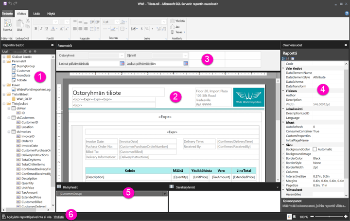

# Sivutettujen raporttien käsittely Raportin suunnittelunäkymässä (esikatselu)

Raportin Suunnittelunäkymä Power BI-raportin muodostimessa on rakenteen tilaa, voit julkaista Power BI-palvelun Sivutettujen raporttien luomista varten. Suunnittelualue on Raportin muodostimen keskellä, ja sen ympärillä on valintanauha ja ruutuja. Voit lisätä ja järjestellä raporttikohteita suunnittelualueella. Tässä artikkelissa kerrotaan raporttiresurssien lisäämiseen, valitsemiseen ja järjestämiseen käytetyistä ruuduista ja raporttikohteiden ominaisuuksien muuttamisesta.  

1. [Raporttitietoruutu](#1-report-data-pane) 
2. [Raportin suunnittelualue](#2-report-design-surface)  
3. [Parametriruutu](#3-parameters-pane) 
4. [Ominaisuudet-ruutu](#4-properties-pane) 
5. [Ryhmittelyruutu](#5-grouping-pane) 
6. [Nykyisen raportin tilarivi](#6-current-report-status-bar)  
  
## 1 Raporttitietoruutu  
 Raporttitietoruudulla voit määrittää raporttitiedot ja raporttiresurssit, joita tarvitset raportissa, ennen raportin asettelun suunnittelua. Voit esimerkiksi lisätä tietolähteitä, tietojoukkoja, laskettuja kenttiä, raporttiparametreja ja kuvia raporttitietoruutuun.  
  
 Kun lisäät kohteita raporttitietoruutuun, voit valita, missä raportin osassa tiedot näytetään, vetämällä kentät suunnittelualueella oleviin raporttikohteisiin.  
  
> [!TIP]  
>  Jos vedät kentän raporttitietoruudusta suoraan raportin suunnittelualueelle sen sijaan, että asettaisit sen tietoalueelle, kuten taulukolle tai kaaviolle, näet raportin suorittaessasi kentässä ainoastaan tietojen ensimmäisen arvon.  
  
 Voit myös vetää sisäänrakennettuja kenttiä raporttitietoruudusta raportin suunnittelualueelle. Hahmonnettaessa nämä kentät antavat raporttia koskevia tietoja, kuten raportin nimen, raportin sivujen kokonaismäärän ja senhetkisen sivunumeron.  
  
 Joitakin asioita lisätään automaattisesti raporttitietoruutuun, kun lisäät sisältöä raportin suunnittelualueelle. Jos esimerkiksi upotat kuvan raporttiin, se lisätään raporttitietoruudun Kuvat-kansioon.  
  
> [!NOTE]  
>  Voit lisätä uuden kohteen raporttitietoruutuun **Uusi**-painikkeella. Voit lisätä raporttiin useita tietojoukkoja samasta tai muista tietolähteistä. Jos haluat lisätä uuden tietojoukon samasta tietolähteestä, napsauta tietolähdettä hiiren kakkospainikkeella > **Lisää tietojoukko**.  
  
## 2 Raportin suunnittelualue  
 Raportit suunnitellaan pääasiassa Raportin muodostimessa Raportin suunnittelualueella. Voit sijoittaa raporttikohteita, kuten tietoalueita, aliraportteja, tekstiruutuja, kuvia, suorakulmioita ja rivejä raporttiin lisäämällä ne valintanauhasta tai Raporttiosavalikoimasta suunnittelualueelle. Sen kautta voit lisätä ryhmiä, lausekkeita, parametreja, suodattimia, toimintoja, näkyvyyden ja muotoilun raporttikohteisiin.  
  
 Voit myös muuttaa seuraavia:  
  
-   Raportin leipätekstin ominaisuudet, kuten reunan ja täytön väri, napsauttamalla suunnittelualueen valkoista aluetta (raporttikohteiden ulkopuolella) hiiren kakkospainikkeella ja valitsemalla **Leipätekstin ominaisuudet**.  
  
-   Otsikon ja alatunnisteen ominaisuudet, kuten reunan ja täytön väri, napsauttamalla suunnittelualueen valkoista aluetta (raporttikohteiden ulkopuolella) hiiren kakkospainikkeella ja valitsemalla **Otsikon ominaisuudet** tai **Alatunnisteen ominaisuudet**.  
  
-   Raportin ominaisuudet, kuten sivun asetukset, napsauttamalla hiiren kakkospainikkeella suunnittelualueen ulkopuolista harmaata aluetta ja valitsemalla **Raportin ominaisuudet**.  
  
-   Raporttikohteiden ominaisuudet napsauttamalla niitä hiiren kakkospainikkeella ja valitsemalla **Ominaisuudet**.  
  
### Suunnittelualueen koko ja tulostusalue  
Suunnittelualueen koko voi poiketa raportin tulostamiseen määrittämäsi sivun tulostusalueesta. Suunnittelualueen koon muuttaminen ei muuta raportin tulostusalueen kokoa. Raportin tulostusalueen kokovalinta ei vaikuta suunnittelualueen täyteen kokoon. Katso lisätietoja Hahmontamistavat-artikkelista. 
  
- Voit ottaa viivaimen käyttöön valitsemalla **Näytä**-välilehdeltä **Viivain**-valintaruudun.  
  
## 3 Parametriruutu  
 Raporttiparametrien avulla voit hallita raportin tietoja, yhdistää toisiinsa liittyviä raportteja ja muuttaa raportin esitystapaa. Parametriruutu sisältää raporttiparametrien joustavan asettelun.  
  
 Katso lisätietoja Raporttiparametreista   
  
## 4 Ominaisuudet-ruutu
 Jokaisella raportin kohteella, mukaan lukien tietoalueilla, kuvat, tekstiruuduilla ja raportin leipätekstillä, on liitettyjä ominaisuuksia. Esimerkiksi tekstiruudun BorderColor-ominaisuus näyttää tekstiruudun reunan väriarvon ja raportin PageSize-ominaisuus näyttää raportin sivun koon.  
  
 Nämä ominaisuudet näkyvät Ominaisuudet-ruudulla. Ominaisuudet-ruudun ominaisuudet muuttuvat valitsemasi raporttikohteen mukaan.  
  
- Näet Ominaisuudet-ruudun **Näytä**-välilehden **Näytä tai piilota** -ryhmästä > **Ominaisuudet**.  
  
### Ominaisuuksien arvojen muuttaminen  
 Voit muuttaa raporttikohteiden ominaisuuksia Raportin muodostimessa eri tavoilla:  
  
-   valitsemalla painikkeita ja luetteloita valintanauhasta  
  
-   muuttamalla asetuksia valintaikkunoissa  
  
-   muuttamalla ominaisuuksien arvoja Ominaisuudet-ruudussa.  
  
 Useimmin käytetyt ominaisuudet ovat käytettävissä valintaikkunoissa ja valintanauhassa.  
  
 Voit määrittää ominaisuuksien arvon avattavasta luettelosta, tai kirjoittamalla arvon, tai voit luoda lausekkeen valitsemalla `<Expression>`.  
  
### Ominaisuudet-ruudun näkymän muuttaminen  
 Oletusarvoisesti Ominaisuudet-ruudussa näkyvät ominaisuudet on järjestetty yleisten luokkien mukaan, esim. Toiminto, Reunus, Täyttö, Fontti ja Yleinen. Jokaiseen luokkaan on liitetty joukko ominaisuuksia. Esimerkiksi Fontti-luokassa ovat seuraavat ominaisuudet: Color, FontFamily, FontSize, FontStyle, FontWeight, LineHeight, and TextDecoration. Voit halutessasi järjestää ruudussa luetellut ominaisuudet aakkosjärjestykseen. Tämä poistaa luokat ja järjestää kaikki ominaisuudet aakkosjärjestykseen luokasta riippumatta.  
  
 Ominaisuudet-ruudun yläreunassa on kolme painiketta: **Luokka**, **Järjestä aakkosjärjestykseen** ja **Ominaisuussivu**. Voit vaihtaa Ominaisuudet-ruudun näkymää valitsemalla Luokka- ja Aakkosjärjestys-painikkeet. Voit avata valitun raporttikohteen ominaisuuksien valintaikkunan valitsemalla **Ominaisuussivut**-painikkeen.  
  
  
## 5 Ryhmittelyruutu

 Voit käyttää ryhmiä järjestääksesi raporttitiedot visuaaliseksi hierarkiaksi ja laskeaksesi arvoja yhteen. Voit katsoa tietoalueen rivi- ja sarakeryhmiä suunnittelualueella ja Ryhmittelyruudussa. Ryhmittely-ruudussa on kaksi ruutua: Riviryhmät ja Sarakeryhmät. Kun valitset tietoalueen, Ryhmittelyruudussa näytetään kyseisen tietoalueen kaikki ryhmät hierarkkisessa luettelossa: aliryhmät näkyvät sisennettyinä pääryhmänsä alla.  
  
 Voit luoda ryhmiä vetämällä kenttiä raporttitietoruudusta ja pudottamalla ne suunnittelualueelle tai Ryhmittelyruutuun. Voit lisätä pääryhmiä, vierekkäisiä ryhmiä, aliryhmiä sekä muuttaa ryhmien ominaisuuksia ja poistaa ryhmiä Ryhmittelyruudussa.  
  
 Ryhmittelyruutu on oletusarvoisesti näkyvissä, mutta voit sulkea sen poistamalla Ryhmittelyruudun valinnan Näytä-välilehdellä. Ryhmittelyruutua ei voi käyttää Kaavio- tai Mittari-tietoalueilla.  
  
 Katso lisätietoja Ryhmittelyruutu- ja Tietoja ryhmistä -artikkeleista.  
  
## 6 Nykyisen raportin tilarivi

Jos raportti on yhdistetty palvelimeen, nykyisen raportin tilarivi näyttää palvelimen nimen. Muussa tapauksessa tilarivillä lukee ”Nykyistä raporttipalvelinta ei ole.” Voit yhdistää palvelimeen valitsemalla **Yhdistä**.

## Seuraavat vaiheet

[Mitä ovat sivutetut raportit Power BI Premiumissa? (esikatselu)](paginated-reports-report-builder-power-bi.md) 

  
  
