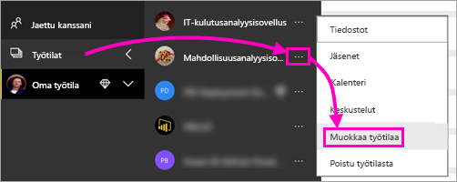
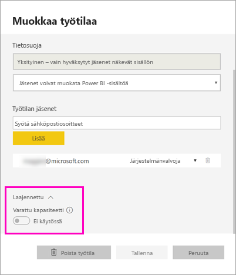
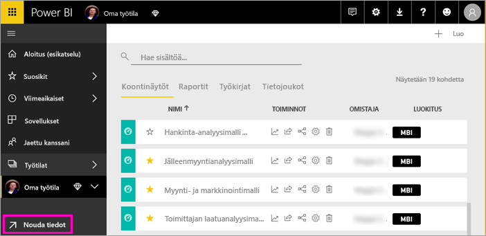
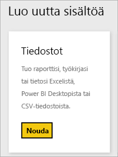
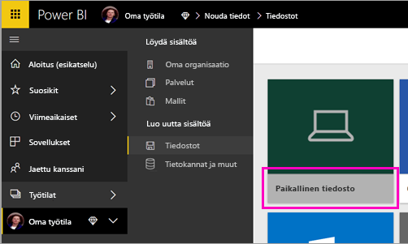
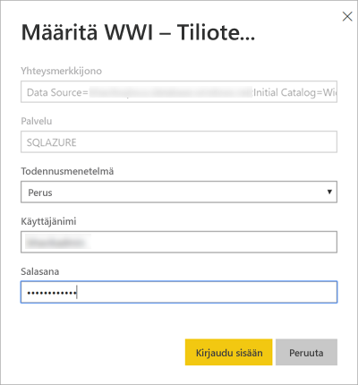
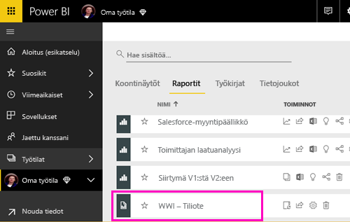
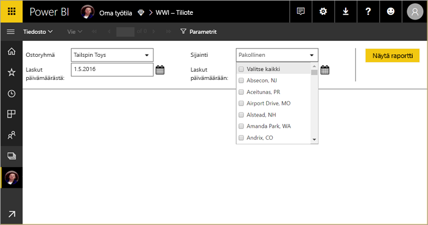
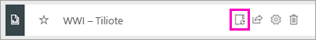

# Sivutetun raportin julkaiseminen Power BI -palveluun

Tässä artikkelissa opit julkaisemaan sivutetun raportin Power BI -palveluun lataamalla sen paikallisesta tietokoneesta. Voit ladata sivutetut raportit omaan työtilaasi tai mihin tahansa muuhun työtilaan niin kauan kuin työtila on Premium-kapasiteetissa. Etsi vinoneliökuvaketta  työtilan nimen vieressä. 

Jos raportin tietolähde on paikallinen, sinun on [luotava yhdyskäytävä](#create-a-gateway) raportin lataamisen jälkeen.

## Työtilan lisääminen Premium-kapasiteettiin

Jos työtilassa ei ole vinoneliökuvaketta  nimen vieressä, sinun on lisättävä työtila Premium-kapasiteettiin. 

1. Valitse **Työtilat**, valitse työtilan nimen vierestä kolme pistettä ( **...** ) , ja valitse sitten **Muokkaa työtilaa**.

    

1. Laajenna **Muokkaa työtilaa** -valintaikkunassa **Lisäasetukset**-kohtaa ja liu’uta sitten **Varattu kapasiteetti** asentoon **Päällä**.

    

   Et välttämättä voi muuttaa sitä. Jos et pysty muuttamaan sitä, ota yhteyttä Power BI Premium -kapasiteetin järjestelmänvalvojaan, jotta saat määritysoikeudet työtilan lisäämiseksi Premium-kapasiteettiin.

## Sivutetun raportin lataaminen

1. Luo sivutettu raportti raportin muodostimessa ja tallenna se paikalliseen tietokoneeseen.

1. Avaa Power BI -palvelu selaimessa ja selaa Premium-työtilaan, jossa haluat julkaista raportin. Pane merkille vinoneliökuvake  nimen vieressä. 

1. Valitse **Nouda tiedot**.

    

1. Valitse **Tiedostot**-ruudusta **Nouda**.

    

1. Valitse **Paikallinen tiedosto** > selaa sivutettuun raporttiin > **Avaa**.

    

1. Valitse **Jatka** > **Muokkaa tunnistetietoja**.

    

1. Määritä tunnistetiedot > **Kirjaudu sisään**.

    

   Näet raportin raporttiluettelossa.

    

1. Valitse se Power BI -palvelun avaamiseksi. Jos siinä on parametreja, sinun on valittava ne ennen kuin voit tarkastella raporttia.
 
    

## Luo yhdyskäytävä

Kuten mikä tahansa muu Power BI -raportti, jos raportin tietolähde on paikallinen, sinun on luotava yhdyskäytävä tai yhdistettävä siihen tietojen käyttämiseksi.

1. Valitse raportin nimen vieressä **Hallitse**.

   

1. Katso lisätietoja ja seuraavat vaiheet Power BI -palvelun artikkelista [Yhdyskäytävän asentaminen](service-gateway-install.md).

### Yhdyskäytävän rajoitukset

Yhdyskäytävät eivät nykyisin tue moniarvoisia parametrejä.

## Seuraavat vaiheet

- [Sivutetun raportin tarkasteleminen Power BI -palvelussa](paginated-reports-view-power-bi-service.md)
- [Mitä ovat sivutetut raportit Power BI Premiumissa?](paginated-reports-report-builder-power-bi.md)

