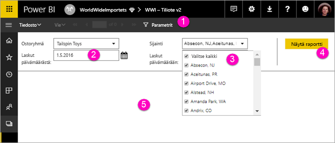

# Sivutettujen raporttien parametrien tarkasteleminen Power BI -palvelussa

Tässä artikkelissa opit käsittelemään sivutettujen raporttien parametreja Power BI -palvelussa.  Raporttitietoja voidaan suodattaa raporttiparametrin avulla. Parametrit tarjoavat luettelon käytettävissä olevista arvoista, ja voit valita yhden tai useita arvoja. Joskus parametreilla on oletusarvo, ja joskus sinun täytyy valita arvo, ennen kuin voit nähdä raportin.  

Kun tarkastelet raporttia, jossa on parametreja, raporttien katseluohjelman työkalurivi näyttää jokaisen parametrin, joten voit määrittää arvot vuorovaikutteisesti. Seuraavassa kuvassa on parametrialue raportissa, jossa on parametrit **ostoryhmälle**, **sijainnille**, **aloituspäivälle** ja **päättymispäivälle**.  

## Parametrit-ruutu Power BI -palvelussa

  
1.  **Parametrit-ruutu** Raporttien katseluohjelman työkalurivi näyttää kehotteen, kuten ”Pakollinen”, tai kunkin parametrin oletusarvon.    
  
2.  **Laskujen aloitus-/päättymispäivämäärän parametrit** Kummallakin päivämääräparametrilla on oletusarvot. Voit muuttaa päivämäärää kirjoittamalla päivämäärän tekstiruutuun tai valitsemalla päivämäärän kalenterista.  
  
3.  **Sijainnin parametri** Sijainnin parametri on määritetty siten, että voidaan valita yksi tai monta arvoa tai ne kaikki. 
  
4.  **Näytä raportti** Kun lisäät tai muutat parametriarvoja, suorita raportti valitsemalla **Näytä raportti**. 

5. **Oletusarvot** Jos kaikilla parametreilla on oletusarvot, raportti suoritetaan automaattisesti ensimmäisellä näyttökerralla. Joillakin tämän raportin parametreilla ei ole oletusarvoja, joten et näe raporttia, ennen kuin valitset arvot.  

## Seuraavat vaiheet

[Sivutettujen raporttien parametrien luominen Power BI -palvelussa](paginated-reports-parameters.md)
