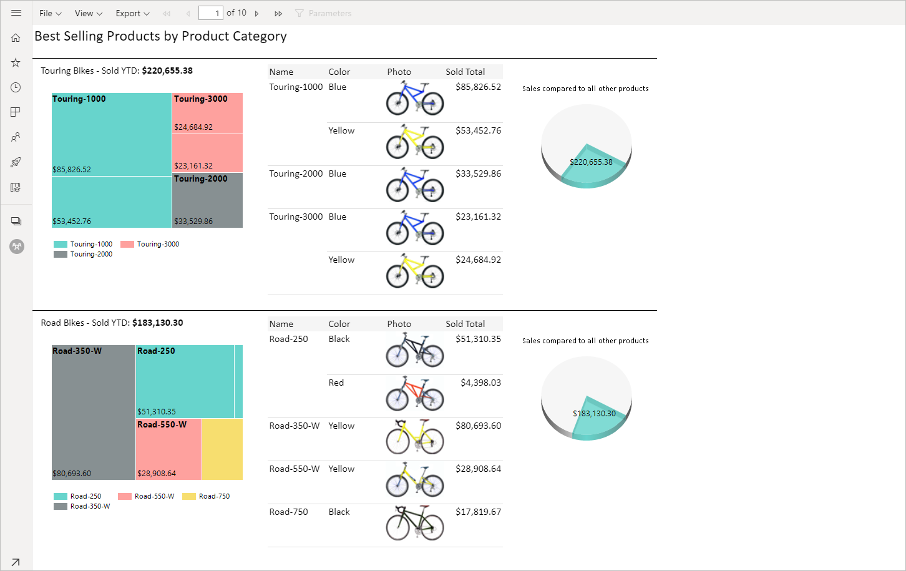

# Sivutettujen raporttien raporttinäkymien määrittäminen Power BI -palvelussa

Kun hahmonnat sivutetun raportin Power BI -palvelussa, oletusnäkymä on HTML-pohjainen ja vuorovaikutteinen. Toinen raporttinäkymä, jota käytetään PDF-tiedostoja ja muita kiinteitä sivumuotoja varten, on uusi Sivunäkymä-vaihtoehto.

**Vuorovaikutteinen oletusnäkymä**

**Sivunäkymä**

Sivunäkymässä hahmonnettu raportti näyttää erilaiselta verrattuna oletusnäkymään. Jotkin sivutettujen raporttien ominaisuudet ja käsitteet koskevat vain kiinteitä sivuja. Näkymä on samankaltainen kuin silloin, kun raportti tulostetaan tai viedään. Voit edelleen muuttaa joitakin elementtejä, kuten parametriarvoja, mutta raportissa ei ole muita vuorovaikutteisia ominaisuuksia, kuten sarakkeiden lajittelua ja vaihtoja.

Sivunäkymä tukee kaikkia ominaisuuksia, joita selaimen PDF-katseluohjelma tukee, kuten lähentämistä, loitontamista ja sovittamista sivulle.

## Sivunäkymään vaihtaminen

Kun avaat sivutetun raportin, se hahmonnetaan oletusarvoisesti vuorovaikutteiseen näkymään. Jos raportissa on parametreja, valitse parametrit ja näytä sitten raportti.

1. Valitse työkalurivillä **Näytä** > **Sivunäkymä**.

    

2. Voit muuttaa sivunäkymän asetuksia valitsemalla **Sivun asetukset** työkalurivin **Näytä**-valikossa. 

    
    
    **Sivun asetukset** -valintaikkunassa on asetukset, joiden avulla voit määrittää sivunäkymän **sivun koon** ja **suunnan**. Kun olet ottanut asetukset käyttöön, samat asetukset ovat käytössä, kun tulostat sivun myöhemmin.
   
    

3. Kun haluat vaihtaa takaisin vuorovaikutteiseen näkymään, valitse **Oletus** avattavassa **Näytä**-luetteloruudussa.

## Selaintuki

Sivunäkymää tuetaan Google Chrome- ja Microsoft Edge -selaimissa. Varmista, että PDF-tiedostojen tarkastelu on käytössä selaimessa. Se on oletusasetus näissä selaimissa.

Sivunäkymää ei tueta Internet Explorerissa eikä Safarissa, joten asetus on poistettu käytöstä. Sitä ei tueta myöskään mobiililaitteiden selaimissa eikä alkuperäisissä Power BI -mobiilisovelluksissa.  

## Seuraavat vaiheet

- [Sivutetun raportin tarkasteleminen Power BI -palvelussa](../consumer/paginated-reports-view-power-bi-service.md)
- [Mitä ovat sivutetut raportit Power BI Premiumissa?](paginated-reports-report-builder-power-bi.md)
