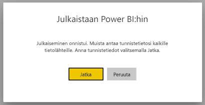
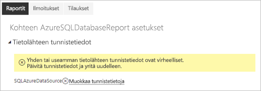
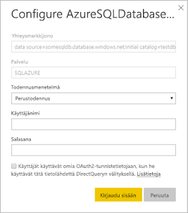

# Power BI:n sivutetuissa raporteissa tuetut tietolähteet

Artikkelissa kuvataan tarkasti Power BI -palvelun sivutetuissa raporteissa tuetut tietolähteet ja se, miten yhteys muodostaa yhteyden Microsoft Azuren SQL-tietokannan tietolähteisiin. Joitakin tietolähteitä tuetaan suoraan. Voit muodostaa yhteyden muihin tietoyhdyskäytävien kautta.

## Suoraan tuetut tietolähteet

Sivutetut raportit tukevat suoraan seuraavia tietolähteitä:

| Tietolähde | Todentaminen | Huomautukset |
| --- | --- | --- |
| Azuren SQL-tietokanta  Azure SQL Data Warehouse | Perus, kertakirjautuminen (SSO), OAuth2 | Voit käyttää Enterprise-yhdyskäytävää Azure SQL-tietokannan kanssa. Et kuitenkaan saa käyttää SSO- tai oAuth2-todennusta näissä tilanteissa.   |
| Azure SQL:n hallittu esiintymä | Perustodennus | Julkisen tai yksityisen päätepisteen kautta (yksityinen päätepiste on reititettävä yritysyhdyskäytävän kautta)  |
| Azure Analysis Services | SSO, OAuth2 | AAS-palomuuri täytyy poistaa käytöstä tai määrittää sallimaan kaikki IP-alueet.|
| Power BI -tietojoukko | SSO | Power BI:n Premium- ja muut kuin Premium-tietojoukot. Edellyttää lukuoikeutta |
| Power BI:n Premium-tietojoukko (XMLA) | SSO |   |
| Anna tiedot | – | Tiedot on upotettu raporttiin. |

Microsoft Azuren SQL-tietokantaa lukuun ottamatta kaikki tietolähteet ovat valmiita käytettäviksi sen jälkeen, kun olet ladannut raportin Power BI -palveluun. Tietolähteet siirtyvät oletusarvoisesti käyttämään kertakirjautumista (SSO), jos se on käytettävissä. Azure Analysis Servicesia varten voit vaihtaa todennustyypiksi OAuth2. Kun tietyn tietolähteen todennustyypiksi vaihdetaan OAuth2, sitä ei voi enää palauttaa kertakirjautumiseen.  Tämä muutos koskee myös kaikkia tätä tietolähdettä kaikissa tietyn vuokraajan työtiloissa käyttäviä raportteja.  Sivutettujen raporttien rivitason suojaus ei toimi, elleivät käyttäjät valitse todennustyypiksi kertakirjautumista.

Microsoft Azuren SQL-tietokannoissa on annettava lisätietoja kohdassa [Microsoft Azuren SQL-tietokannan todentaminen](#azure-sql-database-authentication) kuvatulla tavalla.

## Muut tietolähteet

Edellä mainittujen suoraan tuettujen tietolähteiden lisäksi seuraavia tietolähteitä voi käyttää [Power BI -tietoyhdyskäytävän](../service-gateway-onprem.md) kautta:

- SQL Server
- SQL Server Analysis Services
- Oracle
- Teradata

Sivutetuissa raporteissa Microsoft Azuren SQL-tietokantaa ja Azure Analysis Servicesia ei tällä hetkellä voi käyttää Power BI -tietoyhdyskäytävän kautta.

## Microsoft Azuren SQL-tietokannan todentaminen

Microsoft Azuren SQL-tietokantoja varten todennustyyppi on määritettävä enne raportin suorittamista. Tämä pätee vain silloin, kun käytät tietolähdettä ensimmäistä kertaa työtilassa. Näet ensimmäisellä kerralla seuraavan sanoman:

Jos et anna tunnistetietoja, raportin suorittamisessa tapahtuu virhe. Valitse **Jatka**, jos haluat siirtyä **Tietolähteen tunnistetiedot** -sivulle juuri lataamassasi raportissa:

Valitse minkä tahansa haluamasi tietolähteen **Muokkaa tunnistetietoja** -linkki, jotta saat näkyviin **Määritä**-valintaikkunan:

Microsoft Azuren SQL-tietokannan tietolähteissä tuetaan seuraavia todennustyyppejä:

- Perus (käyttäjänimi ja salasana)
- SSO (kertakirjautuminen)
- OAuth2 (tallennettu AAD-tunnus)

Jotta SSO ja OAuth2 toimivat oikein, [AAD-todennuksen tuen on oltava käytössä](https://docs.microsoft.com/azure/sql-database/sql-database-aad-authentication-configure) Microsoft Azuren SQL-tietokantapalvelimessa, johon tietolähde muodostaa yhteyden. OAuth2-todennusmenetelmässä AAD luo tunnuksen ja tallentaa sen tulevaa tietolähteen käyttöä varten. Jos haluat käyttää [SSO-todennustapaa](https://docs.microsoft.com/power-bi/service-azure-sql-database-with-direct-connect#single-sign-on) sen sijaan, valitse sen alapuolella oleva SSO-vaihtoehto, **Käyttäjät käyttävät omia OAuth2-tunnistetietojaan käyttäessään tätä tietolähdettä DirectQueryn kautta**.
  
## Seuraavat vaiheet

[Sivutetun raportin tarkasteleminen Power BI -palvelussa](../consumer/paginated-reports-view-power-bi-service.md)

Onko sinulla kysyttävää? [Kokeile Power BI -yhteisöä](https://community.powerbi.com/)
