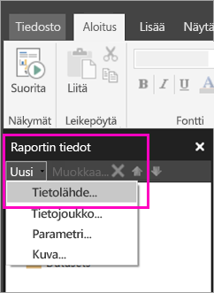

# Upotetun tietolähteen luominen sivutettuun raporttiin Power BI -palvelussa

Tässä artikkelissa opit luomaan upotetun tietolähteen sivutettuun raporttiin Power BI -palvelussa ja muokkaamaan sitä. Määrität upotetun tietolähteen yhdessä raportissa, ja käytät sitä vain kyseisessä raportissa. Power BI -palveluun tällä hetkellä julkaistavat sivutetut raportit edellyttävät upotettuja tietojoukkoja ja upotettuja tietolähteitä, ja ne voidaan yhdistää seuraaviin tietolähteisiin:

- Azure Analysis Services
- Azure SQL -tietokanta ja 
- Azure SQL Data Warehouse
- SQL Server
- SQL Server Analysis Services
- Oracle 
- Teradata 

Käytä seuraavien tietolähteiden tapauksessa [SQL Server Analysis Services -yhteysvaihtoehtoa](../service-premium-connect-tools.md):

- Power BI Premium -tietojoukot

Sivutetut raportit yhdistetään paikallisiin tietolähteisiin [Power BI -yhdyskäytävän avulla](../service-gateway-onprem.md). Määrität yhdyskäytävän, kun olet julkaissut raportin Power BI -palveluun.

Katso lisätiedot kohdasta [Raporttitiedot Power BI:n raportin muodostimessa](report-builder-data.md).

## Upotetun tietolähteen luominen
  
1. Avaa Power BI:n raportin muodostin.

1. Valitse raporttitietoruudun työkaluriviltä **Uusi** > **tietolähde**. **Tietolähteen ominaisuudet** -valintaikkuna avautuu.

    
  
2.  Kirjoita tietolähteen nimi **Nimi**-tekstiruutuun tai hyväksy oletusnimi.  
  
3.  Valitse **Käytä omaan raporttiin upotettua yhteyttä**.  
  
1.  Valitse tietolähteen tyyppi **Valitse yhteystyyppi** -luettelosta. 

1.  Määritä yhteysmerkkijono käyttämällä jotakin seuraavista menetelmistä:  
  
    -   Kirjoita yhteysmerkkijono suoraan **Yhteysmerkkijono**-tekstiruutuun. 
  
     -   Valitse **Muodosta**, niin vaiheessa 2 valitsemasi tietolähteen **Yhteyden ominaisuudet** -valintaikkuna avautuu.  
  
        Täytä **Yhteyden ominaisuudet** -valintaikkunan kentät tietolähdetyypin tiedoilla. Yhteyden ominaisuuksiin kuuluvat tietolähteen tyyppi, tietolähteen nimi ja tunnistetiedot. Kun olet määrittänyt arvot tässä valintaikkunassa, valitse **Testaa yhteyttä** varmistaaksesi, että tietolähde on käytettävissä ja että määrittämäsi tunnistetiedot ovat oikeat.  
  
4.  Valitse **Tunnistetiedot**.  
  
     Määritä tälle tietolähteelle käytettävät tunnistetiedot. Tietolähteen omistaja valitsee tuetun tunnistetietotyypin. Jos haluat lisätietoja, katso [Raportin tietolähteiden tunnistetietojen ja yhteystietojen määritys](https://docs.microsoft.com/sql/reporting-services/report-data/specify-credential-and-connection-information-for-report-data-sources).
  
5.  Valitse **OK**.  
  
     Tietolähde näkyy raporttitietoruudussa.  
     
## Rajoitukset ja huomioitavat seikat

Power BI-tietojoukkoihin yhdistyvät sivutetut raportit noudattavat Power BI:n jaettujen tietojoukkojen sääntöjä pienen muutoksin.  Varmista, että noudatat seuraavia ohjeita, jotta käyttäjät voivat tarkastella sivutettuja raportteja oikein Power BI -tietojoukkoja käyttämällä ja jotta tarkastelijoilla on käytössä ja pakotettuna rivitason suojaus (RLS):

### Perinteiset sovellukset ja työtilat

- .rdl samassa työtilassa kuin tietojoukko (sama omistaja): Tuetaan
- .rdl eri työtilassa kuin tietojoukko (sama omistaja): Tuetaan
- Jaettu .rdl: Jokaiselle raporttia tietojoukon tasolla tarkastelevalle käyttäjälle on määritettävä lukuoikeus
- Jaettu sovellus: Jokaiselle raporttia tietojoukon tasolla tarkastelevalle käyttäjälle on määritettävä lukuoikeus
- .rdl samassa työtilassa kuin tietojoukko (eri omistaja): Tuetaan
- .rdl samassa työtilassa kuin tietojoukko (eri omistaja): Jokaiselle raporttia tietojoukon tasolla tarkastelevalle käyttäjälle on määritettävä lukuoikeus
- Roolitason suojaus: Jotta suojaus voidaan pakottaa, jokaiselle raporttia tietojoukon tasolla tarkastelevalle käyttäjälle on määritettävä lukuoikeus.

### Uuden käyttökokemuksen sovellukset ja työtilat

- .rdl samassa työtilassa kuin tietojoukko: Tuetaan
- .rdl eri työtilassa kuin tietojoukko (sama omistaja): Tuetaan
- Jaettu .rdl: Jokaiselle raporttia tietojoukon tasolla tarkastelevalle käyttäjälle on määritettävä lukuoikeus
- Jaettu sovellus: Jokaiselle raporttia tietojoukon tasolla tarkastelevalle käyttäjälle on määritettävä lukuoikeus
- .rdl samassa työtilassa kuin tietojoukko (eri omistaja): - Tuetaan
- .rdl eri työtilassa kuin tietojoukko (eri omistaja): Jokaiselle raporttia tietojoukon tasolla tarkastelevalle käyttäjälle on määritettävä lukuoikeus
- Roolitason suojaus: Jotta suojaus voidaan pakottaa, jokaiselle raporttia tietojoukon tasolla tarkastelevalle käyttäjälle on määritettävä lukuoikeus

## Seuraavat vaiheet

- [Upotetun tietojoukon luominen sivutettuun raporttiin Power BI -palvelussa](paginated-reports-create-embedded-dataset.md)
- [Mitä ovat sivutetut raportit Power BI Premiumissa?](paginated-reports-report-builder-power-bi.md)
