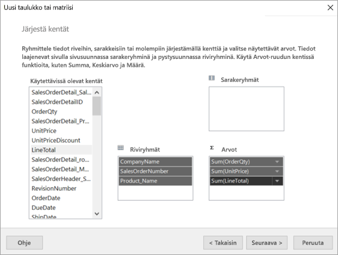

# Opetusohjelma: Sivutetun raportin luominen ja lataaminen Power BI -palveluun

Tässä opetusohjelmassa muodostat yhteyden Azure SQL -mallitietokantaan. Sen jälkeen luot Power BI:n raportin muodostimen ohjatun toiminnon avulla sivutetun raportin, joka sisältää useille sivuille rivitetyn taulukon. Sen jälkeen lataat sivutetun raportin Power BI -palvelussa olevaan Premium-kapasiteetin työtilaan.

Suoritat tässä opetusohjelmassa seuraavat vaiheet:

> [!div class="checklist"]
> * Azure-mallitietokannan luominen
> * Luo matriisi Power BI:n raportin muodostimen ohjatun toiminnon avulla.
> * raportin muotoilu: otsikon, sivunumeron ja sarakkeiden otsikot kullakin sivulla
> * valuutan muotoileminen
> * raportin julkaiseminen Power BI -palveluun.

Jos sinulla ei ole Azure-tilausta, luo [ilmainen tili](https://azure.microsoft.com/free/?WT.mc_id=A261C142F) ennen aloittamista.
 
## Edellytykset  

Edellytykset sivutetun raportin luomiseen:

- [Power BI:n raportin muodostimen asentaminen Microsoft Download Centeristä](https://go.microsoft.com/fwlink/?linkid=2086513). 

- [Azure SQL -mallitietokannan luominen Azure-portaalissa](https://docs.microsoft.com/azure/sql-database/sql-database-get-started-portal) -pikaoppaan noudattaminen. **Palvelimen nimi** -ruudussa olevan arvon kopioiminen ja tallentaminen **Yleiskatsaus**-välilehdelle. Muista Azuressa luomasi käyttäjänimi ja salasana.

Sivutetun raportin lataaminen Power BI -palveluun edellyttää seuraavia:

- [Power BI Pro -lisenssi](../service-admin-power-bi-pro-in-your-organization.md).
- Työtila palvelun [Power BI Premium -kapasiteetissa](../admin/service-premium-what-is.md). Työtilan nimen vieressä on .

## Matriisin luominen ohjatun toiminnon avulla
  
1.  Käynnistä Power BI:n raportin muodostin tietokoneella.  
  
     **Aloitus**-valintaikkuna aukeaa.  
  
     
  
1.  Varmista, että **Uusi raportti** on valittu vasemmassa ruudussa, ja valitse oikeasta ruudusta **Ohjattu taulukon tai matriisin luominen**.  
  
4.  Valitse **Valitse tietojoukko** -sivulta **Luo tietojoukko** > **Seuraava**.  

    
  
5.  Valitse **Valitse yhteys tietolähteeseen** -sivulta **Uusi**. 

    
  
     **Tietolähteen ominaisuudet** -valintaikkuna avautuu.  
  
6.  Voit antaa tietolähteelle haluamasi nimen, joka koostuu merkeistä ja alaviivoista. Kirjoita tätä opetusohjelmaa seuratessasi **Nimi**-kenttään **MyAzureDataSource**.  
  
7.  Valitse **Valitse yhteystyyppi** -ruudusta **Microsoft Azuren SQL-tietokanta**.  
  
8.  Valitse **Yhteysmerkkijono**-ruudun vierestä **Muodosta**. 

    

9. **Azuressa:** Palaa Azure-portaaliin ja valitse **SQL-tietokannat**.

1. Valitse Azure SQL-tietokanta, jonka loit ”Azure SQL-mallitietokannan luominen Azure-portaalissa” -pikaoppaassa tämän artikkelin **edellytyksissä**.

1. Kopioi **Yleiskatsaus**-välilehden **Palvelimen nimi** -ruudussa oleva arvo.

2. **Raportin muodostimessa**: Liitä kopioimasi palvelimen nimi **Yhteyden ominaisuudet** -valintaikkunan **Palvelimen nimi** -kohtaan. 

1. **Kirjautuminen palvelimelle** -sivu: Varmista, että **Käytä SQL Server -todennusta** on valittu, ja kirjoita sitten käyttäjänimi ja salasana, jotka loit Azuressa mallitietokantaa varten.

1. Valitse **Yhteyden muodostaminen tietokantaan** -kohdassa oleva alanuoli ja valitse Azuressa luomasi tietokannan nimi.
 
    

1. Valitse **Testaa yhteyttä**. Näet **Tulokset**-viestin **Testiyhteys onnistui**.

1. Valitse **OK** > **OK**. 

   Nyt Raportin muodostin näyttää **Yhteysmerkkijono**-ruudussa juuri luomasi yhteysmerkkijonon. 

    

1. Valitse **OK**.
  
9. Näet **Valitse yhteys tietolähteeseen** -sivulla ”(tässä raportissa)” -kohdan juuri luomasi tietolähteen yhteydessä. Valitse kyseinen tietolähde > **Seuraava**.  

    

10. Kirjoita ruutuun sama käyttäjänimi ja salasana. 
  
10. Laajenna SalesLT **Suunnittele kysely** -sivulta, laajenna taulukot ja valitse seuraavat taulukot:

    - Osoite
    - Asiakas
    - Tuote
    - ProductCategory
    - SalesOrderDetail
    - SalesOrderHeader

     Koska **Suhteiden** > **automaattinen tunnistus** on valittuna, Raportin muodostin havaitsee näiden taulukoiden väliset suhteet. 
    
    
 
1.  Valitse **Suorita kysely**. Raportin muodostimessa näytetään **Kyselyn tulokset**. 
 
     

18. Valitse **Seuraava**. 

19. Valitse **Valitse tietojoukko** -sivulla juuri luomasi tietojoukko > **Seuraava**.

    

1. Vedä **Järjestä kentät** -sivulla seuraavat kentät **Käytettävissä olevat kentät** -ruudusta **Riviryhmät**-ruutuun:

    - CompanyName
    - SalesOrderNumber
    - Product_Name

1. Vedä seuraavat kentät **Käytettävissä olevat kentät** -ruudusta **Arvot**-ruutuun:

    - OrderQty
    - Yksikköhinta
    - LineTotal

    Raportin muodostimessa **Arvot**-ruudun kentät muunnetaan automaattisesti summiksi.

    

24. Säilytä **Valitse asettelu** -sivulla kaikki oletusasetukset, mutta tyhjennä **Laajenna/Kutista ryhmät**. Yleensä Laajenna/Kutista ryhmät -ominaisuus on erittäin hyödyllinen, mutta tällä kertaa haluamme rivittää taulukon useille sivuille.

1. Valitse **Seuraava** > **Valmis**. Taulukko näytetään suunnittelualueella.
 
## Luomuksesi

Katsotaan ohjatun toiminnon tuloksia.

1. Näet Raporttitietoruudussa luomasi upotetun Azure-tietolähteen ja siihen perustuvan upotetun tietolähteen. 

2. Suunnittelualueen leveys on noin kuusi tuumaa. Näet suunnittelualueella matriisin, joka sisältää sarakeotsikot ja paikkamerkkien arvot. Matriisissa on kuusi saraketta ja sen korkeus näyttää olevan vain viisi riviä. 

3. Order Qty, Unit Price ja Line Total ovat summia ja jokaisella riviryhmällä on välisumma. 

    Et vieläkään näe tietojen todellisia arvoja. Sinun on suoritettava raportti, jotta voit tarkastella niitä.

4. Valitun matriisin nimi Ominaisuudet-ruudulla on Tablix1. *Tablix*-elementti on Raportin muodostimessa oleva tietoalue, jossa tiedot näytetään riveissä ja sarakkeissa. Se voi olla joko taulukko tai matriisi.

5. Ryhmittelyruudussa näet kolme ohjatussa toiminnossa luomaasi riviryhmää: 

    - Yrityksen nimi
    - Myyntitilaus
    - Tuotenimi

    Tässä matriisissa ei ole sarakeryhmiä.

### Raportin suorittaminen

Sinun on suoritettava raportti, jotta näet todelliset arvot.

1. Valitse **Suorita** **Aloitus**-työkaluriviltä.

   Näet nyt arvot. Matriisissa on paljon enemmän rivejä kuin Suunnittelunäkymässä näit. Huomaa, että Raportin muodostimen mukaan kyseessä on sivu **1**/**2?** . Raportin muodostin lataa raportin mahdollisimman nopeasti, joten se hakee vain muutaman sivun tiedot kerralla. Kysymysmerkki ilmaisee, että Raportin muodostin ei ole vielä ladannut kaikkia tietoja.

   

2. Valitse **Tulostusasettelu**. Raportti on tässä muodossa, kun tulostat sen. Raportin muodostin tietää nyt, että raportissa on 33 sivua, ja alatunnisteeseen on lisätty automaattisesti päivämäärä- ja aikaleima.

## Raportin muotoilu

Sinulla on nyt raportti, joka sisältää 33 sivulle rivitetyn matriisin. Lisätään nyt muita ominaisuuksia ja parannetaan sen ulkoasua. Voit suorittaa raportin jokaisen vaiheen jälkeen, jos haluat seurata sen edistymistä.

- Valitse valintanauhan **Suorita**-välilehdeltä **Muodosta**, jotta voit jatkaa sen muokkaamista.  

### Sivun leveyden määrittäminen

Sivutettu raportti on yleensä muotoiltu tulostamista varten, ja tyypillisen sivun koko on 8½ x 11 tuumaa. 

1. Voit muuttaa suunnittelualueen seitsemän tuuman levyiseksi vetämällä viivainta. Reunusten leveys on oletusarvoisesti 1 tuuma, joten reunuksia on kavennettava.

1. Napsauta suunnittelualueen ulkopuolista harmaata aluetta avataksesi **Raportin** ominaisuudet.

    Jos et näe Ominaisuudet-ruutua, napsauta **Näytä**-välilehteä > **Ominaisuudet**.

2. Laajenna **Reunukset** ja muuta **Vasen** ja **Oikea** 1 tuuman levyisestä 0,75-tuumaiseksi. 

    
  
### Raportin otsikon lisääminen  

1. Valitse sivun yläosasta sanat **Lisää otsikko napsauttamalla** ja kirjoita sitten **Myynti yrityksen mukaan**.  

2. Valitse otsikkoteksti ja muuta Ominaisuudet-ruudussa olevasta **Fontti**-kohdasta **Väri**-arvoksi **Sininen**.
  
### Sivunumeron lisääminen

Huomasitkin, että raportin alatunnisteessa on päivämäärä- ja aikaleima. Voit lisätä myös sivunumeron alatunnisteeseen.

1. Näet alatunnisteen oikeassa reunassa, suunnittelualueen alareunassa, [&ExecutionTime]. 

2. Laajenna Sisäiset kentät -kansio raporttitietoruudussa. Vedä **Sivunumero** alatunnisteen vasempaan reunaan samalle korkeudelle kuin [&ExecutionTime].

3. Vedä [&PageNumber]-ruudun oikeaa reunaa niin, että ruutu on neliön muotoinen.

4. Valitse **Lisää**-välilehdeltä **Tekstiruutu**.

5. Napsauta [&PageNumber]-kohdan oikealta puolelta, kirjoita /-merkki ja tee tekstiruudusta sitten neliön muotoinen.

6. Vedä **Kokonaissivumäärä** alatunnisteeseen /-merkin oikealle puolelle ja tee siitäkin neliön muotoinen vetämällä oikeaa reunaa.

    

### Taulukon leventäminen  

Voit nyt leventää matriisia niin, että se täyttää sivun koko leveyden, ja leventää tekstisarakkeita niin, ettei nimiä tarvitse vierittää yhtä paljon. 
 
1. Valitse matriisi ja valitse sitten Yrityksen nimi -sarake.

3. Osoita Yrityksen nimi -sarakkeen oikeassa reunassa olevan matriisin yläreunan harmaata palkkia. Vedä oikealle, kunnes sarake päättyy 1 3/8:n tuuman kohdalle. 

    

4. Vedä tuotenimi -kohdan oikeaa reunaa, kunnes sarake päättyy 3 3/4:n tuuman kohdalle.   

Matriisin on nyt lähes tulostusalueen levyinen.

### Valuutan muotoileminen

Saatoit huomata raporttia suorittaessasi, että dollarisummia ei ole vielä muotoiltu valuutaksi.

1. Valitse [Sum(OrderQty)]-solun vasen yläkulma, pidä vaihto-näppäintä painettuna ja valitse [Sum(LineTotal)]-solun oikea alakulma.

    

2. Valitse **Aloitus**-välilehdeltä dollarimerkin näköinen ( **$** ) valuuttasymboli ja valitse sitten **Paikkamerkkityylit** > **Näytearvot** -kohdan vieressä oleva nuoli.
 
    

    Arvot muotoillaan nyt valuuttana.

    

### Sarakeotsikoiden lisääminen kullekin sivulle

Tehdään muotoiluun vielä yksi parannus ennen raportin julkaisemista Power BI -palveluun: tehdään sarakeotsikoista näkyviä raportin kullakin sivulla.

1. Valitse Ryhmittelyruudun yläpalkin oikeasta reunasta avattavan valikon nuoli > **Mukautettu tila**.

    

2. Valitse yläreunasta **Riviryhmien** yläreunan **Staattinen**-palkki. Näet, että Yrityksen nimi -solu on valittu matriisissa.

   

3. Näet **Ominaisuudet**-ruudussa **Tablix-jäsenen** ominaisuudet. Aseta **KeepWithGroup**-ominaisuuden arvoksi **After** ja **RepeatOnNewPage**-ominaisuudeksi **True**.

    

    Suoritetaan raportti ja katsotaan, miltä se näyttää nyt.

5. Valitse **Aloitus**-välilehdeltä **Suorita**.

6. Valitse **Tulostusasettelu**, jos se ei ole valittuna. Raportissa on nyt 29 sivua. Selaa joitakin sivuja. Valuutta on muotoiltu, sarakkeiden otsikot näkyvät jokaisella sivulla ja raportin jokaisella sivulla on sivunumeron ja päivämäärä- ja aikaleiman sisältävä alatunniste.
 
    

7. Tallenna raportti tietokoneellesi.
 
##  Raportin lataaminen palveluun

Nyt kun olet luonut tämän sivutetun raportin, voit ladata sen Power BI -palveluun.

1. Valitse Power BI -palvelun (`https://app.powerbi.com`) siirtymisruudusta **Työtilat** > **Luo työtila**.

2. Anna työtilan nimeksi **Azure AW** tai muu yksilöllinen nimi. Olet toistaiseksi ainoa jäsen. 

3. Valitse nuoli **Lisäasetukset**-kohdan vierestä ja ota käyttöön **Varattu kapasiteetti**. 

    

    Jos et voi lisätä työtilaa varattuun Premium-kapasiteettiin, sinun on pyydettävä Power BI -järjestelmänvalvojaasi antamaan sinulle oikeudet.

4. Valitse tarvittaessa **käytettävissä oleva varattu kapasiteetti tälle työtilalle** > **Tallenna**.
    
    

    Jos työtila ei ole Premium-kapasiteetissa, näet ”Sivutettua raporttia ei voi ladata palvelimeen” -viestin yrittäessäsi ladata raporttia palvelimelle. Ota yhteys Power BI -järjestelmänvalvojaasi siirtääksesi työtilan.

1. Valitse uudessa työtilassasi **Nouda tiedot**.

2. Valitse **Tiedostot**-ruutu > **Nouda**.

3. Valitse **Paikallinen tiedosto**, siirry tiedoston tallennussijaintiin > **Avaa**.

   Power BI tuo tiedoston. Näet sen sovellusluettelosivulla **Raportit**-kohdassa.

    

4. Valitse raportti katsoaksesi sitä.

5. Jos saat virheilmoituksen, saatat joutua antamaan tunnistetiedot uudelleen. Valitse **Hallinta**-kuvake.

    

6. Valitse **Muokkaa tunnistetietoja** ja anna tunnistetiedot, joita käytit Azuressa Azure-tietokantaa luodessasi.

    

7. Voit nyt tarkastella sivutettua raporttia Power BI -palvelussa.

    

## Seuraavat vaiheet

[Mitä ovat sivutetut raportit Power BI Premiumissa?](paginated-reports-report-builder-power-bi.md)
