# Sivutetun raportin julkaiseminen Power BI -palveluun

Tässä artikkelissa opit julkaisemaan sivutetun raportin Power BI -palveluun lataamalla sen paikallisesta tietokoneesta. Voit ladata sivutetut raportit omaan työtilaasi tai mihin tahansa muuhun työtilaan niin kauan kuin työtila on Premium-kapasiteetissa. Etsi vinoneliökuvaketta  työtilan nimen vieressä. 

Jos raportin tietolähde on paikallinen, sinun on luotava yhdyskäytävä raportin lataamisen jälkeen. Lisätietoja on tämän artikkelin myöhemmässä [Luo yhdyskäytävä](#create-a-gateway) -osassa.

## Työtilan lisääminen Premium-kapasiteettiin

Jos työtilassa ei ole vinoneliökuvaketta  nimen vieressä, sinun on lisättävä työtila Premium-kapasiteettiin. 

1. Valitse **Työtilat**, valitse työtilan nimen vierestä kolme pistettä ( **...** ) , ja valitse sitten **Muokkaa työtilaa**.

    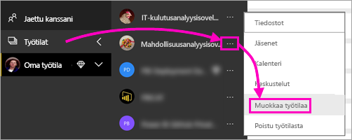

1. Laajenna **Muokkaa työtilaa** -valintaikkunassa **Lisäasetukset**-kohtaa ja liu’uta sitten **Varattu kapasiteetti** asentoon **Päällä**.

    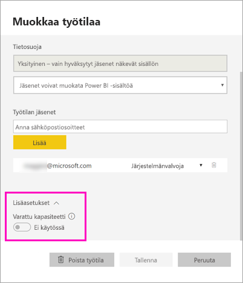

   Et välttämättä voi muuttaa sitä. Jos et pysty muuttamaan sitä, ota yhteyttä Power BI Premium -kapasiteetin järjestelmänvalvojaan, jotta saat määritysoikeudet työtilan lisäämiseksi Premium-kapasiteettiin.

## Julkaise sivutettu raportti raportin muodostimen kautta

1. Luo sivutettu raportti raportin muodostimessa ja tallenna se paikalliseen tietokoneeseen.

1. Valitse raportin muodostimen **Tiedosto**-valikosta **Tallenna nimellä**.

    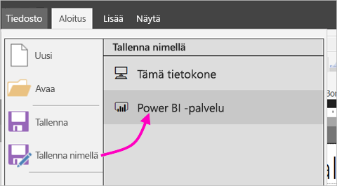

    Jos et ole vielä kirjautunut sisään Power BI:hin, sinun on nyt kirjauduttava sisään tai luotava tili. Valitse raportin muodostimen oikeasta yläkulmasta **Kirjaudu sisään** ja suorita vaiheet.

2. Valitse vasemmalla olevasta työtilojen luettelosta työtila, jonka nimen vieressä on vinoneliökuvake . Kirjoita ruutuun **tiedoston nimi** > **Tallenna**. 

    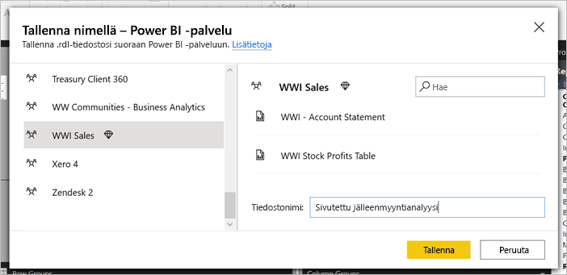

4. Avaa Power BI -palvelu selaimessa ja selaa Premium-työtilaan, jossa julkaisit sivutetun raportin. Näet raportin **Raportit**-välilehdellä.

    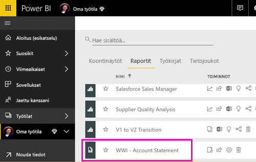

5. Valitse sivutettu raportti avataksesi sen Power BI -palvelussa. Jos siinä on parametreja, sinun on valittava ne ennen kuin voit tarkastella raporttia.

    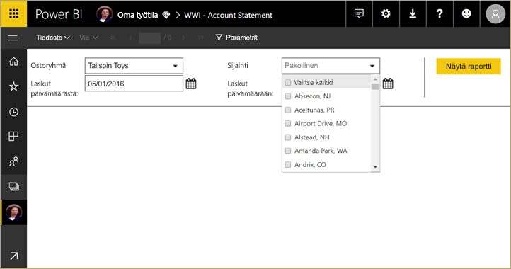

6. Jos raportin tietolähde on paikallinen, lue tästä artikkelista, miten voit käyttää tietolähdettä [luomalla yhdyskäytävän](#create-a-gateway).

## Lataa sivutettu raportti Power BI -palvelun kautta

Voit myös aloittaa Power BI-palvelusta ja ladata sivutetun raportin.

1. Luo sivutettu raportti raportin muodostimessa ja tallenna se paikalliseen tietokoneeseen.

1. Avaa Power BI -palvelu selaimessa ja selaa Premium-työtilaan, jossa haluat julkaista raportin. Pane merkille vinoneliökuvake  nimen vieressä. 

1. Valitse **Nouda tiedot**.

    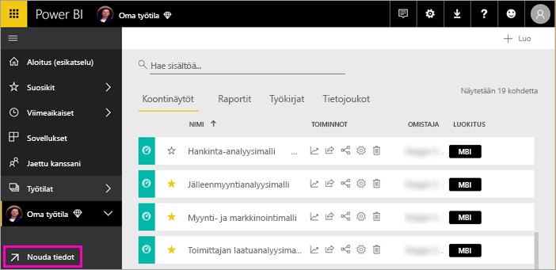

1. Valitse **Tiedostot**-ruudusta **Nouda**.

    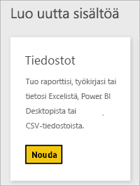

1. Valitse **Paikallinen tiedosto** > selaa sivutettuun raporttiin > **Avaa**.

    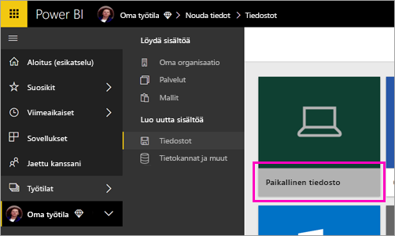

1. Valitse **Jatka** > **Muokkaa tunnistetietoja**.

    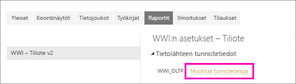

1. Määritä tunnistetiedot > **Kirjaudu sisään**.

    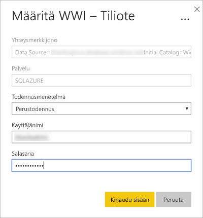

   Näet raportin **Raportit**-välilehdellä.

    

1. Valitse se Power BI -palvelun avaamiseksi. Jos siinä on parametreja, sinun on valittava ne ennen kuin voit tarkastella raporttia.
 
    

6. Jos raportin tietolähde on paikallinen, lue tästä artikkelista, miten voit käyttää tietolähdettä [luomalla yhdyskäytävän](#create-a-gateway).

## Luo yhdyskäytävä

Kuten mikä tahansa muu Power BI -raportti, jos raportin tietolähde on paikallinen, sinun on luotava yhdyskäytävä tai yhdistettävä siihen tietojen käyttämiseksi.

1. Valitse raportin nimen vieressä **Hallitse**.

   

1. Katso lisätietoja ja seuraavat vaiheet Power BI -palvelun artikkelista [Mikä paikallinen tietoyhdyskäytävä on](../connect-data/service-gateway-onprem.md).

## Seuraavat vaiheet

- [Sivutetun raportin tarkasteleminen Power BI -palvelussa](../consumer/paginated-reports-view-power-bi-service.md)
- [Mitä ovat sivutetut raportit Power BI Premiumissa?](paginated-reports-report-builder-power-bi.md)
- [Opetusohjelma: Power BI:n sivutetun raportin upottaminen sovellukseen asiakkaitasi varten ](../developer/embedded/embed-paginated-reports-customers.md)
