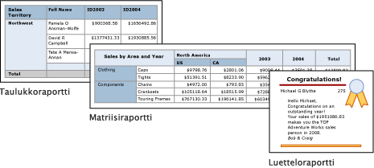

# Taulukot, matriisit ja luettelot Power BI:n raportin muodostimessa
 Power BI:n raporttien muodostimessa taulukot, matriisit ja luettelot ovat *tietoalueita*, joissa sivutetun raportin tiedot on järjestetty riveihin ja sarakkeisiin. Solut sisältävät yleensä tekstitietoja, kuten tekstiä, päivämääriä ja numeroita, mutta ne voivat sisältää myös mittareita ja kaavioita tai raporttikohteita, kuten kuvia. Taulukoita, matriiseja ja luetteloita kutsutaan usein *tablix*-tietoalueiksi.  
  
 Taulukko-, matriisi- ja luettelomallit pohjautuvat tablix-tietoalueeseen. Se on joustava ruudukko, joka esittää tietoja soluissa. Taulukko- ja matriisimalleissa solut on järjestetty riveihin ja sarakkeisiin. Koska mallit ovat pohjana olevien yleisten tablix-tietoalueiden variaatioita, voit näyttää tiedot eri mallimuodoissa ja muuttaa raporttia kehittäessäsi taulukkoa, matriisia tai luetteloa niin, että se sisältää toisen tietoalueen ominaisuuksia. Jos esimerkiksi lisäät taulukon ja huomaat, ettei se vastaakaan tarpeitasi, voit tehdä taulukosta matriisin lisäämällä sarakeryhmiä.  
  
 Taulukko- ja matriisitietoalueilla voidaan näyttää monimutkaista tietosuhteita lisäämällä sisäkkäisiä taulukoita, matriiseja, luetteloja, kaavioita ja mittareita. Taulukoissa ja matriiseissa käytetään taulukkomuotoista asettelua, ja niiden tiedot ovat peräisin yhdestä yhteen tietolähteeseen perustuvasta tietojoukosta. Taulukoiden ja matriisien tärkein ero on se, että taulukot voivat sisältää vain riviryhmiä, kun taas matriiseissa on sekä rivi- että sarakeryhmiä.  
  
 Luettelot poikkeavat molemmista hieman. Ne tukevat vapaata asettelua, joka voi sisältää useita vertaistaulukoita tai -matriiseja, joista jokainen käyttää eri tietojoukon tietoja. Luetteloja voidaan käyttää myös lomakkeissa, kuten laskuissa.  
  
 Seuraavissa kuvissa näytetään yksinkertaisia raportteja, joissa on taulukko, matriisi tai luettelo.  

  
##   Taulukot  
 Taulukon avulla voit näyttää tietoja ja/tai järjestää tiedot rivinryhmiin. Taulukkomalli sisältää kolme saraketta, taulukon otsikkorivin ja tietojen lisätietorivin. Seuraavassa kuvassa esitetään suunnittelualueessa valittu taulukkomalli:  

  
 Voit ryhmitellä tietoja yhden tai usean kentän perusteella tai kirjoittamalla oman lausekkeesi. Voit luoda sisäkkäisiä ryhmiä tai riippumattomia, rinnakkaisia ryhmiä, näyttää ryhmitettyjen tietojen koostetut arvot tai lisätä summia ryhmiin. Jos taulukossa on esimerkiksi riviryhmä **Luokka**, voit lisätä kunkin ryhmän välisumman sekä kokonaissumman raporttiin. Voit parantaa taulukon ulkoasua ja korostaa haluamiasi tietoja yhdistämällä soluja ja käyttämällä tietoihin ja taulukon otsikoihin muotoiluja.  
  
 Voit halutessasi piilottaa yksityiskohtaiset tai ryhmitellyt tiedot aluksi ja sisällyttää porautumisominaisuuksia, joiden avulla käyttäjä voi valita vuorovaikutteisesti, kuinka paljon tietoja näytetään.  
  
##   Matriisit  
 Matriisin avulla voit näyttää tietojen koostettuja yhteenvetoja riveihin tai sarakkeisiin ryhmiteltynä. Ne muistuttavat välilehtien välistä tai pivot-taulukkoa. Rivien ja sarakkeiden määrään vaikuttavat kunkin rivi- ja sarakeryhmän yksilöllisten arvojen määrä. Seuraavassa kuvassa esitetään suunnittelualueessa valittu matriisimalli:  

 
 Voit ryhmitellä tietoja useiden kenttien tai lausekkeiden mukaan rivi- ja sarakeryhmiin. Kun raporttitietoja ja tietoalueita yhdistetään suorituksen aikana, matriisi kasvaa sivulla vaaka- ja pystysuunnassa, kun siihen lisätään sarakeryhmien sarakkeita ja riviryhmien rivejä. Matriisin soluissa esitetään koostearvot, joiden sisältö perustuu kyseisen solun rivi- ja sarakeryhmän leikkauspisteeseen. Jos matriisissa on esimerkiksi riviryhmä (Luokka) ja kaksi sarakeryhmää (Alue ja Vuosi), joissa esitetään myyntisumma, raportissa näytetään kaksi solua, joissa on kutakin Luokka-ryhmän arvoa vastaava myyntisumma. Solujen kaksi leikkauspistettä ovat: Luokka ja Alue sekä Luokka ja Vuosi. Matriisi voi sisältää sisäkkäisiä ja rinnakkaisia ryhmiä. Sisäkkäisillä ryhmillä on pää-aliryhmäsuhde ja rinnakkaisilla ryhmillä vertaissuhde. Voit lisätä matriisin sisäkkäisten rivi- ja sarakeryhmien välisummat kaikilla tasoilla.  
  
 Voit parantaa matriisin tietojen luettavuutta ja korostaa haluamiasi tietoja yhdistämällä soluja tai jakamalla vaaka- ja pystysuunnassa sekä käyttämällä muotoiluja tietojen ja ryhmien otsikoihin.  
  
 Voit myös lisätä porautumiskytkimiä, jotka piilottavat tai näyttävät tiedot raporttia avatessa. Kytkinten avulla käyttäjä voi tarkastella enemmän tai vähemmän yksityiskohtaisia tietoja tarpeen mukaan.  
  
##   Luettelot  
 Luettelon avulla voit luoda vapaan asettelun. Luetteloihin voidaan ruudukkoasettelun lisäksi sijoittaa kenttiä vapaasti. Luettelon avulla voit suunnitella lomakkeen, jossa näytetään useita tietojoukkokenttiä tai joka toimii säilönä useille, rinnakkain esitettäville ryhmitettyjen tietojen tietoalueille. Voit esimerkiksi määrittää luettelolle ryhmän; lisätä taulukon, kaavion tai kuvan; ja näyttää ryhmän arvot taulukko- ja graafisessa muodossa. Voit käyttää tätä esimerkiksi työntekijä- tai potilastietojen esittämiseen.  

  
##   Tietojen valmistelu  
 Taulukon, matriisin ja luettelon tietoalueilla esitetään tietojoukon tietoja. Voit valmistella tiedot kyselyllä, joka hakee tietojoukon tiedot, tai määrittämällä ominaisuudet taulukossa, matriisissa tai luettelossa.  
  
 Transact-SQL ja muut kyselyiden kielet, joiden avulla noudat raportin tietojoukkojen tietoja, voivat valmistella tiedot suodattimilla, jotka sisällyttävät vain tietyn tietojen alijoukon, korvaavat nolla- tai tyhjät arvot luettavuutta parantavilla vakioilla sekä lajittelevat ja ryhmittelevät tietoja.  
  
 Voit valmistella raportin taulukon, matriisin tai luettelon tiedot määrittämällä tietoalueen tai tietoalueen solujen ominaisuudet. Voit suodattaa tai lajitella tiedot määrittämällä tietoalueen ominaisuudet. Voit esimerkiksi valita sarakkeet, joiden mukaan tiedot lajitellaan, sekä lajittelusuunnan. Voit antaa kentälle vaihtoehtoisen arvon määrittämällä kentässä näytettävän solutekstin arvot. Voit esimerkiksi käyttää lauseketta, joka asettaa kentän tyhjäksi, jos kenttä on tyhjä tai jos se sisältää nolla-arvon.  
  
##   Taulukon, matriisin tai luettelon luominen ja määrittäminen  
 Kun lisäät taulukoita tai matriiseja raporttiin, voit käyttää Ohjattua taulukon ja matriisin luomista tai luoda ne manuaalisesti Raportin muodostimen mallien avulla. Luettelot koostetaan manuaalisesti luettelomallista.  
  
 Ohjattu toiminto opastaa sinua taulukon tai matriisin nopeassa luomisessa ja määrittämisessä. Kun olet suorittanut ohjatun toiminnon tai koostanut tablix-tietoalueet alusta alkaen, voit edelleen määrittää ja tarkentaa niitä. Napsauttamalla tietoalueita kakkospainikkeella voit avata valintaikkunoita, joiden avulla voit määrittää helposti otsikoiden ja alatunnisteiden, näyttöasetusten, suodattimien ja lajittelun sivunvaihdot, toistuvuuden ja näkyvyyden yleisimmin käytetyt ominaisuudet. Tablix-tietoalueet tarjoavat paljon lisäominaisuuksia, jotka voit määrittää vain Raportin muodostimen Ominaisuudet-ruudusta. Jos haluat esimerkiksi nähdä sanoman, kun taulukon, matriisin tai luettelon tietojoukko on tyhjä, määrität sanoman tekstin Ominaisuudet-ruudun NoRowsMessage-tablix-ominaisuudessa.  
  
##   Tablix-mallien välillä vaihtaminen  
 Alkuperäinen tablix-mallivalintasi ei rajoita käytössäsi olevia vaihtoehtoja. Ehkä haluat muokata tablix-rakennetta lisätessäsi ryhmiä, kokonaissummia tai otsikoita. Voit esimerkiksi aloittaa taulukosta ja sitten poistaa lisätiedot-rivin ja lisätä sarakeryhmiä.  
  
 Voit jatkaa taulukon, matriisin tai luettelon kehittämistä lisäämällä haluamiasi tablix-ominaisuuksia. Tablix-ominaisuuksiin sisältyvät tietojen lisätiedot tai ryhmitettyjen rivien ja sarakkeiden koostetut tiedot. Voit luoda sisäkkäisiä ryhmiä, riippumattomia rinnakkaisia ryhmiä tai rekursiivisia ryhmiä. Voit suodattaa ja lajitella ryhmitellyt tiedot ja yhdistää ryhmiä helposti sisällyttämällä useita ryhmälausekkeita ryhmämääritykseen.  
  
 Voit myös lisätä ryhmien summia tai tietoalueiden kokonaissummia. Voit piilottaa rivejä tai sarakkeita, raportin yksinkertaistamiseksi ja antaaksesi käyttäjille oikeuden näyttää tai piilottaa piilotetut tiedot (kuten porautumisraportissa). 

## Seuraavat vaiheet

- [Mitä ovat sivutetut raportit Power BI Premiumissa?](paginated-reports-report-builder-power-bi.md)
