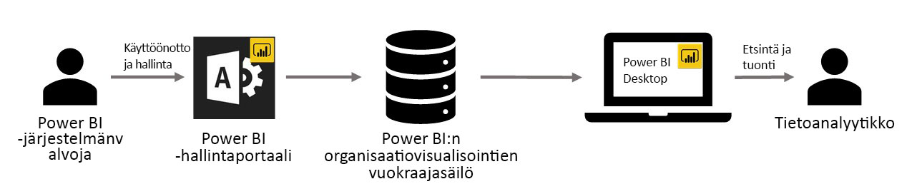

# Organisaation mukautetut visualisoinnit Power BI:ssä

Power BI:n mukautettujen visualisointien avulla voit luoda yksilöllisen visualisointityypin, joka on räätälöity juuri sinulle. Mukautetut visualisoinnit ovat kehittäjien työn tulosta, ja usein niitä luodaan silloin, kun Power BI:hin sisältyvä laaja visualisointivalikoima ei täysin vastaa kehittäjän tarpeita.

Joissakin organisaatioissa mukautetut visualisoinnit ovat vielä tärkeämpiä – niitä saatetaan tarvita organisaation tiettyjen tietojen tai merkityksellisten tietojen välittämiseen, niillä voi olla erityisiä tietovaatimuksia tai ne saattavat korostaa yksityisiä liiketoimintamalleja. Tällaisten organisaatioiden on kehitettävä mukautettuja visualisointeja, jaettava niitä koko organisaatioon ja varmistettava, että niitä ylläpidetään oikein. Power BI:n mukautettujen visualisointien avulla se onnistuu helposti.

Seuraavassa kuvassa näkyy prosessi, jonka mukaan organisaation mukautetut visualisoinnit siirtyvät Power BI:ssä järjestelmänvalvojalta kehityksen ja ylläpidon kautta tietoanalyytikolle.

Power BI -järjestelmänvalvoja ottaa organisaation visualisoinnit käyttöön ja hallinnoi niitä hallintaportaalissa. Kun ne on otettu käyttöön organisaation säilössä, organisaation käyttäjät voivat helposti löytää ne ja tuoda ne raportteihinsa suoraan Power BI Desktopista.

Lisätietoja siitä, miten voit käyttää organisaation mukautettuja visualisointeja luomissasi raporteissa, on seuraavassa artikkelissa: [Lisätietoja organisaation visualisointien tuomisesta raportteihin](power-bi-custom-visuals.md).

## Organisaation mukautettujen visualisointien hallinta

Lisätietoja organisaation mukautettujen visualisointien käyttöönotosta ja hallinnasta organisaatiossasi on seuraavassa artikkelissa: [Lisätietoja organisaation mukautettujen visualisointien käyttöönotosta ja hallinnasta](https://go.microsoft.com/fwlink/?linkid=866790).

> [!WARNING]
> Mukautettu visualisointi voi sisältää koodia, joka aiheuttaa suojaus- tai tietosuojariskejä. Varmista, että luotat mukautetun visualisoinnin tekijään ja lähteeseen, ennen kuin se otetaan käyttöön organisaation säilössä.

## Huomioon otettavat seikat ja rajoitukset

Sinun on otettava huomioon useita seikkoja ja rajoituksia.

Järjestelmänvalvoja:

* Vanhoja mukautettuja visualisointeja (esimerkiksi mukautettuja visualisointeja, joita ei ole luotu uusilla ohjelmointirajapintojen versioilla) ei tueta.

* Jos mukautettu visualisointi poistetaan säilöstä, poistettua visualisointia käyttäviä aiemmin luotuja raportteja ei enää hahmonneta. Säilöstä poistamista ei voi kumota. Voit poistaa mukautetun visualisoinnin tilapäisesti käytöstä Poista käytöstä -ominaisuuden avulla.

Käyttäjä:

* Organisaation mukautetut visualisoinnit ovat yksityisiä visualisointeja, jotka on tuotu organisaation säilöstä. Yksityisiä visualisointeja ei voi [viedä PowerPointiin](https://docs.microsoft.com/power-bi/consumer/end-user-powerpoint) tai näyttää sähköpostiviesteissä, joita käyttäjä vastaanottaa [tilatessaan raporttisivuja](https://docs.microsoft.com/power-bi/consumer/end-user-subscribe). Vain suoraan Marketplacesta tuodut [sertifioidut mukautetut visualisoinnit](https://docs.microsoft.com/power-bi/power-bi-custom-visuals-certified) tukevat näitä ominaisuuksia.

* AppSource Marketplacen Visio-visualisointia, PowerApps-visualisointia, Map Box -visualisointia ja GlobeMap-visualisointia ei hahmonneta, jos ne on otettu käyttöön organisaation säilön kautta.

## Vianmääritys

Lisätietoja vianmäärityksestä on kohdassa [Power BI:n mukautettujen visualisointien vianmääritys](power-bi-custom-visuals-troubleshoot.md).

## Usein kysytyt kysymykset

Saat lisätietoja ja vastauksia kysymyksiisi [Power BI:n mukautettujen visualisointien usein kysytyistä kysymyksistä](power-bi-custom-visuals-faq.md#organizational-custom-visuals).

Onko sinulla kysyttävää? [Kokeile Power BI -yhteisöä](http://community.powerbi.com/).
