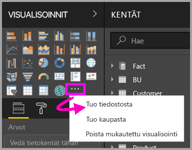
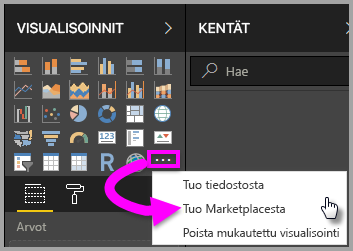
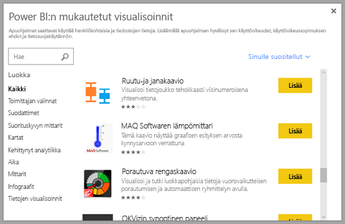

# Visualisoinnit Power BI:ssä

Kun luot tai muokkaat Power BI -raporttia, käytettävissäsi on monia eri visualisointityyppejä. Näiden visualisointien kuvakkeet näytetään **Visualisoinnit**-ruudussa. Nämä visualisoinnit ovat heti käytettävissäsi, kun lataat [Power BI Desktopin](https://powerbi.microsoft.com/desktop/) tai avaat [Power BI -palvelun](https://app.powerbi.com).

Sinun ei kuitenkaan tarvitse tyytyä pelkästään näihin visualisointeihin. Kun valitset alareunasta kolme pistettä (...), näet toisenkin lähteen raporttivisualisoinneille: *Power BI -visualisoinnit*.

Kehittäjät luovat Power BI -visualisointeja Power BI -visualisointien SDK:n avulla. Näillä visualisoinneilla yrityskäyttäjät voivat tarkastella tietoja tarpeisiinsa sopivilla tavoilla. Raporttien tekijät voivat tuoda mukautettuja visualisointitiedostoja raportteihinsa ja käyttää niitä minkä tahansa muun Power BI -visualisoinnin tapaan. Power BI -visualisoinnit ovat Power BI:n ykkösluokkaa: niitä voi esimerkiksi suodattaa, korostaa, muokata ja jakaa.

Power BI -visualisointeja voi ottaa käyttöön kolmella tavalla:

* Mukautetut visualisointitiedostot
* Organisaation visualisoinnit
* Marketplacen visualisoinnit

## Mukautetut visualisointitiedostot

Power BI -visualisoinnit ovat paketteja, jotka sisältävät koodin niille tarjottujen tietojen näyttämiseksi (hahmontamiseksi). Kuka tahansa voi luoda mukautetun visualisoinnin ja pakata sen yksittäiseksi `.pbiviz`-tiedostoksi, jonka voi sitten tuoda Power BI -raporttiin.

> [!WARNING]
> Mukautettu visualisointi voi sisältää koodia, joka aiheuttaa suojaus- tai tietosuojariskejä. Varmista, että luotat mukautetun visualisoinnin tekijään ja lähteeseen, ennen kuin tuot sen raporttiisi.

## Organisaation visualisoinnit

Power BI -järjestelmänvalvojat hyväksyvät Power BI -visualisointeja ja ottavat niitä käyttöön organisaatiossaan, jotta raporttien tekijät voivat helposti etsiä, päivittää ja käyttää niitä. Järjestelmänvalvojat voivat hallita näitä visualisointeja helposti (esimerkiksi päivittää version, ottaa käyttöön ja poistaa käytöstä).

 [Lue lisätietoja organisaation visualisoinneista](power-bi-custom-visuals-organization.md).

## Marketplacen visualisoinnit

Yhteisön jäsenet ja Microsoft ovat antaneet Power BI -visualisointinsa yleiseen käyttöön ja julkaisseet ne [AppSource](https://appsource.microsoft.com/marketplace/apps?product=power-bi-visuals) Marketplacessa. Voit ladata näitä visualisointeja ja lisätä niitä Power BI -raportteihisi. Microsoft on testannut ja hyväksynyt kaikkien näiden Power BI -visualisointien toiminnan ja laadun.

Mikä [AppSource](developer/office-store.md) on? Se on paikka, josta löydät sovelluksia, apuohjelmia ja laajennuksia Microsoft-ohjelmistollesi. AppSource yhdistää miljoonat Office 365:n, Azuren, Dynamics 365:n, Cortanan ja Power BI:n kaltaisten tuotteiden käyttäjät ratkaisuihin, joiden avulla he voivat työskennellä entistä tehokkaammin, älykkäämmin ja tyylikkäämmin.

### Sertifioidut visualisoinnit

Power BI -sertifioidut visualisoinnit ovat Marketplacen visualisointeja, jotka ovat läpäisseet ylimääräisen tiukan laatutestauksen ja joita tuetaan erilaisissa käyttötilanteissa, esimerkiksi [sähköpostitilauksissa](service-report-subscribe.md) ja [PowerPointiin viennissä](service-publish-to-powerpoint.md).
Jos haluat tarkastella luetteloa sertifioiduista Power BI -visualisoinneista tai lähettää oman, lue artikkeli [Sertifioidut Power BI -visualisoinnit](power-bi-custom-visuals-certified.md).

Oletko Web-kehittäjä ja kiinnostunut omien visualisointien luomisesta ja niiden lisäämisestä AppSourceen? Katso artikkeli [Power BI:n mukautetun visualisoinnin kehittäminen](developer/custom-visual-develop-tutorial.md) ja lue lisää [Power BI -visualisointien julkaisemisesta AppSourcessa](developer/office-store.md).

### Mukautetun visualisoinnin tuominen tiedostosta

1. Valitse kolme pistettä **Visualisoinnit**-ruudun alareunasta.

    

2. Valitse avattavasta valikosta **Tuo tiedostosta**.

    

3. Valitse **Avaa tiedosto** -valikosta `.pbiviz`-tiedosto, jonka haluat tuoda, ja valitse sitten **Avaa**. Mukautetun visualisoinnin kuvake lisätään **Visualisoinnit**-ruudun alaosaan. Lisäksi visualisointi on nyt valmis käytettäväksi raportissa.

    

### Organisaation visualisointien tuominen

1. Valitse kolme pistettä **Visualisoinnit**-ruudun alareunasta.

    

2. Valitse avattavasta valikosta **Tuo Marketplacesta**.

    

3. Valitse **OMA ORGANISAATIO** yläreunan välilehtivalikosta.

    

4. Etsi tuotava visualisointi selaamalla luetteloa.

    

5. Tuo mukautettu visualisointi valitsemalla **Lisää**. Mukautetun visualisoinnin kuvake lisätään **Visualisoinnit**-ruudun alaosaan. Lisäksi visualisointi on nyt valmis käytettäväksi raportissa.

    

## Power BI -visualisointien lataaminen tai tuominen Microsoft AppSourcesta

Sinulla on kaksi vaihtoehtoa Power BI -visualisointien lataamiseen ja tuomiseen: Power BI ja [AppSource-sivusto](https://appsource.microsoft.com/).

### Power BI -visualisointien hankkiminen Power BI:ssä

1. Valitse kolme pistettä **Visualisoinnit**-ruudun alareunasta.

    

2. Valitse avattavasta valikosta **Tuo Marketplacesta**.

    

3. Etsi tuotava visualisointi selaamalla luetteloa.

    

4. Saat lisätietoja visualisoinnista korostamalla ja valitsemalla sen.

    

5. Tietosivulla voit tarkastella näyttökuvia, videoita, yksityiskohtaista kuvausta ja muita tietoja.

    

6. Näet arvosteluja siirtymällä alareunaan.

    

7. Tuo mukautettu visualisointi valitsemalla **Lisää**. Mukautetun visualisoinnin kuvake lisätään **Visualisoinnit**-ruudun alaosaan. Lisäksi visualisointi on nyt valmis käytettäväksi raportissa.

    

### Power BI -visualisointien lataaminen ja tuominen Microsoft AppSourcesta

1. Aloita [Microsoft AppSourcesta](https://appsource.microsoft.com) ja valitse **Sovellukset**-välilehti.

    

2. Siirry [sovellusten tulossivulle](https://appsource.microsoft.com/marketplace/apps), jossa voit tarkastella kunkin luokan suosituimpia sovelluksia, mukaan lukien *Power BI -sovelluksia*. Koska nyt haetaan Power BI -visualisointeja, rajataan tuloksia valitsemalla vasemmasta siirtymisluettelosta **Power BI -visualisoinnit**. Tämä pienentää tulosten määrää.

    

3. AppSource näyttää kunkin mukautetun visualisoinnin ruudun.  Jokaisessa ruudussa on tilannevedos mukautetusta visualisoinnista, lyhyt kuvaus ja latauslinkki. Saat lisätietoja valitsemalla ruudun.

    

4. Tietosivulla voit tarkastella näyttökuvia, videoita, yksityiskohtaista kuvausta ja muita tietoja. Lataa mukautettu visualisointi valitsemalla **Hanki se nyt** ja hyväksymällä sitten käyttöehdot.

    

5. Lataa mukautettu visualisointi valitsemalla linkki.

    

    Lataussivu sisältää myös ohjeet mukautetun visualisoinnin tuomiseen Power BI Desktopiin ja Power BI -palveluun.

    Voit myös ladata malliraportin, joka sisältää mukautetun visualisoinnin ja esittelee sen ominaisuuksia.

    

6. Tallenna `.pbiviz`-tiedosto ja avaa sitten Power BI.

7. Tuo `.pbiviz`-tiedosto raporttiin. (Katso ohjeet ylempää osiosta [Mukautetun visualisoinnin tuominen tiedostosta](#import-a-custom-visual-from-a-file).)

## Huomioitavat asiat ja rajoitukset

* Mukautettu visualisointi lisätään tiettyyn raporttiin tuotaessa. Jos haluat käyttää visualisointia toisessa raportissa, sinun on tuotava se myös kyseiseen raporttiin. Kun mukautetun visualisoinnin sisältävä raportti tallennetaan käyttämällä **Tallenna nimellä** -vaihtoehtoa, kopio mukautetusta visualisoinnista tallennetaan uuden raportin yhteydessä.

* Jos et näe **Visualisoinnit**-ruutua, sinulla ei ole raportin muokkausoikeuksia.  Voit lisätä Power BI -visualisointeja vain raportteihin, joita voit muokata, et kanssasi jaettuihin raportteihin.

## Vianmääritys

Vianmääritysohjeet löytyvät kohdasta [Power BI:n Power BI -visualisointien vianmääritys](power-bi-custom-visuals-troubleshoot.md).

## Usein kysytyt kysymykset

Saat lisätietoja ja vastauksia kysymyksiisi [Power BI:n Power BI -visualisointien usein kysytyistä kysymyksistä](power-bi-custom-visuals-faq.md#organizational-visuals).

## Seuraavat vaiheet

* [Visualisoinnit Power BI -raporteissa](visuals/power-bi-report-visualizations.md)

Onko sinulla kysyttävää? [Kokeile Power BI -yhteisöä](http://community.powerbi.com/).
