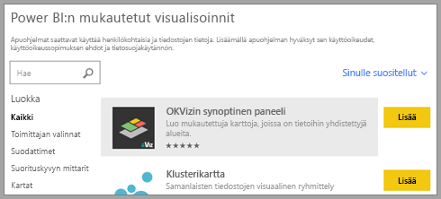
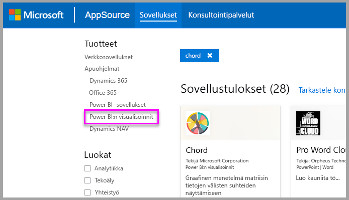
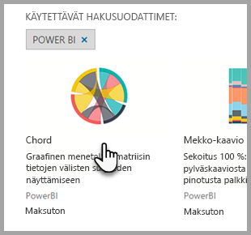
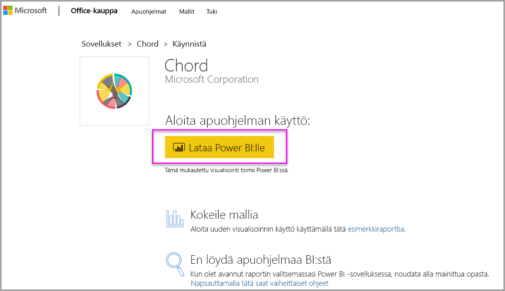

# Mukautetut visualisoinnit Power BI:ssä

Kun luot tai muokkaat Power BI-raporttiin, voit käyttää monia eri visualisointityyppejä. Nämä visualisoinnit kuvakkeet näkyvät **visualisoinnit** ruudussa. Nämä visualisoinnit ovat näihin sovelluksiin esimääritetyn, kun lataat [Power BI Desktop](https://powerbi.microsoft.com/desktop/) tai avaa [Power BI-palvelun](https://app.powerbi.com).

Et ole kuitenkin ainoat visualisointien. Jos valitset alareunassa kolme pistettä (...), toinen raportin visualisointien lähde, on käytettävissä -*mukautettujen visualisointien*.

Kehittäjät luoda mukautettuja visualisointeja mukautettujen visualisointien SDK: N käyttäminen. Nämä visualisoinnit yrityskäyttäjät voivat tarkastella tietojaan parhaiten Omat tavalla. Raporttien tekijät voit sitten tuoda mukautetut visualisointitiedostot raportteihinsa ja käyttää niitä Power BI-visualisointien tapaan. Mukautetut visualisoinnit ovat Power BI ensimmäisen luokan kansalainen ja voidaan suodattaa korostetun, muokattu, jaetun ja niin edelleen.

Mukautetut visualisoinnit on otettu käyttöön kolmella tavalla:

* Mukautetut visualisointitiedostot
* Organisaation visualisoinnit
* Marketplacen visualisoinnit

## Mukautetut visualisointitiedostot

Mukautetut visualisoinnit ovat paketteja, jotka sisältävät koodin antaa heille tietojen hahmontamista varten. Kuka tahansa voi luoda mukautetun visualisoinnin ja pakata sen yksittäisen `.pbiviz` -tiedosto, joka voidaan sitten tuoda Power BI-raporttiin.

> [!WARNING]
> Mukautettu visualisointi voi sisältää koodia, suojaus- tai tietosuojariskejä. Varmista, että luotat tekijään ja mukautetun visualisoinnin lähde ennen kuin tuot sen raporttiisi.

## Organisaation visualisoinnit

Power BI-järjestelmänvalvojat Hyväksy ja ottaa käyttöön organisaatiossaan, joka raporttien tekijät voivat helposti löytää, päivittää ja käyttää mukautettuja visualisointeja. Järjestelmänvalvojat voivat hallita helposti (esimerkiksi version päivitys, käytöstäpoisto/käyttöönotto) nämä visualisoinnit.

 [Lue lisätietoja organisaation visualisointien](power-bi-custom-visuals-organization.md).

## Marketplacen visualisoinnit

Yhteisön jäsenet ja Microsoft ovat antaneet yleiseen käyttöön mukautettuja julkinen etua ja julkaisseet ne [AppSource](https://appsource.microsoft.com/marketplace/apps?product=power-bi-visuals) Marketplacessa. Voit ladata nämä visualisoinnit ne lisätään Power BI-raportteja. Microsoft on testannut ja hyväksynyt mukautettujen visualisointien toiminnan ja laadun.

Mikä [AppSource](developer/office-store.md) on? Se on paikka, voit etsiä sovelluksia, apuohjelmia ja laajennuksia Microsoft-ohjelmiston. [AppSource](https://appsource.microsoft.com/) yhdistää miljoonat käyttäjät tuotteita, kuten Office 365, Azure, Dynamics 365, Cortanan ja Power BI-ratkaisuihin, joilla voit työskennellä tehokkaammin, insightfully, ja beautifully kuin ennen.

### Sertifioidut visualisoinnit

Power BI-sertifioidut visualisoinnit ovat Marketplacen visualisointeja, jotka ovat läpäisseet tiukkojen laadun testaus ja tuetaan lisätilanteissa, kuten [sähköpostitilausten](https://docs.microsoft.com/power-bi/service-report-subscribe), ja [PowerPointiin](https://docs.microsoft.com/power-bi/service-publish-to-powerpoint).
Jos haluat tarkastella luetteloa sertifioiduista mukautetuista visualisoinneista tai lähettää oman, lue artikkeli [Sertifioidut mukautetut visualisoinnit](https://docs.microsoft.com/power-bi/power-bi-custom-visuals-certified).

Oletko Web-kehittäjä ja kiinnostunut omien visualisointien luomisesta ja niiden lisäämisestä AppSourceen? Katso [kehittäminen Power BI-visualisointisi](developer/custom-visual-develop-tutorial.md) ja oppia miten [mukautettujen visualisointien julkaiseminen Appsourceen](https://docs.microsoft.com/power-bi/developer/office-store).

### Mukautetun visualisoinnin tuominen tiedostosta

1. Valitse kolme pistettä alaosasta **visualisoinnit** ruudussa.

    

2. Valitse avattavasta valikosta **Tuo tiedostosta**.

    

3. Valitse Avaa Tiedosto-valikosta `.pbiviz` tiedosto, jonka haluat tuoda, ja valitse sitten **Avaa**. Mukautetun visualisoinnin kuvake lisätään alareunassa- **visualisoinnit** ruudussa ja on nyt valmis käytettäväksi raportissa.

    

### Organisaation visualisointien tuominen

1. Valitse kolme pistettä alaosasta **visualisoinnit** ruudussa.

    

2. Valitse avattavasta valikosta **Tuo Marketplacesta**.

    

3. Valitse **OMA ORGANISAATIO** yläreunan välilehtivalikosta.

    

4. Etsi tuotava visualisointi selaamalla luetteloa.

    

5. Valitse **Lisää** mukautetun visualisoinnin tuominen. Sen kuvake lisätään alareunassa- **visualisoinnit** ruudussa ja on nyt valmis käytettäväksi raportissa.

    

## Mukautettujen visualisointien lataaminen tai tuominen Microsoft AppSourcesta

Sinulla on kaksi vaihtoehtoa mukautettujen visualisointien lataamiseen ja tuomiseen:-Power BI-ja - [AppSource sivusto](https://appsource.microsoft.com/).

### Mukautettujen visualisointien tuominen Power BI:stä

1. Valitse kolme pistettä alaosasta **visualisoinnit** ruudussa.

    

2. Valitse avattavasta valikosta **Tuo Marketplacesta**.

    

3. Etsi tuotava visualisointi selaamalla luetteloa.

    

4. Saat lisätietoja visualisoinnista korostamalla ja valitsemalla sen.

    

5. Tietosivulla voit tarkastella näyttökuvia, videoita, yksityiskohtaista kuvausta ja muita tietoja.

    

6. Näet arvosteluja siirtymällä alareunaan.

    

7. Valitse **Lisää** mukautetun visualisoinnin tuominen. Sen kuvake lisätään alareunassa- **visualisoinnit** ruudussa ja on nyt valmis käytettäväksi raportissa.

    

### Mukautettujen visualisointien lataaminen tai tuominen Microsoft AppSourcesta

1. Aloita [Microsoft AppSourcesta](https://appsource.microsoft.com) ja valitse **Sovellukset**-välilehti.

    

2. Siirry [sovellusten tulossivulle](https://appsource.microsoft.com/marketplace/apps), jossa voit tarkastella kunkin luokan suosituimpia sovelluksia, mukaan lukien *Power BI -sovelluksia*. Haetaan mukautettuja visualisointeja, joten valitse **Power BI-visualisointien** rajata tulokset vasemmassa siirtymisruudussa luettelosta.

    

3. AppSource näyttää kunkin mukautetun visualisoinnin ruudun.  Jokaisessa ruudussa on mukautetun visualisoinnin tilannevedos lyhyt kuvaus ja latauslinkki. Saat lisätietoja valitsemalla ruudun.

    

4. Tietosivulla voit tarkastella näyttökuvia, videoita, yksityiskohtaista kuvausta ja muita tietoja. Valitse **hanki se nyt** mukautetun visualisoinnin lataaminen ja sitten hyväksyt käyttöehdot.

    

5. Lataa mukautettu visualisointi valitsemalla linkki.

    

    Lataus-sivulla sisältää myös ohjeet mukautetun visualisoinnin tuominen Power BI Desktop ja Power BI-palvelussa.

    Voit myös ladata malliraportin, joka sisältää mukautetun visualisoinnin ja esittelee sen ominaisuuksia.

    

6. Tallenna `.pbiviz` tiedosto ja avaa sitten Power BI.

7. Tuonti `.pbiviz` tiedosto raporttiin. (Katso ohjeet ylempää osiosta [Mukautetun visualisoinnin tuominen tiedostosta](#import-a-custom-visual-from-a-file).)

## Huomioitavat asiat ja rajoitukset

* Mukautettu visualisointi lisätään tiettyyn raporttiin tuotaessa. Jos haluat käyttää visualisointia toisessa raportissa, sinun on tuotava se myös kyseiseen raporttiin. Kun mukautetun visualisoinnin sisältävä raportti tallennetaan käyttämällä **Tallenna nimellä** -vaihtoehtoa, kopio mukautetusta visualisoinnista tallennetaan uuden raportin yhteydessä.

* Jos et näe **visualisoinnit** ruudun, joka tarkoittaa, että sinulla ei ole raportin muokkausoikeuksia.  Voit lisätä mukautettuja visualisointeja vain raportteihin, joita voit muokata, et kanssasi jaettuihin raportteihin.

## Vianmääritys

Vianmääritys, katso [Power BI: n mukautettujen visualisointien vianmääritys](power-bi-custom-visuals-troubleshoot.md).

## Usein kysytyt kysymykset

Saat lisätietoja ja vastauksia kysymyksiisi [Power BI:n mukautettujen visualisointien usein kysytyistä kysymyksistä](power-bi-custom-visuals-faq.md#organizational-custom-visuals).

## Seuraavat vaiheet

* [Visualisoinnit Power BI-raporteissa](visuals/power-bi-report-visualizations.md)

Onko sinulla kysyttävää? [Kokeile Power BI -yhteisöä](http://community.powerbi.com/).
