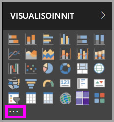
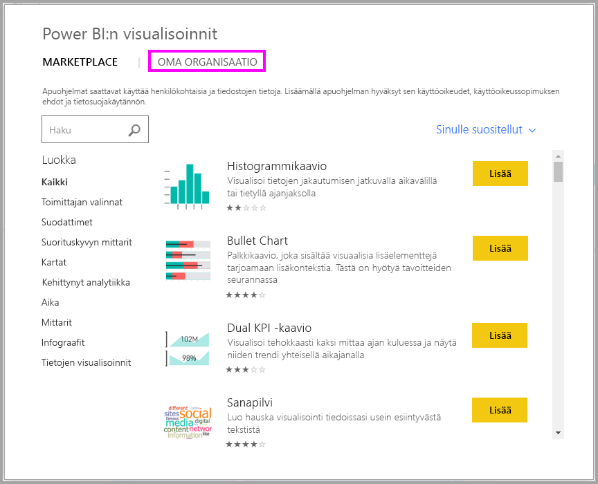

# Mukautetut visualisoinnit Power BI:ssä

Kun luot tai muokkaat Power BI -raporttia, käytettävissäsi on monia eri visualisointityyppejä. Nämä visualisoinnit näkyvät **Visualisoinnit**-ruudussa. Kun lataat [Power BI Desktopin](https://powerbi.microsoft.com/en-us/desktop/) tai avaat [Power BI -palvelun](https://app.powerbi.com), tämä visualisointijoukko tulee valmiina pakettina.

Nämä eivät kuitenkaan ole ainoat käytettävissäsi olevat visualisoinnit: kun valitset kolme pistettä, avautuu toinen raportin visualisointien lähde, *mukautetut visualisoinnit*.

Mukautettuja visualisointeja luovat kehittäjät mukautettujen visualisointien SDK:n avulla, jotta yrityskäyttäjät voivat tarkastella tietojaan yritykselle parhaiten sopivalla tavalla. Raporttien tekijät voivat tuoda mukautettuja visualisointitiedostoja raportteihinsa ja käyttää niitä minkä tahansa muun Power BI -visualisoinnin tapaan. Mukautetut visualisoinnit ovat Power BI:n ykkösluokkaa, ja niitä voidaan suodattaa, korostaa, muokata, jakaa ja niin edelleen.

Mukautetut visualisoinnit voivat olla kolmen käyttöönottokanavan muodossa:

* Mukautetut visualisointitiedostot
* Organisaation visualisoinnit
* Marketplacen visualisoinnit

## Mukautetut visualisointitiedostot

Mukautetut visualisoinnit ovat paketteja, jotka sisältävät koodin niille tarjottujen tietojen hahmontamista varten. Kuka tahansa voi luoda mukautetun visualisoinnin ja pakata sen yksittäiseksi `.pbiviz`-tiedostoksi, joka voidaan tuoda Power BI -raporttiin.

> [!WARNING]
> Mukautettu visualisointi voi sisältää koodia, johon liittyy tietoturva- tai tietosuojariskejä. Varmista, että luotat mukautetun visualisoinnin tekijään ja lähteeseen, ennen kuin tuot sen raporttiisi.

## Organisaation visualisoinnit

Power BI -järjestelmänvalvojat voivat ottaa mukautettuja visualisointeja käyttöön organisaatiossaan, jotta raporttien tekijät voivat helposti löytää ja käyttää mukautettuja visualisointeja, jotka järjestelmänvalvoja on hyväksynyt käytettäväksi organisaation sisällä. Näin järjestelmänvalvoja voi valita tietyt mukautetut visualisoinnit, joita organisaatiossa voidaan käyttää. Myös visualisointien hallinta (version päivitys, käytöstäpoisto/käyttöönotto jne.) on näin helpompaa. Raportin tekijän on helppo löytää visualisointeja, jotka ovat yksilöllisiä organisaatiolle, ja visualisointien päivittämiseen tarjotaan saumaton tuki.

Jos tarvitset lisätietoja organisaation mukautetuista visualisoinneista, [lue lisää organisaation visualisoinneista](power-bi-custom-visuals-organization.md).

## Marketplacen visualisoinnit

Yhteisön jäsenet ja Microsoft ovat antaneet mukautetut visualisointinsa yleiseen käyttöön ja julkaisseet ne [AppSource](https://appsource.microsoft.com/en-us/marketplace/apps?product=power-bi-visuals) Marketplacessa. Näitä visualisointeja voi ladata ja lisätä Power BI -raportteihin. Microsoft on testannut ja hyväksynyt kaikkien mukautettujen visualisointien toiminnan ja laadun.

Mikä [AppSource](developer/office-store.md) on? Se on paikka, josta löydät sovelluksia, apuohjelmia ja laajennuksia Microsoft-ohjelmistollesi. [AppSource](https://appsource.microsoft.com/en-us/) yhdistää miljoonat Office 365:n, Azuren, Dynamics 365:n, Cortanan ja Power BI:n kaltaisten tuotteiden käyttäjät ratkaisuihin, joiden avulla he voivat työskennellä entistä tehokkaammin, älykkäämmin ja tyylikkäämmin.

### Sertifioidut visualisoinnit

Power BI -sertifioidut visualisoinnit ovat Marketplacen visualisointeja, jotka ovat läpäisseet ylimääräisen tiukan laatutestauksen ja joita tuetaan lisätilanteissa, kuten [sähköpostitilauksissa](https://docs.microsoft.com/power-bi/service-report-subscribe) ja [PowerPointiin viennissä](https://docs.microsoft.com/power-bi/service-publish-to-powerpoint).
Jos haluat tarkastella luetteloa sertifioiduista mukautetuista visualisoinneista tai lähettää oman, lue artikkeli [Sertifioidut mukautetut visualisoinnit](https://docs.microsoft.com/power-bi/power-bi-custom-visuals-certified).

Oletko Web-kehittäjä ja kiinnostunut omien visualisointien luomisesta ja niiden lisäämisestä AppSourceen? Katso artikkeli [Power BI:n mukautetun visualisoinnin kehittäminen](developer/custom-visual-develop-tutorial.md) ja lue lisää [mukautettujen visualisointien julkaisemisesta AppSourcessa](https://appsource.microsoft.com/en-us/marketplace/apps?product=power-bi-visuals).

### Mukautetun visualisoinnin tuominen tiedostosta

1. Valitse kolme pistettä Visualisoinnit-ruudun alareunasta.

    

2. Valitse avattavasta valikosta **Tuo tiedostosta**.

    

3. Valitse Avaa tiedosto -valikosta `.pbiviz`-tiedosto, jonka haluat tuoda, ja valitse sitten Avaa. Mukautetun visualisoinnin kuvake lisätään Visualisoinnit-ruudun alaosaan, ja visualisointi on valmis käytettäväksi raportissa.

    

### Organisaation visualisointien tuominen

1. Valitse kolme pistettä Visualisoinnit-ruudun alareunasta.

    

2. Valitse avattavasta valikosta Tuo Marketplacesta.

    

3. Valitse **OMA ORGANISAATIO** yläreunan välilehtivalikosta.

    

4. Etsi tuotava visualisointi selaamalla luetteloa.

    

5. Tuo mukautettu visualisointi valitsemalla **Lisää**. Mukautetun visualisoinnin kuvake lisätään Visualisoinnit-ruudun alaosaan, ja visualisointi on valmis käytettäväksi raportissa.

    

## Mukautettujen visualisointien lataaminen tai tuominen Microsoft AppSourcesta

Sinulla on kaksi vaihtoehtoa mukautettujen visualisointien lataamiseen ja tuomiseen: Power BI ja AppSource-sivusto.

### Mukautettujen visualisointien tuominen Power BI:stä

1. Valitse kolme pistettä Visualisoinnit-ruudun alareunasta.

    

2. Valitse avattavasta valikosta **Tuo Marketplacesta**.

    

3. Etsi tuotava visualisointi selaamalla luetteloa.

    

4. Saat lisätietoja visualisoinnista korostamalla ja valitsemalla sen.

    

5. Tietosivulla voit tarkastella näyttökuvia, videoita, yksityiskohtaista kuvausta ja muita tietoja.

    

6. Näet arvosteluja siirtymällä alareunaan.

    

7. Tuo mukautettu visualisointi valitsemalla Lisää. Mukautetun visualisoinnin kuvake lisätään Visualisoinnit-ruudun alaosaan, ja visualisointi on valmis käytettäväksi raportissa.

    

### Mukautettujen visualisointien lataaminen tai tuominen Microsoft AppSourcesta

1. Aloita [Microsoft AppSourcesta](https://appsource.microsoft.com) ja valitse **Sovellukset**-välilehti.

    

2. Siirry [sovellusten tulossivulle](https://appsource.microsoft.com/en-us/marketplace/apps), jossa voit tarkastella kunkin luokan suosituimpia sovelluksia, mukaan lukien *Power BI -sovelluksia*. Koska nyt haetaan mukautettuja visualisointeja, rajataan tuloksia valitsemalla **Power BI -visualisoinnit** vasemmasta siirtymisluettelosta.

    

3. AppSource näyttää kunkin mukautetun visualisoinnin ruudun.  Jokaisessa ruudussa on tilannevedos mukautetusta visualisoinnista, lyhyt kuvaus ja latauslinkki. Saat lisätietoja valitsemalla ruudun.

    

4. Tietosivulla voit tarkastella näyttökuvia, videoita, yksityiskohtaista kuvausta ja muita tietoja. Lataa mukautettu visualisointi valitsemalla **Hanki se nyt** ja hyväksymällä käyttöehdot.

    

5. Lataa mukautettu visualisointi valitsemalla linkki.

    

    Lataussivu sisältää myös ohjeet mukautetun visualisoinnin tuomiseen Power BI Desktopiin ja Power BI -palveluun.

    Voit myös ladata malliraportin, joka sisältää mukautetun visualisoinnin ja esittelee sen ominaisuuksia.

    

6. Tallenna .pbiviz-tiedosto ja avaa sitten Power BI.

7. Tuo .pbiviz-tiedosto raporttiin (katso osio [Mukautetun visualisoinnin tuominen tiedostosta](#import-a-custom-visuals-from-a-file) edellä)

## Huomioitavat asiat ja rajoitukset

* Mukautettu visualisointi lisätään tiettyyn raporttiin tuotaessa. Jos haluat käyttää visualisointia toisessa raportissa, sinun on tuotava se myös kyseiseen raporttiin. Kun mukautetun visualisoinnin sisältävä raportti tallennetaan käyttämällä **Tallenna nimellä** -vaihtoehtoa, kopio mukautetusta visualisoinnista tallennetaan uuden raportin yhteydessä.

* Jos et näe **Visualisoinnit**-ruutua, sinulla ei ole raportin muokkausoikeuksia.  Voit lisätä mukautettuja visualisointeja vain raportteihin, joita voit muokata, et kanssasi jaettuihin raportteihin.

## Vianmääritys

Lisätietoja vianmäärityksestä on kohdassa [Power BI:n mukautettujen visualisointien vianmääritys](power-bi-custom-visuals-troubleshoot.md).

## Usein kysytyt kysymykset

Saat lisätietoja ja vastauksia kysymyksiisi [Power BI:n mukautettujen visualisointien usein kysytyistä kysymyksistä](power-bi-custom-visuals-faq.md#organizational-custom-visuals).

## Seuraavat vaiheet

* [Visualisoinnit Power BI:ssä](visuals/power-bi-report-visualizations.md)

Onko sinulla kysyttävää? [Kokeile Power BI -yhteisöä](http://community.powerbi.com/).
