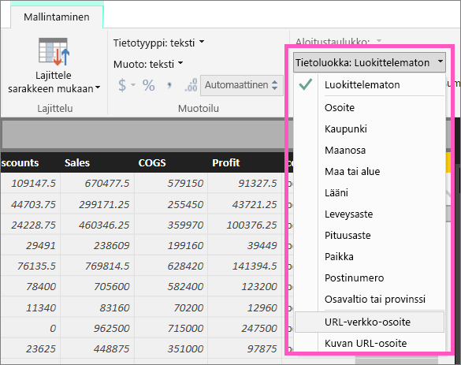
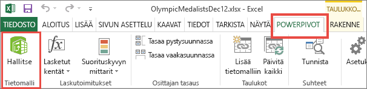
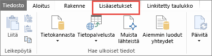
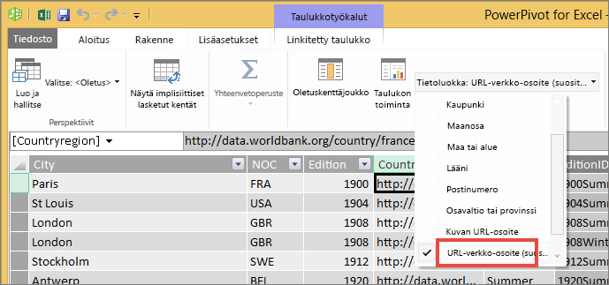

# Hyperlinkkien lisääminen taulukkoon
Tässä aiheessa kurssilla opit käyttämään Power BI Desktopia hyperlinkkien luomiseen. Voit sitten lisätä nämä hyperlinkit raportin taulukoihin ja matriiseihin joko Desktopissa tai Power BI -palvelussa. 

> [!NOTE]
> Voit luoda hyperlinkit [koontinäyttöjen ruutuihin](service-dashboard-edit-tile.md) ja [tekstikenttiin](service-dashboard-add-widget.md) -saman Power BI-palveluun. Voit luoda hyperlinkit [raporttien tekstiruutuihin](service-add-hyperlink-to-text-box.md) -saman käyttämällä Power BI-palvelussa ja Power BI Desktop.
> 

## Hyperlinkin luominen taulukkoon tai matriisiin Power BI Desktopilla
Voit luoda hyperlinkit taulukoihin ja matriiseihin Power BI Desktop, mutta ei Power BI-palvelussa. Voit myös luoda hyperlinkkejä Excelin Power Pivot-, ennen kuin tuot työkirjan Power BI. Menetelmät on kuvailtu alla.

## Hyperlinkin luominen taulukkoon tai matriisiin Power BI Desktopilla
Hyperlinkin lisäämisen menettely riippuu siitä, oletko tuonut tiedot vai yhdistänyt niihin DirectQueryllä. Molemmat keinot on kuvattu alla.

### Power BI:hin tuodut tiedot
1. Jos hyperlinkkiä ei vielä ole tietojoukon kenttänä, lisää se [mukautettuna sarakkeena](desktop-common-query-tasks.md) Desktopissa.
2. Valitse sarake Tiedot-näkymässä ja sitten **Mallinnus**-välilehdeltä avattava **Tietoluokka**-valikko.
   
    
3. Valitse **URL-verkko-osoite**.
4. Siirry Raporttinäkymään ja luo taulukko tai matriisi URL-verkko-osoitteeksi luokiteltuun kenttään. Hyperlinkit näkyvät sinisinä ja alleviivattuina.

    

    > [!NOTE]
    > URL-osoitteiden alussa on oltava **http://, https://** tai **www**.
    >
   
1. Jos et halua taulukossa näkyvän pitkää URL-osoitetta, voit näyttää sen sijaan   hyperlinkkikuvakkeen. Huomaa, matriiseissa ei voi näyttää kuvakkeita.
   
    Valitse kaavio, jotta se on aktiivinen.

    Valitse Muotoilu-kuvake  Muotoilu-välilehden avaamiseksi.

    Laajenna **Arvot**, etsi **URL-osoitekuvake** ja ota se **käyttöön.**

    

1. (Valinnainen) [Julkaise raportti Desktopista Power BI -palveluun](guided-learning/publishingandsharing.yml?tutorial-step=2) ja avaa raportti Power BI -palvelussa. Hyperlinkit toimivat myös siellä.

### DirectQueryyn yhdistetyt tiedot
Et voi luoda uutta saraketta DirectQuery-tilassa.  Jos tiedoissasi kuitenkin on jo URL-osoitteita, voit muuttaa ne hyperlinkeiksi.

1. Luo Raporttinäkymässä taulukko käyttämällä URL-osoitteita sisältävää kenttää.
2. Valitse sarake Tiedot-näkymässä ja sitten **Mallinnus**-välilehdeltä avattava **Tietoluokka**-valikko.
3. Valitse **URL-verkko-osoite**. Hyperlinkit näkyvät sinisinä ja alleviivattuina.
4. (Valinnainen) [Julkaise raportti Desktopista Power BI -palveluun](guided-learning/publishingandsharing.yml?tutorial-step=2) ja avaa raportti Power BI -palvelussa. Hyperlinkit toimivat myös siellä.

## Hyperlinkin luominen taulukkoon tai matriisiin Excel Power Pivotilla
Toinen tapa lisätä hyperlinkkejä Power BI -taulukoihin ja -matriiseihin on luoda hyperlinkit tietojoukkoon ennen kyseisen tietojoukon tuomista Power BI:hin tai siihen liittämistä Power BI:ssä. Tässä esimerkissä käytetään Excel-työkirjaa.

1. Avaa työkirja Excelissä.
2. Valitse **PowerPivot**-välilehti ja valitse sitten **Hallinta**.
   
   
1. Kun PowerPivot avautuu, valitse **Lisäasetukset**-välilehti.
   
   
4. Aseta kohdistin sarakkeeseen, joka sisältää ne URL-osoitteet, jonka haluaisit muuttaa hyperlinkeiksi Power BI -taulukoissa.
   
   > [!NOTE]
   > URL-osoitteiden alussa on oltava **http://, https://** tai **www**.
   > 
5. Valitse **Raportointiominaisuudet**-ryhmästä avattava **Tietoluokka**-valikko ja valitse **URL-verkko-osoite**. 
   
   

6. Muodosta yhteys tähän työkirjaan tai tuo se Power BI -palvelussa tai Power BI Desktopissa.
7. Luo taulukon visualisointi, joka sisältää URL-kentän.
   
   

## Huomioon otettavat seikat ja vianmääritys
Kysymys: Voinko käyttää mukautettua URL-osoitetta taulukon tai matriisin hyperlinkkinä?    
Vastaus: Ei. Voit käyttää linkkikuvaketta. Jos haluat käyttää mukautettua tekstiä hyperlinkkinä ja URL-osoitteiden luettelo on lyhyt, kokeile käyttää tekstiruutua.

## Seuraavat vaiheet
[Visualisoinnit Power BI -raporteissa](visuals/power-bi-report-visualizations.md)

[Power BI:n peruskäsitteet](consumer/end-user-basic-concepts.md)

Onko sinulla muuta kysyttävää? [Kokeile Power BI -yhteisöä](http://community.powerbi.com/)

