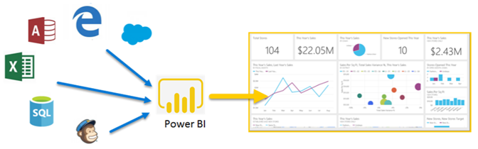
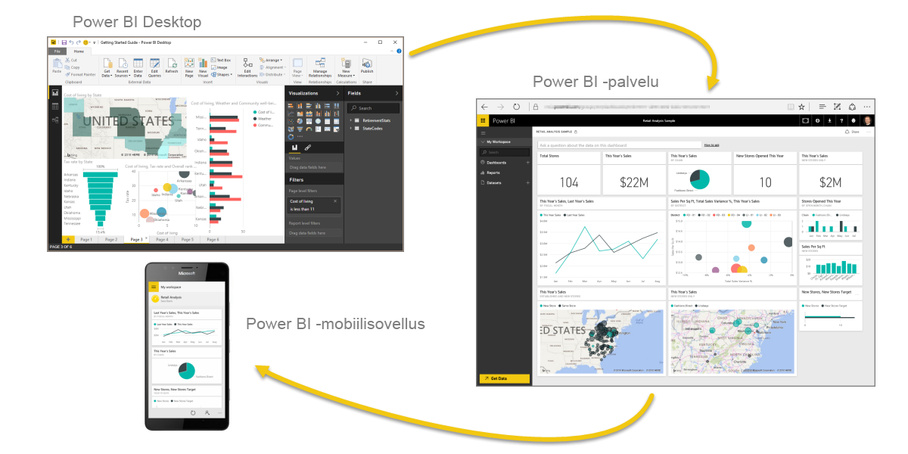
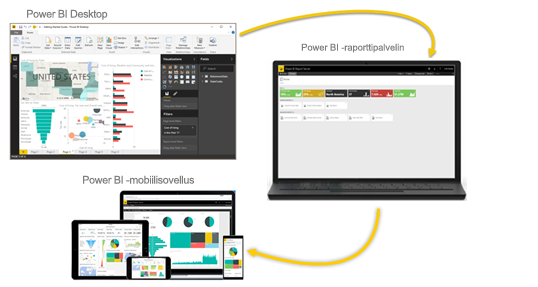

# Mikä Power BI on?
**Power BI** on kokoelma ohjelmistopalveluja, sovelluksia ja yhdistimiä, jotka yhdessä muuntavat toisiinsa liittymättömistä lähteistä peräisin olevan tiedon johdonmukaisiksi, visuaalisesti vaikuttaviksi ja vuorovaikutteisiksi näkemyksiksi. **Power BI:n** avulla voit helposti muodostaa yhteyden tietolähteisiin, jotka voivat olla lähes mitä tahansa yksinkertaisesta Excel-laskentataulukosta kokoelmaan pilvipohjaisia ja paikallisia hybriditietovarastoja. Voit löytää ja visualisoida tärkeät tiedot sekä jakaa tulokset kaikille tarvittaville tahoille.

**Power BI:tä** voi käyttää yksinkertaisesti ja nopeasti, kun on tarve tuottaa merkityksellisiä tietoja Excel-taulukosta tai paikallisesta tietokannasta käden käänteessä. **Power BI** on kuitenkin myös järeä ja monipuolinen suuryritystason työkalu, joka sopii laajamittaiseen mallintamiseen, reaaliaikaiseen analytiikkaan ja mukautettavaan kehittämiseen. Näin ollen se toimii yhtä sujuvasti henkilökohtaisena raportointi- ja visualisointityökaluna kuin analytiikka- ja päätöksentekovälineenä ryhmäprojekteille, yksiköille ja kokonaisille organisaatioille.

## Power BI:n osat
Power BI koostuu **Power BI Desktop** -nimisestä Windows-työpöytäsovelluksesta ja **Power BI -palvelusta**, joka on verkkopohjainen SaaS (*ohjelmisto palveluna*) -tuote. Lisäksi siihen kuuluvat Power BI **-mobiilisovellukset**, jotka ovat saatavilla Windows-puhelimille ja -tableteille sekä iOS- ja Android-laitteille.

Jokainen osista – **työpöytäsovellus**, **verkkopalvelu** ja **mobiilisovellukset** – on suunniteltu siten, että merkityksellisten liiketoimintatietojen tuottaminen, jakaminen ja hyödyntäminen on mahdollisimman tehokasta kunkin käyttäjän tai hänen roolinsa kannalta.

## Power BI:n tuki käyttäjärooleille
Power BI:n käyttämisen tapa voi riippua roolistasi projektissa tai tiimissä. Vastaavasti muissa rooleissa toimivat voivat käyttää sitä omilla tavoillaan.

Saatat itse käyttää ensisijaisesti **Power BI -palvelua**, kun taas runsaasti laskentatehoa vaativia liiketoimintaraportteja tuottava kollegasi luottaa **Power BI Desktopiin** – ja julkaisee Desktop-raportit sitten Power BI -palveluun tarkasteltaviksesi. Toinen kollega myynnin puolelta voi käyttää pääasiassa Power BI -puhelinsovellusta myyntitavoitteidensa seurantaan ja uusien liiditietojen tutkimiseen.

Jos olet sovelluskehittäjä, saatat käyttää Power BI -ohjelmointirajapintoja tietojen viemiseen tietojoukkoihin tai upottaa koontinäyttöjä tai raportteja räätälöityihin sovelluksiisi. Onko sinulla idea uudesta visualisoinnista? Rakenna se itse ja jaa se muiden kanssa.  

Saatat käyttää **Power BI:n** eri osia aina sen mukaan, mitä on tarkoitus saavuttaa tai mikä roolisi on tietyssä projektissa tai tehtävässä.

Voit esimerkiksi tarkastella varastotilannetta tai valmistumisprosessin etenemistä palvelun reaaliaikaisessa koontinäytössä ja käyttää myös **Power BI Desktopia** raporttien luomiseen tiimillesi asiakkaiden osallistamistilastoista. Power BI:n käyttötapa voi perustua siihen, mikä Power BI:n ominaisuus tai palvelu on kulloinkin tilanteeseesi paras työkalu, mutta kaikki sen osat ovat silti aina saatavillasi – joustavasti ja kätevästi.

Rooliasi vastaavien dokumenttien tutkiminen:
- Power BI [***suunnittelijoille***](desktop-what-is-desktop.md)
- Power BI [***kuluttajille***](consumer/end-user-consumer.md)
- Power BI [***kehittäjille***](developer/what-can-you-do.md)
- Power BI [***järjestelmänvalvojille***](service-admin-administering-power-bi-in-your-organization.md)

## Työnkulut Power BI:ssä
Tyypillinen Power BI -työnkulku alkaa yhteyden ottamisesta tietolähteisiin ja raportin luomisesta **Power BI Desktopissa**. Raportti julkaistaan sitten **Desktopista** **Power BI -palveluun** ja jaetaan niin, että **palvelun** ja **mobiilisovelluksen** käyttäjät voivat *kuluttaa* (tarkastella ja käsitellä) raportin.
Joskus saatat haluta antaa työtovereille samat oikeudet kuin sinulla (*tekijän* käyttöoikeudet) niin, että he voivat käyttää **palvelua** raporttien muokkaamiseen, raporttinäkymien luomiseen ja oman työnsä jakamiseen.

Asiat eivät aina etene näin, mutta tämä on yksi yleisempiä työnkulkuja, ja se näyttää miten kolme keskeistä Power BI -osaa täydentävät toisiaan.

Mutta entä jos et ole valmis siirtymään pilvipalveluun, ja haluat säilyttää raporttisi yrityksen palomuurin takana?  Lue lisää.

## Paikallinen raportointi Power BI -raporttipalvelimella
Luo, ota käyttöön ja hallitse Power BI ‑mobiiliraportteja ja sivutettuja raportteja paikallisesti Power BI -raporttipalvelimen tarjoamien erilaisten käyttövalmiiden työkalujen ja palveluiden avulla.

Power BI -raporttipalvelin on ratkaisu, jonka voit ottaa käyttöön oman palomuurisi sisällä ja toimittaa sitten raporttisi halutuille käyttäjille eri tavoilla, halusivat he sitten katsella niitä verkkoselaimella, mobiililaitteella tai sähköpostiviestinä. Ja koska Power BI -raporttipalvelin on yhteensopiva Power BI:n kanssa pilvipalvelussa, voit siirtyä pilvipalveluun, kun olet valmis.

## Seuraavat vaiheet
[Kirjaudu sisään, hae tietoja ja opettele käyttämään Power BI -palvelua](service-the-new-power-bi-experience.md)   
[Opetusohjelma: Power BI -palvelun käytön aloittaminen](service-get-started.md)
