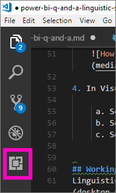
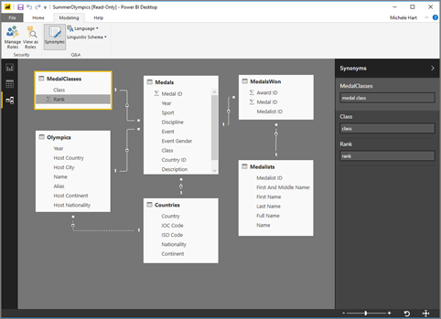
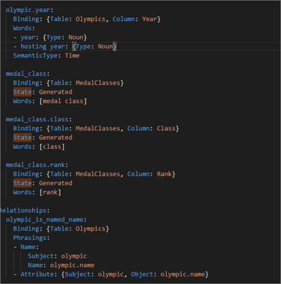
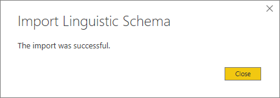

# <a name="edit-qa-linguistic-schema-and-add-phrasings-in-power-bi-desktop"></a>Q&A:n lingvistisen rakenteen muokkaaminen ja muotoilujen lisääminen Power BI Desktopissa 
Yleisien lauseiden ja luonnollisen kielen käyttäminen tiedoista esitettävissä kysymyksissä on tehokasta. Vielä tehokkaampaa on, kun tiedot vastaavat, minkä Power BI:n Q&A-toiminto mahdollistaa. Kun esität Power BI Q&A:lle kysymyksen, se pyrkii parhaansa mukaan vastaamaan oikein. 

Mutta jotta Q&A:n vuorovaikutukset olisivat vieläkin parempia, vastauksia voidaan parantaa eri tavoin – yksi tapa on lingvistisen rakenteen muokkaaminen. 

Kaikki alkaa yrityksesi tiedoista.  Mitä parempi tietomalli on, sitä helpompi käyttäjien on saada laadukkaita vastauksia. Yksi tapa parantaa mallia on lisätä lingvistinen rakenne, joka määrittelee ja luokittelee terminologian ja taulukoiden ja sarakkeiden nimien välisen suhteen tietojoukossasi. Lingvistisiä rakenteita hallitaan Power BI Desktopissa. 

## <a name="what-is-a-linguistic-schema"></a>Mikä lingvistinen rakenne on?
Lingvistinen rakenne kuvaa termit ja lauseet, jotka Q&A:n tulee ymmärtää tietojoukon kohteista, mukaan lukien sanaluokat, synonyymit ja muotoilut, jotka liittyvät kyseiseen tietojoukkoon. Kun tuot tietojoukon tai yhdistät siihen, Power BI luo lingvistisen rakenteen tietojoukon rakenteen perusteella. Kun esität Q&A:lle kysymyksen, se etsii vastineita ja suhteita tiedoista kysymyksesi tarkoituksen selvittämiseksi. Se etsii esimerkiksi substantiiveja, verbejä, adjektiiveja, muotoiluja ja muita osia. Se etsii myös suhteita, kuten sitä, mitkä sarakkeet ovat verbin objekteja. 

Todennäköisesti tunnet sanaluokat (jos et, katso alla), mutta muotoilu saattaa olla uusi termi sinulle.  Muotoilu tarkoittaa sitä, miten puhut asioiden välisistä suhteista (tai ilmaiset niitä). Voisit esimerkiksi kuvata asiakkaiden ja tuotteiden välistä suhdetta sanomalla ”asiakkaat ostavat tuotteita”. Asiakkaiden ja iän välistä suhdetta saattaisit kuvata sanomalla ”ikä osoittaa, miten vanhoja asiakkaat ovat”. Asiakkaiden ja puhelinnumeroiden välistä suhdetta voisit kuvata sanomalla ”asiakkailla on puhelinnumerot”.

Nämä muotoilut ovat muodoltaan ja kooltaan erilaisia. Jotkin vastaavat suoraan tietomallin suhteita. Jotkin liittävät sarakkeet niiden sisältämiin taulukoihin. Osa liittää useita taulukoita ja sarakkeita yhteen monimutkaisina suhteina. Kaikissa tapauksissa ne kuvaavat tavallisilla termeillä, miten asiat liittyvät toisiinsa.

Lingvistiset rakenteet tallennetaan YAML-muodossa. Muoto liittyy suosittuun JSON-muotoon, mutta tarjoaa joustavamman ja helpommin luettavan syntaksin. Lingvistisiä rakenteita voidaan muokata, viedä ja tuoda Power BI Desktopiin.

## <a name="prerequisites"></a>Edellytykset
- Jos et ole vielä lukenut artikkelia [Q&A:n tietomallin parantamisesta](desktop-qna-in-reports.md), sinun kannattaa lukea se ensin. Se sisältää lukuisia vinkkejä tietomallin suunnitteluun ja parantamiseen ja tärkeän osion synonyymien lisäämisestä.  

- Q&A:ssa on kaksi puolta.  Ensimmäinen puoli on valmistelu tai ”mallinnus”.  Toinen puoli on kysymysten esittäminen ja tietojen tutkiminen tai ”käyttö”. Joissakin yrityksissä tietomallintajiksi tai IT-järjestelmänvalvojiksi kutsutut työntekijät saattavat koota ja luoda tietojoukkoja ja julkaista niitä Power BI:ssä.  Toiset työntekijät taas voivat ”käyttää” tietoja verkossa.  Muissa yrityksissä nämä roolit on voitu yhdistää. 

    Tämä ohjeaihe on tarkoitettu tietomallintajille. He optimoivat tietojoukon parhaiden mahdollisten Q&A:n tulosten tarjoamiseksi. 

- [.yaml- ja .pbix-mallitiedostot](https://go.microsoft.com/fwlink/?linkid=871858)    
- YAML-tiedostoeditoriksi suositellaan [Visual Studio Codea](https://code.visualstudio.com/)


### <a name="set-up-an-editor-for-yaml-files"></a>YAML-tiedostojen editorin määrittäminen
YAML-tiedostojen lingvistisen rakenteen muokkaamisessa suositellaan käyttämään Visual Studio Codea. Visual Studio Code sisältää valmiin YAML-tiedostojen tuen, ja se voidaan laajentaa vahvistamaan erityisesti Power BI:n lingvistisen rakenteen muoto.
1. Asenna [Visual Studio Code](https://code.visualstudio.com/).    

2. Valitse aiemmin tallentamasi lingvistinen esimerkkimalli: [YAML-tiedosto](https://go.microsoft.com/fwlink/?linkid=871858) (SummerOlympics.lsdl.yaml).    
4. Valitse **Visual Studio Code** ja **Käytä aina tätä sovellusta .yaml-tiedostojen avaamiseen**.

    

4. Asenna Red Hat -laajennuksen YAML-tuki Visual Studio Codessa.    
    a. Valitse **Laajennukset**-välilehti (viimeisenä vasemmalla) tai CTRL + VAIHTO + X.    
        
    b. Tee haku ”yaml” ja valitse **Red Hatin YAML-tuki** luettelosta.    
    c. Valitse **Asenna > Lataa uudelleen**.


## <a name="working-with-linguistic-schemas"></a>Lingvististen rakenteiden käsitteleminen
Lingvistisiä rakenteita voidaan muokata, tuoda ja viedä Power BI Desktopin [suhdenäkymässä](desktop-relationship-view.md). Yksi tapa muokata lingvististä rakennetta on [synonyymien lisääminen **Synonyymit**-ruutuun](desktop-qna-in-reports.md). Sinun ei tarvitse avata YAML-tiedostoa.




 Toinen tapa muokata lingvististä rakennetta on viedä YAML-tiedosto ja muokata sitä suoraan.  Kun muokkaat lingvistisen rakenteen YAML-tiedostoa, merkitset taulukon sarakkeet eri kieliopillisiksi elementeiksi ja määrität sanoja, joita työtoveri saattaisi käyttää kysymyksen muodostamiseen. Merkitset esimerkiksi sarakkeet, jotka ovat verbin subjekti ja objekti. Lisäät vaihtoehtoisia sanoja, joilla työtoverit voivat viitata taulukoihin, sarakkeisiin ja mittareihin mallissasi. 


Ennen kuin voit muokata lingvististä rakennetta, sinun on avattava (vietävä) se Power BI Desktopista. Kun tallennat YAML-tiedoston takaisin samaan sijaintiin, kyseessä on tuonti.  Voit kuitenkin tuoda myös muita YAML-tiedostoja.  Jos sinulla esimerkiksi on samankaltainen tietojoukko ja olet tehnyt jo suuren työn lisäämällä sanaluokkia, tunnistamalla suhteita sekä luomalla muotoiluja ja synonyymejä. 

Q&A käyttää kaikkia näitä tietoja yhdessä mahdollisten tekemiesi parannusten kanssa parempien vastausten, automaattisen täydennyksen ja kysymysten yhteenvedon tarjoamiseksi.


## <a name="edit-a-linguistic-schema"></a>Lingvistisen rakenteen muokkaaminen
Kun viet lingvistisen rakenteen ensin Power BI Desktopista, Q&A-moduuli luo automaattisesti tiedoston koko sisällön tai suurimman osan siitä. Näin luodut entiteetit, sanat (synonyymit), suhteet ja muotoilut merkitään tunnisteella **Tila: luotu**, ja ne lisätään tiedostoon pääasiassa tiedoksi, mutta ne voivat olla hyödyllinen lähtökohta omille muutoksillesi. 

> [!NOTE]
> Tähän opetusohjelmaan sisältyvä YAML-mallitiedosto ei sisällä tunnisteita **Tila: luotu** tai **Tila: poistettu**, koska se valmisteltu erityisesti tätä opetusohjelmaa varten. Jos haluat nähdä nämä tunnisteet, avaa muokkaamaton .pbix-tiedoston Suhde-näkymässä ja vie lingvistinen rakenne.




Kun tuot lingvistisen rakenteen tiedoston takaisin Power BI Desktopiin, kaikki tunnisteella **Tila: luotu** merkitty ohitetaan (ja luodaan myöhemmin uudelleen), joten jos haluat tehdä muutoksia johonkin luotuun sisältöön, muista poistaa myös vastaava **Tila: luotu** -tunniste. Vastaavasti jos haluat poistaa luotua sisältöä, sinun on muutettava tunniste **Tila: luotu** tunnisteeksi **Tila: poistettu**, jotta sitä ei luoda uudelleen, kun tuot lingvistisen rakenteen tiedoston.

1. Avaa tietojoukko Power BI Desktopin *Suhde-näkymässä*. 
2. Valitse **Mallinnus**-välilehti ja valitse **Vie lingvistinen rakenne**.
3. Valitse Visual Code (tai muu editori).
4. Tee haluamasi muutokset ja tallenna YAML-tiedosto.
5. Valitse Power BI Desktopissa **Suhde-näkymä > Mallinnus-välilehti > Lingvistinen rakenne > Tuo lingvistinen rakenne**.
6. Siirry sijaintiin, johon tallensit muokatun YAML-tiedoston ja valitse se. Ilmoitus onnistumisesta kertoo, että lingvistisen rakenteen YAML-tiedosto on tuotu.

    

### <a name="add-phrasings-to-the-linguistic-schema"></a>Muotoilujen lisääminen lingvistiseen rakenteeseen
Muotoilu tarkoittaa sitä, miten puhut asioiden välisistä suhteista (tai ilmaiset niitä). Voisit esimerkiksi kuvata asiakkaiden ja tuotteiden välistä suhdetta sanomalla ”asiakkaat ostavat tuotteita”. Asiakkaiden ja iän välistä suhdetta saattaisit kuvata sanomalla ”ikä osoittaa, miten vanhoja asiakkaat ovat”. Urheilijoiden ja mitaleiden välistä suhdetta voisit kuvata sanomalla ”urheilijat voittavat mitaleja”.

Nämä muotoilut ovat muodoltaan ja kooltaan erilaisia. Jotkin vastaavat suoraan semanttisen mallin suhteita. Jotkin liittävät sarakkeet niiden sisältämiin taulukoihin. Osa liittää useita taulukoita ja sarakkeita yhteen monimutkaisina suhteina. Kaikissa tapauksissa ne kuvaavat tavallisilla termeillä, miten asiat liittyvät toisiinsa.

## <a name="where-do-phrasings-come-from"></a>Mistä muotoilut ovat peräisin?
Power BI lisää monia yksinkertaisia muotoiluja lingvistiseen rakenteeseen automaattisesti mallin rakenteen ja sarakkeiden nimiin perustuvien arvausten perusteella. Esimerkki:
- Useimmat sarakkeet liittyvät niiden sisältämään taulukkoon yksinkertaisella muotoilulla, kuten ”tuotteilla on kuvaukset”.
- Mallisuhteet tuottavat oletusmuotoiluja suhteen kumpaankin suuntaan, esimerkiksi ”tuotteita on tilauksessa” ja ”tilauksessa on tuotteita”.
- Jotkin mallisuhteet voivat sarakkeiden nimien perusteella tuottaa monimutkaisempia oletusmuotoiluja, kuten ”tilauksia toimitetaan kaupunkeihin”.

Käyttäjät voivat kuitenkin puhua asioista monilla eri tavoilla, joita Q&A ei voi arvata. Tällaisten muotoilujen kohdalla sinun kannattaa lisätä omia muotoiluja manuaalisesti.


## <a name="why-should-i-add-phrasings"></a>Miksi kannattaa lisätä muotoiluja?
Ensimmäinen syy muotoilun lisäämiseen on uuden termin määritteleminen. Esimerkiksi jos haluat pystyä pyytämään ”luetteloi vanhimmat asiakkaat”, sinun on ensin opetettava Q&A:lle, mitä ”vanha” tarkoittaa. Voit tehdä niin lisäämällä esimerkiksi muotoilun ”ikä osoittaa, miten vanhoja asiakkaat ovat”.

Toinen syy muotoilun lisäämiseen on moniselitteisyyden selvittäminen. Perusavainsanahaku toimii vain tiettyyn rajaan asti, kun sanoilla on useampi kuin yksi merkitys. Esimerkiksi ”lennot Chicagoon” ei ole sama kuin ”lennot Chicagosta”. Mutta Q&A ei tiedä, kumpaa tarkoitat, ellet lisää muotoiluja ”lennot ovat lähtökaupungeista” ja ”lennot ovat tulokaupunkeihin”. Vastaavasti Q&A ymmärtää lauseiden ”autot, jotka Jaakko möi Marjalle” ja ”autot, jotka Jaakko osti Marjalta” välisen eron vasta sitten, kun lisäät muotoilut ”asiakkaat ostavat autoja työntekijöiltä” ja ”työntekijät myyvät asiakkaille autoja”.

Viimeinen syy muotoilujen lisäämiseen on uudelleenmuotoilujen parantaminen. Sen sijaan, että Q&A vastaa sinulle ”Näytä asiakkaat ja heidän tuotteensa”, olisi selkeämpää, jos se sanoisi ”Näytä asiakkaat ja heidän ostamansa tuotteet” tai ”Näytä asiakkaat ja heidän tarkastelemansa tuotteet” sen mukaan, miten se ymmärsi kysymyksen. Mukautettujen muotoilujen lisääminen mahdollistaa tarkemmat ja yksiselitteisemmät uudelleenmuotoilut.


## <a name="what-kinds-of-phrasings-are-there"></a>Millaisia muotoiluja on olemassa?
Jotta voidaan ymmärtää eri muotoilutyyppejä, on ensin muistettava pari perustavanlaatuista kielioppitermiä:
- *Substantiivi* on henkilö, paikka tai asia. 
    - Esimerkkejä: auto, teini-ikäinen, Marty, vuokondensaattori
- *Verbi* ilmaisee toimintaa tai olemista. 
    - Esimerkkejä: kuoriutua, haljeta, ahmia, heittää ulos
- *Adjektiivi* on kuvaileva sana, joka määrittää substantiivia. 
    - Esimerkkejä: tehokas, maaginen, kultainen, varastettu
- *Prepositio* on ennen substantiivia käytettävä sana, joka liittää sen edelliseen substantiiviin, verbiin tai adjektiiviin 
    - Esimerkkejä: lähellä, ilman, yli
-  *Määrite* on jonkin ominaispiirre tai ominaisuus.
-  *Nimi* on sana tai joukko sanoja, jolla henkilö, eläin, paikka tai asia tunnetaan tai johon sillä viitataan.   


## <a name="attribute-phrasings"></a>Määritemuotoilut
Määritemuotoilut ovat Q&A:n työkalu, jota käytetään, kun jokin asia toimii määritteenä toiselle asialle. Ne ovat yksinkertaisia, suoraviivaisia ja tekevät suurimman osan työstä, kun tarkempaa ja yksityiskohtaisempaa muotoilua ei ole määritetty. Määritemuotoiluja kuvataan käyttämällä perusverbiä ”olla” (”tuotteilla on luokat” ja ”isäntämaissa on isäntäkaupungit”). Ne myös mahdollistavat automaattisesti myös kysymysten esittämisen käyttämällä genetiivimuotoa (”tuotteiden luokat”, ”tuotteiden tilaukset”, ”Jaakon tilaukset”). Määritemuotoiluja käytetään esimerkiksi seuraavanlaisissa kysymyksissä:
- Millä asiakkailla on tilauksia?
- Luettele isäntäkaupungit maan mukaan nousevassa järjestyksessä
- Näytä tilaukset, jotka sisältävät chaita
- Luetteloi asiakkaat, joilla on tilauksia
- Mikä on kunkin tuotteen luokka?
- Laske Robert Kingin tilaukset    

Power BI luo valtaosan mallissasi tarvittavista määritemuotoiluista taulukon tai sarakkeen sisällön ja mallin suhteiden perusteella. Sinun ei yleensä tarvitse luoda niitä itse.
Tässä on esimerkki siitä, miltä määritemuotoilu näyttää lingvistisen rakenteen sisällä:

```json
product_has_category:
  Binding: {Table: Products}
  Phrasings:
  - Attribute: {Subject: product, Object: product.category}
```
 
## <a name="name-phrasings"></a>Nimimuotoilut
Nimimuotoilut ovat hyödyllisiä, jos tietomallissasi on nimettyjä kohteita, kuten urheilijoiden ja asiakkaiden nimiä, sisältävä taulukko. Esimerkiksi muotoilu ”tuotenimet ovat tuotteiden nimiä” on välttämätön, jotta tuotenimiä voidaan käyttää kysymyksissä. Nimimuotoilu mahdollistaa myös muodon ”nimeltä” käytön verbinä (esim. ”Luetteloi asiakkaat nimeltä Hannes Niemi”). Mutta se on tärkeimmillään silloin, kun sitä käytetään yhdessä muiden muotoilujen kanssa siten, että nimiarvolla voidaan viitata tietyn taulukon riviin. Esimerkiksi muotoilussa ”Asiakkaat, jotka ostivat chaita” Q&A voi kertoa, että arvo ”chai” viittaa tuotetaulukon koko riviin eikä pelkästään tuotenimisarakkeen arvoon. Nimimuotoiluja käytetään esimerkiksi seuraavanlaisissa kysymyksissä:    
- Ketkä työntekijät ovat nimeltään Robert King
- Kuka on nimeltään Ernst Handel
- Fernand De Montignyn urheilu
- Urheilijoiden nimeltä Marja määrä
- Mitä Robert King osti?

Kun muistat käyttää ymmärrettävää nimeämiskäytäntöä mallisi sarakkeiden nimissä (esim. ”Nimi” tai ”Tuotenimi” eikä ”Ttnm”), Power BI luo suurimman osan mallissasi tarvittavista nimimuotoiluista automaattisesti, joten sinun ei yleensä tarvitse luoda niitä itse.

Tässä on esimerkki siitä, miltä nimimuotoilu näyttää lingvistisen rakenteen sisällä:

```json
employee_has_name:
  Binding: {Table: Employees}
  Phrasings:
  - Name:
      Subject: employee
      Name: employee.name
```

 
## <a name="adjective-phrasings"></a>Adjektiivimuotoilut
Adjektiivimuotoilut määrittävät uudet adjektiivit, joita käytetään kuvaamaan asioita mallissasi. Esimerkiksi muotoilua ”tyytyväiset asiakkaat ovat asiakkaita, joissa luokitus > 6” tarvitaan, jotta voidaan esittää kysymyksiä, kuten ”luetteloi tyytyväiset asiakkaat Des Moinesissa”. Adjektiivimuotoiluja on useita erilaisia eri tilanteissa käytettäväksi.

*Yksinkertaiset adjektiivimuotoilut* määrittävät uuden adjektiivin ehdon perusteella, esimerkiksi ”poistettuja tuotteita ovat tuotteet, joissa tila = D”. Yksinkertaisia adjektiivimuotoiluja käytetään esimerkiksi seuraavanlaisissa kysymyksissä:
- Mitkä tuotteet on poistettu?
- Luetteloi poistetut tuotteet
- Luetteloi kultamitalistit
- Tuotteet, jotka jälkitoimitetaan

Tässä on esimerkki siitä, miltä yksinkertainen adjektiivimuotoilu näyttää lingvistisen rakenteen tuote_on_poistettu sisällä:

```json
Binding: {Table: Products}
  Conditions:
  - Target: product.discontinued
    Operator: Equals
    Value: true
  Phrasings:
  - Adjective:
      Subject: product
      Adjectives: [discontinued]
```

*Mittarin adjektiivimuotoilut* määrittävät uuden adjektiivin numeerisen arvon perusteella, joka osoittaa alan, jota adjektiivi koskee, kuten ”pituudet ilmaisevat, kuinka pitkiä joet ovat” ja ”pienillä mailla on pienet maa-alueet”. Mittarin adjektiivimuotoiluja käytetään esimerkiksi seuraavanlaisissa kysymyksissä:
- Luetteloi pitkät joet
- Mitkä joet ovat pisimmät?
- Luetteloi pienimmät maat, jotka ovat voittaneet kultaa koripallossa
- Kuinka pitkä on Rio Grande?

Tässä on esimerkki siitä, miltä mittarin adjektiivimuotoilu näyttää lingvistisen rakenteen joella_on_pituus sisällä:

 ```json
Binding: {Table: Rivers}
  Phrasings:
  - Adjective:
      Subject: river
      Adjectives: [long]
      Antonyms: [short]
      Measurement: river.length
```

*Dynaamiset adjektiivimuotoilut* määrittävät joukon uusia adjektiiveja malliin sarakkeen arvojen perusteella, esimerkiksi ”värit kuvaavat tuotteita” ja ”urheilulajeilla on sukupuoli”. Dynaamisia adjektiivimuotoiluja käytetään esimerkiksi seuraavanlaisissa kysymyksissä:
- Luetteloi punaiset tuotteet
- Mitkä tuotteet ovat vihreitä?
- Näytä naisten luistelulajit
- Laske aktiiviset ongelmat

Tässä on esimerkki siitä, miltä dynaaminen adjektiivimuotoilu näyttää lingvistisen rakenteen tuotteella_on_väri sisällä:
```json
Binding: {Table: Products}
  Phrasings:
  - DynamicAdjective:
      Subject: product
      Adjective: product.color
```

 
## <a name="noun-phrasings"></a>Substantiivimuotoilut
Substantiivimuotoilut määrittävät uusia substantiiveja, jotka kuvaavat asioiden alijoukkoja mallissasi. Ne sisältävät usein jonkin mallikohtaisen mittarin tai ehdon. Esimerkiksi Olympialaiset-malliin voitaisiin lisätä muotoiluja, jotka erottavat mestarit mitalisteista, palloilulajit vesiurheilulajeista, joukkueet yksilöistä, urheilijoiden ikäluokat (teinit, aikuiset, seniorit) jne. Elokuvatietokantaan voitaisiin lisätä substantiivimuotoiluja muotoilulle ”flopit ovat elokuvia, joissa nettotuotto < 0”, jotta voidaan esittää kysymyksiä, kuten ”laske flopit vuoden mukaan”. Substantiivimuotoiluja on kaksi eri tilanteissa käytettäväksi.

*Yksinkertaiset substantiivimuotoilut* määrittävät uuden substantiivin ehdon perusteella, esimerkiksi ”alihankkijat ovat työntekijöitä, joissa täysi aika = epätosi” ja ”mestari on urheilija, jossa mitalien lukumäärä > 5”. Yksinkertaisia substantiivimuotoiluja käytetään esimerkiksi seuraavanlaisissa kysymyksissä:

- Ketkä työntekijät ovat alihankkijoita?
- Laske alihankkijat Portlandissa
- Kuinka monta mestaria vuonna 2016

Tässä on esimerkki siitä, miltä yksinkertainen substantiivimuotoilu näyttää lingvistisen rakenteen työntekijä_on_alihankkija sisällä:

```json
Binding: {Table: Employees}
  Conditions:
  - Target: employee.full_time
    Operator: Equals
    Value: false
  Phrasings:
  - Noun:
      Subject: employee
      Nouns: [contractor]
```

*Dynaamiset substantiivimuotoilut* määrittävät joukon uusia substantiiveja mallin sarakkeen arvojen perusteella, esimerkiksi ”työt määrittävät työntekijöiden alijoukot”. Dynaamisia substantiivimuotoiluja käytetään esimerkiksi seuraavanlaisissa kysymyksissä:

- Luetteloi kassat Chicagossa
- Ketkä työntekijät ovat baristoja?
- Luetteloi tuomarit vuonna 1992

Tässä on esimerkki siitä, miltä dynaaminen substantiivimuotoilu näyttää lingvistisen rakenteen työntekijällä_on_työ sisällä:

 ```json
Binding: {Table: Employees}
  Phrasings:
  - DynamicNoun:
      Subject: employee
      Noun: employee.job
```

## <a name="preposition-phrasings"></a>Prepositiomuotoilut
Prepositiomuotoiluja käytetään kuvaamaan sitä, kuinka asiat liittyvät toisiinsa prepositioilla mallissasi. Esimerkiksi muotoilu ”kaupungit ovat maissa” parantaa kysymyksen ”laske kaupungit Washingtonissa” kaltaisten kysymysten ymmärtämistä. Jotkin prepositiomuotoilut luodaan automaattisesti, kun sarake tunnistetaan maantieteelliseksi entiteetiksi. Prepositiomuotoiluja käytetään esimerkiksi seuraavanlaisissa kysymyksissä:

- Laske asiakkaat New Yorkissa
- Luetteloi kirjat kielitieteestä
- Missä kaupungissa John Galt on?
- Kuinka monta kirjaa Stephen Pinker on kirjoittanut?
 
Tässä on esimerkki siitä, miltä prepositiomuotoilu näyttää lingvistisen rakenteen asiakkaat_ovat_kaupungeissa sisällä:

 ```json
Binding: {Table: Customers}
  Phrasings:
  - Preposition:
      Subject: customer
      Prepositions: [in]
      Object: customer.city
```

 
## <a name="verb-phrasings"></a>Verbimuotoilut
Verbimuotoiluja käytetään kuvaamaan sitä, kuinka asiat liittyvät toisiinsa verbeillä mallissasi. Esimerkiksi muotoilu ”asiakkaat ostavat tuotteita” parantaa kysymyksen ”kuka osti juustoa?” ja ”mitä Jaakko osti?” kaltaisten kysymysten ymmärtämistä. Verbimuotoilut ovat kaikkein joustavimpia muotoilutyyppejä, ja ne liittävät usein enemmän kuin kaksi asiaa toisiinsa, esimerkiksi ”työntekijät myyvät asiakkaiden tuotteita”. Verbimuotoiluja käytetään esimerkiksi seuraavanlaisissa kysymyksissä:

- Kuka möi mitä kenelle?
- Kuka työntekijä möi chaita Jaakolle?
- Kuinka monelle asiakkaalle Marja möi chaita?
- Luetteloi tuotteet, jotka Marja möi Jaakolle.
- Mitä poistettuja tuotteita Bostonin työntekijät möivät Chicagon asiakkaille?

Verbimuotoilut voivat sisältää myös prepositiolausekkeita, jotka lisäävät niiden joustavuutta, kuten ”urheilijat voittavat mitaleita kilpailuissa” tai ”asiakkaat saavat hyvityksiä tuotteista”. Verbimuotoiluja ja prepositiolausekkeita käytetään esimerkiksi seuraavanlaisissa kysymyksissä:

- Kuinka moni urheilija voitti kultamitalin Visa Championships -kilpailuissa?
- Ketkä asiakkaat saivat hyvityksen juustosta?
- Missä kilpailussa Danell Leyva voitti pronssimitalin?

Jotkin verbimuotoilut luodaan automaattisesti, kun sarakkeen tunnistetaan sisältävän sekä verbin että preposition.

Tässä on esimerkki siitä, miltä verbimuotoilu näyttää lingvistisen rakenteen asiakkaat_ostavat_tuotteita_myyjiltä sisällä:

```json
Binding: {Table: Orders}
  Phrasings:
  - Verb:
      Subject: customer
      Verbs: [buy, purchase]
      Object: product
      PrepositionalPhrases:
      - Prepositions: [from]
        Object: salesperson
```

## <a name="relationships-with-multiple-phrasings"></a>Suhteiden esittäminen useilla muotoiluilla
Usein yksi suhde voidaan kuvata useammalla kuin yhdellä tavalla. Tässä tapauksessa yhdellä suhteella voi olla useampi kuin yksi muotoilu. On tavallista, että taulukon entiteetin ja sarakkeen entiteetin välinen suhde esitetään sekä määritemuotoilulla että toisella muotoilulla. Esimerkiksi asiakkaan ja asiakkaan nimen välisessä suhteessa kannattaa käyttää sekä määritemuotoilua (esimerkiksi ”asiakkailla on nimet”) että nimimuotoilua (esimerkiksi ”asiakasnimet ovat asiakkaiden nimiä”), jotta voidaan esittää kummankin tyyppisiä kysymyksiä.

Tässä on esimerkki siitä, miltä kahden muotoilun avulla esitetty suhde näyttää lingvistisen rakenteen asiakkaalla_on_nimi sisällä:

  ```json
Binding: {Table: Customers}
  Phrasings:
    - Attribute: {Subject: customer, Object: customer.name}
    - Name:
        Subject: customer
        Object: customer.name
```

Toinen esimerkki olisi vaihtoehtoisen muotoilun ”työntekijät myyvät asiakkaille tuotteita” lisääminen suhteeseen ”asiakkaat ostavat tuotteita työntekijöiltä”. Huomaa, että sinun ei tarvitse lisätä muunnelmia, kuten ”työntekijät myyvät tuotteita **asiakkaille**” tai ”tuotteita myydään asiakkaille **työntekijöiden toimesta**”, koska Q&A johtaa automaattisesti subjektin ja epäsuoran objektin muunnelmat.

## <a name="considerations-and-troubleshooting"></a>Huomioon otettavat seikat ja vianmääritys
Jos teet .lsdl.yaml-tiedostoon muutoksen, joka ei vastaa lingvistisen rakenteen muotoa, vahvistusmerkit ilmoittavat ongelmista: 


Onko sinulla kysyttävää? [Kokeile Power BI -yhteisöä](http://community.powerbi.com/)
