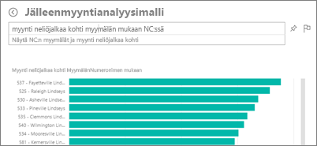
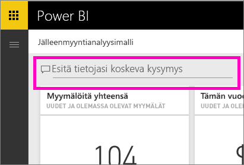

# Q&A Power BI -palvelussa ja Power BI Desktopissa
## Mikä on Q&A?
Joskus nopein tapa saada vastauksia tiedoista on kysyä kysymyksiä luonnollisella kielellä. Esimerkiksi ”mikä oli viime vuoden kokonaismyynti”.  Q&A-toiminnolla voit tutkia tietojasi intuitiivisesti luonnollisella kielellä sekä saada vastauksia eri kaavioiden muodossa. Q&A eroaa hakukoneesta – Q&A antaa vain tuloksia Power BI:n tiedoista.

Tämä artikkeli on hyvä aloituskohta Q&A-toiminnon käyttöön. Valitse linkki alta ja lue lisää Q&A-toiminnon käytöstä Power BI -palvelussa (koontinäytöt ja raportit), Power BI Desktopissa (raportit), Power BI Embeddedissä ja Power BI -mobiilisovelluksessa.  

Kysymyksen esittäminen on vasta alkua.  Toivottavasti tämä artikkeli auttaa sinua tietojen tutkimisessa ja kysymysten keksimisessä. Kysymyksillä voit löytää uusia tietoja, keskittyä yksityiskohtiin ja tarkastella kokonaisuutta laajemmasta näkökulmasta. Tulet yllättymään iloisesti löytämistäsi merkityksellisistä tiedoista ja muusta.

Kokemus on todella interaktiivinen … ja nopea! Muistissa oleva tallennustila tarjoaa vastauksen lähes välittömästi.

##  Q&A *kuluttajille*
Kun työtoverisi jakaa koontinäytön kanssasi, löydät Q&A-kysymysruudun koontinäytössä Power BI-palvelussa (app.powerbi.com), koontinäytön alareunassa Power BI -mobiilisovelluksessa ja visualisoinnin yläpuolella Power BI Embeddedissä. Jos omistaja ei ole antanut sinulle muokkausoikeuksia, pystyt ainoastaan tutkimaan tietoja Q&A-toiminnon avulla, mutta et voi tallentaa sen avulla luotuja visualisointeja.

## Q&A *luojille*
Jos olet Power BI -raporttien *luoja* tai sinulla on tietojoukon muokkausoikeudet, löydät Q&A-kysymysruudun koontinäytössä Power BI -palvelussa sekä raportin jokaisella sivulla Power BI -palvelussa ja Power BI Desktopissa. Kaikki Q&A-toiminnolla luodut visualisoinnit voidaan tallentaa koontinäyttöön ja raporttiin.

Tietojen tutkimisen lisäksi luojat ja tietojoukon omistajat voivat toiminnon avulla parantaa kuluttajien käyttökokemusta [muokkaamalla tietojoukkoja](service-prepare-data-for-q-and-a.md), lisäämällä [suositeltuja kysymyksiä](service-q-and-a-create-featured-questions.md) sekä [ottamalla Q&A:n käyttöön ja poistamalla sen käytöstä](service-q-and-a-direct-query.md) paikallisissa reaaliaikaisen yhteyden tietojoukoissa. [Upotetuissa skenaarioissa](developer/qanda.md) kehittäjät voivat valita kahden tilan välillä: **vuorovaikutteinen** ja **vain tulos**.

## Miten Q&A tietää vastaukset kysymyksiin?
### Mitä tietojoukkoja Q&A käyttää?
Miten Q&A tietää vastaukset tietokohtaisiin kysymyksiin? Toiminta perustuu taulukoiden, sarakkeiden ja pohjana olevan tietojoukon laskettujen kenttien nimiin. Sinun (tai tietojoukon omistajan) antamat nimet ovat siis tärkeitä!

Oletetaan, että sinulla on esimerkiksi Excel-taulukko nimeltä ”Myynti”, jossa on sarakkeet ”Tuote”, ”Kuukausi”, ”Yksikköjä myyty”, ”Myyntikate” ja ”Tuotto”. Mistä tahansa näistä kohteista voi esittää kysymyksiä.  Voit sanoa esimerkiksi ”näytä *myynti*”, ”*tuotto* yhteensä *kuukauden* mukaan”, ”lajittele *tuotteet* *myytyjen yksiköiden* mukaan” ja paljon muuta.

Q&A voi vastata kysymyksiin, jotka perustuvat tietojoukon järjestykseen. Miten tämä toimii Salesforce-tietojen kanssa? Kun muodostat yhteyden salesforce.com-tiliisi, Power BI luo automaattisesti koontinäytön.  Ennen kuin aloitat Q&A-toiminnon käytön, tutustu koontinäytön visualisoinneissa ja avattavassa Q&A-luettelossa näkyviin tietoihin.

* Jos visualisointien akselien otsikot ja arvot ovat ”myynti”, ”tili”, ”kuukausi” ja ”mahdollisuudet”, voit esittää esimerkiksi seuraavanlaisia kysymyksiä: ”Millä *tilillä* on suurin *mahdollisuus* tai näytä *myynti* kuukauden mukaan palkkikaaviona”.
* Jos avattava valikko sisältää kohteet ”myyjä”, ”alue” ja ”vuosi”, voit esittää esimerkiksi seuraavanlaisia kysymyksiä: ”kellä *myyjällä* oli alhaisin *myynti* kohteessa *Florida* vuonna *2013*”.

Jos sinulla on sivuston suorituskykytietoja Google Analyticsissä, voit kysyä Q&A:lta verkkosivulla käytetystä ajasta, yksilöllisten vierailujen määrästä ja käyttäjien sitoutumisesta. Jos haluat demografisia tietoja, voit esittää kysymyksiä esimerkiksi iästä ja kotitalouden tuloista sijainnin mukaan.

### Mitä visualisointia Q&A käyttää?
Q&A valitsee parhaan visualisoinnin näytettyjen tietojen perusteella. Joskus pohjana oleva tietojoukko on määritelty tiettynä tyyppinä tai luokkana, jolloin Q&A tietää missä muodossa tiedot kannattaa näyttää. Esimerkiksi jos tiedot on määritetty päivämäärä-tyypiksi, ne näytetään todennäköisesti viivakaaviona. Kaupungiksi luokitellut tiedot näytetään todennäköisesti karttana.

Voit myös kertoa Q&A:lle mistä visualisoinnista haluat hakea lisäämällä sen kysymykseen. Muista kuitenkin, että Q&A ei ehkä voi näyttää tietoja pyytämästäsi visualisointityypistä.

Lisätietoja Q&A:n tunnistamista avainsanoista on artikkelissa [Vihjeitä kysymysten esittämiseen](service-q-and-a-tips.md).

## Lisätietoja Power BI:n Q&A-toiminnosta
[Yleiskatsaus: Q&A-toiminnon käyttäminen Power BI -koontinäytöissä ja -raporteissa](power-bi-tutorial-q-and-a.md): Vaiheittaiset Q&A-käyttöohjeet ja yleiskuvaus toiminnasta.

[Microsoft Power BI -mobiilisovellus](mobile-apps-ios-qna.md) iOS:lle iPad-, iPhone- ja iPod Touch -laitteissa.

[Microsoft Power BI Embedded](developer/qanda.md) Q&A:n sisällyttäminen sovellukseen.

[Vihjeitä kysymysten esittämiseen Q&A:ssa](service-q-and-a-tips.md): Lisätietoja Q&A-toiminnon käyttämisestä parhaiden mahdollisten tulosten varmistamiseksi.

[Suositeltujen kysymysten lisääminen tietojoukkoihin](service-q-and-a-create-featured-questions.md) Lisää kysymyksiä, niin Q&A ehdottaa niitä työtovereillesi.

[Q&A-toiminnon ottaminen käyttöön paikallisissa tietojoukoissa](service-q-and-a-direct-query.md) Jos haluat muodostaa yhteyden tietojoukkoon yhdyskäytävän kautta, ota Q&A käyttöön ja poista se käytöstä Power BI:n asetuksissa.

[Opetusohjelma: Käytä Q&A-toimintoa jälleenmyynnin myynnin mallissa Power BI -palvelussa](power-bi-visualization-introduction-to-q-and-a.md): Käytä Q&A-toimintoa realistisessa opetusohjelmassa.

[Varmista tietojen ja Q&A-toiminnon yhteensopivuus](service-prepare-data-for-q-and-a.md): Luotko tietojoukkoja ja malleja?  Silloin tämä ohjeaihe on sinulle.

Onko sinulla muuta kysyttävää? [Kokeile Power BI -yhteisöä](http://community.powerbi.com/)
