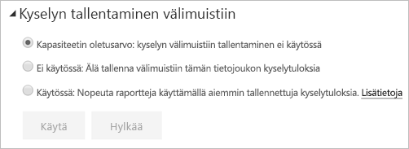

# Kyselyn tallentaminen välimuistiin Power BI Premiumissa / Embeddedissa

Power BI Premiumia tai Power BI Embeddedia käyttävät organisaatiot voivat hyödyntää *kyselyn tallentamista välimuistiin* tietojoukkoon liittyvien raporttien nopeuttamiseksi. Kyselyn tallentaminen välimuistiin ohjaa Premium- tai Embedded-kapasiteetin käyttämään sen paikallista välimuistipalvelua kyselyn tulosten säilyttämiseen, jolloin pohjana oleva tietolähde ei käsittele tuloksia.

> [!IMPORTANT]
> Kyselyn tallentaminen välimuistiin on käytettävissä vain Power BI Premiumissa tai Power BI Embeddedissa. Sitä ei voi käyttää Azure Analysis Services- tai SQL Server Analysis Services -palveluja hyödyntäviin LiveConnect-tietojoukkoihin.

Välimuistissa olevat kyselytulokset ovat käyttäjä- ja tietojoukkokontekstikohtaisia ja noudattavat aina suojaussääntöjä. Tällä hetkellä kyselyn tallentaminen välimuistiin koskee vain aloitussivua. Toisin sanoen kyselyt eivät tallennu välimuistiin, kun käsittelet raporttia. Kyselyn välimuistissa noudatetaan [henkilökohtaisia kirjanmerkkejä](consumer/end-user-bookmarks.md#personal-bookmarks) ja [pysyviä suodattimia](https://powerbi.microsoft.com/blog/announcing-persistent-filters-in-the-service/), joten mukautetun raportin avulla luodut kyselyt tallennetaan välimuistiin. [Koontinäyttöruudut](service-dashboard-tiles.md), jotka käyttävät samoja kyselyjä, hyötyvät myös kyselyn tallentamisesta välimuistiin. Etenkin suorituskyky hyötyy, kun tietojoukkoa käytetään usein eikä sitä tarvitse päivittää usein. Kyselyn tallentaminen välimuistiin voi myös pienentää Premium- tai Embedded-kapasiteetin kuormitusta vähentämällä kyselyjen kokonaismäärää.

Voit hallita kyselyn tallentamista välimuistiin tietojoukon **Asetukset**-sivulla Power BI -palvelussa. Asetusvaihtoehtoja on kolme:

- **Kapasiteetin oletusarvo**: Kyselyn tallentaminen välimuistiin pois käytöstä
- **Ei käytössä**: Älä käytä kyselyn tallentamista välimuistiin tälle tietojoukolle.
- **Käytössä**: Käytä kyselyn tallentamista välimuistiin tälle tietojoukolle.

    

## Huomioitavat asiat ja rajoitukset

- Kun vaihdat välimuistiin tallentamisen **Käytössä**-asetuksen **Ei käytössä** -asetukseksi, kaikki aiemmin tallennetut tietojoukon kyselytulokset poistetaan kapasiteetin välimuistista. Voit poistaa välimuistiin tallentamisen käytöstä joko eksplisiittisesti tai palauttamalla järjestelmänvalvojan määrittämän kapasiteetin oletusasetuksen **Ei käytössä**. Asetuksen poistaminen käytöstä voi aiheuttaa pienen viiveen, kun raportti seuraavan kerran suorittaa kyselyjä tälle tietojoukolle. Viiveen aiheuttavat pyydettäessä suoritettavat kyselyt, jotka eivät hyödynnä tallennettuja tuloksia. Lisäksi vaadittu tietojoukko on ehkä ladattava muistiin, ennen kuin se voi suorittaa kyselyjä.
- Kun kyselyn välimuisti päivitetään, Power BI:n on suoritettava kyselyt pohjana olevia tietomalleja vastaan uusimpien tulosten saamiseksi. Jos kyselyn välimuisti on otettu käyttöön suuressa määrässä tietojoukkoja ja Premium- tai Embedded-kapasiteetti on erittäin kuormitettu, välimuistin päivityksen aikana voi ilmetä suorituskyvyn heikkenemistä. Heikkeneminen johtuu suoritettavien kyselyjen lisääntyneestä määrästä.

## Seuraavat vaiheet

* [Mikä on Power BI Premium?](service-premium-what-is.md)
* [Mikä on Power BI Embedded Azuressa?](developer/azure-pbie-what-is-power-bi-embedded.md)
