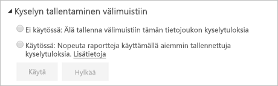

# Kyselyn tallentaminen välimuistiin Power BI Premiumissa

Power BI Premiumia käyttävät organisaatiot voivat hyödyntää *kyselyn tallentamista välimuistiin* tietojoukkoon liittyvien raporttien nopeuttamiseksi. Kyselyn tallentaminen välimuistiin ohjaa Premium-kapasiteetin käyttämään sen paikallista välimuistipalvelua kyselyn tulosten säilyttämiseen, jolloin pohjana oleva tietolähde ei käsittele tuloksia.

> [!IMPORTANT]
> Kyselyn tallentaminen välimuistiin on käytettävissä vain Power BI Premiumissa. Sitä ei voi käyttää Azure Analysis Services- tai SQL Server Analysis Services -palveluja hyödyntäviin LiveConnect-tietojoukkoihin.

Välimuistissa olevat kyselytulokset ovat käyttäjä- ja tietojoukkokontekstikohtaisia ja noudattavat aina suojaussääntöjä. Tällä hetkellä kyselyn tallentaminen välimuistiin koskee vain aloitussivua. Toisin sanoen kyselyt eivät tallennu välimuistiin, kun käsittelet raporttia. Välimuisti kuvastaa omia kirjanmerkkejä ja pysyviä suodattimia. [Koontinäyttöruudut](service-dashboard-tiles.md), jotka käyttävät samoja kyselyjä, hyötyvät myös kyselyn tallentamisesta välimuistiin. Etenkin suorituskyky hyötyy, kun tietojoukkoa käytetään usein eikä sitä tarvitse päivittää usein. Kyselyn tallentaminen välimuistiin voi myös pienentää Premium-kapasiteetin kuormitusta vähentämällä kyselyjen kokonaismäärää.

Voit hallita kyselyn tallentamista välimuistiin tietojoukon **Asetukset**-sivulla Power BI -palvelussa. Se on kaksi mahdollista asetukset:

- **Ei käytössä**: Älä käytä kyselyn tallentamista välimuistiin tälle tietojoukolle.

- **Käytössä**: Käytä kyselyn tallentamista välimuistiin tälle tietojoukolle.

> [!NOTE]
> Kun vaihdat välimuistiin tallentamisen **Käytössä**-asetuksen **Ei käytössä** -asetukseksi, kaikki aiemmin tallennetut tietojoukon kyselytulokset poistetaan kapasiteetin välimuistista. Voit poistaa välimuistiin tallentamisen käytöstä joko eksplisiittisesti tai palauttamalla järjestelmänvalvojan määrittämän kapasiteetin oletusasetuksen **Ei käytössä**. Asetuksen poistaminen käytöstä voi aiheuttaa pienen viiveen, kun raportti seuraavan kerran suorittaa kyselyjä tälle tietojoukolle. Viiveen aiheuttavat pyydettäessä suoritettavat kyselyt, jotka eivät hyödynnä tallennettuja tuloksia. Lisäksi vaadittu tietojoukko on ehkä ladattava muistiin, ennen kuin se voi suorittaa kyselyjä.

