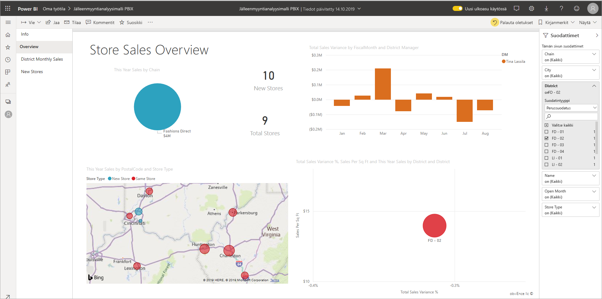

# Suodattimen lisääminen Power BI - raporttiin

[!INCLUDE [power-bi-service-new-look-include](includes/power-bi-service-new-look-include.md)]

Tässä artikkelissa kerrotaan, miten voit lisätä sivu-, visualisointi-, raportti- tai porautumissuodattimen Power BI -raporttiin. Artikkelin esimerkit koskevat Power BI -palvelua. Vaiheet ovat lähes samanlaiset Power BI Desktopissa.

**Tiesitkö?** Power BI:ssä on uusi suodatuskokemus. Lue lisää [uudesta suodatuskokemuksesta Power BI -raporteissa](power-bi-report-filter.md).

Power BI tarjoaa useita erilaisia suodattimia manuaalisista ja automaattisista suodattimista porautumisen suodattimiin ja läpivientikyselyjen suodattimiin. Lue lisää [erilaisista suodattimista](power-bi-report-filter-types.md).

## Lukunäkymän tai muokkausnäkymän suodattimet
Voit käsitellä raportteja kahdessa eri näkymässä: lukunäkymässä ja muokkausnäkymässä. Käytettävissä olevat suodatusominaisuudet vaihtelevat näkymän mukaan. [Lue lisää Power BI -raporttien suodattimista ja korostamisesta](power-bi-reports-filters-and-highlighting.md).

Tässä artikkelissa kerrotaan, miten voit luoda suodattimia raporttiin **muokkausnäkymässä**.  Lisätietoja lukunäkymän suodattimista on artikkelissa [Suodattimien käsitteleminen raportissa lukunäkymässä](consumer/end-user-report-filter.md).

Koska suodattimet *pysyvät*, kun siirryt pois raportista, Power BI säilyttää suodattimet, osittajan ja muut tietojen näkymän muutokset, jotka olet tehnyt. Näin voit jatkaa siitä, mihin jäit, kun palaat raporttiin. Jos et halua suodattimen muutosten säilyvän, valitse **Palauta oletukset** ylävalikosta.

## Suodattimien tasot Suodattimet-ruudussa
Suodattimet-ruutu näkyy raportin piirtoalustan oikeassa reunassa sen mukaan, onko käytössä Desktop vai Power BI. Jos et näe Suodattimet-ruutua, laajenna ruutu valitsemalla oikeasta yläkulmasta >-kuvake.

Voit määrittää suodattimia raportin kolmelle eri tasolle: visualisointitason, sivutason ja raporttitason suodattimet. Voit myös määrittää porautumisen suodattimia. Tässä artikkelissa selvitetään eri tasoja.

## Suodattimen lisääminen visualisointiin
Voit lisätä visualisointitason suodattimen tiettyyn visualisointiin kahdella eri tavalla. 

* Voit suodattaa kentän, joka on jo käytössä visualisoinnissa.
* Vaihtoehtoisesti voit määrittää kentän, joka ei ole käytössä visualisoinnissa, ja lisätä kyseisen kentän suoraan **Visuaalisen tason suodattimet** -säilöön.

Tässä menettelyssä käytetään jälleenmyyntianalyysimallia. Voi halutessasi ladata sen ja käyttää sitä apuna. Lataa [jälleenmyyntianalyysimallin](sample-retail-analysis.md#get-the-content-pack-for-this-sample) sisältöpaketti.

### Visualisoinnin kenttien suodattaminen

1. Avaa raporttisi Muokkausnäkymässä valitsemalla **Lisää asetuksia (...)**  > **Muokkaa raporttia**.
   
   

2. Avaa Visualisoinnit- ja Suodattimet-ruutu sekä Kentät-ruutu (jos ne eivät ole jo avoinna).
   
   
3. Valitse visualisointi, jotta siitä tulee aktiivinen. Kaikki visualisoinnissa käytettävät kentät näkyvät **Kentät**-ruudussa ja luetellaan lisäksi **Visuaalisen tason suodattimet** -otsikon alla olevassa **Suodattimet**-ruudussa.
   
   
4. Tässä vaiheessa lisäämme suodattimen kenttään, joka on jo käytössä visualisoinnissa. 
   
    Vieritä alaspäin **Visuaalisen tason suodattimet** -alueelle ja laajenna suodatettava kenttä valitsemalla nuolipainike. Tässä esimerkissä suodatamme kentän **StoreNumberName** perusteella.
     
     
    
    Määritä suodatusasetukseksi **Perussuodatus**, **Lisäsuodatus** tai **Ylimmät N**. Tässä esimerkissä teemme perussuodatuksen avulla haun **cha** ja valitsemme löytyvät viisi myymälää.
     
     
   
    Visualisointi muuttuu vastaamaan uutta suodatinta. Jos tallennat suodattimen sisältävän raportin, raporttia lukevat käyttäjät ensinnäkin näkevät visuaalisen suodattimen ja voivat lisäksi käsitellä suodatinta lukunäkymässä valitsemalla tai tyhjentämällä arvoja.
     
    
    
    Kun käytät suodatinta visualisoinnissa käytetyssä kentässä, ja kenttä koostetaan (esimerkiksi summa, keskiarvo tai määrä), suodatat *koostetussa* arvossa jokaisessa arvopisteessä. Jos siis haluat suodattaa yllä olevan visualisoinnin, jossa **Tämän vuoden myynti > 500000**, tarkoittaa, että tuloksessa näkyy vain **13 - Charleston Fashion Direct** -arvopiste. [Mallimittareiden](desktop-measures.md) suodattimet koskevat aina arvopisteen koostearvoa.

### Suodattaminen kentällä, joka ei ole visualisoinnissa

Nyt lisäämme visualisointiin uuden kentän visuaalisen tason suodattimena.
   
1. Valitse Kentät-ruudusta kenttä, jonka haluat lisätä uutena visuaalisen tason suodattimena, ja vedä se **Visuaalisen tason suodattimet** -alueelle.  Tässä esimerkissä vedämme **Aluejohtaja**-kentän **Visuaalisen tason suodattimet** -säilöön, teemme haun **an** ja valitsemme löytyvät kolme johtajaa.
     
    

    Huomaa, että **Aluejohtaja**-kenttää *ei* lisätä itse visualisointiin. Visualisointi muodostuu Akseli-kohdan arvosta **StoreNumberName** ja Arvo-kohdan arvosta **This Year Sales**.  
     
    

    Visualisointi suodatetaan nyt niin, että siinä näkyy vain kolmen johtajan tiettyjen myymälöiden tämän vuoden myynti.
     
    

    Jos tallennat suodattimen sisältävän raportin, raporttia lukevat käyttäjät voivat käsitellä **Aluejohtaja**-suodatinta lukunäkymässä valitsemalla tai tyhjentämällä arvoja.
    
    Jos vedät *numeerisen sarakkeen* suodatinruutuun visuaalisen tason suodattimen luomiseksi, suodatinta käytetään *pohjana olevissa tietoriveissä*. Esimerkiksi suodattimen lisääminen **Yksikkökustannus**-kenttään ja määrittämällä sen arvoksi **Yksikkökustannus** > 20 näyttää vain niiden tuoterivien tiedot, joissa yksikkökustannus oli suurempi kuin 20, visualisoinnissa näytettävien arvopisteiden kokonaisyksikkökustannuksesta riippumatta.

## Suodattimen lisääminen koko sivulle

Voit myös lisätä sivutason suodattimen koko sivun suodattamiseksi.

1. Avaa jälleenmyyjäanalyysimalli Power BI -palvelussa ja siirry sitten **Alueen kuukausimyynti** -sivulle. 

2. Avaa raportti Muokkausnäkymässä valitsemalla **...**  > **Muokkaa raporttia**.
   
   
2. Avaa Visualisoinnit- ja Suodattimet-ruutu sekä Kentät-ruutu (jos ne eivät ole jo avoinna).
3. Valitse Kentät-ruudusta kenttä, jonka haluat lisätä uutena sivutason suodattimena, ja vedä se **Sivutason suodattimet** -alueelle.  
4. Valitse suodatettavat arvot ja määritä suodatusasetukseksi **Perussuodatus** tai **Lisäsuodatus**.
   
   Kaikki sivulla olevat visualisoinnit piirretään uudelleen vastaamaan muutosta.
   
   

    Jos tallennat suodattimen sisältävän raportin, raporttia lukevat käyttäjät voivat käsitellä suodatinta lukunäkymässä valitsemalla tai tyhjentämällä arvoja.

## Porautumissuodattimen lisääminen
Power BI -palvelun ja Power BI Desktopin porautumisen avulla voit luoda *kohderaporttisivun*, jolla keskitytään tiettyyn entiteettiin, kuten toimittajaan, asiakkaaseen tai valmistajaan. Nyt käyttäjät voivat muilla raporttisivuilla napsauttaa hiiren kakkospainikkeella kyseisen entiteetin arvopistettä ja porautua tiettyyn entiteettiin keskittyvälle sivulle.

### Porautumissuodattimen luominen
Seuraa mukana lataamalla [Asiakkaan tuottavuuden malli](sample-customer-profitability.md#get-the-content-pack-for-this-sample). Oletetaan, että haluat luoda sivun, jolla keskitytään Johtaja-liiketoiminta-alueisiin.

1. Avaa jälleenmyyjäanalyysimalli Power BI -palvelussa ja siirry sitten **Alueen kuukausimyynti** -sivulle.

2. Avaa raporttisi Muokkausnäkymässä valitsemalla **Lisää asetuksia (...)**  > **Muokkaa raporttia**.
   
   

1. Lisää raporttiin uusi sivu ja anna sen nimeksi **Tiimijohtaja**. Tämä sivu on porautumisen *kohde*.
2. Lisää visualisointeja, jotka seuraavat tiimijohtajien liiketoiminta-alueiden avaintietoja.    
3. Vedä **Johto**-taulukosta **Johto** porautumissuodattimien ruutuun.    
   
    
   
    Huomaa, että Power BI lisää taaksepäin osoittavan nuolen raporttisivulle.  Valitsemalla taaksepäin osoittavan nuolen käyttäjät voivat palata *alkuperäiselle* raporttisivulle eli sivulle, jolla he valitsivat porautumisen. Valitse taaksepäin osoittava nuoli painamalla muokkausnäkymässä Ctrl-näppäintä pitkään
   
     

### Porautumissuodattimen käyttäminen
Katsotaan, miten porautumissuodatin toimii.

1. Aloita **Tiimin tuloskortti** -raporttisivulta.    
2. Oletetaan, että olet Antero Mäntylä ja haluat nähdä Tiimijohtaja-raporttisivun, joka on suodatettu näyttämään vain sinun tietosi.  Avaa Porautuminen-valikkovaihtoehto napsauttamalla hiiren kakkospainikkeella vasemman yläreunan alueen kaaviosta mitä tahansa vihreää arvopistettä.
   
    
3. Poraudu **Tiimijohtaja**-raporttisivulle valitsemalla **Porautuminen > Tiimijohtaja**. Sivu suodatetaan näyttämään tietoja hiiren kakkospainikkeella napsauttamastasi arvopisteestä – tässä tapauksessa Antti Mäntylästä. Kaikki alkuperäisen sivun suodattimia käytetään porautumisraporttisivulla.  
   
    

## Lisää raporttitason suodatin koko raportin suodattamiseksi

1. Avaa raportti Muokkausnäkymässä valitsemalla **Muokkaa raporttia**.
   
   

2. Avaa Visualisoinnit- ja Suodattimet-ruutu sekä Kentät-ruutu, jos ne eivät ole jo avoinna.
3. Valitse Kentät-ruudusta kenttä, jonka haluat lisätä uutena raporttitason suodattimena, ja vedä se **Raporttitason suodattimet** -alueelle.  
4. Valitse arvot, joiden perusteella haluat suodattaa.

    Aktiivisella sivulla ja kaikilla raportin sivuilla olevat visualisoinnit muuttuvat uuden suodattimen mukaisiksi. Jos tallennat suodattimen sisältävän raportin, raporttia lukevat käyttäjät voivat käsitellä suodatinta lukunäkymässä valitsemalla tai tyhjentämällä arvoja.

1. Palaa edelliselle raporttisivulle valitsemalla taaksepäin osoittava nuoli.

## Huomioon otettavat seikat ja vianmääritys

- Jos Kentät-ruutu ei ole näkyvissä, varmista, että valittuna on raportin [muokkausnäkymä](service-interact-with-a-report-in-editing-view.md).    
- Jos olet tehnyt paljon muutoksia suodattimiin ja haluat palata raportin tekijän oletusasetuksiin, valitse **Palauta oletukset** ylävalikosta.

## Seuraavat vaiheet
[Aloita raportin Suodattimet-ruudun esittely](consumer/end-user-report-filter.md)

[Suodattimet ja korostaminen raporteissa](power-bi-reports-filters-and-highlighting.md)

[Erilaiset Power BI -suodattimet](power-bi-report-filter-types.md)

Onko sinulla kysyttävää? [Kokeile Power BI -yhteisöä](http://community.powerbi.com/)

