# Suodattimen lisääminen Power BI -palvelun raporttiin (muokkausnäkymässä)

Tässä artikkelissa kerrotaan, miten voit lisätä sivu-, visualisointi-, raportti- tai porautumissuodattimen Power BI -raporttiin. Artikkelin esimerkit koskevat Power BI -palvelua. Vaiheet ovat lähes samanlaiset Power BI Desktopissa.

## Lukunäkymän tai muokkausnäkymän suodattimet
Voit käsitellä raportteja kahdessa eri näkymässä: lukunäkymässä ja muokkausnäkymässä. Käytettävissä olevat suodatusominaisuudet vaihtelevat näkymän mukaan. [Lue lisää Power BI -raporttien suodattimista ja korostamisesta](power-bi-reports-filters-and-highlighting.md).

Tässä artikkelissa kerrotaan, miten voit luoda suodattimia raporttiin **muokkausnäkymässä**.  Lisätietoja lukunäkymän suodattimista on artikkelissa [Suodattimien käsitteleminen raportissa lukunäkymässä](consumer/end-user-reading-view.md).

## Suodatintyypit Suodattimet-ruudussa
Suodattimet-ruutu näkyy raportin piirtoalustan oikeassa reunassa sen mukaan, onko käytössä Desktop vai Power BI. Jos et näe Suodattimet-ruutua, laajenna ruutu valitsemalla oikeasta yläkulmasta >-kuvake.

Suodattimia on neljää tyyppiä: **sivusuodattimet**, **visuaaliset suodattimet**, **porautumissuodattimet** ja **raporttisuodattimet**.

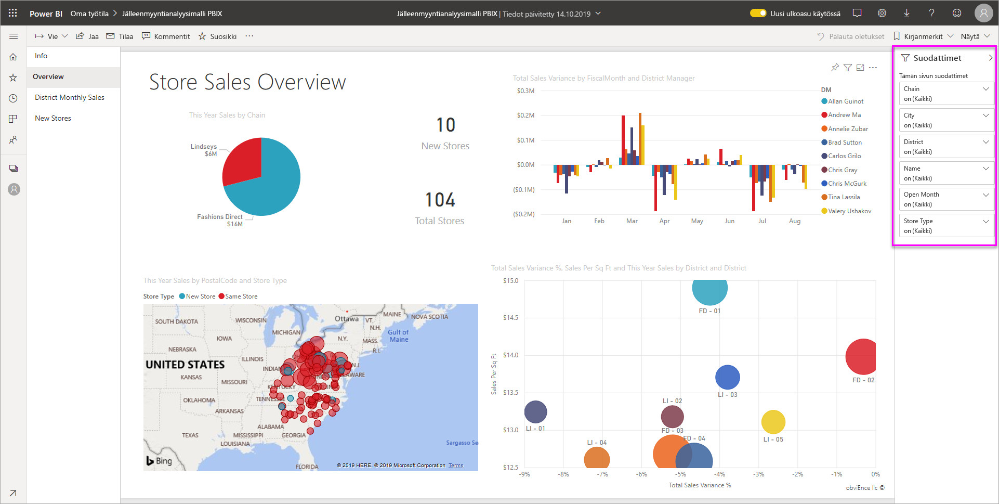

Koska suodattimet *pysyvät*, kun siirryt pois raportista, Power BI säilyttää suodattimet, osittajan ja muut tietojen näkymän muutokset, jotka olet tehnyt. Näin voit jatkaa siitä, mihin jäit, kun palaat raporttiin. Jos et halua suodattimen muutosten säilyvän, valitse **Palauta oletukset** ylävalikosta.

## Suodattimen lisääminen visualisointiin
Voit lisätä suodattimen tiettyyn visualisointiin (eli visuaalisen suodattimen) kahdella eri tavalla. 

* Voit suodattaa kentän, joka on jo käytössä visualisoinnissa.
* Vaihtoehtoisesti voit määrittää kentän, joka ei ole käytössä visualisoinnissa, ja lisätä kyseisen kentän suoraan **Visuaalisen tason suodattimet** -säilöön.

Tässä menettelyssä käytetään jälleenmyyntianalyysimallia. Voi halutessasi ladata sen ja käyttää sitä apuna. Lataa [Jälleenmyyntianalyysimalli](sample-retail-analysis.md).

### Visualisoinnin kenttien suodattaminen

1. Avaa [raportti muokkausnäkymässä](service-the-report-editor-take-a-tour.md).
   
   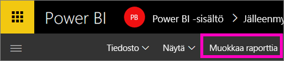
2. Avaa Visualisoinnit- ja Suodattimet-ruutu sekä Kentät-ruutu (jos ne eivät ole jo avoinna).
   
   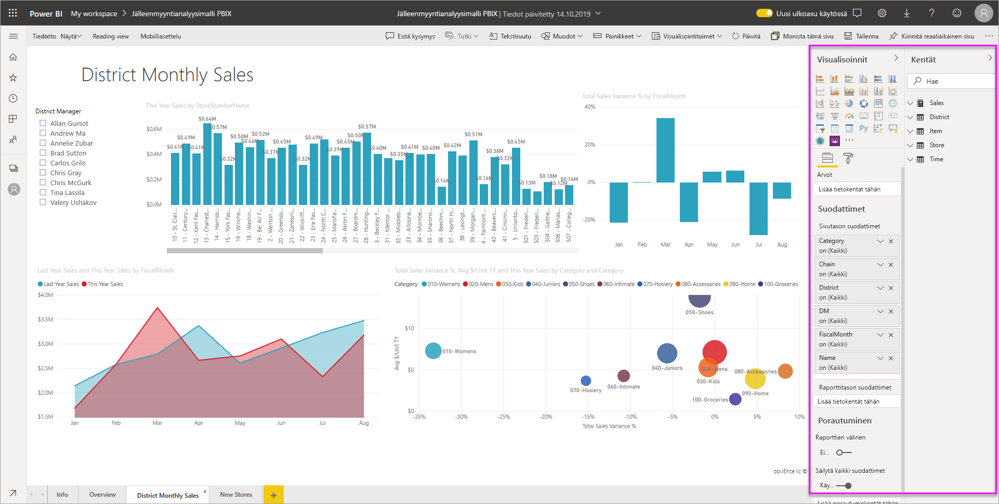
3. Valitse visualisointi, jotta siitä tulee aktiivinen. Kaikki visualisoinnissa käytettävät kentät näkyvät **Kentät**-ruudussa ja luetellaan lisäksi **Visuaalisen tason suodattimet** -otsikon alla olevassa **Suodattimet**-ruudussa.
   
   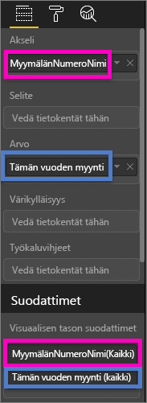
4. Tässä vaiheessa lisäämme suodattimen kenttään, joka on jo käytössä visualisoinnissa. 
   
    Vieritä alaspäin **Visuaalisen tason suodattimet** -alueelle ja laajenna suodatettava kenttä valitsemalla nuolipainike. Tässä esimerkissä suodatamme kentän **StoreNumberName** perusteella.
     
    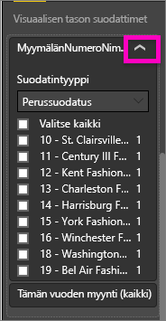 
    
    Määritä suodatusasetukseksi **Perussuodatus**, **Lisäsuodatus** tai **Ylimmät N**. Tässä esimerkissä teemme perussuodatuksen avulla haun **cha** ja valitsemme löytyvät viisi myymälää.
     
    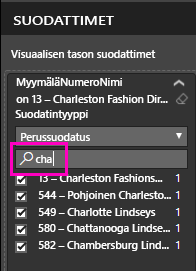 
   
    Visualisointi muuttuu vastaamaan uutta suodatinta. Jos tallennat suodattimen sisältävän raportin, raporttia lukevat käyttäjät ensinnäkin näkevät visuaalisen suodattimen ja voivat lisäksi käsitellä suodatinta lukunäkymässä valitsemalla tai tyhjentämällä arvoja.
     
    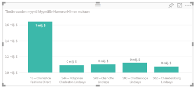

### Suodattaminen kentällä, joka ei ole visualisoinnissa

Nyt lisäämme visualisointiin uuden kentän visuaalisen tason suodattimena.
   
1. Valitse Kentät-ruudusta kenttä, jonka haluat lisätä uutena visuaalisen tason suodattimena, ja vedä se **Visuaalisen tason suodattimet** -alueelle.  Tässä esimerkissä vedämme **Aluejohtaja**-kentän **Visuaalisen tason suodattimet** -säilöön, teemme haun **an** ja valitsemme löytyvät kolme johtajaa. 
     
    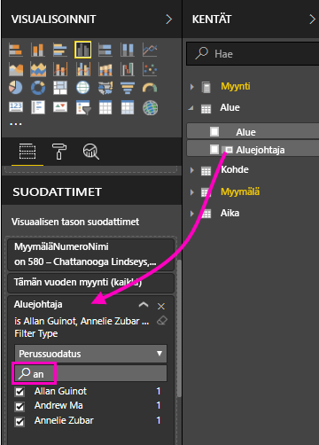

    Huomaa, että **Aluejohtaja**-kenttää *ei* lisätä itse visualisointiin. Visualisointi muodostuu Akseli-kohdan arvosta **StoreNumberName** ja Arvo-kohdan arvosta **This Year Sales**.  
     
    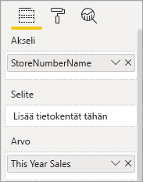

    Visualisointi suodatetaan nyt niin, että siinä näkyy vain kolmen johtajan tiettyjen myymälöiden tämän vuoden myynti.
     
    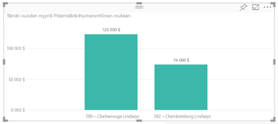

    Jos tallennat suodattimen sisältävän raportin, raporttia lukevat käyttäjät voivat käsitellä **Aluejohtaja**-suodatinta lukunäkymässä valitsemalla tai tyhjentämällä arvoja.

## Suodattimen lisääminen koko sivulle

Voit myös lisätä suodattimen koko sivulle (sivunäkymän suodatin).
1. Avaa [raportti muokkausnäkymässä](service-the-report-editor-take-a-tour.md).
2. Avaa Visualisoinnit- ja Suodattimet-ruutu sekä Kentät-ruutu (jos ne eivät ole jo avoinna).
3. Valitse Kentät-ruudusta kenttä, jonka haluat lisätä uutena sivutason suodattimena, ja vedä se **Sivutason suodattimet** -alueelle.  
4. Valitse suodatettavat arvot ja määritä suodatusasetukseksi **Perussuodatus** tai **Lisäsuodatus**.
   
   Kaikki sivulla olevat visualisoinnit, joita tämä suodatin koskee, piirretään uudelleen, jotta ne vastaavat tehtyjä muutoksia. 
   
   

    Jos tallennat suodattimen sisältävän raportin, raporttia lukevat käyttäjät voivat käsitellä suodatinta lukunäkymässä valitsemalla tai tyhjentämällä arvoja.

## Porautumissuodattimen lisääminen
Power BI -palvelun ja Power BI Desktopin porautumisen avulla voit luoda *kohderaporttisivun*, jolla keskitytään tiettyyn entiteettiin, kuten toimittajaan, asiakkaaseen tai valmistajaan. Nyt käyttäjät voivat muilla raporttisivuilla napsauttaa hiiren kakkospainikkeella kyseisen entiteetin arvopistettä ja porautua tiettyyn entiteettiin keskittyvälle sivulle.

### Porautumissuodattimen luominen
Avaa Asiakkaan tuottavuuden malli muokkausnäkymässä. Oletetaan, että haluat luoda sivun, jolla keskitytään Johtaja-liiketoiminta-alueisiin.   

1. Lisää raporttiin uusi sivu ja anna sen nimeksi **Tiimijohtaja**. Tämä on porautumisen *kohdesivu*.
2. Lisää visualisointeja, jotka seuraavat tiimijohtajien liiketoiminta-alueiden avaintietoja.    
3. Lisää porautumissuodattimiin myös **Johtaja > Johtajan nimi**.    
   
    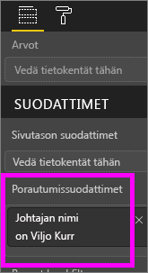
   
    Huomaa, että Power BI lisää taaksepäin osoittavan nuolen raporttisivulle.  Valitsemalla taaksepäin osoittavan nuolen käyttäjät voivat palata *alkuperäiselle* raporttisivulle eli sivulle, jolla he valitsivat porautumisen. Taaksepäin osoittava nuoli toimii vain lukunäkymässä.
   
     

### Porautumissuodattimen käyttäminen
Katsotaan, miten porautumissuodatin toimii.

1. Aloita **Tiimin tuloskortti** -raporttisivulta.    
2. Oletetaan, että olet Antero Mäntylä ja haluat nähdä Tiimijohtaja-raporttisivun, joka on suodatettu näyttämään vain sinun tietosi.  Avaa Porautuminen-valikkovaihtoehto napsauttamalla hiiren kakkospainikkeella vasemman yläreunan alueen kaaviosta mitä tahansa vihreää arvopistettä.
   
    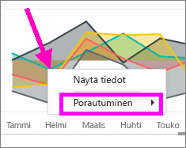
3. Poraudu **Tiimijohtaja**-raporttisivulle valitsemalla **Porautuminen > Tiimijohtaja**. Sivu suodatetaan näyttämään tietoja hiiren kakkospainikkeella napsauttamastasi arvopisteestä – tässä tapauksessa Antti Mäntylästä. Vain porautumissuodattimissa oleva kenttä välitetään porautumisraporttisivulle.  
   
    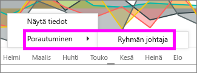

## Suodattimen lisääminen koko raporttiin (raporttisuodatin)
1. Avaa [raportti muokkausnäkymässä](service-the-report-editor-take-a-tour.md).
2. Avaa Visualisoinnit- ja Suodattimet-ruutu sekä Kentät-ruutu (jos ne eivät ole jo avoinna).
3. Valitse Kentät-ruudusta kenttä, jonka haluat lisätä uutena raporttitason suodattimena, ja vedä se **Raporttitason suodattimet** -alueelle.  
4. Valitse arvot, joiden perusteella haluat suodattaa.

    Aktiivisella sivulla ja kaikilla raportin sivuilla olevat visualisoinnit muuttuvat uuden suodattimen mukaisiksi. Jos tallennat suodattimen sisältävän raportin, raporttia lukevat käyttäjät voivat käsitellä suodatinta lukunäkymässä valitsemalla tai tyhjentämällä arvoja.

1. Palaa edelliselle raporttisivulle valitsemalla taaksepäin osoittava nuoli.

## Huomioon otettavat seikat ja vianmääritys

- Joissakin tilanteissa visuaalisen tason suodatin ja sivutason suodatin voivat palauttaa eri tuloksia.  Esimerkiksi, kun lisäät visuaalisen tason suodattimen, Power BI suodattaa kootut tulokset.  Oletuskooste on Summa, mutta voit [muuttaa koostetyyppiä](service-aggregates.md).  

    Kun lisäät sivutason suodattimen, Power BI suodattaa ilman koostamista.  Tämä johtuu siitä, että sivulla voi olla useita visualisointeja, joista jokainen voi hyödyntää eri koostetyyppiä.  Suodatinta käytetään siis jokaisella tietorivillä.

- Jos Kentät-ruutu ei ole näkyvissä, varmista, että valittuna on raportin [muokkausnäkymä](service-interact-with-a-report-in-editing-view.md).    
- Jos olet tehnyt paljon muutoksia suodattimiin ja haluat palata raportin tekijän oletusasetuksiin, valitse **Palauta oletukset** ylävalikosta.

## Seuraavat vaiheet
[Aloita raportin Suodattimet-ruudun esittely](consumer/end-user-report-filter.md)

[Suodattimet ja korostaminen raporteissa](power-bi-reports-filters-and-highlighting.md)

[Suodattimien ja korostamisen käsitteleminen raportin lukunäkymässä](consumer/end-user-reading-view.md)

[Raportin visualisointien ristiinsuodatuksen ja ristiinkorostuksen muuttaminen suhteessa toisiinsa](consumer/end-user-interactions.md)

Onko sinulla kysyttävää? [Kokeile Power BI -yhteisöä](http://community.powerbi.com/)

