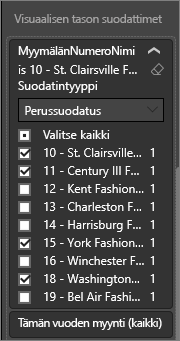
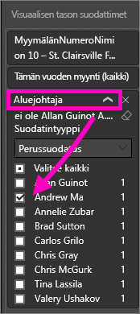

# Suodattimen lisääminen Power BI -palvelun raporttiin (muokkausnäkymässä)
> [!TIP]
> Suosittelemme lukemaan ensin artikkelin [Tietoja Power BI -raporttien suodattimista ja korostamisesta](power-bi-reports-filters-and-highlighting.md).

Tämän artikkelin esimerkeissä on käytetty Power BI-palvelua. Vaiheet ovat kuitenkin lähes samanlaiset Power BI Desktopissa.
> 
> 

## Raporttisuodattimien väliset erot muokkausnäkymässä ja lukunäkymässä
Raportteja voidaan käsitellä kahdessa eri näkymässä: [lukunäkymässä](service-reading-view-and-editing-view.md) ja [muokkausnäkymässä](service-interact-with-a-report-in-editing-view.md).  Käytettävissä olevat suodatusominaisuudet vaihtelevat näkymän mukaan.

* Muokkausnäkymässä voit lisätä raportti- ja sivusuodattimia sekä visuaalisia suodattimia. Suodattimet tallennetaan raporttiin. Lukunäkymässä raporttia katsovat käyttäjät voivat käsitellä lisäämiäsi suodattimia.
* Lukunäkymässä voit käsitellä raportissa olevia raportti-, porautumis- ja sivusuodattimia sekä visuaalisia suodattimia, mutta et voi lisätä uusia suodattimia. Suodattimet-ruudussa tekemäsi muutokset tallennetaan raporttiin myös silloin, kun tarkastelet raporttia mobiilisovelluksessa.  

> [!NOTE]
> Tässä artikkelissa kerrotaan, miten voit luoda suodattimia raporttiin **muokkausnäkymässä**.  Lisätietoja lukunäkymän suodattimista on artikkelissa [Suodattimien käsitteleminen raportissa lukunäkymässä](service-reading-view-and-editing-view.md).

## Power BI:n *Suodattimet*-ruudussa käytettävissä olevat suodattimet
Suodattimet-ruutu näkyy raportin piirtoalustan oikeassa reunassa sen mukaan, onko käytössä Desktop vai Power BI. Jos et näe Suodattimet-ruutua, laajenna ruutu valitsemalla oikeasta yläkulmasta >-kuvake.

Käytössä on neljä erilaista suodatinta:

- **sivusuodatin** koskee kaikkia raporttisivulla olevia visualisointeja     
- **visuaalinen suodatin** koskee raporttisivulla olevaa yksittäistä visualisointia    
- **porautumissuodatin** koskee mitä tahansa raportin entiteettiä    
- **raporttisuodatin** koskee kaikkia raportin sivuja.    

    

## Suodattimen lisääminen tiettyyn visualisointiin (visuaalinen suodatin)
Voit tehdä tämän seuraavilla tavoilla: 

* suodattamalla kentän, joka on jo käytössä visualisoinnissa
* määrittämällä kentän, joka ei ole käytössä visualisoinnissa, ja lisäämällä kyseisen kentän suoraan **Visuaalisen tason suodattimet** -säilöön.

### Visualisoinnissa jo käytössä olevien kenttien suodattaminen
1. Avaa [raportti muokkausnäkymässä](service-reading-view-and-editing-view.md).
   
   
2. Avaa Visualisoinnit- ja Suodattimet-ruutu sekä Kentät-ruutu (jos ne eivät ole jo avoinna).
   
   
3. Valitse visualisointi, jotta siitä tulee aktiivinen. Kaikki visualisoinnissa käytettävät kentät määritetään **Kentät**-ruudussa ja luetellaan lisäksi **Visuaalisen tason suodattimet** -otsikon alla olevassa **Suodattimet**-ruudussa.
   
   
4. Tässä vaiheessa lisäämme suodattimen kenttään, joka on jo käytössä visualisoinnissa. 
   
   * Vieritä alaspäin **Visuaalisen tason suodattimet** -alueelle ja laajenna suodatettava kenttä valitsemalla nuolipainike. Tässä esimerkissä suodatamme kentän **StoreNumberName**
     
       
   * Määritä suodatusasetukseksi **Perussuodatus**, **Lisäsuodatus** tai **Ylimmät N** (katso artikkeli [Raporttisuodattimien käyttäminen](power-bi-how-to-report-filter.md)). Tässä esimerkiksi valitsemme perussuodatuksen ja valitsemme numerot 10, 11, 15 ja 18.
     
       
   * Visualisointi muuttuu vastaamaan uutta suodatinta. Jos tallennat suodattimen sisältävän raportin, raporttia lukevat käyttäjät voivat käsitellä suodatinta lukunäkymässä valitsemalla tai tyhjentämällä arvoja.
     
      
5. Nyt lisäämme visualisointiin täysin uuden kentän visuaalisen tason suodattimena.
   
   * Valitse Kentät-ruudusta kenttä, jonka haluat lisätä uutena visuaalisen tason suodattimena, ja vedä se **Visuaalisen tason suodattimet** -alueelle.  Tässä esimerkissä vedämme **Aluejohtaja**-kentän **Visuaalisen tason suodattimet** -säilöön ja valitsemme vain henkilön Antti Mäntylä. 
     
      
   * Huomaa, että **Aluejohtaja**-kenttää *ei* lisätä itse visualisointiin. Visualisointi muodostuu Akseli-kohdan arvosta **StoreNumberName** ja Arvo-kohdan arvosta **This Year Sales**.  
     
      
   * Visualisointi suodatetaan nyt niin, että siinä näkyvät vain Antin tiettyjen myymälöiden tämän vuoden myynti.
     
     

## Suodattimen lisääminen koko sivulle (sivunäkymän suodatin)
1. Avaa [raportti muokkausnäkymässä](service-reading-view-and-editing-view.md).
2. Avaa Visualisoinnit- ja Suodattimet-ruutu sekä Kentät-ruutu (jos ne eivät ole jo avoinna).
3. Valitse Kentät-ruudusta kenttä, jonka haluat lisätä uutena sivutason suodattimena, ja vedä se **Sivutason suodattimet** -alueelle.  
4. Valitse suodatettavat arvot ja määritä suodatusasetukseksi **Perussuodatus** tai **Lisäsuodatus** (katso artikkeli [Raporttisuodattimien käyttäminen](power-bi-how-to-report-filter.md)).
   
   Kaikki sivulla olevat visualisoinnit, joita tämä suodatin koskee, piirretään uudelleen, jotta ne vastaavat tehtyjä muutoksia. 
   
   

Jos tallennat suodattimen sisältävän raportin, raporttia lukevat käyttäjät voivat käsitellä suodatinta lukunäkymässä valitsemalla tai tyhjentämällä arvoja.

## Porautumissuodattimen lisääminen
Power BI -palvelun ja Power BI Desktopin porautumisen avulla voit luoda *kohderaporttisivun*, jolla keskitytään tiettyyn entiteettiin, kuten toimittajaan, asiakkaaseen tai valmistajaan. Nyt käyttäjät voivat muilla raporttisivuilla napsauttaa hiiren kakkospainikkeella kyseisen entiteetin arvopistettä ja porautua tiettyyn entiteettiin keskittyvälle sivulle.

### Porautumissuodattimen luominen
Avaa Asiakkaan tuottavuuden malli muokkausnäkymässä. Oletetaan, että haluat luoda sivun, jolla keskitytään Johtaja-liiketoiminta-alueisiin.   

1. Lisää raporttiin uusi sivu ja anna sen nimeksi **Tiimijohtaja**. Tämä on porautumisen *kohdesivu*.
2. Lisää visualisointeja, jotka seuraavat tiimijohtajien liiketoiminta-alueiden avaintietoja.    
3. Lisää porautumissuodattimiin myös **Johtaja > Johtajan nimi**.    
   
    
   
    Huomaa, että Power BI lisää taaksepäin osoittavan nuolen raporttisivulle.  Valitsemalla taaksepäin osoittavan nuolen käyttäjät voivat palata *alkuperäiselle* raporttisivulle eli sivulle, jolla he valitsivat porautumisen. Taaksepäin osoittava nuoli toimii vain lukunäkymässä.
   
     

### Porautumissuodattimen käyttäminen
Katsotaan, miten porautumissuodatin toimii.

1. Aloita **Tiimin tuloskortti** -raporttisivulta.    
2. Oletetaan, että olet Antero Mäntylä ja haluat nähdä Tiimijohtaja-raporttisivun, joka on suodatettu näyttämään vain sinun tietosi.  Avaa Porautuminen-valikkovaihtoehto napsauttamalla hiiren kakkospainikkeella vasemman yläreunan alueen kaaviosta mitä tahansa vihreää arvopistettä.
   
    
3. Poraudu **Tiimijohtaja**-raporttisivulle valitsemalla **Porautuminen > Tiimijohtaja**. Sivu suodatetaan näyttämään tietoja hiiren kakkospainikkeella napsauttamastasi arvopisteestä – tässä tapauksessa Antti Mäntylästä. Vain porautumissuodattimissa oleva kenttä välitetään porautumisraporttisivulle.  
   
    

## Suodattimen lisääminen koko raporttiin (raporttisuodatin)
1. Avaa [raportti muokkausnäkymässä](service-reading-view-and-editing-view.md).
2. Avaa Visualisoinnit- ja Suodattimet-ruutu sekä Kentät-ruutu (jos ne eivät ole jo avoinna).
3. Valitse Kentät-ruudusta kenttä, jonka haluat lisätä uutena raporttitason suodattimena, ja vedä se **Raporttitason suodattimet** -alueelle.  
4. Valitse suodatettavat arvot (katso artikkeli [Raporttisuodattimien käyttäminen](power-bi-how-to-report-filter.md)).

    Aktiivisella sivulla ja kaikilla raportin sivuilla olevat visualisoinnit muuttuvat uuden suodattimen mukaisiksi. Jos tallennat suodattimen sisältävän raportin, raporttia lukevat käyttäjät voivat käsitellä suodatinta lukunäkymässä valitsemalla tai tyhjentämällä arvoja.

1. Palaa edelliselle raporttisivulle valitsemalla taaksepäin osoittava nuoli.

## Huomioon otettavat seikat ja vianmääritys
### Miksi visuaalisen tason suodatin ja sivutason suodatin palauttavat eri arvot?
Kun lisäät visuaalisen tason suodattimen, Power BI suodattaa kootut tulokset.  Oletuskooste on Summa, mutta voit [muuttaa koostetyyppiä](service-aggregates.md).  

Kun lisäät sivutason suodattimen, Power BI suodattaa ilman tietojen koostamista.  Tämä johtuu siitä, että sivulla voi olla useita visualisointeja, joista jokainen voi hyödyntää eri koostetyyppiä.  Suodatinta käytetään siis jokaisella tietorivillä.

Jos Kentät-ruutu ei ole näkyvissä, varmista, että valittuna on raportin [muokkausnäkymä](service-interact-with-a-report-in-editing-view.md).

## Seuraavat vaiheet
 [Raporttisuodattimien käyttäminen](power-bi-how-to-report-filter.md)

  [Suodattimet ja korostaminen raporteissa](power-bi-reports-filters-and-highlighting.md)

[Suodattimien ja korostamisen käsitteleminen raportin lukunäkymässä](service-reading-view-and-editing-view.md)

[Raportin visualisointien ristiinsuodatuksen ja ristiinkorostuksen muuttaminen suhteessa toisiinsa](service-reports-visual-interactions.md)

Onko sinulla kysyttävää? [Kokeile Power BI -yhteisöä](http://community.powerbi.com/)

