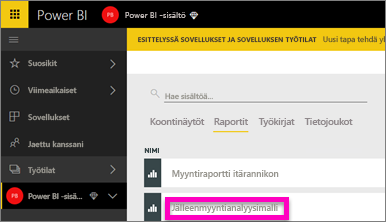
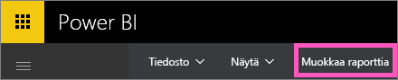
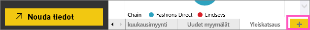
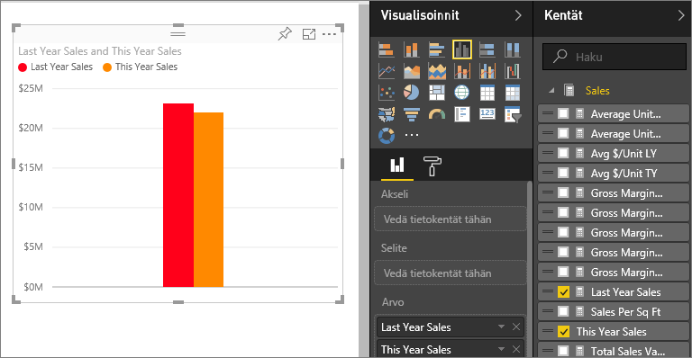
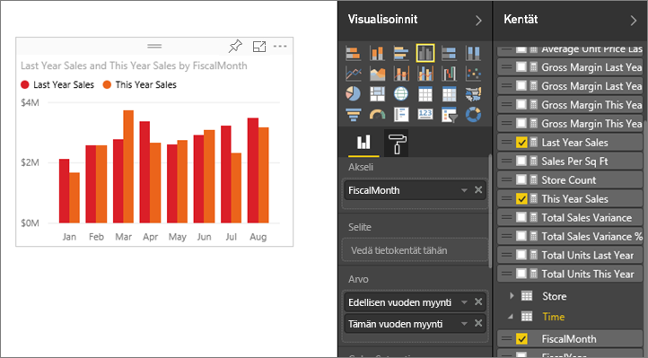
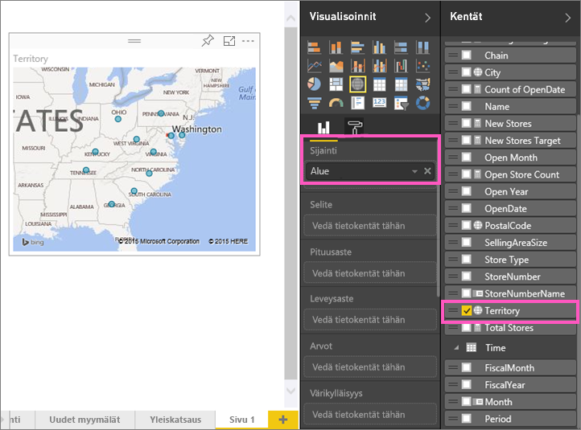
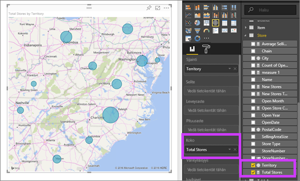
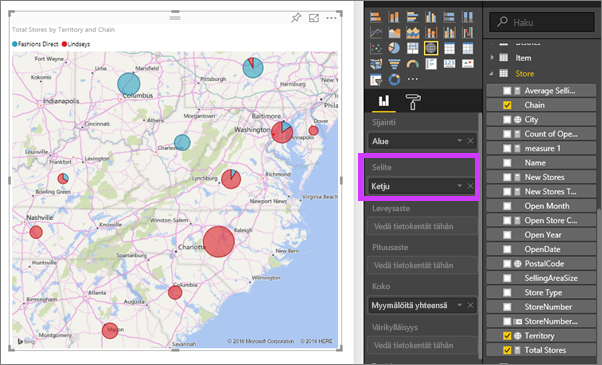

# Visualisointien lisääminen Power BI -raporttiin, osa 2
[Osassa 1](power-bi-report-add-visualizations-ii.md) opettelit luomaan tavallisia visualisointeja valitsemalla kenttien nimien vieressä olevia valintaruutuja.  Osassa 2 opetetaan luomaan visualisointeja ja muokkaamaan niitä vetämis- ja pudottamistoiminnon avulla sekä hyödyntämällä **Kentät**- ja **Visualisoinnit**-paneeleja.

### Edellytykset
- [Osa 1](power-bi-report-add-visualizations-ii.md)
- Power BI -palvelu – Raportteihin voi lisätä visualisointeja käyttämällä joko Power BI -palvelua tai Power BI Desktopia. Tässä opetusohjelmassa käytetään Power BI -palvelua. 
- Jälleenmyyntianalyysimalli

## Uuden visualisoinnin luominen
Tässä opetusohjelmassa perehdymme jälleenmyyntianalyysimallin tietojoukkoon ja luomme siitä muutamia olennaisimpia visualisointeja.

### Avaa raportti ja lisää uusi tyhjä sivu.
1. Avaa työtila, johon olet tallentanut jälleenmyyntianalyysimallin. Avaa raportti lukunäkymässä valitsemalla **Jälleenmyyntianalyysimalli**.
   
   
2. Avaa raportti muokkausnäkymässä valitsemalla **Muokkaa raporttia**.
   
   
3. [Lisää uusi sivu](power-bi-report-add-page.md) valitsemalla alareunasta keltainen plus-kuvake.
   
   

### Lisää visualisointi, jossa esitetään tämän vuoden myynti viime vuoteen verrattuna.
1. Valitse **Myynti**-taulukosta **Myynti tänä vuonna** > **Arvo** ja **Myynti edellisvuonna**. Power BI luo pylväskaavion.  Se näyttää kiinnostavalta, joten haluat perehtyä myyntiin tarkemmin. Miltä myynti näyttää kuukausittain?  
   
   
2. Vedä Aika-taulukosta **Akseli**-alueelle **Kuukausi**.  
   
3. [Vaihda visualisointi](power-bi-report-change-visualization-type.md) aluekaavioksi.  Valittavissa on monenlaisia visualisointityyppejä. Voit päättää, mitä niistä haluat käyttää katsomalla [niiden kuvaukset, vinkit parhaista käytännöistä ja opetusohjelmia](power-bi-visualization-types-for-reports-and-q-and-a.md). Valitse Visualisoinnit-ruudusta aluekaavion kuvake.
4. Lajittele visualisointi valitsemalla kolme pistettä (...) ja valitsemalla **Lajitteluperuste: kuukausi**.
5. [Muokkaa visualisoinnin kokoa](power-bi-visualization-move-and-resize.md) valitsemalla visualisointi, tarttumalla kiinni yhdestä sen kehyksessä olevista ympyröistä ja vetämällä. Tee visualisoinnista niin suuri, ettei vierityspalkkia enää näy, ja niin pieni, että tilaa jää toisellekin visualisoinnille.
   
   
6. [Tallenna raportti](service-report-save.md).

### Lisää karttavisualisointi, joka näyttää myynnin sijainnin mukaan.
1. Valitse **Kauppa**-taulukosta **Alue**. Power BI tunnistaa, että Alue-arvo tarkoittaa sijaintia, ja luo karttavisualisoinnin.  
   
2. Vedä Koko-alueelle vaihtoehto **Myymälöitä yhteensä**.  
   
3. Lisää visualisoinnille selite.  Jos haluat nähdä tiedot kaupan nimen mukaan, vedä selitealueelle vaihtoehto **Ketju**.  
   

## Seuraavat vaiheet
* Lisätietoja Kentät-ruudusta on ohjeaiheessa [Raporttieditorin esittely](service-the-report-editor-take-a-tour.md).   
* Ohjeet visualisointien suodattamiseen ja korostamiseen on ohjeaiheessa [Tietoja Power BI -raporttien suodattimista ja korostamisesta](power-bi-reports-filters-and-highlighting.md).  
* Lisätietoja [Power BI -raporttien visualisoinneista](power-bi-report-visualizations.md).  
* Onko sinulla kysyttävää? [Kokeile Power BI -yhteisöä](http://community.powerbi.com/)

