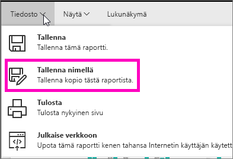
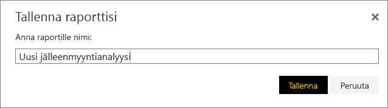
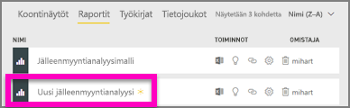

# Uuden raportin luominen olemassa olevasta raportista (raportin kopioiminen)
Sinulla saattaa olla raportti, joka on jo yhteydessä tietojoukkoon ja joka käyttää visualisointeja, joita haluat käyttää uudelleen tai muokata.  Voit kopioida kyseisen raportin uuden raportin pohjaksi.  Toimi seuraavasti:

1. [Avaa raportti](consumer/end-user-report-open.md).
2. Valitse **Tiedosto**-valikosta **Tallenna nimellä**.
   
   
3. Nimeä uusi raportti ja valitse **Tallenna**.
   
   
   
   Onnistumisilmoitus kertoo, että uusi raportti tallennettiin nykyiseen Power BI -työtilaan.
   
   
4. Avaa **Raportit** -välilehti työtilassa ja avaa tallentamasi uusi raportti. Voit halutessasi poistaa visualisoinnit, joita et halua säilyttää, muokata muita visualisointeja sekä lisätä uusia.
   
   
5. Raportin päivittäminen ja muokkaaminen on hauskaa.

## Seuraavat vaiheet:
[Luo uusia visualisointeja](visuals/power-bi-report-add-visualizations-ii.md)

[Poista visualisointeja](consumer/end-user-delete.md), joita et tarvitse

[Luo raportti käyttämällä Power BI Desktopia](desktop-report-view.md)
