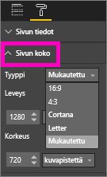

# Power BI -raportin sivun näyttöasetukset
Ymmärrämme, miten tärkeää on pitää raportin asettelu pikselilleen oikein. Joskus se voi olla hankalaa, koska sinä ja työtoverisi saatatte katsella raportteja erikokoisilta näytöiltä, joissa on erilaiset kuvasuhteet. 

Näyttönäkymän oletusasetuksena on **Sovita sivulle**, ja näytön koon oletusasetus on **16:9**. Jos haluat lukita käyttöön jonkin muun kuvasuhteen tai sovittaa raportin eri tavalla, käytettävissäsi ovat ***Sivunäkymä***- ja ***Sivun koko*** ‑asetukset.

<iframe width="560" height="315" src="https://www.youtube.com/embed/5tg-OXzxe2g" frameborder="0" allowfullscreen></iframe>

## Sivun näkymäasetusten sijainti Power BI -palvelussa ja Power BI Desktopissa
Sivun näkymäasetukset ovat käytettävissä sekä Power BI -palvelussa että Power BI Desktopissa, mutta niiden käyttöliittymät poikkeavat hieman toisistaan. Seuraavissa kahdessa osiossa kerrotaan, missä näkymäasetukset sijaitsevat kummassakin Power BI ‑työkalussa.

### Power BI Desktopissa
Valitse Raporttinäkymästä **Näkymä**, jolloin esiin tulee sivun näkymäasetukset sekä puhelimen asetteluasetukset.

  

### Power BI -palvelussa (app.powerbi.com)
Avaa Power BI-palvelussa raportti ja valitse vasemmasta yläkulmasta valikko **Näkymä**.

Sivun näkymäasetukset ovat käytettävissä sekä [luku- että muokkausnäkymässä](consumer/end-user-reading-view.md). Muokkausnäkymässä raportin omistaja voi määrittää yksittäisille raportin sivuille sivun näkymäasetukset, ja asetukset tallentuvat yhdessä raportin kanssa. Kun työtoverit avaavat raportin lukunäkymässä, he näkevät raportin sivut omistajan asetusten mukaisesti.  Lukunäkymässä työtoverit voivat muuttaa *joitakin* sivun näkymäasetuksia, mutta muutoksia ei tallenneta raportin sulkemisen yhteydessä.

##    Sivun näkymäasetukset
Ensimmäiset *Sivunäkymä*-asetukset määrittävät raporttisivun näyttämisen suhteessa selainikkunaan.  Vaihtoehdot ovat:

* **Sovita sivulle** (oletusasetus): sisältö skaalataan sen mukaan, miten se sopii sivulle parhaiten
* **Sovita leveyteen**: sisältö ovat skaalataan mahtumaan sivulle leveyssuunnassa
* **Todellinen koko**: sisältö näytetään täydessä koossa

Seuraavat *Sivunäkymä*-asetukset määrittävät objektien asettelun raporttipohjalla.

* **Näytä ruudukon viivat**: ottaa käyttöön ruudukon, joka auttaa objektien sijoittelemisessa raporttipohjalle
* **Kohdista ruudukkoon**: käytetään **Näytä ruudukon viivat** ‑asetuksen kanssa objektien tasaamiseen tarkasti raporttipohjalle 
* **Lukitse objektit**: lukitsee kaikki pohjalla olevat objektit niin, ettei niitä voi siirtää eikä niiden kokoa muuttaa
* **Valinta-paneeli**: Valinta-paneelissa on luettelo kaikista raporttipohjalla olevista objekteista, joista voit päättää, mitkä näytetään ja mitkä piilotetaan

    

## Sivun koko ‑asetukset

*Sivun koko* ‑asetukset ovat vain raportin omistajan käytettävissä. Power BI -palvelussa (app.powerbi.com) se tarkoittaa, että pystyy avaamaan raportin [muokkausnäkymässä](consumer/end-user-reading-view.md). Asetuksilla määritetään raporttipohjan kuvasuhde ja todellinen koko (kuvapisteinä).   

* Suhde 4:3
* Suhde 16:9 (oletusasetus)
* Cortana
* Letter
* Mukautettu (korkeus ja leveys kuvapisteinä)

## Seuraavat vaiheet
[Opettele käyttämään sivun näkymä- ja kokoasetuksia omissa Power BI ‑raporteissasi](consumer/end-user-report-view.md).

Lue lisää [Power BI -raporteista](consumer/end-user-reports.md)

[Power BI:n peruskäsitteet](consumer/end-user-basic-concepts.md)

Onko sinulla muuta kysyttävää? [Kokeile Power BI -yhteisöä](http://community.powerbi.com/)

