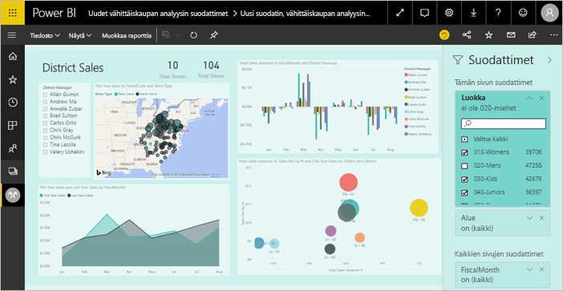
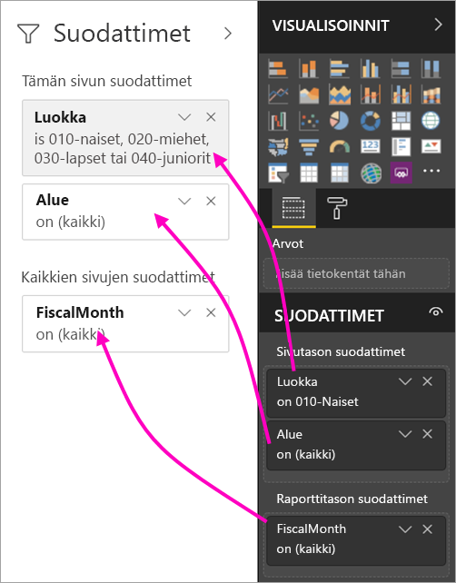
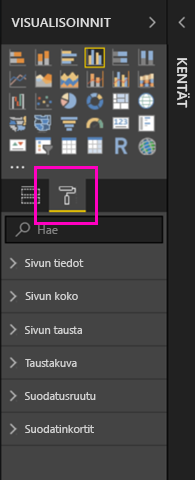
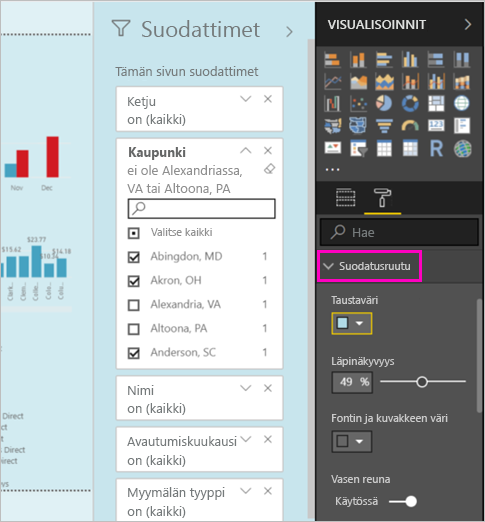
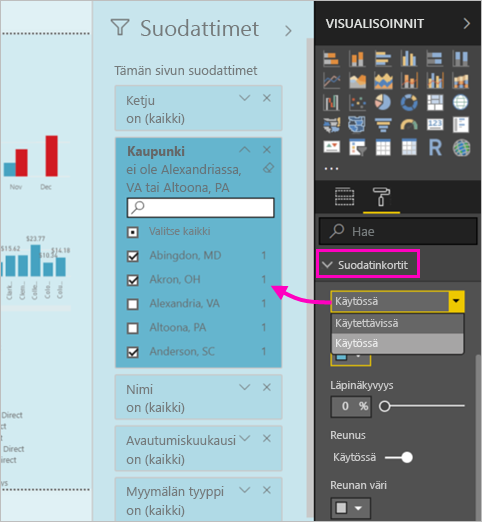
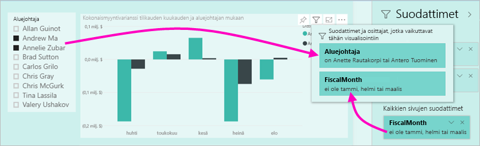

# Uusi suodatuskokemus Power BI -raporteissa (esikatselu)

Tässä artikkelissa käsitellään uutta suodatuskokemusta: Power BI -suodattimet saavat uusia toimintoja ja uuden rakenteen. Kun suunnittelet raportteja Power BI Desktopissa tai Power BI -palvelussa, voit saada Suodattimet-ruudun näyttämään samalta ja toimimaan samoin kuin koko raportti. Uudessa kokemuksessa vanha Suodattimet-ruutu toimii suodattimen muokkausruutuna ja uusi Suodattimet-ruutu on ainoa, jonka raportin kuluttajat näkevät. 
 

Raportin suunnittelijana voit tehdä seuraavia asioita uusilla suodattimilla:

- Voit näyttää suodattimien vain luku -näkymän visualisoinnin otsikossa, jotta kuluttajat tietävät täsmälleen, mitkä suodattimet tai osittajat vaikuttavat kyseiseen visualisointiin.
- Voit muotoilla ja mukauttaa suodatinruutua siten, että tuntuu raportin osalta.
- Voit määrittää, onko Suodattimet-ruutu avoin vai kutistettu oletusarvoisesti, kun käyttäjä avaa raportin.
- Voit piilottaa koko suodatinruudun tai tietyt suodattimet, joita et halua raportin kuluttajien näkevän.
- Voit hallita ja jopa lisätä kirjanmerkkeihin näkyvyyden, uuden suodatinruudun avoimen tai kutistetun tilan.
- Voit lukita suodattimet, joita et halua kuluttajien muokkaavan.

## Ota käyttöön uusi suodatuskokemus 

Voit ottaa käyttöön uuden kokemuksen Power BI Desktopissa. Sitten voit muokata suodattimia siellä tai Power BI -palvelussa (https://app.powerbi.com). Koska tämä uusi suodatuskokemus on esikatselutilassa, se on ensin otettava käyttöön Power BI Desktopissa. Jos aloitat luomalla raportin Power BI -palvelussa, siinä ei voi käyttää uusia suodattimia.

### Ota käyttöön uudet suodattimet kaikissa uusissa raporteissa

1. Valitse Power BI Desktopissa **Tiedosto** > **Asetukset ja vaihtoehdot** > **Asetukset** > **Esikatselutoiminnot** ja valitse sitten **Uusi suodatuskokemus** -valintaruutu. 
2. Käynnistä Power BI Desktop uudelleen nähdäksesi uuden suodatuskokemuksen kaikissa uusissa raporteissa.

Power BI Desktopin uudelleenkäynnistämisen jälkeen se on käytössä oletusarvoisesti kaikissa uusissa raporteissa, jotka luot.  

### Ota käyttöön uudet suodattimet aiemmin luodussa raportissa

Voit ottaa käyttöön uudet suodattimet myös aiemmin luoduissa raporteissa.

1. Valitse Power BI Desktopin aiemmin luodussa raportissa **Tiedosto** > **Asetukset ja vaihtoehdot** > **Asetukset**
2. Valitse **Raportin asetukset** -kohdassa **Ota käyttöön päivitetty suodatinruutu ja näytä suodattimet visuaalisessa otsikossa tälle raportille**.

## Luo uusi suodatinruutu

Kun otat käyttöön uuden suodatinruudun, näet sen raporttisivun oikealla puolella muotoiltuna oletusarvoisesti raportin nykyisten asetuksien perusteella. Vanha suodatinruutu toimii nyt suodattimen muokkausruutuna. Uusi suodatinruutu näyttää, mitä raporttien kuluttajat näkevät, kun julkaiset raportin. Voit päivittää olemassa olevia suodattimia uudessa ruudussa, mutta vanhassa suodatinruudussa voit määrittää, mitkä suodattimet haluat sisällyttää.

1. Päätä ensin, haluatko raporttien kuluttajien näkevän suodatinruudun. Jos haluat heidän näkevän sen, valitse silmäkuvake  Suodattimet-kohdan vieressä.

2. Voit aloittaa uuden suodatinruudun luomisen vetämällä haluamasi kentät suodattimen muokkausruutuun joko visualisointi-, sivu- tai raporttitason suodattimina. Voit tarkastella niitä uudessa Suodattimet-ruudussa.

    

Kun lisäät visualisoinnin raportin pohjaan, Power BI lisää automaattisesti suodattimen visualisoinnin jokaiseen kenttään. Power BI ei lisää kyseisiä automaattisia suodattimia vain luku -suodatinruutuun. Sinun on valittava silmäkuvake lisätäksesi ne.

 
## Lukitse tai piilota suodattimet

Voit lukita tai piilottaa yksittäiset suodatinkortit. Jos lukitset suodattimen, raportin kuluttajat voivat tarkastella mutta eivät muuttaa sitä. Jos piilotat sen, he eivät voi edes tarkastella sitä. Suodatinkorttien piilottamisesta on yleensä hyötyä, jos haluat piilottaa tietojen puhdistussuodattimia, jotka sisältävät tyhjäarvoja tai odottamattomia arvoja. 

- Suodattimen muokkausruudussa valitse **Lukitse suodatin**- tai **Piilota suodatin** -kuvakkeet suodatinkortin kohdalla tai poista niiden valinta.

   

Kun otat nämä asetukset käyttöön ja poistat ne käytöstä suodattimen muokkausruudussa, näet muutokset uudessa suodatinruudussa. Piilotetut suodattimet eivät näy suodattimen ponnahdusikkunassa visualisointia varten.

Voit myös määrittää suodatinruudussa tilan työnkulkua varten raportin kirjanmerkkien kanssa. Ruudun avoin-, suljettu- ja näkyvyystilat voidaan kaikki lisätä kirjanmerkiksi.
 
## Muotoile uusi Suodattimet-ruutu

Iso osa tätä uutta kokemusta on se, että voit nyt muotoilla suodatinruudun vastaamaan raportin ulkoasua ja tunnelmaa. Voit muotoilla suodatinruudun eri tavoin raportin jokaisella sivulla. Voit muotoilla seuraavia elementtejä: 

- Taustaväri
- Taustan läpinäkyvyys
- Suodatinruudun reuna käytössä tai pois käytöstä
- Suodatinruudun reunan väri

Voit myös muotoilla näitä elementtejä suodatinkorteissa sen mukaan, onko ne otettu käyttöön (määritetty jollekin) vai käytettävissä (eivät valittuja): 

- Taustaväri
- Taustan läpinäkyvyys
- Reuna: käytössä tai pois käytöstä
- Reunan väri

### Määritä Suodattimet-ruudun ja korttien muotoilu

1. Napsauta raportissa joko itse raporttia tai taustaa (*taustakuva*) ja valitse sitten **Visualisoinnit**-ruudussa **Muotoilu**. 
    Näet vaihtoehtoja raportin sivun, taustakuvan ja myös suodatinruudun ja suodatinkorttien muotoiluun.

        

1. Laajenna **suodatinruutu** määrittääksesi taustan värin, kuvakkeen ja vasemman reunan täydentämään raporttisivua.

    

1. Laajenna **suodatinkortit** määrittääksesi **Käytettävissä**- ja **Otettu käyttöön** -kohtien värin ja reunan. Jos teet Käytettävissä- ja Otettu käyttöön -kohtien korteista eri väriset, on selvää, mitkä suodattimet on otettu käyttöön. 
  
    

## Näytä visualisoinnin suodattimet lukutilassa

Lukutilassa voit visualisointia osoittamalla näyttää ponnahdusikkunan, joka sisältää kaikki visualisointiin vaikuttavat suodattimet, osittajat ja niin edelleen. Ponnahdusikkunan muotoilu on sama kuin suodatinruudun muotoilu. 

Seuraavat suodattimet näkyvät tässä näkymässä: 
- Perussuodattimet
- Osittajat
- Ristiinkorostus 
- Ristiinsuodatus
- Lisäsuodattimet
- Ylimmät N-suodattimet
- Suhteelliset päivämääräsuodattimet
- Synkronoinnin osittajat
- Sisällytä / Jätä pois -suodattimet
- Suodattimet, jotka välitetään URL-osoitteen kautta

## Tulossa pian

Tulevina kuukausina aiomme sisällyttää seuraavat parannukset:
- Mahdollisuus muuttaa suodatinkorttien järjestystä
- Yhden suodatinruudun käyttökokemus raportin tekijöille 
- Lisää muotoiluasetuksia

Kokeile uutta suodatuskokemusta. Anna meille palautetta tästä ominaisuudesta ja siitä, miten voimme jatkaa tämän kokemuksen parantamista. 

## Seuraavat vaiheet
[Raporttisuodattimien käyttäminen](consumer/end-user-report-filter.md)

[Suodattimet ja korostaminen raporteissa](power-bi-reports-filters-and-highlighting.md)

[Suodattimien ja korostamisen käsitteleminen raportin lukunäkymässä](consumer/end-user-reading-view.md)

[Raportin visualisointien ristiinsuodatuksen ja ristiinkorostuksen muuttaminen suhteessa toisiinsa](consumer/end-user-interactions.md)

Onko sinulla kysyttävää? [Kokeile Power BI -yhteisöä](http://community.powerbi.com/)

