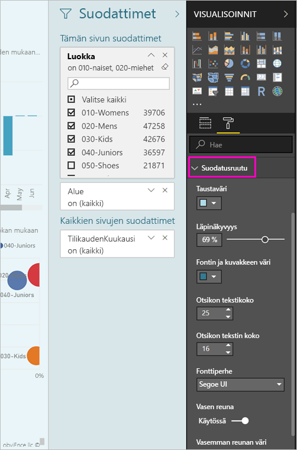
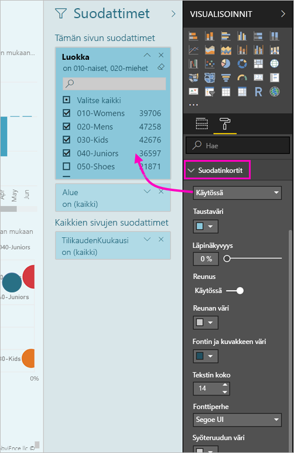

# <a name="the-new-filter-experience-in-power-bi-reports-preview"></a>Uusi suodatuskokemus Power BI -raporteissa (esikatselu)

Power BI-suodattimien on uusia toimintoja ja uusi rakenne. Kun esikatseluominaisuuksien käyttäminen suodatin uuden kokemuksen, voit muotoilla näyttää samalta kuin muut raportin suodattimet-ruutu. Voit lukita ja jopa piilottaa suodattimia. Kun suunnittelet raportin, näet enää vanha suodattimet-ruudun lainkaan visualisoinnit-ruudussa. Voit tehdä kaikki suodattimen muokkaaminen ja muotoileminen yhteen suodattimet-ruutuun. 


> [!NOTE]
> Uusi suodatuskokemus on esikatseluvaiheessa. Uudet koontiversiot saattavat ohittaa määrittämäsi muotoilut.

Raportin suunnittelijan on täällä, mitä voit tehdä uuden yhteen suodattimet-ruudussa:

- Lisätä ja poistaa kenttiä ja suodattaa. 
- Muuttaa suodatin.
- Muotoile ja mukauttaa suodattimet-ruudussa, niin, että tuntuu raportin osana.
- Voit määrittää, onko Suodattimet-ruutu avoin vai kutistettu oletusarvoisesti, kun käyttäjä avaa raportin.
- Piilottaa tietyt suodattimet, joita et halua nähdä raporttien tai koko suodattimet-ruudussa.
- Ohjausobjektin ja jopa kirjanmerkin näkyvyyden, Avaa ja kutistettu tilan uusi suodattimet-ruutu.
- Voit lukita suodattimet, joita et halua kuluttajien muokkaavan.

Uusi suodatin-kokemuksen raporttien myös viemällä hiiren osoittimen visualisoinnista vain luku-luettelo, suodattimia tai osittajia, joka vaikuttaa tämän visualisoinnin.


## <a name="turn-on-the-new-filter-experience"></a>Ota käyttöön uusi suodatuskokemus 

Voit ottaa käyttöön uuden kokemuksen Power BI Desktopissa. Sitten voit muokata suodattimia siellä tai Power BI -palvelussa (https://app.powerbi.com). Koska tämä uusi suodatuskokemus on esikatselutilassa, se on ensin otettava käyttöön Power BI Desktopissa. Jos aloitat luomalla raportin Power BI -palvelussa, siinä ei voi käyttää uusia suodattimia.

### <a name="turn-on-new-filters-for-all-new-reports"></a>Ota käyttöön uudet suodattimet kaikissa uusissa raporteissa

1. Valitse Power BI Desktopissa **Tiedosto** > **Asetukset ja vaihtoehdot** > **Asetukset** > **Esikatselutoiminnot** ja valitse sitten **Uusi suodatuskokemus** -valintaruutu. 
2. Käynnistä Power BI Desktop uudelleen nähdäksesi uuden suodatuskokemuksen kaikissa uusissa raporteissa.

Power BI Desktopin uudelleenkäynnistämisen jälkeen se on käytössä oletusarvoisesti kaikissa uusissa raporteissa, jotka luot.  

### <a name="turn-on-new-filters-for-an-existing-report"></a>Ota käyttöön uudet suodattimet aiemmin luodussa raportissa

Voit ottaa käyttöön uudet suodattimet myös aiemmin luoduissa raporteissa.

1. Valitse Power BI Desktopin aiemmin luodussa raportissa **Tiedosto** > **Asetukset ja vaihtoehdot** > **Asetukset**
2. Vasemmassa siirtymispalkissa kohdassa **nykyinen tiedosto**, valitse **raportin asetukset**.
3. Valitse **suodatus käyttökokemus**, valitse **käyttöön päivitetty suodattimet-ruutu ja Näytä suodattimet tämän raportin visualisoinnin otsikon**.

## <a name="view-filters-for-a-visual-in-reading-mode"></a>Näytä visualisoinnin suodattimet lukutilassa

Lukutilassa voit visualisoinnin suodatuskuvaketta osoittamalla näyttää ponnahdusikkunan, joka sisältää kaikki visualisointiin vaikuttavat suodattimet, osittajat ja niin edelleen. Ponnahdusikkunat muotoilu on sama kuin suodattimet-ruudussa-muotoilun. 


Seuraavat suodattimet näkyvät tässä näkymässä: 
- Perussuodattimet
- Osittajat
- Ristiinkorostus 
- Ristiinsuodatus
- Lisäsuodattimet
- Ylimmät N-suodattimet
- Suhteelliset päivämääräsuodattimet
- Synkronoinnin osittajat
- Sisällytä / Jätä pois -suodattimet
- Suodattimet, jotka välitetään URL-osoitteen kautta

## <a name="build-the-new-filters-pane"></a>Luo uusi suodattimet-ruutu

Kun otat käyttöön uuden suodattimet-ruutu, näet sen oikealla puolella raporttisivun muotoiltu oletusarvoisesti nykyisen raportin asetuksien perusteella. Uusi suodattimet-ruudun avulla voit määrittää mitkä suodattimet sisältävät ja päivittää olemassa olevia suodattimia uuden ruudun. Uusi suodattimet-ruutu näyttää, mitä-raporttien näet kun julkaiset raportin. 

1. Oletusarvon mukaan raportin käyttäjät näkevät suodattimet-ruutu. Jos et halua nähdä sitä, valitse silmäkuvaketta kohdan **suodattimet**.

    

2. Uusi suodattimet-ruudun kehittämiseen Vedä kentät, joita haluat tutkia uusi suodattimet-ruudun visualisoinnin, sivun joko tai raporttitason suodattimet.

Kun lisäät visualisointiin raportin pohja, Power BI lisää automaattisesti suodattimen visualisoinnin kunkin kentän suodattimet-ruutu. 

## <a name="lock-or-hide-filters"></a>Lukitse tai piilota suodattimet

Voit lukita tai piilottaa yksittäiset suodatinkortit. Jos lukitset suodattimen, raportin kuluttajat voivat tarkastella mutta eivät muuttaa sitä. Jos piilotat sen, he eivät voi edes tarkastella sitä. Suodatinkorttien piilottamisesta on yleensä hyötyä, jos haluat piilottaa tietojen puhdistussuodattimia, jotka sisältävät tyhjäarvoja tai odottamattomia arvoja. 

- Uusi suodattimet-ruudussa, valitse tai tyhjennä **lukituksen suodatin** tai **Piilota suodatin** suodatuksen kortti kuvakkeita.

   

Kun otat nämä asetukset käyttöön ja poistaa käytöstä uusi suodattimet-ruudussa, voit nähdä muutokset näkyvät raportissa. Piilotetut suodattimet eivät näy suodattimen ponnahdusikkunassa visualisointia varten.

Voit myös määrittää uusia suodattimia ruudussa tilaksi työnkulku, jossa on raportin kirjanmerkit. Ruudun avoin-, suljettu- ja näkyvyystilat voidaan kaikki lisätä kirjanmerkiksi.
 
## <a name="format-the-new-filters-pane"></a>Muotoile uusi Suodattimet-ruutu

Suuri osa tämän uuden kokemuksen on, että voit muotoilla raportin ulkoasun vastaamaan suodattimet-ruutu. Voit muotoilla eri tavoin, jokainen raportin suodattimet-ruutu. Voit muotoilla seuraavia elementtejä: 

- Taustaväri
- Taustan läpinäkyvyys
- Reunan käytössä tai pois käytöstä
- Reunan väri
- Otsikon ja otsikon fontti, väri ja tekstin koko

Voit myös muotoilla näitä elementtejä suodatinkorteissa sen mukaan, onko ne otettu käyttöön (määritetty jollekin) vai käytettävissä (eivät valittuja): 

- Taustaväri
- Taustan läpinäkyvyys
- Reuna: käytössä tai pois käytöstä
- Reunan väri
- Fontti, väri ja tekstin koko
- Syöteruudun väri

### <a name="format-the-filters-pane-and-cards"></a>Muotoile suodattimet-ruutu ja korteissa

1. Napsauta raportissa joko itse raporttia tai taustaa (*taustakuva*) ja valitse sitten **Visualisoinnit**-ruudussa **Muotoilu**. 
    Näet vaihtoehtoja raportin sivulla taustakuvan, ja myös suodattimet-ruutu ja suodatin kortit.

        

1. Laajenna **suodatinruutu** määrittääksesi taustan värin, kuvakkeen ja vasemman reunan täydentämään raporttisivua.

    

1. Laajenna **suodatinkortit** määrittääksesi **Käytettävissä**- ja **Otettu käyttöön** -kohtien värin ja reunan. Jos teet Käytettävissä- ja Otettu käyttöön -kohtien korteista eri väriset, on selvää, mitkä suodattimet on otettu käyttöön. 
  
    

## <a name="theming-for-filter-pane"></a>Suodattimet-ruutu teema
Voit muokata suodatinruutu oletusasetukset nyt teema kanssa. Tässä on esimerkki-teeman edistynyttä avulla pääset alkuun:

 
```
"outspacePane": [{ 

"backgroundColor": {"solid": {"color": "#0000ff"}}, 

"foregroundColor": {"solid": {"color": "#00ff00"}}, 

"transparency": 50, 

"titleSize": 35, 

"headerSize": 8, 

"fontFamily": "Georgia", 

"border": true, 

"borderColor": {"solid": {"color": "#ff0000"}} 

}], 

"filterCard": [ 

{ 

"$id": "Applied", 

"transparency": 0, 

"backgroundColor": {"solid": {"color": "#ff0000"}}, 

"foregroundColor": {"solid": {"color": "#45f442"}}, 

"textSize": 30, 

"fontFamily": "Arial", 

"border": true, 

"borderColor": {"solid": {"color": "#ffffff"}}, 

"inputBoxColor": {"solid": {"color": "#C8C8C8"}} 

}, 

{ 

"$id": "Available", 

"transparency": 40, 

"backgroundColor": {"solid": {"color": "#00ff00"}}, 

"foregroundColor": {"solid": {"color": "#ffffff"}}, 

"textSize": 10, 

"fontFamily": "Times New Roman", 

"border": true, 

"borderColor": {"solid": {"color": "#123456"}}, 

"inputBoxColor": {"solid": {"color": "#777777"}} 

}] 
```

## <a name="sort-the-filter-pane"></a>Lajittele suodattimet-ruutu

Mukautetun lajittelun toimintoja on osa uuden suodattimen ruudussa käyttökokemuksen. Raportin luojat vetämällä ja pudottamalla suodattimet järjestää ne, jotka haluavat järjestyksessä.


Lajittele oletusjärjestyksenä on aakkosjärjestys suodattimet. Aloita mukautetun lajittelun tilassa, vedä suodattimen uuteen paikkaan. Voit lajitella vain suodattimia sisällä tason he pätevät--esimerkiksi visuaalisen tason, sivutason ja raporttitason suodatin.

## <a name="filters-pane-scaling"></a>Suodattaa ruudussa skaalaus

Uusi suodattimet-ruudun kasvavat raporttisivu ja visualisoinnit, joten raporttisivun ja suodattimet-ruudussa pysy suhteessa toistensa kanssa.

## <a name="improved-filters-pane-accessibility"></a>Parannettu suodattimet-ruudussa helppokäyttötoiminnot

Olemme parantaneet näppäimistöllä uusi suodattimet-ruudun. Voit suodattimet-ruutu kaikki osat läpi SARKAINTA ja Avaa pikavalikko näppäimistön tai VAIHTO + F10 kontekstissa-näppäimen avulla.


## <a name="rename-filters"></a>Nimeä uudelleen suodattimet
Kun muokkaat suodattimet-ruutu, kaksoisnapsautat otsikko ja muokata sitä. Nimeäminen uudelleen on hyötyä, jos haluat päivittää ennemmin loppukäyttäjien suodatinkortti. Pidä mielessä, nimeäminen uudelleen suodatuksen kortti *ei* näytön nimeä kentän kentät-luettelossa. Se muuttuu vain käyttää suodatuksen kortti näyttönimi.


## <a name="restrict-changes-to-filter-type"></a>Rajoita muutokset suodatintyyppi

Kohdassa suodatus koe osion raporttiasetukset, voit valita joko ohjausobjektissa, jos käyttäjät voivat muuttaa suodatinta.


## <a name="next-steps"></a>Seuraavat vaiheet

Kokeile uutta suodatuskokemusta. Anna meille palautetta toiminto ja miten voimme jatkaa parantaa sitä, [Power BI ideoita sivuston](https://ideas.powerbi.com/forums/265200-power-bi). 

- [Raporttisuodattimien käyttäminen](consumer/end-user-report-filter.md)
- [Suodattimet ja korostaminen raporteissa](power-bi-reports-filters-and-highlighting.md)

Onko sinulla kysyttävää? [Kokeile Power BI -yhteisöä](http://community.powerbi.com/)

