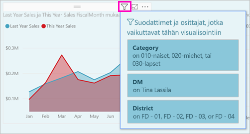
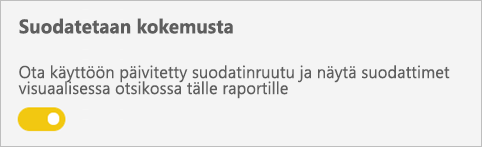
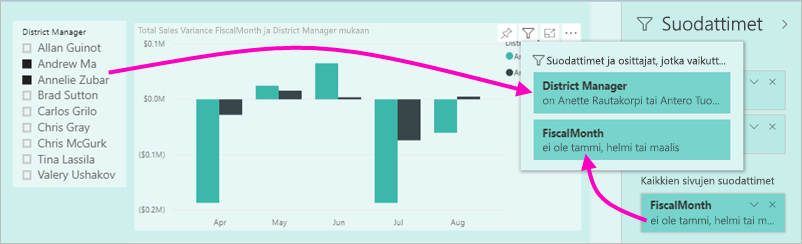
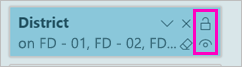
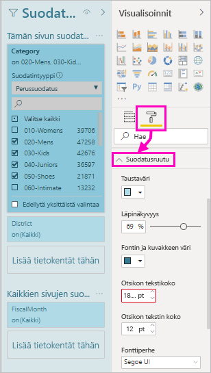
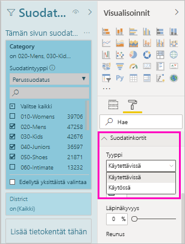
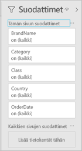
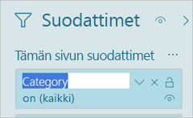
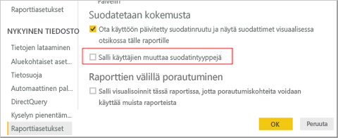

# <a name="the-new-filter-experience-in-power-bi-reports"></a>Uusi suodatuskokemus Power BI -raporteissa

Power BI:n suodattimilla on uusia toimintoja ja uusi rakenne. Kun valitset uuden suodatuskokemuksen, voit muotoilla Suodattimet-ruutua siten, että se näyttää samalta kuin muu raportti. Voit lukita ja jopa piilottaa suodattimia. Kun suunnittelet raporttia, et enää näe vanhaa Suodattimet-ruutua lainkaan Visualisoinnit-ruudussa. Voit tehdä kaikenlaiset suodattimen muokkaukset ja muotoilut yhdessä Suodattimet-ruudussa. 


Raportin suunnittelijana voit tehdä seuraavia asioita uudessa Suodattimet-ruudussa:

- Lisätä ja poistaa suodatettavia kenttiä. 
- Muuttaa suodattimen tilaa.
- Muotoilla ja mukauttaa Suodattimet-ruutua siten, että se tuntuu raportin osalta.
- Voit määrittää, onko Suodattimet-ruutu avoin vai kutistettu oletusarvoisesti, kun käyttäjä avaa raportin.
- Voit piilottaa koko Suodattimet-ruudun tai tietyt suodattimet, joita et halua raportin käyttäjien näkevän.
- Voit hallita ja jopa lisätä kirjanmerkkeihin näkyvyyden ja uuden Suodattimet-ruudun avoimen tai kutistetun tilan.
- Voit lukita suodattimet, joita et halua kuluttajien muokkaavan.

Uuden suodatinkokemuksen ansiosta käyttäjät voivat myös liikuttaa hiiren osoitinta minkä tahansa visualisoinnin päällä ja nähdä Vain luku -luettelon kaikista suodattimista tai osittajista, jotka vaikuttavat tähän visualisointiin.



## <a name="turn-on-the-new-filter-experience"></a>Ota käyttöön uusi suodatuskokemus 

Uusi suodatuskokemus otetaan käyttöön oletuksena uusissa raporteissa. Voit ottaa käyttöön uuden käyttökokemuksen jo olemassa olevissa raporteissa Power BI Desktopissa tai Power BI -palvelussa.

### <a name="turn-on-new-filters-for-an-existing-report-in-power-bi-desktop"></a>Ota käyttöön uudet suodattimet aiemmin luodussa raportissa Power BI Desktopissa

1. Valitse Power BI Desktopin aiemmin luodussa raportissa **Tiedosto** > **Asetukset ja vaihtoehdot** > **Asetukset**
2. Valitse vasemmasta siirtymispalkista **Nykyinen tiedosto** -kohdan alta **Raportin asetukset**.
3. Valitse **Suodatuskokemus**-kohdan alta **Ota käyttöön päivitetty suodatinruutu ja näytä suodattimet visualisoinnin otsikossa tälle raportille**.

### <a name="turn-on-new-filters-for-an-existing-report-in-the-service"></a>Ota käyttöön uudet suodattimet aiemmin luodussa raportissa palvelussa

Jos olet ottanut **uuden ulkoasun** käyttöön Power BI -palvelussa , uusi suodatuskokemus otetaan käyttöön automaattisesti. Lue lisää [Power BI -palvelun uudesta ulkoasusta](service-new-look.md).

Jos et ole ottanut uutta ulkoasua käyttöön, voit nähdä uuden suodatuskokemuksen noudattamalla seuraavia vaiheita.

1. Valitse Power BI -palvelussa **Raportit**-välilehti työtilan sisältöluettelosta.
2. Etsi raportti, jonka haluat ottaa käyttöön, ja valitse kyseisen raportin **Asetukset**-kuvake ](media/power-bi-report-filter/power-bi-settings-icon.png)Raportin asetukset -kuvake![.
3. Valitse **Suodatuskokemus**-kohdan alta **Ota käyttöön päivitetty suodatinruutu ja näytä suodattimet visualisoinnin otsikossa tälle raportille**.

    

## <a name="view-filters-for-a-visual-in-reading-mode"></a>Näytä visualisoinnin suodattimet lukutilassa

Lukutilassa voit visualisoinnin suodatuskuvaketta osoittamalla näyttää suodatinluettelon ponnahdusikkunan, joka sisältää kaikki visualisointiin vaikuttavat suodattimet, osittajat ja niin edelleen. Suodatinluettelon ponnahdusikkunan muotoilu on sama kuin Suodattimet-ruudun muotoilu. 



Seuraavat suodattimet näkyvät tässä näkymässä: 
- Perussuodattimet
- Osittajat
- Ristiinkorostus 
- Ristiinsuodatus
- Lisäsuodattimet
- Ylimmät N-suodattimet
- Suhteelliset päivämääräsuodattimet
- Synkronoinnin osittajat
- Sisällytä / Jätä pois -suodattimet
- Suodattimet, jotka välitetään URL-osoitteen kautta

## <a name="build-the-new-filters-pane"></a>Luo uusi Suodattimet-ruutu

Kun otat käyttöön uuden Suodattimet-ruudun, näet sen raporttisivun oikealla puolella muotoiltuna oletusarvoisesti raportin nykyisten asetusten mukaan. Voit uuden Suodattimet-ruudun avulla määrittää, mitkä suodattimet haluat sisällyttää, ja päivittää nykyisiä suodattimia uudessa ruudussa. Uusi Suodattimet-ruutu näyttää, mitä raporttien käyttäjät näkevät, kun julkaiset raportin. 

1. Oletusarvon mukaan raportin käyttäjät voivat nähdä Suodattimet-ruudun. Jos et halua heidän näkevän sitä, valitse silmäkuvake **Suodattimet**-ruudun vierestä.

    

2. Voit aloittaa uuden Suodattimet-ruudun luomisen vetämällä haluamasi kentät uuteen Suodattimet-ruutuun joko visualisointi-, sivu- tai raporttitason suodattimina.

Kun lisäät visualisoinnin raporttipohjaan, Power BI lisää automaattisesti suodattimen Suodattimet-ruutuun visualisoinnin jokaiseen kenttään. 

## <a name="lock-or-hide-filters"></a>Lukitse tai piilota suodattimet

Voit lukita tai piilottaa yksittäiset suodatinkortit. Jos lukitset suodattimen, raportin kuluttajat voivat tarkastella mutta eivät muuttaa sitä. Jos piilotat sen, he eivät voi edes tarkastella sitä. Suodatinkorttien piilottamisesta on yleensä hyötyä, jos haluat piilottaa tietojen puhdistussuodattimia, jotka sisältävät tyhjäarvoja tai odottamattomia arvoja. 

- Valitse uudesta Suodattimet-ruudusta **Lukitse suodatin**- tai **Piilota suodatin** -kuvakkeet suodatinkortissa tai poista niiden valinta.

   

Kun otat nämä asetukset käyttöön ja poistat ne käytöstä uudessa Suodattimet-ruudussa, näet muutokset raportissa. Piilotetut suodattimet eivät näy suodatinluettelon ponnahdusikkunassa visualisointia varten.

Voit myös määrittää uuden Suodattimet-ruudun tilan työnkulkua varten raportin kirjanmerkkien kanssa. Ruudun avoin-, suljettu- ja näkyvyystilat voidaan kaikki lisätä kirjanmerkiksi.
 
## <a name="format-the-new-filters-pane"></a>Muotoile uusi Suodattimet-ruutu

Iso osa tätä uutta kokemusta on se, että voit nyt muotoilla Suodattimet-ruudun vastaamaan raportin ulkoasua ja tunnelmaa. Voit muotoilla Suodattimet-ruudun eri tavoin raportin jokaisella sivulla. Voit muotoilla seuraavia elementtejä: 

- Taustaväri
- Taustan läpinäkyvyys
- Reuna käytössä tai pois käytöstä
- Reunan väri
- Otsikon ja ylätunnisteen fontti, väri ja tekstin koko

Voit myös muotoilla näitä elementtejä suodatinkorteissa sen mukaan, onko ne otettu käyttöön (määritetty jollekin) vai käytettävissä (eivät valittuja): 

- Taustaväri
- Taustan läpinäkyvyys
- Reuna: käytössä tai pois käytöstä
- Reunan väri
- Fontti, väri ja tekstin koko
- Syöteruudun väri

### <a name="format-the-filters-pane-and-cards"></a>Muotoile Suodattimet-ruutua ja kortteja

1. Napsauta raportissa joko itse raporttia tai taustaa (*taustakuva*) ja valitse sitten **Visualisoinnit**-ruudussa **Muotoilu**. 
    Näet vaihtoehtoja raporttisivun, taustakuvan ja myös Suodattimet-ruudun ja Suodattimet-korttien muotoiluun.

1. Laajenna **suodatinruutu** määrittääksesi taustan värin, kuvakkeen ja vasemman reunan täydentämään raporttisivua.

    

1. Laajenna **suodatinkortit** määrittääksesi **Käytettävissä**- ja **Otettu käyttöön** -kohtien värin ja reunan. Jos teet Käytettävissä- ja Otettu käyttöön -kohtien korteista eri väriset, on selvää, mitkä suodattimet on otettu käyttöön. 
  
    

## <a name="theming-for-filter-pane"></a>Suodattimet-ruudun teeman määrittäminen
Voit nyt muuttaa suodatinruudun oletusasetuksia teematiedoston avulla. Tässä on esimerkki teemakatkelmasta, jonka avulla pääset alkuun:

 
```
"outspacePane": [{ 

"backgroundColor": {"solid": {"color": "#0000ff"}}, 

"foregroundColor": {"solid": {"color": "#00ff00"}}, 

"transparency": 50, 

"titleSize": 35, 

"headerSize": 8, 

"fontFamily": "Georgia", 

"border": true, 

"borderColor": {"solid": {"color": "#ff0000"}} 

}], 

"filterCard": [ 

{ 

"$id": "Applied", 

"transparency": 0, 

"backgroundColor": {"solid": {"color": "#ff0000"}}, 

"foregroundColor": {"solid": {"color": "#45f442"}}, 

"textSize": 30, 

"fontFamily": "Arial", 

"border": true, 

"borderColor": {"solid": {"color": "#ffffff"}}, 

"inputBoxColor": {"solid": {"color": "#C8C8C8"}} 

}, 

{ 

"$id": "Available", 

"transparency": 40, 

"backgroundColor": {"solid": {"color": "#00ff00"}}, 

"foregroundColor": {"solid": {"color": "#ffffff"}}, 

"textSize": 10, 

"fontFamily": "Times New Roman", 

"border": true, 

"borderColor": {"solid": {"color": "#123456"}}, 

"inputBoxColor": {"solid": {"color": "#777777"}} 

}] 
```

## <a name="sort-the-filter-pane"></a>Lajittele suodatinruutu

Mukautettu lajittelutoiminto on osa uutta suodatinruutukokemusta. Raportin luojat voivat vetää ja pudottaa suodattimet niiden järjestämiseksi uudelleen haluttuun järjestykseen.


Suodattimet lajitellaan oletusarvoisesti aakkosjärjestyksessä. Voit aloittaa mukautetun lajittelun tilassa vetämällä minkä tahansa suodattimen uuteen paikkaan. Voit lajitella suodattimia vain tasolla, johon niitä käytetään, kuten visualisointitason, sivutason tai raporttitason suodatin.

## <a name="improved-filters-pane-accessibility"></a>Parannetut Suodattimet-ruudun helppokäyttötoiminnot

Olemme parantaneet uuden Suodattimet-ruudun näppäimistön selausta. Voit siirtyä Suodattimet-ruudun kaikissa osissa ja avata pikavalikon näppäimistön pikanäppäimen tai Vaihto + F10 -näppäimen avulla.



## <a name="rename-filters"></a>Nimeä suodattimet uudelleen
Kun muokkaat Suodattimet-ruutua, voit muokata otsikkoa kaksoisnapsauttamalla sitä. Uudelleennimeämisestä on hyötyä, jos haluat päivittää suodatinkortin, jotta se on mielekkäämpi loppukäyttäjille. Muista, että suodatinkortin uudelleennimeäminen *ei* nimeä uudelleen kentän näyttönimeä Kentät-luettelossa. Se muuttaa vain suodatinkortissa käytettyä näyttönimeä.



## <a name="restrict-changes-to-filter-type"></a>Rajoita suodatintyypin muutoksia

Voit raporttiasetusten Suodatuskokemus-osiossa hallita sitä, voivatko käyttäjät muuttaa suodatintyyppiä.



## <a name="next-steps"></a>Seuraavat vaiheet

Kokeile uutta suodatuskokemusta. Anna meille palautetta tästä ominaisuudesta ja siitä, miten voimme jatkaa sen parantamista, [Power BI:n ideat -sivustolla](https://ideas.powerbi.com/forums/265200-power-bi). 

- [Raporttisuodattimien käyttäminen](consumer/end-user-report-filter.md)
- [Suodattimet ja korostaminen raporteissa](power-bi-reports-filters-and-highlighting.md)
- [Erilaiset Power BI -suodattimet](power-bi-report-filter-types.md)

Onko sinulla kysyttävää? [Kokeile Power BI -yhteisöä](http://community.powerbi.com/)

