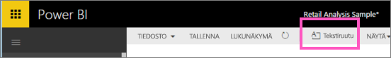
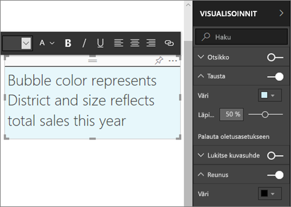
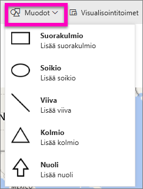
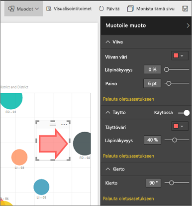

# Tekstiruudut ja muodot Power BI -raporteissa
Voit lisätä tekstiruudut ja muodot raportteja käyttämällä Power BI-palvelussa ja Power BI Desktop. Kummassakin tapauksessa sinulla on oltava raportin muokkausoikeudet. Jos raportti on jaettu kanssasi Power BI-palvelussa, ei ole raportin muokkausoikeuksia. 

Katso käyttää Power BI Desktop- [staattisia kuvia lisääminen raporttiin](guided-learning/visualizations.yml?tutorial-step=11), ja noudata ohjeita kokeile sitten itse käyttämällä Power BI-palvelussa.
> 
> <iframe width="560" height="315" src="https://www.youtube.com/embed/_3q6VEBhGew" frameborder="0" allowfullscreen></iframe>
> 

## Tekstiruudun lisääminen raporttiin
1. Avaa raportti muokkausnäkymässä.

2. Aseta kohdistin raportin piirtoalustan tyhjälle alueelle ja valitse **tekstiruudun** yläreunan valikosta.
   
   
3. Kirjoita tekstiruutuun ja määritä halutessasi muodossa fontti, väri ja tekstin tasaus. 
   
   
4. Jos haluat muuttaa tekstiruudun sijaintia, valitse yläosan harmaa alue ja vedä siitä. Jos haluat muuttaa tekstiruudun kokoa, valitse ja vedä jostakin ääriviivan kahvasta. 
   
   

5. Kun tekstiruutu on edelleen valittuna, lisätä muita muotoiluja **visualisoinnit** ruudussa. Tässä esimerkissä on muotoiltu taustaa ja reunaa. Voit myös luoda tekstiruudulle tarkan koon ja sijainnin.  

   

6. Sulje tekstiruutu valitsemalla mikä tahansa tyhjä kohta raportin piirtoalustassa. 

7. Valitse Kiinnitä-kuvake   Kiinnitä tekstiruutu koontinäyttöön. 

## Muodon lisääminen raporttiin
1. Aseta kohdistin mihin tahansa kohtaan raportin piirtoalustalla ja valitse **Muodot**.
   
   
2. Lisää muoto raportin piirtoalustaan valitsemalla muoto avattavasta valikosta. Tässä esimerkissä Lisää nuolen, joka ohjaa huomion kuplaan, jossa on suurin myyntivariaatio. 
   
   Mukauta muotoa **Muotoile muoto** -ruudussa. Tässä esimerkissä olemme luoneet punaisen nuolen tummanpunaisella reunuksella kierrettynä 90 astetta.
   
   
3. Jos haluat muuttaa muodon sijaintia, valitse yläosan harmaa alue ja vedä siitä. Muodon kokoa, valitse ja vedä jostakin ääriviivan kahvasta. Voit myös tekstiruudun tavoin luoda muodolle tarkan koon ja sijainnin.

   > [!NOTE]
   > muotoja ei voi kiinnittää koontinäyttöön lukuun ottamatta yhtenä visualisointina, kun [kiinnitetään reaaliaikainen sivu](service-dashboard-pin-live-tile-from-report.md). 
   > 
   > 

## Seuraavat vaiheet
[Hyperlinkin lisääminen tekstiruutuun](service-add-hyperlink-to-text-box.md)

[Power BI-palvelun kuluttajille peruskäsitteet](consumer/end-user-basic-concepts.md)

Onko sinulla kysyttävää? [Kokeile Power BI -yhteisöä](http://community.powerbi.com/)
