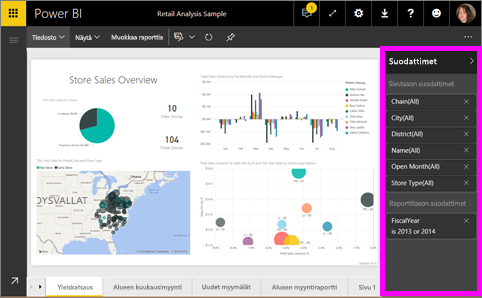
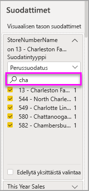
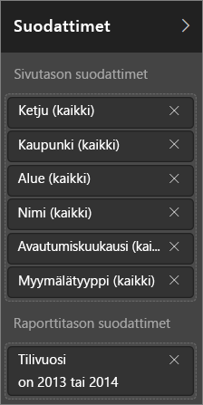
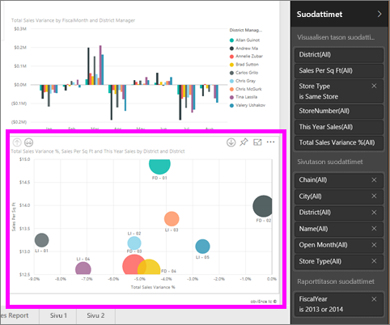
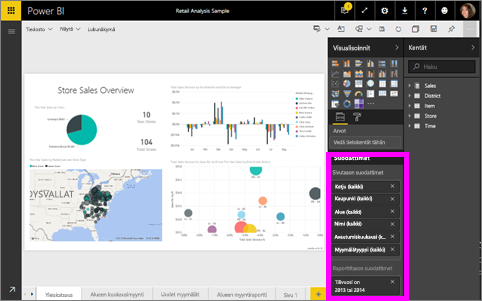

# Tietoja Power BI -raporttien suodattimista ja korostamisesta
 Tässä artikkelissa esitellään suodattaminen ja korostaminen Power BI -palvelussa. Käyttökokemus on lähes sama kuin Power BI Desktopissa. ***Suodattimet*** poistavat kaikki muut tiedot paitsi ne, joihin haluat keskittyä. ***Korostus*** ei suodata. Se ei poista tietoja, vaan korostaa näkyvien tietojen alijoukon, jolloin korostamattomat tiedot pysyvät näkyvissä, mutta himmeinä.

Raportteja voidaan suodattaa ja korostaa monin eri tavoin Power BI:ssä. Kaikkien näiden tietojen kokoaminen yhteen artikkeliin olisi turhan sekavaa, joten tiedot on jaettu seuraaviin osioihin:

* Johdanto suodattimiin ja korostuksiin (artikkeli, jota luet parhaillaan)
* Tavat, joilla voit [luoda ja käyttää muokkausnäkymän suodattimia](power-bi-report-add-filter.md) raporteissa. Kun sinulla on raportin muokkausoikeudet, voit luoda, muokata ja poistaa suodattimia raporteissa.
* Tavat, joilla voit [käyttää suodattimia ja korostuksia kanssasi jaetussa raportissa](consumer/end-user-reading-view.md), raportin lukunäkymässä. Se, mitä voit tehdä, on rajoitetumpaa, mutta käytettävissäsi on silti laaja valikoima vaihtoehtoja suodattamiseen ja korostamiseen.  
* Yksityiskohtainen esittely [suodattimien ja korostusten ohjaimista, jotka ovat käytettävissä muokkausnäkymässä](consumer/end-user-report-filter.md), mukaan lukien perusteellisempi esittely suodatintyypeistä (esimerkiksi päivämäärä ja aika, numerot ja teksti) sekä perusvaihtoehtojen ja lisävaihtoehtojen välinen ero.
* Kun olet oppinut, miten suodattimet ja korostus toimivat oletusarvoisesti, voit lukea, [miten sivulla olevat visualisoinnit suodattavat ja korostavat toisiaan](consumer/end-user-interactions.md)

## Suodattimet-ruudun esittely

Voit käyttää suodattimia **Suodattimet**-ruudussa tai [tekemällä valintoja osittajissa](visuals/power-bi-visualization-slicers.md) suoraan itse raportissa. Suodattimet-ruudussa näkyvät taulukot ja kentät, joita on käytetty raportissa sekä suodattimet, joita on mahdollisesti käytetty. 

Käytössä on neljä erilaista suodatinta:

- **sivusuodatin** koskee kaikkia raporttisivulla olevia visualisointeja     
- **visuaalinen suodatin** koskee raporttisivulla olevaa yksittäistä visualisointia. Näet vain visuaalisen tason suodattimia, jos olet valinnut visualisoinnin raportin pohjalta.    
- **raporttisuodatin** koskee kaikkia raportin sivuja.    
- **porautumissuodatin** koskee mitä tahansa raportin entiteettiä    

Voit hakea haluamaasi arvoa sivulta, visualisoinnista ja raporttisuodattimista luku- tai muokkausnäkymässä ja valita sen. 

Jos suodattimen vieressä on sana **kaikki**, se tarkoittaa, että kaikki kentän arvot sisältyvät suodattimeen.  Esimerkiksi **Chain(All)** alla olevassa näyttökuvassa tarkoittaa, että tämä raporttisivu sisältää tietoja kaikista säilön ketjuista.  Toisaalta raporttitason **FiscalYear is 2013 or 2014** -suodatin ilmaisee, että raportti sisältää tietoja vain tilikaudelta 2013 ja 2014.

## Suodattimet luku- tai muokkausnäkymässä
Raportteja voidaan käsitellä kahdessa eri näkymässä: [lukunäkymässä](consumer/end-user-reading-view.md) ja muokkausnäkymässä. Käytettävissä olevat suodatusominaisuudet vaihtelevat näkymän mukaan.

* Muokkausnäkymässä voit lisätä raportti- ja sivusuodattimia sekä porautumissuodattimia ja visuaalisia suodattimia. Kun tallennat raportin, suodattimet tallennetaan raportin mukana, vaikka avaisit sen mobiilisovelluksessa. Lukunäkymässä raporttia tarkastelevat henkilöt voivat käsitellä lisäämiäsi suodattimia, mutta he eivät voi lisätä uusia suodattimia raporttiin.
* Lukunäkymässä voit käsitellä kaikkia raportissa jo olevia suodattimia ja tallentaa tekemäsi valinnat. Et voi lisätä uusia suodattimia.

### Suodattimet lukunäkymässä
Jos sinulla on oikeudet raporttiin vain lukunäkymässä, Suodattimet-ruutu näyttää tältä:

Tällä raportin sivulla on kuusi sivutason suodatinta ja yksi raporttitason suodatin.

Jokaisessa visualisoinnissa voi olla suodattimia kaikille visualisoinnin kentille, ja raportin tekijä voi lisätä muita. Alla olevassa kuvassa kuplakaaviossa on kuusi suodatinta.

Lukunäkymässä voit tutkia tietoja muokkaamalla olemassa olevia suodattimia. Tekemäsi muutokset tallennetaan raporttiin myös silloin, kun avaat raportin mobiilisovelluksessa. Lue ohjeet [raportin Suodattimet-ruudun esittelystä](consumer/end-user-report-filter.md)

Kun suljet raportin, suodattimet tallennetaan. Jos haluat kumota suodatuksen ja palata takaisin raportin laatijan oletusarvoiseen suodatukseen, jaotteluun, porautumiseen ja lajitteluun, valitse yläosan valikosta **Palauta oletukset**.

### Suodattimet muokkausnäkymässä
Kun sinulla on raportin omistajan oikeudet ja avaat raportin muokkausnäkymässä, näet, että **Suodattimet** on vain yksi monista käytettävissä olevista muokkausruuduista.

Kuten lukunäkymässä, tällä raportin sivulla on kuusi sivutason suodatinta ja yksi raporttitason suodatin. Valitsemalla kuplakaavion voitaisiin nähdä, että sillä on kuusi visuaalisen tason suodatinta.

Suodattimia ja korostamista voidaan hyödyntää enemmän muokkausnäkymässä. Pääasiassa voidaan lisätä uusia suodattimia. Lue, miten [raporttiin lisätään suodatin](power-bi-report-add-filter.md), ja paljon muuta.

## Ad-hoc-korostaminen
Valitse raportin pohjasta kenttä sivun muiden visualisointien korostamiseksi. Valitse sitten tyhjä tila samassa visualisoinnissa sen poistamiseksi. Tämäntyyppinen korostaminen on hauska tapa tutustua nopeasti tietojen vaikutuksiin. Ohjeet tällaisen ristiinkorostuksen hienosäätämisestä ovat artikkelissa [Visualisointitoimet](consumer/end-user-interactions.md) .

## Seuraavat vaiheet
[Lisää suodatin raporttiin (muokkausnäkymässä)](power-bi-report-add-filter.md)

[Tutustu raportin suodattimiin](consumer/end-user-report-filter.md)

[Raportin visualisointien ristiinsuodatuksen ja ristiinkorostuksen muuttaminen suhteessa toisiinsa](consumer/end-user-interactions.md)

Onko sinulla kysyttävää? [Kokeile Power BI -yhteisöä](http://community.powerbi.com/)

