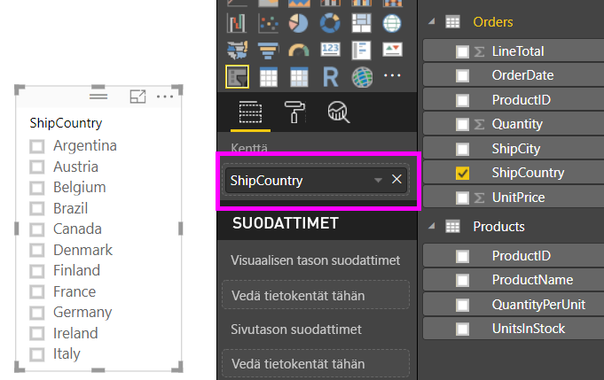
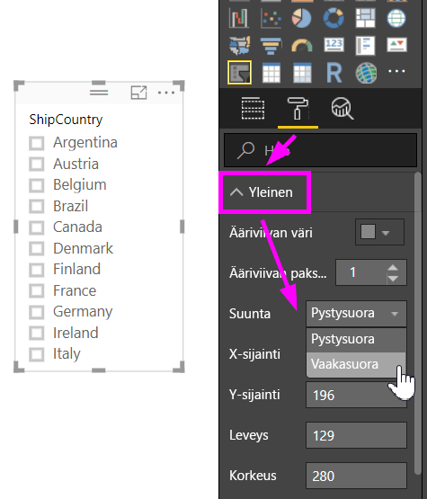
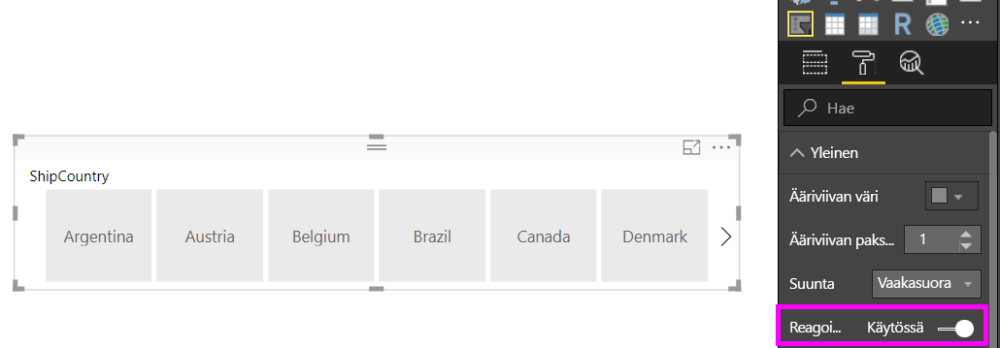
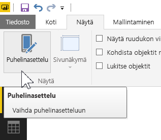
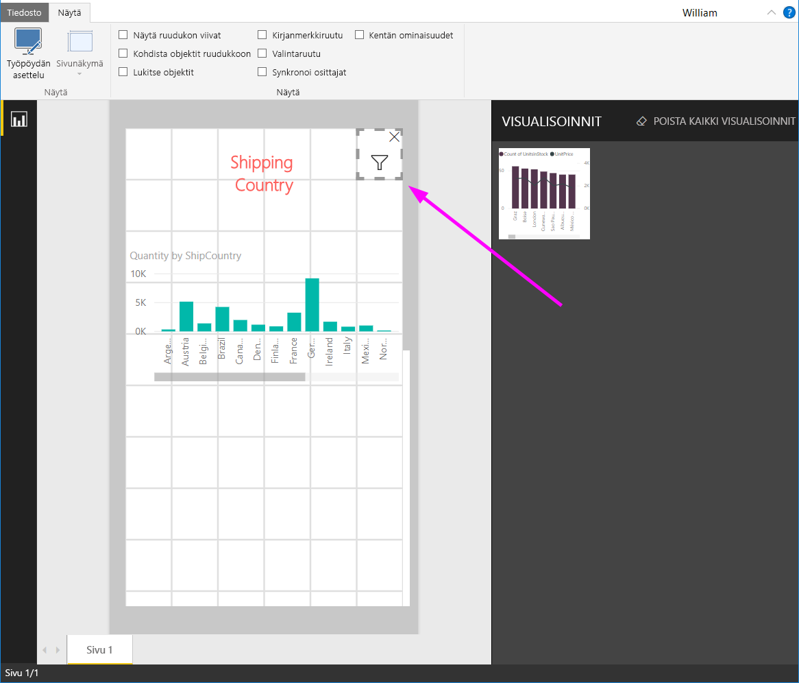

# Kooltaan muokattavan reagoivan osittajan luominen Power BI:ssa

Reagoivien osittajien kokoa voidaan muuttaa mihin tahansa raportin tilaan sopivaksi. Reagoivan osittajan avulla, voit muuttaa niiden kokoa eri kokoihin ja muotoihin, vaakasuuntaisesta pystysuuntaiseksi ja nelikulmaiseksi, ja osittajan arvot järjestävät itsensä kuin sinä. Power BI Desktopin ja Power BI -palvelun avulla voit saada aikaan vaakasuuntaisia osittajia ja reagoivia päivämäärä/alueosittajia. Päivämäärä-/alueosittajilla on myös parannetut kosketusalueet, joten niiden muuttaminen on helpompaa sormenpäällä. Voit tehdä reagoivista osittajista niin pieni tai suuria kuin haluat. Ne myös muuttuvat kooltaan automaattisesti sopimaan hyvin raportteihin Power BI -palvelussa ja Power BI -mobiilisovelluksissa. 

## Osittajan luominen

Ensimmäinen vaihe dynaamisen osittajan luomisessa on perusosittajan luominen. 

1. Valitse **Osittaja**-kuvake  **Visualisoinnit**-ruudusta.
2. Vedä kenttä, jonka haluat suodattaa, kohtaan **Kenttä**.

    

## Vaakasuuntainen osittajan muuntaminen

1. Kun olet valinnut osittajan, tuo muotoiluasetukset näkyviin valitsemalla **Visualisoinnit**-ruudusta **Muotoile**-välilehti.
2. Laajenna **Yleinen**-osaa ja sitten valitse kohdasta **Suunta** **vaakasuuntainen**.

     

1.  Luultavasti haluat tehdä siitä leveämmän, jotta voit näyttää enemmän arvoja.

     

## Tee siitä reagoiva ja tee sillä kokeita

Tämä on helppo vaihe. 

1. Työnnä **Suunta**-kohdan alla **Yleiset**-osassa **Muoto**-välilehdessä **Reagoiva** asentoon **Käytössä**.  

    

1. Nyt voit muokata sitä. Lyhennä, pidennä, levennä tai kavenna sitä vetämällä kulmista. Jos pienennät sitä riittävästi, siitä tulee pelkkä suodatinkuvake.

    

## Lisääminen puhelinraporttiasetteluun

Power BI Desktopissa voit luoda puhelinasettelun raportin jokaista sivua varten. Jos sivulla on puhelinasettelu, se näkyy matkapuhelimessa pystynäkymässä. Muussa tapauksessa sitä pitää tarkastella vaakanäkymässä. 

1. Valitse **Näkymä**-valikosta **Puhelinasettelu**.

     
    
1. Vedä kaikki puhelinraporttiin haluamasi visualisoinnit ruudukkoon. Kun vedät reagoivaa osittajaa, tee siitä haluamasi kokoinen, tässä tapauksessa vain suodatin-kuvakkeen kokoinen.

    

Lue lisää, kuinka luodaan [raportteja, jotka on optimoitu Power BI-mobiilisovelluksille](desktop-create-phone-report.md).

## Ajan tai alueen osittajan reagoivaksi saaminen

Voit seurata samoja vaiheita tehdessäsi ajan tai alueen osittajan reagoivaksi. Kun olet määrittänyt asetuksen **Reagoiva** arvoon **On**, huomaat muutamia asioita:

- Visualisoinnit optimoivat syöteruutujen järjestyksen alustan sallitun koon mukaan. 
- Tietoelementin näyttö on optimoitu tekemään osittajista mahdollisimman käyttökelpoisia piirtoalustan salliman koon perusteella. 
- Uudet liukusäätimien pyöreät kädensijat optimoivat kosketusohjauksen. 
- Jos visualisoinnista tulee liian pieni, jotta siitä olisi hyötyä, siitä tulee kuvake, joka edustaa visualisoinnin tyyppiä omalla paikallaan. Voit käsitellä sitä kaksoisnapauttamalla se auki tarkastelutilassa. Tämä säästää arvokasta tilaa raportin sivulla toiminnoista tinkimättä.

## Seuraavat vaiheet

- [Osittajat Power BI -palvelussa](visuals/power-bi-visualization-slicers.md)
- Onko sinulla kysyttävää? [Voit esittää kysymyksiä Power BI -yhteisössä](http://community.powerbi.com/)