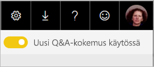
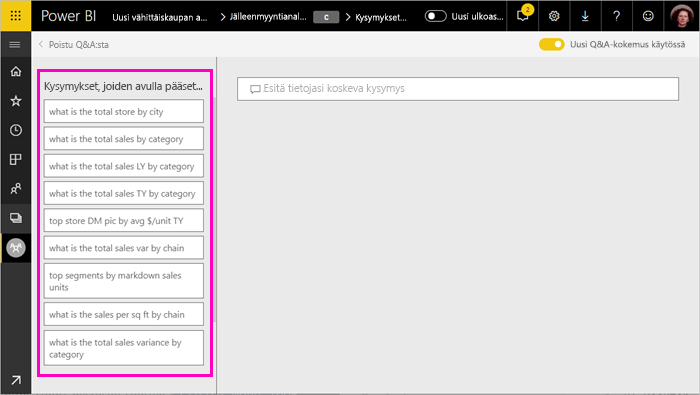
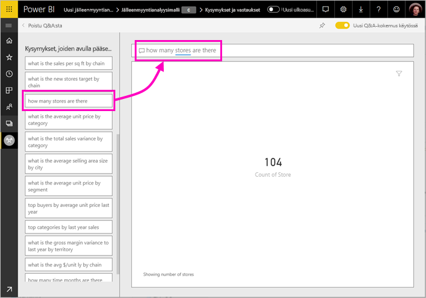
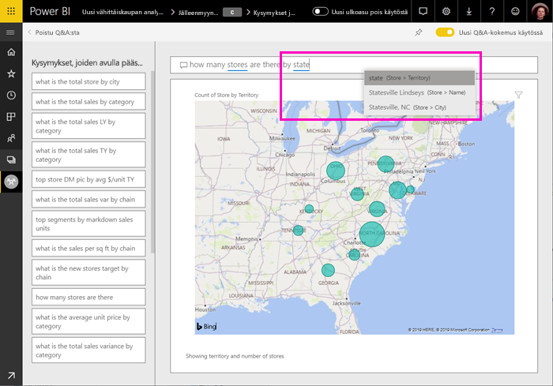
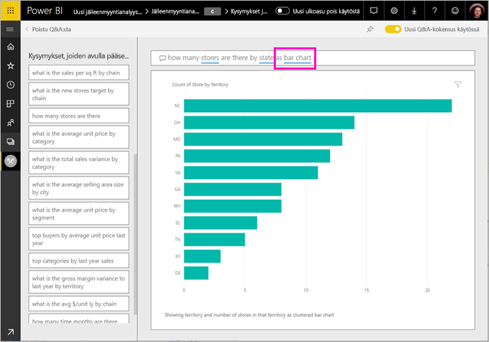
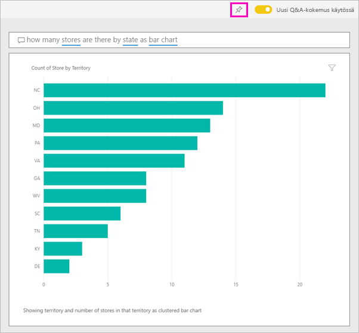

# Tietojen tutkiminen ja visualisointien luominen Power BI Q&A:n avulla

Joskus nopein tapa saada vastauksia tiedoista on esittää kysymyksiä luonnollisella kielellä. Power BI:n Q&A-ominaisuuden avulla voit tutkia tietojasi omien sanoin.  Tämän artikkelin ensimmäisessä osassa kuvataan, miten Q&A:ta käytetään Power BI -palvelun koontinäytöissä. Toisessa osassa kuvataan, mitä voit tehdä Q&A:lla, kun luot raportteja Power BI -palvelussa tai Power BI Desktopissa. Katso lisää taustatietoja artikkelista [Q&A kuluttajille](consumer/end-user-q-and-a.md). 

[Q&A-toimintoa Power BI:n mobiilisovelluksissa](consumer/mobile/mobile-apps-ios-qna.md) ja [Q&A-toimintoa Power BI Embeddedin kanssa](developer/qanda.md) käsitellään erillisissä artikkeleissa. 

Q&A on vuorovaikutteinen, jopa hauska. Usein yksi kysymys johtaa muihin, sillä visualisoinnit paljastavat kiinnostavia polkuja seurattaviksi. Katso videoesittely visualisointien luonnista Q&A:n avulla, tutustu kyseisiin visualisointeihin ja kiinnittää niitä koontinäyttöihin.

<iframe width="560" height="315" src="https://www.youtube.com/embed/qMf7OLJfCz8?list=PL1N57mwBHtN0JFoKSR0n-tBkUJHeMP2cP" frameborder="0" allowfullscreen></iframe>

## Osa 1: Q&A-toiminnon käyttäminen koontinäytössä Power BI -palvelussa

Power BI -palvelussa (app.powerbi.com) koontinäyttö sisältää ruutuja, jotka on kiinnitetty yhdestä tai useammasta tietojoukosta. Voit siten esittää kysymyksiä kaikista näiden tietojoukkojen sisältämistä tiedoista. Voit näyttää koontinäytön luomiseen käytetyt raportit ja tietojoukot valitsemalla **Näytä aiheeseen liittyvät** valikkoriviltä.

Q&A-kysymysruutu sijaitsee koontinäytön vasemmassa yläkulmassa. Tähän kirjoitat kysymyksesi luonnollisella kielellä. Eikö Q&A-ruutua näy? Lue kohta [Huomioitavia seikkoja ja vianmääritys](consumer/end-user-q-and-a.md#considerations-and-troubleshooting) artikkelissa **Q&A kuluttajille**.  Q&A tunnistaa kirjoittamasi sanat ja etsii niiden avulla vastauksen (oikeasta tietojoukosta). Q&A auttaa myös kysymyksen muotoilemisessa automaattisella täydentämisellä, oikaisuilla sekä muilla tekstimuotoisilla ja visuaalisilla apuvälineillä.

Vastaus kysymykseen näkyy vuorovaikutteisena visualisoinnilla, joka päivittyy sitä mukaa, kun muokkaat kysymystä.

1. Avaa koontinäyttö ja aseta kohdistin kysymysruutuun. Valitse oikeassa yläkulmassa **Uusi Q&A-kokemus**.

    

1. Jo ennen kuin alat kirjoittaa, Q&A näyttää uuden näytön ehdotuksilla, jotka voivat olla avuksi kysymyksen muodostamisessa. Näet lauseet ja täydelliset kysymykset, jotka sisältävät pohjana olevien tietojoukkojen taulukoiden nimet, ja saatat nähdä myös valmiita kysymyksiä, jos tietojoukon omistaja on luonut [suositeltuja kysymyksiä](service-q-and-a-create-featured-questions.md).

   

   Voit valita jonkin näistä kysymyksistä lähtökohdaksi ja tarkentaa sitä tarpeen mukaan, jotta löydät vastauksen. Vaihtoehtoisesti voit aloittaa uuden kysymyksen taulukon nimen perusteella.

2. Valitse kysymys kysymysluettelosta tai ala kirjoittaa omaa kysymystäsi ja valitse avattavan luettelon ehdotuksista.

   

3. Kun kirjoitat kysymyksen, Q&A poimii parhaan visualisoinnin vastauksen näyttämistä varten.

   

4. Visualisointi muuttuu dynaamisesti, kun muokkaat kysymystä.

   

1. Kun kirjoitat kysymystä, Power BI etsii parhaan vastauksen kaikkien niiden tietojoukkojen perusteella, jolla on ruutu koontinäytössä.  Jos kaikki ruudut ovat peräisin tietojoukosta *datasetA*, vastauksesi muodostetaan tietojoukon *datasetA* tiedoista.  Jos ruutuja on tietojoukoista *datasetA* ja *datasetB*, Q&A etsii parhaan vastauksen molemmista näistä kahdesta tietojoukosta.

   > [!TIP]
   > Noudata varovaisuutta: jos sinulla on vain yksi ruutu tietojoukosta *datasetA* ja poistat sen koontinäytöstä, Q&A ei voi enää käyttää tietojoukkoa *datasetA*.
   >

5. Kun olet tyytyväinen tulokseen, kiinnitä visualisointi koontinäyttöön valitsemalla nastakuvakkeen oikeassa yläkulmassa. Jos koontinäyttö on jaettu kanssasi, tai se kuuluu johonkin sovellukseen, sitä ei voi kiinnittää.

   

## Osa 2: Q&A-toiminnon käyttäminen raportissa Power BI -palvelussa tai Power BI Desktopissa

Q&A-toiminnon avulla voit tutkia tietojoukkoa ja lisätä visualisointeja raporttiin ja koontinäyttöihin. Raportti perustuu yhteen tietojoukkoon, ja se voi olla tyhjä tai sisältää sivukaupalla visualisointeja. Tyhjä raportti ei kuitenkaan tarkoita, ettei tietoja olisi tutkittavana – tietojoukko on linkitetty raporttiin ja vain odottaa tutkimista ja visualisointien luontia.  Jos haluat nähdä, minkä tietojoukon perusteella raportti on luotu, avaa raportti Power BI -palvelun lukunäkymässä ja valitse **Näytä aiheeseen liittyvät** valikkoriviltä.

Q&A:n käyttö raporteissa edellyttää raportin ja pohjana olevan tietojoukon muokkausoikeuksia. Artikkelissa [Q&A kuluttajille](consumer/end-user-q-and-a.md) tätä kutsutaan *tekijän* skenaarioksi. Jos olet raportin *kuluttaja*, eli raportti on jaettu kanssasi, Q&A ei ole käytettävissä.

1. Avaa raportti muokkausnäkymässä (Power BI -palvelussa) tai raporttinäkymässä (Power BI Desktopissa) ja valitse **Esitä kysymys** valikkoriviltä.

    **Power BI Desktop**    
    

    **Palvelu**    
    

2. Q&A-kysymysruutu tulee näkyviin raporttipohjalla. Alla olevassa esimerkissä kysymysruutu näkyy toisen visualisoinnin päällä. Tämä ei haittaa käyttöä, mutta voit haluta lisätä tyhjän sivun raporttiin ennen kysymyksen esittämistä.

    

3. Aseta kohdistin kysymysruutuun. Kirjoittaessasi kysymystä Q&A näyttää ehdotuksia, joiden avulla voit muotoilla oikean kysymyksen.

   

4. Kun kirjoitat kysymystä, Q&A hakee parhaan [visualisoinnin](visuals/power-bi-visualization-types-for-reports-and-q-and-a.md) ja näyttää sen perusteella vastauksen; visualisointi muuttuu dynaamisesti kysymystä muokatessa.

   

5. Kun olet saanut haluamasi visualisoinnin, paina ENTER-näppäintä. Jos haluat tallentaa visualisoinnin ja raportin, valitse **Tiedosto > Tallenna**.

6. Tee haluamasi toimet uudessa visualisoinnissa. Visualisoinnin luontimenetelmällä ei ole merkitystä – sama vuorovaikutteisuus sekä kaikki muotoilut ja ominaisuudet ovat käytettävissä.

   

   Jos olet luonut visualisoinnin Power BI -palvelussa, voit myös [kiinnittää sen koontinäyttöön](service-dashboard-pin-tile-from-q-and-a.md).

## Kerro Q&A:llen minkä visualisoinnin haluat
Q&A:n avulla voit saada tietosi puhumaan puolestaan, mutta myös Power BI:n näyttämään vastauksen haluamassasi muodossa. Lisää vain ”nimellä <visualization type>” kysymyksesi loppuun.  Esimerkiksi ”näytä varastotilanne tuotantolaitoksen mukaan karttana” tai ”näytä varasto yhteensä korttina”.  Kokeile itse.

## Huomioon otettavat seikat ja vianmääritys
- Jos olet yhdistänyt tietojoukkoon käyttäen reaaliaikaista yhteyttä tai yhdyskäytävää, Q&A on oltava [käytössä tietojoukossa](service-q-and-a-direct-query.md).

- Olet avannut raportin, mutta Q&A-vaihtoehtoa ei näy. Jos käytät Power BI -palvelua, varmista, että avaat raportin muokkausnäkymässä. Jos et voi avata muokkausnäkymää, sinulla ei ole raportin muokkausoikeuksia etkä voi käyttää Q&A-toimintoa kyseisessä raportissa.

## Seuraavat vaiheet

- [Q&A kuluttajille](consumer/end-user-q-and-a.md)   
- [Vihjeitä Q&A-kysymysten esittämiseen](consumer/end-user-q-and-a-tips.md)   
- [Työkirjan valmisteleminen Q&A-toimintoa varten](service-prepare-data-for-q-and-a.md)  
- [Paikallisten tietojoukkojen valmisteleminen Q&A:ta varten](service-q-and-a-direct-query.md)   
- [Ruudun kiinnittäminen koontinäyttöön Q&A:sta](service-dashboard-pin-tile-from-q-and-a.md)
