# Esri ArcGIS -kartat Power BI -palvelussa ja Power BI Desktopissa
Tämä opetusohjelma on kirjoitettu ArcGIS-karttaa luovan henkilön näkökulmasta. Kun tekijä jakaa ArcGIS-kartan työtoverille, kyseinen työtoveri voi tarkastella ja käsitellä karttaa mutta ei tallentaa muutoksia. Lisätietoja ArcGIS-kartan tarkastelemisesta on ohjeartikkelissa [ArcGIS-karttojen käsittely](power-bi-visualizations-arcgis.md).

ArcGIS-kartat ja Power BI yhdessä tekevät kartoista muutakin kuin vain esitettäviä pisteitä. Valitse pohjakarttoja, sijaintityyppejä, teemoja, symbolityylejä ja viittauskerroksia, joiden avulla voit luoda upeita, informatiivisia karttavisualisointeja. Määräävien tietokerrosten yhdistäminen tila-analyysiä sisältävien karttojen kanssa mahdollista visualisaation tietojen entistä tarkemman ymmärtämisen.

 Mobiililaitteella voit tarkastella ja käsitellä ArcGIS-karttoja, mutta et luoda niitä. Katso [ArcGIS-karttojen käsittely](power-bi-visualizations-arcgis.md).

> [!TIP]
> GIS tarkoittaa maantieteellistä informaatiotutkimusta (Geographic Information Science).

Alla olevassa esimerkissä tummanharmaa pohja kuvastaa alueellista myyntiä lämpökarttana, jota verrataan demografisen kerroksen sisältämiin vuoden 2016 mediaanituloihin. ArcGIS-karttojen monipuolisten kartoitusominaisuuksien, demografisten tietojen ja karttavisualisointien ansiosta voit kertoa tarinasi parhaalla mahdollisella tavalla.

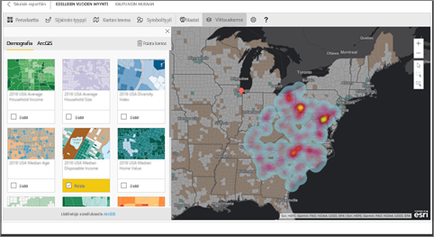

> [!TIP]
> Katso esimerkkejä ja lue käyttäjien kokemuksia [Esrin Power BI -sivulta](https://www.esri.com/powerbi). Katso myös Esrin ohjeartikkeli [ArcGIS Maps for Power BI:n käytön aloitus](https://doc.arcgis.com/en/maps-for-powerbi/get-started/about-maps-for-power-bi.htm).

## Käyttäjän suostumus
ArcGIS Maps for Power BI on Esrin tekemä (www.esri.com). ArcGIS Maps for Power BI:n käyttöön sovelletaan Esrin käyttöehtoja ja tietosuojakäytäntöä. Power BI -käyttäjien, jotka haluavat käyttää ArcGIS Maps for Power BI -visualisointeja, on ilmaistava suostumuksensa valintaikkunassa.

**Resurssit**

[Käyttöehdot](https://go.microsoft.com/fwlink/?LinkID=826322)

[Tietosuojakäytäntö](https://go.microsoft.com/fwlink/?LinkID=826323)

[ArcGIS Maps for Power BI -tuotesivu](https://www.esri.com/powerbi)

 

## ArcGIS-karttojen ottaminen käyttöön
ArcGIS-karttoja voi tällä hetkellä käyttää Power BI -palvelussa, Power BI Desktopissa ja Power BI -mobiilisovelluksessa. Tämän artikkelin ohjeet koskevat Power BI -palvelua ja Desktopia.

### ArcGIS-karttojen ottaminen käyttöön ***Power BI -palvelussa (app.powerbi.com)***
Tässä opetusohjelmassa käytetään [Jälleenmyyntianalyysimallia](sample-retail-analysis.md). **ArcGIS Maps for Power BI:n** käyttöönotto:

1. Valitse valikkorivin oikeasta yläkulmasta hammaspyöräkuvake ja avaa **Asetukset**
   
    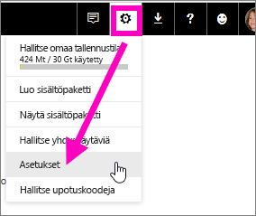
2. Valitse **ArcGIS Maps for Power BI** -valintaruutu. Valinta edellyttää Power BI:n uudelleenkäynnistystä.
   
    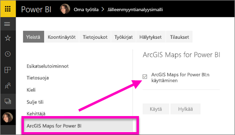
3. Avaa raportti [muokkausnäkymässä](service-reading-view-and-editing-view.md) ja valitse ArcGIS Maps for Power BI -kuvake Visualisoinnit-ruudussa.
   
    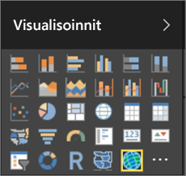
4. Power BI lisää tyhjän ArcGIS -karttamallin raportin pohjaan.
   
   

 

## ArcGIS-karttavisualisoinnin luominen
Katso, miten Will luo muutamia erilaisia ArcGIS-karttavisualisointeja ja kokeile sitä itse alla olevien ohjeiden mukaisesti. Käytä pohjana [Jälleenmyyntianalyysimallia](sample-datasets.md).

<iframe width="560" height="315" src="https://www.youtube.com/embed/EKVvOZmxg9s" frameborder="0" allowfullscreen></iframe>

1. Vedä **Kentät**-ruudussa tietokenttä **Sijainti-** tai **Leveysaste-** ja/tai **Pituusaste**-säilöön. Tässä esimerkissä arvoina käytetään **Kaupunki > Kauppa**.
   
   > [!NOTE]
   > ArcGIS Maps for Power BI tunnistaa automaattisesti, kannattaako valitsemasi kentät näyttää kartalla muotona vai pisteenä. Voit muuttaa oletusasetuksia asetuksista (ks. alla).
   > 
   > 
   
    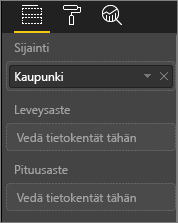
2. Muunna visualisointi ArcGIS-kartaksi valitsemalla malli Visualisoinnit-ruudusta .
3. Vedä **Kentät**-ruudussa mitta **Koko**-säilöön, jos haluat säätää tietojen näyttötapaa. Tässä esimerkissä arvoina käytetään **Myynti > Viime vuoden myynti**.
   
    

## ArcGIS-karttojen asetukset ja muotoilu
**ArcGIS Maps for Power BI** -muotoiluominaisuuksien käyttö:

1. Voit käyttää lisätoimintoja valitsemalla kolme pistettä visualisoinnin oikeasta yläkulmasta ja valitsemalla **Muokkaa**.
   
   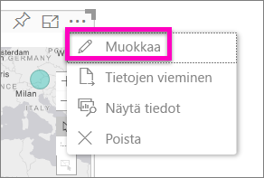
   
   Käytettävissä olevat ominaisuudet näytetään visualisoinnin yläreunassa. Kunkin toiminnon valitseminen avaa tehtäväruudun, jossa on yksityiskohtaisia asetuksia. 
   
   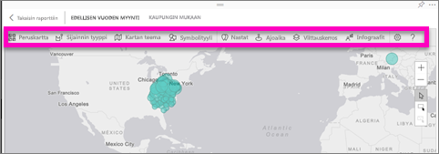
   
   > [!NOTE]
   > Katso lisätietoja asetuksista ja ominaisuuksista alla olevasta **Yksityiskohtaiset ohjeet** -kohdasta.
   > 
   > 
2. Jos haluat palata raporttiin, valitse **Takaisin raporttiin** raportin pohjan vasemmasta yläkulmasta.

 

## Yksityiskohtaiset ohjeet
**Esri** tarjoaa [monipuolisia ](https://go.microsoft.com/fwlink/?LinkID=828772) **ArcGIS Maps for Power BI**:n ominaisuuksia koskevia ohjeita.

## Ominaisuuksien yleiskatsaus
### Pohjakartat
Tarjolla on neljä pohjakarttaa: tummanharmaa pohja, vaaleanharmaa pohja, OpenStreetMap ja Kadut.  Kadut on ArcGIS:n oletuspohjakartta.

Voit käyttää pohjakarttaa valitsemalla sen tehtäväruudusta.

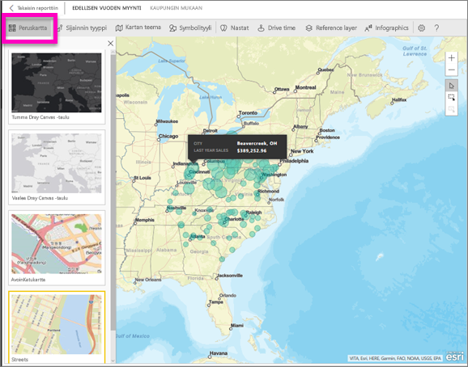

### Sijainnin tyyppi
ArgGIS Maps for Power BI havaitsee automaattisesti parhaan tavan näyttää tiedot kartalla. Se valitsee joko pisteet tai rajat. Sijainnin tyypin asetusten avulla voit hienosäätää näitä valintoja.

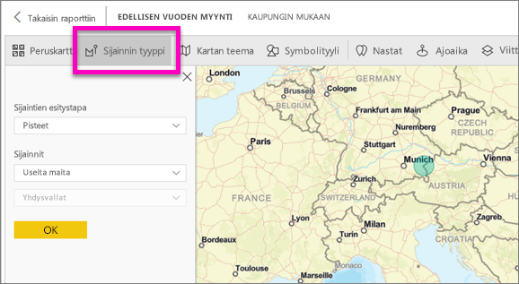

**Rajat** toimii vain, jos tietosi sisältävät maantieteellisiä vakioarvoja. Esri päättelee automaattisesti kartalla näytettävän muodon. Maantieteellisiä vakioarvoja ovat mm. maa, maakunta ja postinumero. Kuten sijaintitietoja lisättäessä, Power BI ei välttämättä tunnista, että kentän on oletusarvoisesti oltava raja tai se ei ehkä tunne tietojasi vastaavia rajoja.  

### Kartan teema
Voit valita neljästä kartan teemasta. Vain sijainti- ja koko-teemat valitaan automaattisesti sijaintiin sitomiesi kenttien perusteella. Teemat lisätään Power BI:n Kentät-ruudussa olevaan **Koko**-säilöön. Käytössä on tällä hetkellä **Koko**-teema, joten vaihdetaan se **Lämpökartaksi**.  

<table>
<tr><th>Teema</th><th>Kuvaus</th>
<tr>
<td>Vain sijainti</td>
<td>Piirtää arvopisteet tai täytetyt rajat kartalle Sijainnin tyyppi -asetusten perusteella.</td>
</tr>
<tr>
<td>Lämpökartta</td>
<td>Piirtää kartalle painotetut tiedot.</td>
</tr>
<tr>
<td>Koko</td>
<td>Piirtää kartalle tietopisteitä, joiden koko riippuu Kentät-ruudulla olevaan Koko-säilöön merkityistä arvoista.</td>
</tr>
<tr>
<td>Klusterointi</td>
<td>Piirtää tietopisteiden määrän kartalla oleville alueille. </td>
</tr>
</table>

### Symbolityyli
Symbolityylien avulla voit hienosäätää tietojen esitystapaa kartalla. Symbolityylit ovat tilannekohtaisia. Ne vaihtelevat valitun Sijainnin tyypin ja Kartan teeman mukaan. Alla olevassa esimerkissä näytetään **Koko**-sijainnin tyyppi ja sen läpinäkyvyyteen, tyyliin ja kokoon tehdyt muutokset.

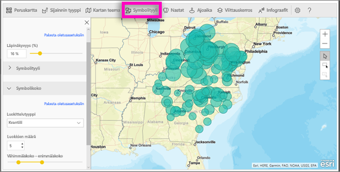

### Nastat
Voit kiinnittää huomion karttapisteisiin lisäämällä nastoja.  

1. Valitse **Nastat**-välilehti.
2. Kirjoita avainsanoja (esim. paikka, kiinnostava kohde) hakuruutuun ja tee valinta avattavasta valikosta. Kartalle ilmestyy symboli, johon näkymä lähennetään automaattisesti. Hakutulokset tallennetaan Nastat-ruudun sijaintikortteihin. Voit tallentaa enintään 10 sijaintikorttia.
   
   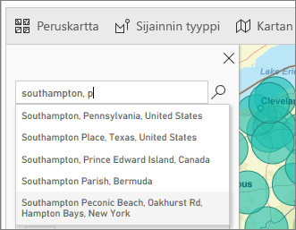
3. Power BI lisää nastan kyseiseen sijaintiin. Voit muuttaa nastan väriä.
   
   
4. Lisää ja poista nastoja.
   
   

### Ajoaika
Ajoaika-ruudulla voit valita sijainnin ja määrittää sitten, mitkä kartan kohteet ovat tietyllä säteellä tai tietyn ajoajan päässä.  
    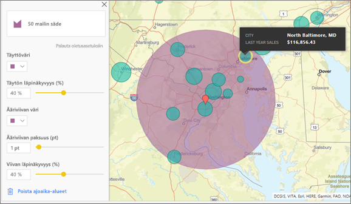

1. Valitse **Ajoaika**-välilehti ja valitse yksittäisten tai useiden kohteiden valintatyökalu. Valitse Washington D.C.:n nasta yksittäisellä valinnalla.
    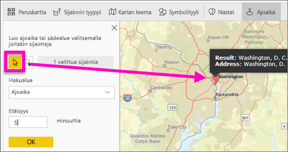
   
   > [!TIP]
   > Sijainti on helpompi valita, jos lähennät karttanäkymää (+ -kuvake).
   > 
   > 
2. Kuvitellaan, että lennät Washington D.C.:hen muutamaksi päiväksi ja haluat selvittää, mitkä myymälät ovat kohtuullisen ajoajan päässä. Valitse hakualueeksi **Säde**, etäisyydeksi **50** mailia ja valitse OK.    
   
    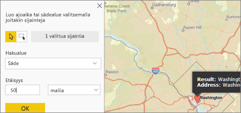
3. Säde näkyy violettina. Voita valita minkä tahansa sijainnin ja tarkastella sen tietoja. Vaihtoehtoisesti voit muotoilla sädettä muuttamalla sen väriä ja ääriviivoja.
   
    

### Viittauskerros
#### Viittauskerros - Demografiset tiedot
ArcGIS Maps for Power BI sisältää erilaisia demografisia kerroksia, jotka auttavat tietojen kontekstualisoinnissa Power BI:ssä.

1. Valitse **Viittauskerros**-välilehti ja valitse **Demografiset tiedot**.
2. Luettelossa kunkin kerroksen vieressä on valintaruutu. Valitse valintaruutu lisätäksesi kyseisen kerroksen kartalle.  Tässä esimerkissä olemme lisänneet kotitalouksien keskimääräiset tulot. 
   
    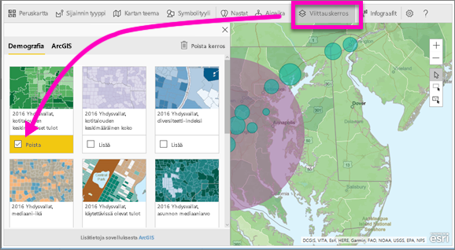
3. Jokainen kerros on vuorovaikutteinen. Samoin kuin voit katsoa kuplan tiedot osoittamalla sitä hiirellä, voit tarkastella varjostetun kartta-alueen tietoja napsauttamalla. 
   
    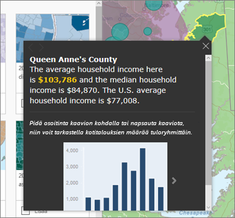

#### Viittauskerros - ArcGIS
ArcGIS Online tarjoaa organisaatioille mahdollisuuden julkaista julkisia verkkokarttoja. Esri tarjoaa myös valvotut verkkokartat Living Atlas -järjestelmän kautta. ArcGIS-välilehdessä voit tehdä hakuja kaikista julkisista verkkokartoista ja Living Atlas -kartoista ja lisätä niitä kartan viittauskerroksiksi.

1. Valitse **Viittauskerros**-välilehti ja sitten **ArcGIS**.
2. Kirjoita hakusanat ja valitse sitten karttakerros. Tässä esimerkissä on käytetty USA:n edustajainhuoneen vaalipiirejä.
   
    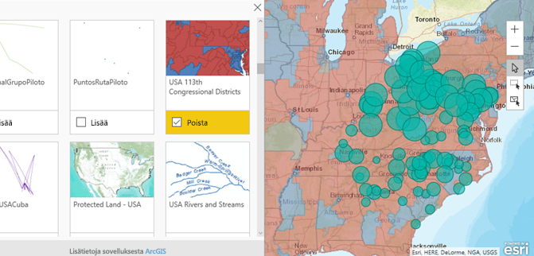
3. Näet tarkat tiedot valitsemalla varjostetun alueen, jolloin *Valitse viittauskerros* -valinta avautuu. Valitse viittauskerroksen rajat tai kohteet viittauskerroksen valintatyökalulla.

 

## Arvopisteiden valinta
ArcGIS Maps for Power BI:ssä on kolme valintatilaa.

Voit muuttaa valintatilaa valitsimella:

 Valitse yksittäisiä arvopisteitä.

 Piirrä suorakulmio kartalle ja valitse siihen sisältyvät arvopisteet.

 Sallii viittauskerrosten sisältämien rajojen tai monikulmioiden käyttö arvopisteiden valintaan.

> [!NOTE]
> Voit valita enintään 250 arvopistettä kerrallaan.
> 
> 

 

## Ohjeiden hakeminen
**Esri** tarjoaa [monipuolisia ](https://go.microsoft.com/fwlink/?LinkID=828772) **ArcGIS Maps for Power BI**:n ominaisuuksia koskevia ohjeita.

Voit esittää kysymyksiä, hakea ajantasaisimpia tietoja, ilmoittaa ongelmista ja hakea vastauksia [**ArcGIS Maps for Power BI**:tä käsittelevästä Power BI -yhteisökeskustelusta](https://go.microsoft.com/fwlink/?LinkID=828771).

Jos sinulla parannusehdotus, lähetä se [Power BI -idealuetteloon](https://ideas.powerbi.com).

 

## ArcGIS Maps for Power BI:n käytön hallinta organisaatiossa
Power BI antaa käyttäjien, vuokraajien järjestelmänvalvojien ja IT-järjestelmänvalvojien valita, käytetäänkö ArcGIS Maps for Power BI:tä.

Power BI Desktopin **Käyttäjäasetuksista** käyttäjät voivat lopettaa ArcGIS Maps for Power BI:n käytön poistamalla sen käytöstä **Asetusten** suojaus-välilehdeltä. Kun ArcGIS Maps on poistettu käytöstä, sitä ei ladata oletusarvoisesti.

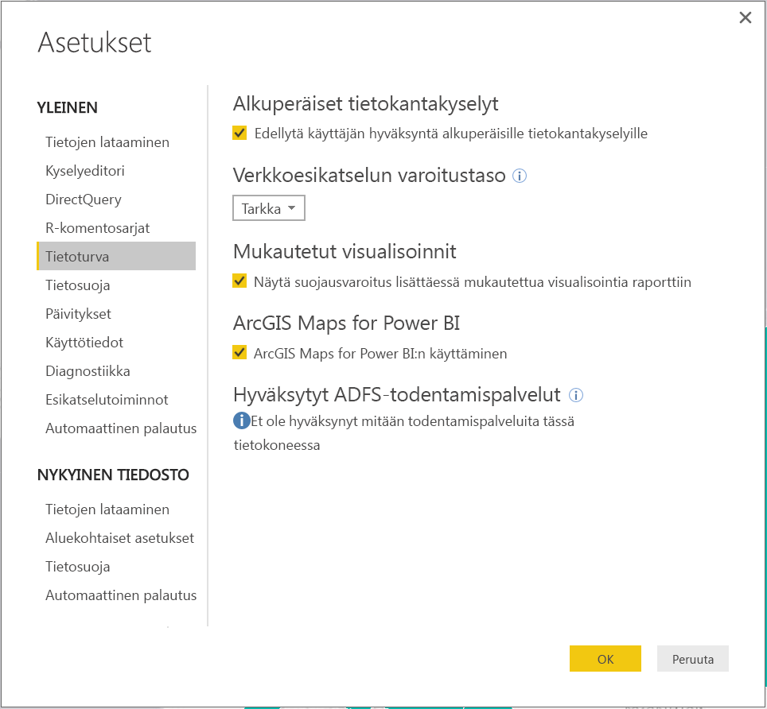

Power BI -palvelun käyttäjät voivat poistaa ArcGIS Maps for Power BI:n käytöstä käyttäjäasetusten Power BI -välilehdeltä. Kun ArcGIS Maps on poistettu käytöstä, sitä ei ladata oletusarvoisesti.

Vuokraajan järjestelmänvalvojat voivat estää kaikkia vuokraajan käyttäjiä käyttämästä ArcGIS Maps for Power BI:tä **Vuokraajan järjestelmänvalvojan asetuksista** PowerBI.comissa. Tällaisissa tapauksessa Power BI:n Visualisoinnit-ruudussa ei enää näytetä ArcGIS Maps for Power BI -kuvaketta.

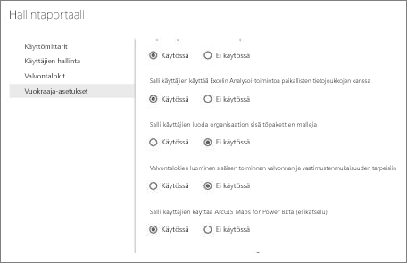

Power BI Desktopin **IT-järjestelmänvalvojan asetukset** tukevat ArcGIS Maps for Power BI:n poistamista käytöstä kaikilla organisaation tietokoneilla **ryhmäkäytäntöjen** avulla.

<table>
<tr><th>Määrite</th><th>Arvo</th>
</tr>
<tr>
<td>avain</td>
<td>Software\Policies\Microsoft\Power BI Desktop\</td>
</tr>
<tr>
<td>valueName</td>
<td>EnableArcGISMaps</td>
</tr>
</table>

Arvo 1 (desimaali) ottaa ArcGIS Maps for Power BI:n käyttöön.

Arvo 0 (desimaali) poistaa ArcGIS Maps for Power BI:n käytöstä.

## Huomioitavat asiat ja rajoitukset
ArcGIS Maps for Power BI on saatavilla seuraavissa palveluissa ja sovelluksissa:

<table>
<tr><th>Palvelu/sovellus</th><th>Käytettävyys</th></tr>
<tr>
<td>Power BI Desktop</td>
<td>Kyllä</td>
</tr>
<tr>
<td>Power BI -palvelu (PowerBI.com)</td>
<td>Kyllä</td>
</tr>
<tr>
<td>Power BI -mobiilisovellukset</td>
<td>Kyllä</td>
</tr>
<tr>
<td>Power BI:n julkaise verkkoon -toiminto</td>
<td>Ei</td>
</tr>
<tr>
<td>Power BI Embedded</td>
<td>Ei</td>
</tr>
<tr>
<td>Upottaminen Power BI -palveluun (PowerBI.com)</td>
<td>Ei</td>
</tr>
</table>

Palveluita tai sovelluksia, joissa ArcGIS Maps for Power BI ei ole käytettävissä, visualisointi näkyy tyhjänä Power BI -logon yhteydessä.

Kun katuosoitteiden sijaintitietoja lisätään, vain ensimmäisten 1500 osoitteen sijaintitiedot voidaan lisätä. Paikannimien ja maiden sijaintitietoja ei lasketa 1500 osoitteen kiintiöön.

 

**Miten ArcGIS Maps ja Power BI toimivat yhdessä?**
ArcGIS Maps for Power BI on Esrin tekemä (www.esri.com). ArcGIS Maps for Power BI:n käyttöön sovelletaan Esrin [käyttöehtoja](https://go.microsoft.com/fwlink/?LinkID=8263222) ja [tietosuojakäytäntöä](https://go.microsoft.com/fwlink/?LinkID=826323). Power BI -käyttäjien, jotka haluavat käyttää ArcGIS Maps for Power BI -visualisointeja, on ilmaistava suostumuksensa valintaikkunassa (ks. Käyttäjän suostumus -kohta).  Esrin ArcGIS Maps for Power BI:n käyttöön sovelletaan Esrin käyttöehtoja ja tietosuojakäytäntöä, joihin on linkki suostumuksen valintaikkunassa. Kunkin käyttäjän on ilmaistava suostumuksensa ennen ArcGIS Maps for Power BI:n ensimmäistä käyttökertaa. Kun käyttäjä antaa suostumuksensa, visualisointiin sidotut tiedot lähetetään Esrin palveluihin, joissa niihin lisätään vähintään sijaintitiedot. Tämä tarkoittaa sijaintitietojen muuntamista pituus- ja leveyspiireiksi, jotka voidaan esittää kartalla. Voit olettaa, että kaikki visualisointeihin sidotut tiedot voidaan lähettää Esrin palveluihin. Esri tarjoaa mm. pohjakarttojen, paikkatietojen analyysin ja sijaintitietojen lisäämisen tapaisia palveluita. ArcGIS Maps for Power BI:n visualisoinnit toimivat yhdessä näiden palvelujen kanssa Esrin tarjoaman ja ylläpitämän suojatun SSL-sertifioidun yhteyden avulla. Lisätietoja ArcGIS Maps for Power BI:stä on tarjolla Esrin [ArcGIS Maps for Power BI -tuotesivulla](https://www.esri.com/powerbi).

Kun käyttäjä tilaa Plus-version Esrin ArcGIS Maps for Power BI:n kautta tarjoaman tilauksen kautta, käyttäjän ja Esrin välillä on suora suhde. Power BI ei lähetä käyttäjän henkilökohtaisia tietoja Esrille. Käyttäjä kirjautuu Esrin tarjoamaan AAD-sovellukseen omalla AAD-tunnuksellaan ja ilmaisee luottavansa siihen. Tällöin käyttäjä jakaa henkilökohtaiset tietonsa suoraan Esrille. Kun käyttäjä lisää Plus-sisältöä ArcGIS Maps for Power BI -visualisointiin, kyseistä sisältöä tarkastelevilla ja muokkaavilla muilla Power BI -käyttäjillä on myös oltava Plus-tilaus. 

Jos sinulla on kysyttävää Esrin ArcGIS Maps for Power BI:n teknisestä toiminnasta, ota yhteyttä Esrin tukisivun kautta.

**Onko ArcGIS Maps for Power BI:n käyttö maksullista?**

ArcGIS Map for Power BI on maksuton kaikille Power BI -käyttäjille. Se on **Esrin** tarjoama palvelun osa, johon sovelletaan **Esrin** käyttöehtoja ja tietosuojakäytäntöä tässä artikkelissa aiemmin kuvatulla tavalla.

**Saan Power BI Desktopissa virhesanoman, jonka mukaan välimuisti on täynnä**

Tämä on virhe, jota korjataan parhaillaan.  Korjausta odottaessasi voit tyhjentää välimuistin poistamalla tiedostoja seuraavasta sijainnista: C:\Users\\AppData\Local\Microsoft\Power BI Desktop\CEF ja käynnistämällä Power BI:n sitten uudelleen.

**Tukeeko ArcGIS Maps for Power BI Esri-muototiedostoja?**

ArcGIS Maps for Power BI havaitsee automaattisesti yleiset rajat, kuten maiden/alueiden, osavaltioiden/provinssien ja postinumeroalueiden rajat. Jos sinun on lisättävä omia muotoja, voit tehdä sen käyttämällä [Shape Maps for Power BI Desktopilla (esiversio)](desktop-shape-map.md).

**Voinko tarkastella ArcGIS-karttoja offline-tilassa?**

Et. Power BI tarvitsee verkkoyhteyden karttojen näyttämiseen.

**Voinko muodostaa yhteyden ArcGIS Online -tiliini Power BI:stä?**

Et vielä. Kun [äänestät tätä ideaa](https://ideas.powerbi.com/forums/265200-power-bi-ideas/suggestions/9154765-arcgis-geodatabases), saat sähköpostiviestin kun ominaisuuden kehittäminen aloitetaan.  

## Seuraavat vaiheet
[Kanssasi jaetun ArcGIS-kartan käsitteleminen](power-bi-visualizations-arcgis.md)

[Blogimerkintä, jossa ilmoitetaan ArcGIS Maps for Power BI:n saatavuudesta](https://powerbi.microsoft.com/blog/announcing-arcgis-maps-for-power-bi-by-esri-preview/)

Ilmenikö muuta kysyttävää? [Voit esittää kysymyksiä Power BI -yhteisössä](http://community.powerbi.com/)

