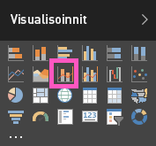

# Yhdistelmäkaavio Power BI:ssä (opetusohjelma)
Power BI:ssä yhdistelmäkaavio on yksittäinen visualisointi, joka yhdistää viivakaavion ja pylväskaavion. Näiden kahden kaavion yhdistäminen nopeuttaa tietojen vertailua.

Yhdistelmäkaaviossa voi olla yksi tai kaksi Y-akselia.

## Milloin kannattaa käyttää yhdistelmäkaaviota
Yhdistelmäkaavio on hyvä vaihtoehto, kun:

* sinulla on viivakaavio ja pylväskaavio, joilla on sama X-akseli
* haluat vertailla useita mittayksiköitä eri arvoalueilla
* haluat havainnollistaa kahden mittayksikön välistä korrelaatiota yhdessä visualisoinnissa
* haluat tarkistaa, täyttääkö mittayksikkö toisen mittayksikön määrittämän tavoitteen
* haluat säästää tilaa piirtoalustalla.

### Edellytykset
Yhdistelmäkaaviot ovat käytettävissä Power BI -palvelussa ja Power BI Desktopissa. Tässä opetusohjelmassa luodaan yhdistelmäkaavio Power BI -palvelussa. Seuraa opetusohjelmaa avaamalla Power BI -palvelu ja muodostamalla yhteys jälleenmyyntianalyysimalliin ([ohjeet alla](#create)).

## Perusmuotoisen yhden akselin yhdistelmäkaavion luominen
Seuraavassa videossa luodaan yhdistelmäkaavio käyttämällä myynti- ja markkinointimallia.

<iframe width="560" height="315" src="https://www.youtube.com/embed/lnv66cTZ5ho?list=PL1N57mwBHtN0JFoKSR0n-tBkUJHeMP2cP" frameborder="0" allowfullscreen></iframe>  

 Luo oma yhdistelmäkaavio kirjautumalla Power BI -palveluun ja valitsemalla **Nouda tiedot \> Mallit \> Jälleenmyyntianalyysimalli > Yhdistä > Siirry koontinäyttöön**.

1. Avaa raportti valitsemalla koontinäytössä **Myymälöitä yhteensä** -ruutu.
2. Avaa raportti muokkausnäkymässä valitsemalla **Muokkaa raporttia**.
3. [Lisää uusi raporttisivu](power-bi-report-add-page.md).
4. Luo pylväskaavio, joka näyttää tämän vuoden myynnin ja myyntikatteen kuukauden mukaan.

    a.  Valitse Kentät-ruudussa **Myynti** \> **Tämän vuoden myynti** > **Arvo**.

    b.  Vedä **Myynti** \> **Tämän vuoden myyntikate** **Arvo**-kohtaan.

    c.  Valitse **Aika** \> **FiscalMonth** ja lisää se **Akseli**-kohtaan.

    
5. Valitse kolme pistettä (...) visualisoinnin oikeassa yläkulmassa ja valitse **Lajitteluperuste: FiscalMonth**. Joudut ehkä valitsemaan sen kahdesti, jos haluat lajitella nousevaan tai laskevaan järjestykseen.

6. Muunna pylväskaavio yhdistelmäkaavioksi. Pidä pylväskaavio valittuna ja valitse **Visualisoinnit**-ruudussa **Viiva- ja yhdistelmäpylväskaavio**.

    
7. Vedä **Kentät**-ruudusta **Myynti** \> **Edellisen vuoden myynti** säilöön **Riviarvot**.

   

   Yhdistelmäkaavion pitäisi näyttää suunnilleen tältä:

   

## Kahden akselin yhdistelmäkaavion luominen
Tässä tehtävässä verrataan myyntikatetta ja myyntiä.

1. Luo uusi viivakaavio, joka seuraa **viime vuoden myyntikateprosenttia** **kuukauden** mukaan.  Myyntikate oli tammikuussa 35 %, huipussaan 45 % huhtikuussa, laski heinäkuussa ja nousi uudelleen elokuussa. Näemmekö samanlaisen kuvion myös tämän vuoden myynnissä?

   
2. Lisää **Tämän vuoden myynti > Arvo** ja **Edellisen vuoden myynti** viivakaavioon. **Edellisen vuoden myyntikateprosentin** asteikko on paljon pienempi kuin **myynnin**, mikä vaikeuttaa vertailua.      

   
3. Voit helpottaa visualisoinnin tulkitsemista muuntamalla viivakaavion viivakaavioksi ja pinotuksi pylväskaavioksi.

   
4. Vedä **Edellisen vuoden myyntikateprosentti** **sarakearvoista** **riviarvoihin**. Power BI luo kaksi akselia, jolloin tietojoukkoja voidaan skaalata erikseen; vasen mittaa myyntiä euroissa ja oikea prosenttilukua.

       

## Akselien otsikoiden lisääminen
1. Avaa Muotoilu-ruutu valitsemalla maalitelakuvakkeen .
2. Laajenna **Y-akselin** asetukset alanuolella.
3. Aseta **Y-akseli (sarake)** > **Sijainti** > **vasemmalla**, **Otsikko** > **Käytössä**, **Tyyli** > **Näytä vain otsikko** ja **Näytä** > **Miljoonat**.

   
4. Kohdassa **Y-akseli (sarake)** vieritä alaspäin ja varmista, että **Näytä toissijainen** on **Käytössä**. Tämä näyttää yhdistelmäkaavion viivakaavio-osan muotoiluvaihtoehdot.

   
5. Jätä **Y-akseli (rivi)** > **Sijainti** > **oikealla** sekä määritä **Otsikko** > **Käytössä** ja **Tyyli** > **Näytä vain otsikko**.

   Yhdistelmäkaavio näyttää nyt kaksi akselia otsikoilla.

   

6. Halutessasi voit parantaa kaavion luettavuutta muokkaamalla tekstin fonttia, kokoa ja väriä sekä määrittämällä muita muotoiluasetuksia.

Seuraavat toiminnot:

* [Yhdistelmäkaavion lisääminen koontinäytön ruutuna](service-dashboard-tiles.md)
* [Raportin tallentaminen](service-report-save.md)

## Ristiinkorostaminen ja ristiinsuodatus

Sarakkeen tai rivin korostaminen yhdistelmäkaaviossa ristiinkorostaa ja ristiinsuodattaa muut raporttisivulla olevat visualisoinnit... ja päinvastoin. Voit muuttaa tätä oletustoimintaa [visualisointitoimien](service-reports-visual-interactions.md) avulla.

## Seuraavat vaiheet

[Power BI -raporttien visualisointien yleiskatsaus](power-bi-report-visualizations.md)

[Visualisointityypit Power BI:ssä](power-bi-visualization-types-for-reports-and-q-and-a.md)

[Power BI:n peruskäsitteet](service-basic-concepts.md)

Onko sinulla muuta kysyttävää? [Kokeile Power BI -yhteisöä](http://community.powerbi.com/)
