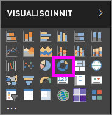
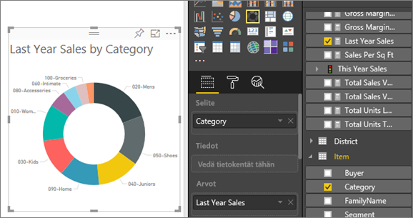

# Rengaskaaviot Power BI:ssä
Rengaskaavio muistuttaa ympyräkaaviota siten, että se näyttää osien suhteen kokonaisuuteen. Ainoa ero on se, että keskellä on tyhjää tilaa otsikkoa tai kuvaketta varten.

## Rengaskaavion luominen
Näissä ohjeissa käytetään esimerkkiä jälleenmyyjän analyysista. Sen avulla voit luoda rengaskaavion tämän vuoden myynnistä luokittain. Jos haluat seurata ohjeita itse, [lataa malli](sample-datasets.md) joko Power BI ‑palveluun (app.powerbi.com) tai Power BI Desktopiin.

1. Aloita [tyhjältä raporttisivulta](power-bi-report-add-page.md) ja valitse kenttä **Myyntivaihe** \> **Myyntivaihe**. Jos käytät Power BI ‑palvelua, varmista, että avaat raportin [muokkausnäkymässä](service-interact-with-a-report-in-editing-view.md).

2. Valitse Kentät-ruudussa **Myynti** \> **Viime vuoden myynti**.  
   
3. Valitse Visualisointi-ruudusta  muuntamaan pylväskaavio rengaskaavioksi. Jos **Viime vuoden myynti** ei ole **Arvot**-alueella, vedä se sinne.
     
   

4. Valitse **Kohteen** \> **luokka** sen lisäämiseksi **Selite**-alueelle. 
     
    

5. Voit vaihtoehtoisesti [säätää kaavion tekstin väriä ja kokoa](power-bi-visualization-customize-title-background-and-legend.md). 

## Huomioon otettavat seikat ja vianmääritys
* Rengaskaavion arvojen summan on oltava 100 %.
* Liian monta luokkaa vaikeuttaa luettavuutta ja tulkintaa.
* Rengaskaavioita kannattaa käyttää vertailemaan tiettyä osaa kokonaisuuteen sen sijaan, että verrattaisiin yksittäisiä osia keskenään. 

## Seuraavat vaiheet
[Raportit Power BI:ssä](service-reports.md)

[Visualisointityypit Power BI:ssä](power-bi-visualization-types-for-reports-and-q-and-a.md)

[Visualisoinnit Power BI -raporteissa](power-bi-report-visualizations.md)

[Power BI:n peruskäsitteet](service-basic-concepts.md)

Onko sinulla muuta kysyttävää? [Kokeile Power BI -yhteisöä](http://community.powerbi.com/)

