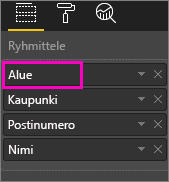
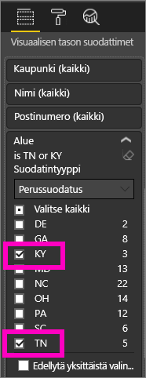
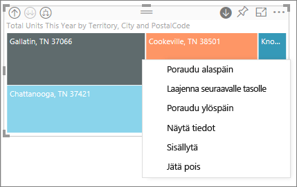
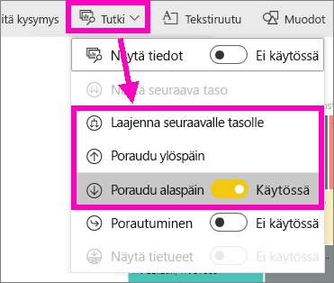
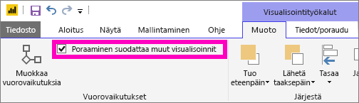
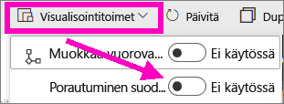
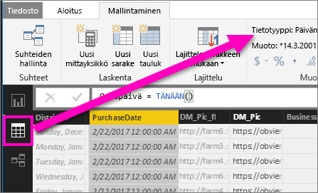

# Visualisointiin porautumistila Power BI:ssä

## Porautuminen edellyttää hierarkiaa
Kun visualisoinnissa on hierarkia, saat porautumalla näkyviin lisää tietoja. Sinulla voi olla esimerkiksi visualisointi, joka kuvaa olympiamitalien määrää hierarkian mukaan, joka muodostuu urheilusta, lajista ja tapahtumasta. Visualisointi näyttää oletusarvoisesti mitalimäärän urheilulajin mukaan – esimerkiksi voimistelu, hiihto ja vesiurheilu. Mutta koska sillä on hierarkia, visualisoinnin yhden elementin (kuten palkin, rivin tai kuplan) valitseminen antaa yksityiskohtaisemman kuvan. Valitsemalla **vesiurheilu**-elementin saat näkyviin uintia, uimahyppyä ja vesipalloa koskevat tiedot.  Valitsemalla **uimahyppy**-elementin saat näkyviin ponnahduslauta-, koroke- ja taitohyppytapahtumat.

Voit lisätä hierarkioita omistamiisi raportteihin, mutta et niihin, jotka on jaettu kanssasi.
Etkö ole varma, mitkä Power BI -visualisoinnit sisältävät hierarkian?  Pidä hiiren osoitinta visualisoinnin päällä, ja jos nämä porauksen ohjausobjektit tulevat näkyviin, visualisoinnissa on hierarkia.

    
   

Päivämäärät ovat hierarkian yksilöivä tyyppi. Kun lisäät visualisointiin päivämääräkentän, Power BI lisää automaattisesti aikahierarkian, joka sisältää vuoden, vuosineljänneksen, kuukauden ja päivän. Lisätietoja saat [Visuaaliset hierarkiat ja porautuminen](guided-learning/visualizations.yml?tutorial-step=18) -opetusohjelmasta tai katsomalla alla oleva video.

  <iframe width="560" height="315" src="https://www.youtube.com/embed/MNAaHw4PxzE?list=PL1N57mwBHtN0JFoKSR0n-tBkUJHeMP2cP" frameborder="0" allowfullscreen></iframe>

> [!NOTE]
> Opettele luomaan hierarkioita Power BI Desktopin avulla katsomalla [How to create and add hierarchies](https://youtu.be/q8WDUAiTGeU) -video
> 

## Edellytykset

1. Power BI -palvelussa ja Desktopissa porautuminen edellyttää visualisointia, jolla on hierarkia. 
   
2. [Avaa Jälleenmyyntianalyysimalli](sample-datasets.md) ja luo puukartta, jossa näkyvät **yksiköt yhteensä tänä vuonna** (Arvot) alueen **(Territory)**, kaupungin **(City)**, postinumeron **(PostalCode)** ja nimen **(Name)** (Ryhmä) mukaan.  Puukartassa on alueesta, kaupungista, postinumerosta ja postitoimipaikasta koostuva hierarkia. Jokainen alue sisältää yhden tai useamman kaupungin, jokainen kaupunki yhden tai useamman postinumeron ja niin edelleen. Visualisointi näyttää oletusarvoisesti vain alueen tiedot, koska *Territory* (Alue) näkyy luettelossa ensimmäisenä.
   
   

2. Eri porautumiskuvakkeiden yhteiskäytön ymmärtäminen voi olla hankalaa, joten suodatetaan puukartta näyttämään vain kaksi pienempää aluetta: **KY** ja **TN**. Valitse puukartta ja laajenna sitten **Alue** kohdassa **Visuaalisen tason suodattimet** ja valitse **KY** ja **TN**.

        

   Nyt puukartassa näkyy vain kaksi aluetta.

   

## Kolme tapaa käyttää porautumisominaisuuksia
Poraudu alaspäin-, Poraudu ylöspäin- ja Laajenna-toimintoja voi käyttää useilla eri tavoilla visualisoinneissa, jotka sisältävät hierarkioita. Tässä artikkelissa esitellään seuraavaksi ensimmäinen tapa. Kun ymmärrät alaspäin porautumisen ja laajentamisen perusteet, voit käyttää mitä tahansa näistä kolmesta menetelmästä. Niillä saadaan aikaan samoja asioita, joten voit kokeilla niitä ja valita itsellesi sopivimman tavan.

- Kun osoitat visualisointia, näet kuvakkeet ja voit käyttää niitä.  

    

- Valikko tulee näkyviin hiiren kakkospainiketta napsauttamalla.
    
    

- Valitse Power BI-valikkoriviltä **Tutki**.

   

## Porautumisen polut
### Poraudu alaspäin
Käytettävissäsi on useita tapoja porautua visualisointiin. ***Poraudu alaspäin*** vie sinut seuraavalle tasolle hierarkiassa, joten jos tarkastelet **alueiden** tasoa, voit porautua kaupunkien tasolle, sitten postinumerojen tasolle ja lopuksi nimien tasolle. Polun jokainen vaihe tuo näkyviin uusia tietoja.

### Laajenna

***Laajenna*** lisää muita hierarkiatasoja nykyiseen näkymään. Jos siis tarkastelet **alueiden** tasoa, voit laajentaa ja lisätä kaupunkeja, postinumeroita ja nimitietoja puukarttaan. Jokainen polun vaihe tuo näkyviin edelliset tiedot ja lisää uuden tietojen tason.

Voit myös valita, haluatko porautua alaspäin tai laajentaa näkymää yksi kenttä kerrallaan vai kaikki kentät kerrallaan. 

## Porautuminen alaspäin kaikki kentät kerrallaan

1. Aloita puukartan ylätasolta, jossa näkyvät KY:n ja TN:n tiedot. Laajenna puukarttaa valitsemalla jokin kahvoista ja vetämällä sitä oikealle. 

     .

2. Jos haluat porautua alaspäin ***kaikki kentät kerrallaan***, valitse visualisoinnin vasemmassa yläkulmassa näkyvä kaksoisnuoli . Puukartassa näkyvät nyt Kentuckyn ja Tennesseen kaupunkitiedot. 

    
   
5. Porautumalla alaspäin vielä kerran siirryt postinumeroiden tasolle hierarkiassa.

    

3. Jos haluat porautua takaisin ylöspäin, valitse ylänuoli visualisoinnin vasemmassa yläkulmassa .

## Porautuminen alaspäin yksi kenttä kerrallaan
Tässä menetelmässä käytetään Poraudu alaspäin -kuvaketta, joka näkyy itse visualisoinnin oikeassa yläkulmassa. 

1. Valitse Poraudu alaspäin -kuvake ja vaihda sen tilaksi . Nyt voit halutessasi porautua ***yksi kenttä kerrallaan***. 
   
   

   Jos et ota porautumista alaspäin käyttöön, visuaalisen elementin (kuten palkin, kuplan tai lehden) valitseminen ei poraudu näkymässä alaspäin, vaan ristisuodattaa muut raportin sivulla olevat kaaviot.

2. Valitse *lehti* kohteelle **TN**. Puukartassa näkyvät nyt kaikki Tennesseen kaupungit, joissa on myymälä. 

    

2. Tässä vaiheessa voit jatkaa porautumista alaspäin Tennessee-näkymässä, tai voit porautua tiettyyn Tennesseen kaupunkiin tai laajentaa näkymää (katso alta **Kaikkien kenttien laajentaminen kerralla**). Poraudutaan jälleen alaspäin yksi kenttä kerrallaan.  Valitse **Knoxville, TN**. Puukartassa näkyy nyt Knoxvillen myymälän postinumero. 

   

    Huomaa, että otsikko muuttuu porautuessasi alaspäin ja uudelleen takaisin ylös.  

## Kaikkien kenttien laajentaminen ja laajentaminen yksi kenttä kerrallaan
Puukartta, jossa näkyy vain postinumero, ei ole kovin havainnollinen.  Laajennetaan siis hierarkiaa yksi taso alaspäin.  

1. Kun puukartta on aktiivinen, valitse *laajenna alaspäin* -kuvake   . Puukartassa näkyy nyt kaksi hierarkian tasoa: postinumero ja myymälän nimi. 

    

2. Jos haluat nähdä kaikki neljä Tennesseen hierarkiatasoa, valitse Poraudu ylöspäin -nuoli, kunnes saavutat puukartan toisen tason, **Yksiköt yhteensä tänä vuonna alueen ja kaupungin mukaan**. 

    

3. Varmista, että porautuminen on edelleen käytössä  ja valitse *Laajenna alaspäin* -kuvake . Puukartassa näkyy nyt joitakin lisätietoja. Pelkän kaupungin ja osavaltion sijasta siinä näkyy myös postinumero. 

    

4. Valitse *laajenna alaspäin* -kuvake vielä kerran, niin näet puukartassa Tennesseen kaikki neljä hierarkiatasoa. Osoittamalla lehteä näet vielä lisää tietoja.

   

## Poraaminen suodattaa muut visualisoinnit
Kun työskentelet Poraudu-tilassa, päätät itse, millä tavoin alaspäin porautuminen ja laajentaminen vaikuttaa sivun muihin visualisointeihin. 

Oletusarvoisesti porautuminen ei vaikuta raportin muihin visualisointeihin. Tämä ominaisuus voidaan kuitenkin ottaa käyttöön Power BI Desktopissa ja Power BI -palvelussa. 

1. Valitse Desktopissa **Muoto**-välilehti ja merkitse sitten valintaruutu kohdassa **Poraaminen suodattaa muut visualisoinnit**.

    

2. Nyt, kun poraudut alaspäin (tai poraudut ylöspäin tai laajennat näkymän) visualisoinnissa, jossa on hierarkia, toiminto suodattaa sivun muut visualisoinnit. 

    

    

> [!NOTE]
> Voit ottaa tämän toiminnon käyttöön Power BI -palvelussa yläreunan valikkoriviltä valitsemalla **Visualisointitoimet > Poraaminen suodattaa muut visualisoinnit**.
>
> 

## Tietoja hierarkia-akselista ja hierarkiaryhmästä
Voit ajatella hierarkia-akselia ja hierarkiaryhmää mekanismina, jonka avulla voit suurentaa ja pienentää niiden tietojen askelväliä, joita haluat tarkastella. Kaikki tiedot, jotka voidaan järjestää luokkiin ja aliluokkiin, ovat kelvollisia sisältämään hierarkian. Tämä sisältää tietysti päivämäärät ja kellonajat.

Voit luoda hierarkian sisältävän visualisoinnin Power BI:ssä valitsemalla yhden tai useamman tietokentän lisättäväksi joko **Akseli**-ruutuun tai **Ryhmä**-ruutuun ja lisäämällä tiedot, joita haluat tarkastella tietokenttinä **Arvot**-ruudussa. Tiedät tietojen olevan hierarkkisia, jos *porautumistilan* kuvakkeet näkyvät visualisoinnin vasemmassa ja oikeassa yläkulmassa. 

Käytännössä kannattaa ajatella kahdenlaisia hierarkkisia tietoja:
- Päivämäärä- ja kellonaikatiedot – jos sinulla on tietotyypin päivämäärä/aika sisältävä tietokenttä, tällöin sinulla on jo hierarkkisia tietoja. Power BI luo automaattisesti hierarkian kaikille tietokentille, joiden arvot voidaan jäsentää [päivämäärä/aika](https://msdn.microsoft.com/library/system.datetime.aspx)-rakenteeksi. Sinun tarvitsee vain lisätä yksi päivämäärä-/aikakenttä **Akseli**- tai **Ryhmä**-ruutuun.
- Luokkatiedot – jos tiedot on saatu alikokoelmia sisältävistä kokoelmista tai niissä on muutoin tietorivejä, joilla on yhteisiä arvoja, tällöin tietosi ovat hierarkkisia.

Power BI:n avulla voit tarkastella alijoukkoja yksitellen tai kaikkia kerrallaan. Voit porautua tietojen läpi nähdäksesi yksittäisen alijoukon kullakin tasolla tai nähdäksesi kaikki alijoukot samanaikaisesti kullakin tasolla. Voit esimerkiksi porautua alaspäin tiettyyn vuoteen tai tarkastella kunkin vuoden kaikkia tuloksia etenemällä hierarkiassa alaspäin. Vastaavasti voit porautua ylöspäin samalla tavalla.

Seuraavissa osioissa kuvataan, kuinka poraudutaan alaspäin ylimmästä näkymästä, keskimmäisestä näkymästä ja alimmasta näkymästä.

### Hierarkkiset tiedot ja aikatiedot
Avaa [Jälleenmyyntianalyysimalli](sample-datasets.md) ja luo pinottu pylväskaaviovisualisointi, jossa tarkastellaan **kuukautta** (Akseli) **kokonaismyynnin** (Arvot) mukaan.  

Vaikka akselin tietokenttä onkin **kuukausi**, se luo myös **Vuosi**-luokan **Akseli**-ruutuun. Tämä johtuu siitä, että Power BI tarjoaa täyden päivämäärä/aikarakenteen kaikille arvoille, jotka se lukee. Hierarkian yläosassa näkyvät vuotta koskevat tiedot.

Kun Porautuminen alaspäin -tila on käytössä, siirry hierarkiassa yksi taso alaspäin napsauttamalla kaavion palkkia. Näet kolme palkkia käytettävissä olevista vuosineljännestiedoista. Valitse vasemman yläkulman kuvakkeista **Expand all down one level of the hierarchy** (Laajenna kaikki alaspäin yhden hierarkiatason verran). Tee tämän jälkeen sama uudelleen siirtyäksesi hierarkian alimmalle tasolle, joka näyttää jokaisen kuukauden tulokset.

Visualisoinnin lisäksi näemme kussakin raportissa hahmonnettujen tietojen hierarkian. Seuraavassa taulukossa näkyvät **Näytä tiedot** -toiminnon tulokset raportissa, joka porautuu alaspäin yksittäisestä kuukaudesta tai kaikista kuukausista. 

Huomaa, että tiedot ovat samat vuosineljänneksen ja koko vuoden raporteissa, mutta porautuessasi alaspäin **Arvot**-kohtaan määritetyn tiedon tasolle, näet, miten yksittäinen raportti muuttuu yksityiskohtaisemmaksi ja ”kaikki kuukaudet” -raportissa on enemmän tietoja.

|Laajennettu tila|Vuosi|Vuosineljännes|Kuukausi|Päivä|
| ---|:---:|:---:|:---:|---|
|Yksittäinen|||||
|Kaikki|||||

### Hierarkkiset luokkatiedot
Kokoelmista ja alikokoelmista mallinnetut tiedot ovat hierarkkisia. Hyvä esimerkki tästä ovat sijaintitiedot. Otetaan esimerkiksi tietolähteessä oleva taulukko, jonka sarakkeet ovat maa, osavaltio, kaupunki ja postinumero. Tiedot, joiden maa, osavaltio ja kaupunki ovat samat, ovat hierarkkisia.

Avaa tätä esimerkkiä varten [Jälleenmyyntianalyysimalli](sample-datasets.md). Luo pinottu pylväskaaviovisualisointi, jossa tarkastellaan **yksiköiden kokonaismäärää tänä vuonna** (Arvot) **alueen**, **kaupungin**, **postinumeron** ja **nimen** (Ryhmä) mukaan.  

Porautuminen alaspäin -tilan ollessa käytössä valitse vasemman yläkulman kuvakkeista **Expand all down one level of the hierarchy** (Laajenna kaikki alaspäin yhden hierarkiatason verran) -kuvake kolme kertaa.
Sinun pitäisi olla hierarkian alimmalla tasolla, joka näyttää alueen, kaupungin ja postinumeron tulokset.

Visualisoinnin lisäksi näemme kussakin raportissa hahmonnettujen tietojen hierarkian. Seuraavassa taulukossa näkyvät **Näytä tiedot** -toiminnon tulokset raportissa, joka porautuu alaspäin yhden alueen tiedoissa tai kaikkien alueiden tiedoissa. Porautuessasi alaspäin näet, miten yksittäinen raportti muuttuu yksityiskohtaisemmaksi ja ”kaikki alueet” -raportissa on enemmän tietoja.

| Laajennettu tila|Alue|Kaupunki|Postinumero|Nimi|
| ---|:---:|:---:|:---:|---|
|Yksittäinen|||||
|Kaikki|||||

## Huomioon otettavat seikat ja rajoitukset
* Jos päivämääräkentän lisääminen visualisointiin ei luo hierarkiaa, syynä voi olla, että ”päivämäärä”-kenttää ei ole todellisuudessa tallennettu päivämääräksi. Jos omistat tietojoukon, avaa se Power BI Desktopin *tietonäkymässä*, valitse päivämäärän sisältävä sarake ja muuta Mallinnus-välilehdellä **tietotyypiksi** **päivämäärä** tai  **päivämäärä/aika**. Jos raportti on jaettu kanssasi, voit pyytää muutosta omistajalta.  
  
  

## Seuraavat vaiheet
[Visualisoinnit Power BI -raporteissa](power-bi-report-visualizations.md)

[Power BI -raportit](service-reports.md)

[Power BI:n peruskäsitteet](service-basic-concepts.md)

Onko sinulla muuta kysyttävää? [Kokeile Power BI -yhteisöä](http://community.powerbi.com/)

