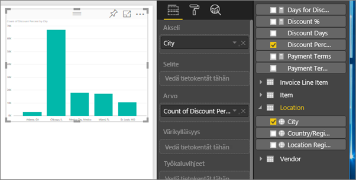
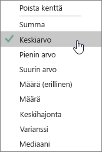
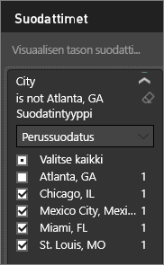
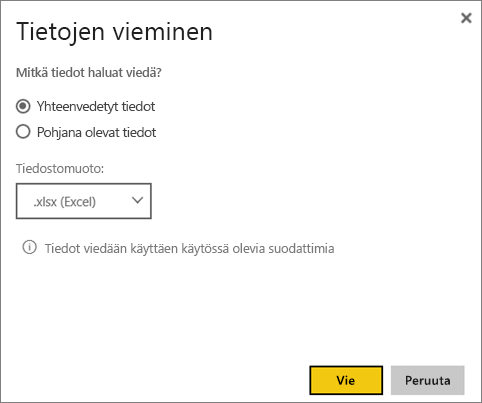

# Tietojen vieminen visualisoinneista
Jos haluat tarkastella tietoja, joita käytetään visualisoinnin luonnissa, voit [näyttää kyseiset tiedot Power BI:ssä](service-reports-show-data.md) tai viedä tiedot Exceliin .xlsx- tai .csv-tiedostona.   

Katso videolta, miten tiedot viedään raportin visualisoinnista, tallennetaan .xlsx-tiedostoksi ja avataan Excelissä. Kokeile sitten itse noudattamalla videon alapuolella olevia vaiheittaisia ohjeita.

<iframe width="560" height="315" src="https://www.youtube.com/embed/KjheMTGjDXw" frameborder="0" allowfullscreen></iframe>

## Power BI -koontinäytön visualisoinnista
1. Valitse visualisoinnin oikean yläkulman kolme pistettä.

    
2. Valitse **Vie tiedot** -kuvake.

    
3. Tiedot viedään .csv-tiedostoon. Jos visualisointi on suodatettu, myös ladatut tiedot suodatetaan.    
4. Selain kehottaa tallentamaan tiedoston.  Kun tiedosto on tallennettu, avaa se Excelissä.

    

## Raportin visualisoinnista
Seuraa mukana avaamalla [Hankinta-analyysimallin raportti](sample-procurement.md) [muokkausnäkymässä](service-reading-view-and-editing-view.md). [Lisää uusi tyhjä raporttisivu](power-bi-report-add-page.md). Lisää sitten kooste ja visualisoinnin tason suodatin noudattamalla alla olevia ohjeita.

1. Luo uusi pylväskaavio.  Valitse Kentät-ruudussa **Sijainti > Kaupunki** ja **Lasku > Alennusprosentti**.  Voit joutua siirtämään **alennusprosentin** Arvo-kohtaan. 

    
2. Muuta **alennusprosentin** kooste **määrästä** **keskiarvoksi**. Arvo-kohdassa valitse **alennusprosentin** (voi myös olla **alennusprosentin määrä**) oikealla puolella oleva nuoli ja valitse **Keskiarvo**.

    
3. Lisää suodatin kohdassa **Kaupunki** ja poista **Atlanta**.

   

   Nyt voit kokeilla molempia tietojen vientivaihtoehtoja. 

4. Valitse visualisoinnin oikean yläkulman kolme pistettä. Valitse **Vie tiedot**.

   
5. Jos visualisoinnissa on Power BI:n verkkoversiossa kooste (esimerkiksi jos olet muuttanut **määrän** *keskiarvoksi*, **summaksi** tai *vähimmäisarvoksi*), sinulla on kaksi vaihtoehtoa: **Yhteenvedetyt tiedot** ja **Pohjana olevat tiedot**. Power BI Desktopissa vaihtoehtona on vain **Yhteenvedetyt tiedot** Katso lisätietoja koosteista artikkelista [Koosteet Power BI:ssa](service-aggregates.md).

    
6. Valitse **Yhteenvedetyt tiedot** > **Vie** ja valitse .xlsx tai .csv. Power BI vie tiedot.  Jos olet käyttänyt suodattimia visualisoinnissa, viedyt tiedot viedään suodatettuina. Kun valitset **Vie**, selain pyytää sinua tallentamaan tiedoston. Kun tiedosto on tallennettu, avaa se Excelissä.

   **Yhteenvedetyt tiedot**: valitse tämä vaihtoehto, jos haluat viedä tietoja siitä, mitä näet tässä visualisoinnissa.  Tällainen vientityyppi näyttää vain tiedot (sarakkeet ja mittayksiköt), jotka valitsit visualisoinnin luomiseksi.  Jos visualisoinnissa on kooste, viet koottuja tietoja. Jos sinulla on palkkikaavio 4 palkilla, saat 4 tietoriviä. Yhteenvedetyt tiedot voidaan tallentaa .xlsx- tai .csv-muodossa.

   Tässä esimerkissä Excel-vienti näyttää kunkin kaupungin kokonaissumman. Koska Atlanta on suodatettu pois, se ei sisälly tuloksiin.  Laskentataulukon ensimmäisellä rivillä näkyy suodattimet, joita käytettiin poimittaessa tietoja Power BI:stä.

   
7. Kokeile nyt valita **Pohjana olevat tiedot** > **Vie** ja sitten .xlsx. Power BI vie tiedot. Jos olet käyttänyt suodattimia visualisoinnissa, viedyt tiedot viedään suodatettuina. Kun valitset **Vie**, selain pyytää sinua tallentamaan tiedoston. Kun tiedosto on tallennettu, avaa se Excelissä.

   >[!WARNING]
   >Viemällä pohjana olevat tiedot käyttäjät voivat tarkastella kaikkia yksityiskohtaisia tietoja – kaikissa sarakkeissa. Power BI -palvelun järjestelmänvalvojat voivat poistaa tämän käytöstä organisaatiossa. Jos olet tietojoukon omistaja, voit määrittää sarakkeet ”piilotetuiksi” niin, että ne eivät näy kenttäluettelossa Power BI Desktopissa tai Power BI -palvelussa.

   **Pohjana olevat tiedot**: valitse tämä vaihtoehto, jos haluat nähdä visualisoinnissa olevat tiedot ***ja*** lisätiedot mallista (katso lisätietoja alla olevasta kaaviosta).  Jos visualisoinnissa on kooste, kooste voidaan poistaa valitsemalla *Pohjana olevat tiedot*. Kun valitset **Vie**, tiedot viedään .xlsx-tiedostoon ja selain pyytää sinua tallentamaan tiedoston. Kun tiedosto on tallennettu, avaa se Excelissä.

   Tässä esimerkissä Excel-vienti näyttää yhden rivin tietojoukon kullekin kaupungille ja kyseisen rivin alennusprosentin. Toisin sanoen tiedot tasoitetaan koostamisen sijaan. Laskentataulukon ensimmäisellä rivillä näkyy suodattimet, joita käytettiin poimittaessa tietoja Power BI:stä.  

   

## Pohjana olevien tietojen vieminen
Kun valitset **Pohjana olevat tiedot**, saatat nähdä erilaisia tietoja. Näiden tietojen ymmärtäminen saattaa vaatia järjestelmänvalvojan tai IT-osaston apua. Power BI Desktopin tai palvelun raportointinäkymässä tulee esiin *mittayksikkö* Kentät-luettelossa, jossa laskinkuvake . Mittayksiköt luodaan Power BI Desktopissa, ei Power BI -palvelussa.

| Visualisoinnin sisältö |                                                                              Mitä näet viennissä                                                                              |
|-----------------|-------------------------------------------------------------------------------------------------------------------------------------------------------------------------------------|
|   Koosteet    |                                                 *ensimmäisen* koosteen ja ei-piilotetut tiedot tämän koosteen koko taulukosta                                                  |
|   Koosteet    | liittyvät tiedot – jos visualisointi käyttää muita tietoja muista tietotaulukoista, jotka *\*\*liittyvät*\* koosteen sisältävään tietotaulukkoon (kunhan tämä suhde on \*:1 tai 1:1) |
|    Mittayksiköt     |                                      Kaikki toimenpiteet visualisoinnissa *ja* kaikki toimenpiteet mistä tahansa tietotaulukosta, joka sisältää visualisoinnissa käytetyn mittayksikön                                      |
|    Mittayksiköt     |                                       Kaikki ei-piilotetut tiedot taulukoista, jotka sisältävät tämän mittayksikön (kunhan tämä suhde on \*:1 tai 1:1)                                       |
|    Mittayksiköt     |                                      Kaikki tiedot kaikista taulukoista, jotka liittyvät mittayksiköt sisältävään taulukkoon ketjun \*:1/1:1) kautta                                      |
|  Vain mittayksiköt  |                                                   Kaikki ei-piilotetut sarakkeet kaikista liittyvistä taulukoista (mittayksikön laajentamiseksi)                                                   |
|  Vain mittayksiköt  |                                                             Yhteenvedetyt tiedot kaikille mallin mittayksiköiden monistetuille riveille.                                                              |

## Rajoitukset ja huomioitavat asiat
* **Power BI Desktopista** ja **Power BI -palvelusta** voidaan viedä korkeintaan 30 000 riviä .csv-tiedostoon.
* .xlsx-tiedostoon vietävien rivien enimmäismäärä on 150 000.
* *Pohjana olevien tietojen* vienti ei toimi, jos tietolähde on reaaliaikainen Analysis Services -yhteys, versio on vanhempi kuin 2016 ja mallin taulukoilla ei ole yksilöiviä tunnuksia.  
* *Pohjana olevien tietojen* vienti ei toimi, jos *Näytä kohteet, joilla ei ole tietoja* -asetus on käytössä vietävässä visualisoinnissa.
* Käytettäessä DirectQueryä voidaan viedä enintään 16 Mt tietoja. Tästä johtuen kaikkia rivejä ei ehkä viedä, etenkin vietäessä useita sarakkeita tai vaikeasti pakattavia tietoja. Myös muut tekijät voivat kasvattaa tiedostokokoa ja vähentää vietyjen rivien määrää.
* Jos visualisointi käyttää useamman kuin yhden taulukon tietoja, eikä näille taulukoille ole suhdetta tietomallissa, vain ensimmäisen taulukon tiedot viedään. 
* Mukautettuja visualisointeja ja R-visualisointeja ei tueta tällä hetkellä.
* Organisaation ulkopuoliset käyttäjät eivät voi viedä tietoja heidän kanssaan jaetuista koontinäytöistä. 
* Power BI:ssä kenttä (sarake) voidaan nimetä uudelleen kaksoisnapsauttamalla kenttää ja kirjoittamalla uusi nimi.  Tätä uutta nimeä kutsutaan *aliakseksi*. On mahdollista, että Power BI -raporttiin voi päätyä kenttien nimien kaksoiskappaleita, mutta Excel ei salli kaksoiskappaleita.  Kun tiedot viedään Exceliin, kentän aliakset muunnetaan takaisin alkuperäisen kentän (sarakkeen) nimiksi.  
* Jos .csv-tiedostossa on unicode-merkkejä, teksti ei ehkä näy oikein Excelissä. Tiedoston voi avata Muistiossa ongelmitta. Esimerkiksi valuuttasymbolit ja vieraskieliset sanat ovat Unicode-merkkejä. Vaihtoehtoinen menetelmä on tuoda .csv-tiedosto suoraan Exceliin sen avaamisen sijaan. Jos haluat tehdä tämän:

  1. Avaa Excel
  2. Valitse **Tiedot**-välilehdellä **Nouda ulkoiset tiedot** > **tekstistä**.
* Power BI -järjestelmänvalvojat voivat poistaa tietojen viennin käytöstä.

## Seuraavat vaiheet
[Koontinäytöt Power BI:ssä](service-dashboards.md)  
[Raportit Power BI:ssä](service-reports.md)  
[Power BI:n peruskäsitteet](service-basic-concepts.md)

Onko sinulla muuta kysyttävää? [Voit esittää kysymyksiä Power BI -yhteisössä](http://community.powerbi.com/)

